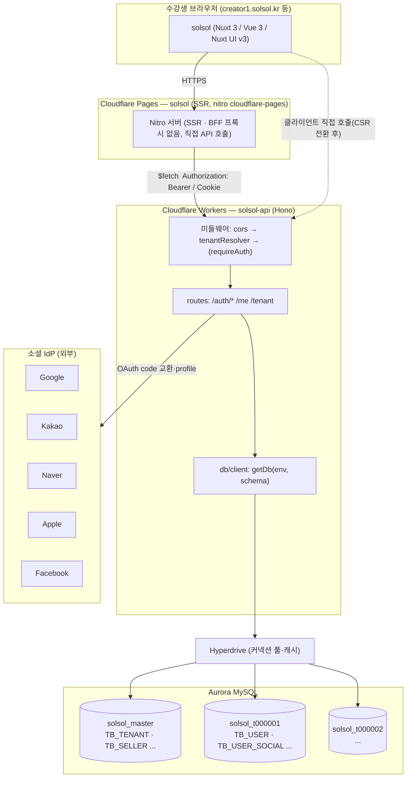
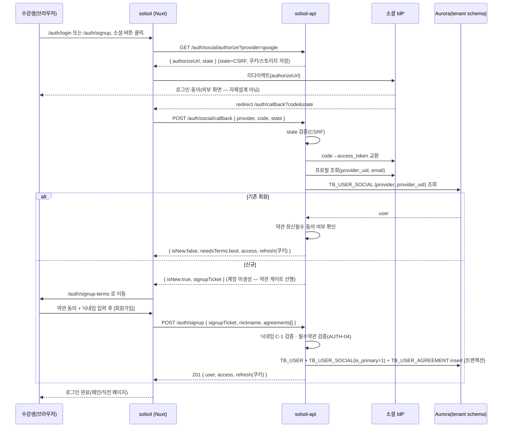
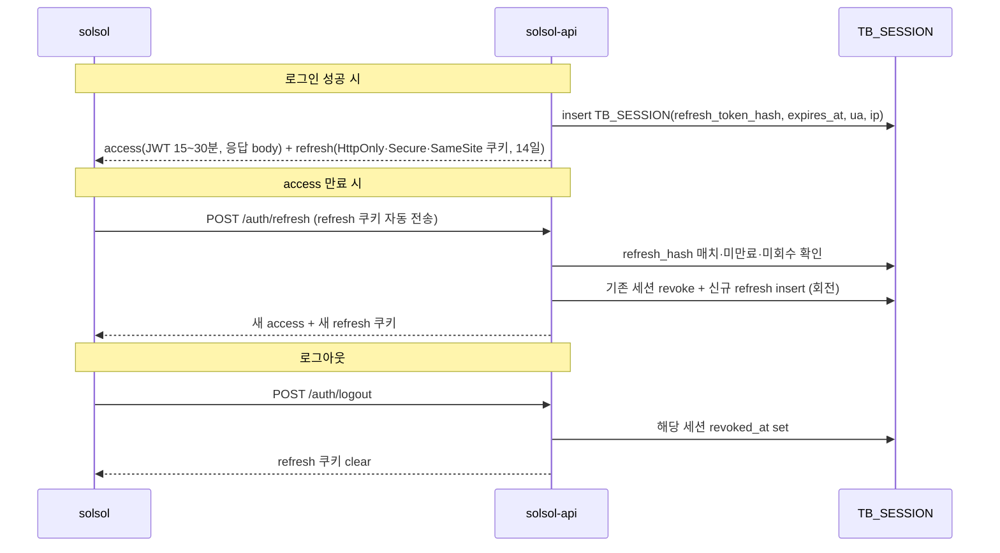
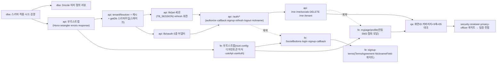

# ADR · 스프린트1 아키텍처 — 인증(AUTH) 풀스택 골격

| 항목 | 내용 |
|------|------|
| 문서 ID | ARCH-AUTH-S1 |
| 상태 | **Accepted** (스프린트1 착수 기준선) |
| 작성자 | 도아컨 (아키텍트) |
| 작성일 | 2026-06-29 |
| 대상 레포 | `solsol`(사용자단·Nuxt 3) · `solsol-api`(백엔드·Hono/Workers) |
| 정본(SoT) | `docs/validation/`(00~06, 읽기전용) · `docs/data-model/`(master.sql · tenant_template.sql · README) |
| 권위 우선순위 | `05_정책설계서`(확정) → `00~03 화면설계서` → `04_정책요약` → 참조 PNG → 스타일가이드. `[추정]`은 권위 아님 |
| 범위 | 사용자단(수강생) 인증: 소셜 5종 로그인·약관 게이트·세션(JWT+리프레시)·내 정보(프로필/연동/탈퇴)·멀티테넌트 라우팅 골격 |

> **본 문서의 위치**: "무엇·왜"는 04/05가 확정했고 "어떻게(엔드포인트·계약)"는 06이 고정했다. 이 ADR은 **"어떤 구조로 빌드를 시작하는가"**(토폴로지·레포 골격·런타임 패턴·작업 분해)를 결정한다. 06과 충돌하면 06이 우선이며, 본 문서는 06을 구현 가능한 골격으로 번역한다.

---

## 0. 결정 요약 (TL;DR)

1. **3티어 토폴로지**: `solsol`(Cloudflare Pages, SSR) → `solsol-api`(Cloudflare Workers, Hono) → Hyperdrive → Aurora MySQL(`solsol_master` + `solsol_t######` 테넌트 스키마들).
2. **멀티테넌트 = schema-per-tenant**. 요청 호스트 → `master.TB_TENANT.schema_name` 해석(미들웨어, 캐시) → Drizzle 런타임 스키마 주입(`<schema>.TB_USER`)으로 쿼리. 풀링 커넥션에서 `USE` 금지.
3. **인증 = 소셜 OAuth 5종 전용**(수강생). OAuth 콜백을 **API가 서버사이드 교환**(code→token→profile) → 회원 식별/생성 → 약관 게이트 → 세션 발급.
4. **세션 = JWT(access, 단명) + Refresh(회전·해시저장 `TB_SESSION`)**. KV는 스프린트1 **미사용**(D1/Aurora 테이블로 충분, 단순화). access JWT 클레임에 `tid`(tenant id)·`sch`(schema)·`sub`(user id)·`typ`(user_type) 포함.
5. **신규 골격**: malgn-noti-api 패턴(`src/{routes,db,lib,middleware,adapters}` + Hono + Drizzle mysql2 + Hyperdrive)을 **구조 원본으로 채택**하되, 단일DB(`company_id` 컬럼) → **schema-per-tenant(런타임 스키마)**로 라우팅 모델만 교체.
6. 프론트는 mockup의 **디자인토큰(primary `#7954C6`)·공통 컴포넌트만 자산 재사용**, 로직은 신규 작성.

> ### ⛔ 가드레일 — 목업 동결(read-only baseline)
> `solsol/mockup` · `solsol-admin/mockup`은 **나중 개발본과의 비교용 기준선**이다. **어떤 에이전트도 절대 수정·삭제·이동 금지**(생성도 금지).
> - 신규 사용자단 앱은 `solsol/` **루트**에 별도 Nuxt 앱으로 구축한다(기존 `solsol/mockup/`은 그대로 둔다). 관리자단은 추후 `solsol-admin/` 루트.
> - "자산 재사용" = mockup 파일을 신규 앱 트리로 **복사(copy)**해 쓰는 것. mockup 원본 파일을 편집/참조-수정하지 않는다.
> - mockup은 읽기 전용 **참고**로만 열람 가능. 변경이 필요하면 신규 앱 쪽에만 반영한다.

---

## 1. 전체 토폴로지



### 호스트 → 테넌트 매핑
- 스프린트1: 서브도메인(`{slug}.solsol.kr`) 또는 커스텀 도메인 모두 `TB_TENANT.domain`/`slug`로 해석. 로컬 dev는 헤더(`X-Tenant`) 또는 `?tenant=` 쿼리로 강제 가능.
- **계정 격리**: 동일 인물·동일 소셜이라도 테넌트가 다르면 별개 계정(01 §S-FR01-0301-001 정책: "계정은 커스터머 사이트별 개별 관리"). 스키마 분리로 물리적으로 보장된다.

### 데이터 정본
- 구조화 데이터: Aurora MySQL. 스프린트1 인증 테이블은 전부 **테넌트 스키마**(`TB_USER`, `TB_USER_SOCIAL`, `TB_USER_AGREEMENT`, `TB_AUTH_CODE`, `TB_SESSION`, `TB_DEVICE_TOKEN`). 라우팅 정본만 **master**(`TB_TENANT`).
- 프로필 이미지: **R2**(`avatar_key`만 DB 저장). 스프린트1 업로드는 후속 가능(§9 OQ-R2).

---

## 2. 레포 골격

### 2.1 `solsol-api` (Hono + Drizzle + Workers)

```
solsol-api/
├─ wrangler.toml                  # Hyperdrive 바인딩·vars·placement=smart
├─ package.json                   # pnpm. deps: hono, drizzle-orm, mysql2, zod, @hono/zod-validator
├─ tsconfig.json
├─ drizzle.config.ts              # introspect/generate 대상 = tenant_template 기준
├─ .dev.vars                      # 로컬 시크릿 (git-ignore) — JWT_SECRET, OAuth 키, DB 직결값
├─ src/
│  ├─ index.ts                    # Hono app. cors → tenantResolver 전역. /auth /me /tenant 라우트 마운트
│  ├─ env.d.ts                    # Bindings 타입(Hyperdrive·시크릿·R2)
│  ├─ db/
│  │  ├─ client.ts                # getDb(env, schema) — mysql2 createConnection + drizzle. 스키마 주입
│  │  ├─ schema.tenant.ts         # 테넌트 스키마 Drizzle 정의(TB_USER·SOCIAL·AGREEMENT·AUTH_CODE·SESSION·DEVICE_TOKEN)
│  │  └─ schema.master.ts         # master Drizzle 정의(TB_TENANT 등 라우팅에 필요한 최소)
│  ├─ middleware/
│  │  ├─ tenant.ts                # tenantResolver: host→TB_TENANT 조회(캐시)→c.set('tenant',{id,schema})
│  │  └─ auth.ts                  # requireAuth(JWT 검증)→c.set('user'). requireUserType('learner')
│  ├─ lib/
│  │  ├─ errors.ts                # AppError + errors.* 헬퍼(06 응답 봉투). code/message/field
│  │  ├─ response.ts              # ok/created/badRequest/unauthorized/conflict ... (06 §0 봉투)
│  │  ├─ jwt.ts                   # signAccess/verifyAccess(클레임 tid·sch·sub·typ) + refresh 토큰 생성/해시
│  │  ├─ nickname.ts             # C-1 닉네임 검증(2~15·금칙어·정규화)
│  │  ├─ masking.ts              # C-6 본인/타인 마스킹 분기
│  │  └─ oauth/                   # 소셜 IdP 어댑터(공통 인터페이스 OAuthProvider)
│  │     ├─ index.ts             # provider 팩토리 + 공통 타입 { exchangeCode, fetchProfile }
│  │     ├─ google.ts  kakao.ts  naver.ts  apple.ts  facebook.ts
│  ├─ routes/
│  │  ├─ auth.ts                  # /auth/social/authorize · /auth/social/callback · /auth/signup · /auth/refresh · /auth/logout
│  │  ├─ me.ts                    # GET/PATCH /me · /me/socials · DELETE /me(탈퇴)
│  │  └─ tenant.ts               # GET /tenant (현재 사이트 메타·약관 버전·표시설정)
│  └─ services/                   # (선택) 도메인 로직 분리: authService, userService
└─ migrations/                    # (운영 적용은 docs/data-model SQL 정본 기준 — §7)
```

핵심 파일 책임:
- `src/db/client.ts` — **getDb(env, schema)**: Hyperdrive 자격으로 mysql2 커넥션 생성 후 `drizzle(conn)` 반환. 스키마는 **쿼리 빌드 시점에 정규화 주입**(아래 §3.3). master 쿼리는 `getMasterDb(env)`로 분리.
- `src/middleware/tenant.ts` — 모든 요청 진입점. host 해석 실패 시 404(`tenant_not_found`).
- `src/lib/oauth/*` — IdP별 차이(토큰 엔드포인트·프로필 필드·Apple의 id_token JWT 등)를 어댑터로 흡수. 라우트는 `provider` 문자열만 받고 어댑터에 위임.

`package.json` 스크립트(pnpm):
```jsonc
{
  "scripts": {
    "dev": "wrangler dev --remote",          // Hyperdrive remote (binding-level remote 미지원 대응)
    "dev:local": "wrangler dev",             // DB 직결(.dev.vars) — Hyperdrive 우회
    "deploy": "wrangler deploy",
    "typecheck": "tsc --noEmit",
    "cf-typegen": "wrangler types"
  }
}
```

`wrangler.toml`(요지):
```toml
name = "solsol-api"
main = "src/index.ts"
compatibility_date = "2025-01-01"
compatibility_flags = ["nodejs_compat"]

[placement]
mode = "smart"               # Aurora(AWS) 근접 실행

[vars]
APP_ENV = "production"

[[hyperdrive]]
binding = "HYPERDRIVE"       # 기본 연결 스키마 = solsol_master(라우팅 조회용) 또는 빈 DB
id = "<HYPERDRIVE_ID>"

[[r2_buckets]]
binding = "FILES"
bucket_name = "solsol-files"  # 프로필 이미지 등
```

### 2.2 `solsol` (Nuxt 3 · 사용자단)

```
solsol/
├─ nuxt.config.ts                 # compat v4, @nuxt/ui, nitro preset cloudflare-pages, runtimeConfig.apiBase
├─ app.config.ts                  # Nuxt UI 테마(primary=#7954C6 등 디자인토큰 매핑)
├─ wrangler.toml / .env           # NUXT_PUBLIC_API_BASE, 서버 전용 시크릿
├─ app/
│  ├─ app.vue
│  ├─ assets/css/main.css         # mockup 디자인토큰 이식(:root --color-primary ...)
│  ├─ layouts/{default,mypage}.vue
│  ├─ components/
│  │  ├─ common/{AppHeader,AppFooter}.vue     # mockup 재사용(자산)
│  │  ├─ mypage/MypageSidebar.vue              # mockup 재사용(자산)
│  │  └─ auth/{SocialButtons,TermsAgreement,NicknameField}.vue   # 신규
│  ├─ pages/
│  │  ├─ auth/login.vue           # S-FR01-0302-001
│  │  ├─ auth/signup.vue          # S-FR01-0301-001 (소셜 시작)
│  │  ├─ auth/signup-terms.vue    # S-FR01-0301-002 (약관 동의)
│  │  ├─ auth/callback.vue        # OAuth redirect 착지 → API 콜백 호출 → 분기
│  │  └─ mypage/profile.vue       # S-FR01-0301-112 (프로필/연동/탈퇴)
│  ├─ composables/
│  │  ├─ useAuth.ts               # 로그인 상태·세션·로그아웃·refresh
│  │  ├─ useApi.ts                # $fetch 래퍼(Authorization·tenant 헤더·에러 봉투 해석)
│  │  └─ useTenant.ts             # 현재 사이트 메타(SSR로 1회 로드)
│  ├─ middleware/
│  │  ├─ auth.global.ts           # 보호 라우트 게이트(미로그인→/auth/login)
│  │  └─ terms-gate.ts           # 약관 미동의 신규회원→/auth/signup-terms 강제(AUTH-04)
│  └─ stores/ (또는 useState)     # 세션·프로필 상태
└─ server/
   └─ (필요 시) routes/auth/      # refresh 쿠키 set/clear를 SSR에서 처리할 경우의 BFF 보조
```

`nuxt.config.ts` 핵심:
```ts
export default defineNuxtConfig({
  compatibilityDate: '2025-01-01',
  future: { compatibilityVersion: 4 },
  modules: ['@nuxt/ui'],
  nitro: { preset: 'cloudflare-pages' },
  runtimeConfig: {
    public: { apiBase: '' },           // NUXT_PUBLIC_API_BASE
    sessionCookieSecret: '',           // 서버 전용(쿠키 서명 시)
  },
  css: ['~/assets/css/main.css'],
})
```

### 2.3 환경변수 · 시크릿 목록

| 키 | 소속 | 종류 | 용도 |
|----|------|------|------|
| `JWT_SECRET` | solsol-api | secret | access JWT 서명(HS256) |
| `REFRESH_PEPPER` | solsol-api | secret | refresh 토큰 해시 솔트(SHA-256 + pepper) |
| `GOOGLE_CLIENT_ID` / `GOOGLE_CLIENT_SECRET` | solsol-api | secret | Google OAuth |
| `KAKAO_REST_API_KEY` / `KAKAO_CLIENT_SECRET` | solsol-api | secret | Kakao OAuth |
| `NAVER_CLIENT_ID` / `NAVER_CLIENT_SECRET` | solsol-api | secret | Naver OAuth |
| `APPLE_CLIENT_ID` / `APPLE_TEAM_ID` / `APPLE_KEY_ID` / `APPLE_PRIVATE_KEY` | solsol-api | secret | Apple(client_secret을 JWT로 서명 생성) |
| `FACEBOOK_APP_ID` / `FACEBOOK_APP_SECRET` | solsol-api | secret | Facebook OAuth |
| `OAUTH_REDIRECT_BASE` | solsol-api | var | 콜백 redirect_uri 베이스(`https://<api or front>/auth/callback`) |
| `HYPERDRIVE`(바인딩) | solsol-api | binding | Aurora 풀링 연결 |
| `DB_HOST/DB_PORT/DB_USER/DB_PASSWORD/DB_NAME` | solsol-api | secret(.dev.vars) | 로컬 dev DB 직결(Hyperdrive 우회) |
| `FILES`(바인딩) | solsol-api | binding | R2 프로필 이미지 |
| `APP_ENV` | solsol-api | var | `local`/`production` 분기 |
| `NUXT_PUBLIC_API_BASE` | solsol | var | 프론트→API 베이스 URL |
| `NUXT_SESSION_COOKIE_SECRET` | solsol | secret | (쿠키 서명 시) |

> **원칙(전역 보안)**: 시크릿은 `wrangler secret put` 또는 `.dev.vars`로만 주입. 코드·로그·커밋 금지. OAuth client_secret·JWT_SECRET·DB password는 응답·에러 메시지에 절대 미노출. 소셜 5종 키 발급은 §9 OQ-OAUTH(외부 콘솔 등록·redirect_uri 화이트리스트 필요).

---

## 3. 멀티테넌트 라우팅 설계

### 3.1 호스트 → 스키마 해석 미들웨어 (`tenantResolver`)

```
요청 → cors → tenantResolver:
  1) host = c.req.header('host')  (로컬은 X-Tenant 헤더/?tenant= 우선)
  2) 캐시 조회(tenantCache[host])  — 히트 시 즉시 c.set('tenant', cached)
  3) 미스 → getMasterDb(env): SELECT id, schema_name, status, plan_state
            FROM solsol_master.TB_TENANT
            WHERE (domain = ? OR slug = ?) AND status = 1  LIMIT 1
  4) 없음 → 404 tenant_not_found / status!=1 또는 plan_state in (expired) → 423/403 tenant_suspended
  5) c.set('tenant', { id, schema })  + 캐시 set(TTL)
  → next()
```

### 3.2 테넌트 캐시
- **구현**: Worker isolate 모듈 스코프 `Map<host, {tenant, expiresAt}>` (TTL 60~300초). 추가 인프라 0.
- 무효화: 테넌트 도메인/상태 변경은 저빈도 → TTL 만료로 자연 갱신(스프린트1 충분). 즉시 무효화가 필요해지면 KV+버전키로 승격(§9 OQ-CACHE).
- **주의**: isolate별 캐시라 전역 일관성은 보장 못 하지만 TB_TENANT는 거의 불변이라 허용 가능한 트레이드오프.

### 3.3 Drizzle 런타임 스키마 주입 패턴

**문제**: schema-per-tenant인데 풀링 커넥션에서 `USE <schema>`는 상태 누수(다음 요청이 다른 테넌트 스키마를 물고 갈 수 있음) → **금지**. Hyperdrive는 기본 스키마 1개로만 연결.

**채택안 — 스키마 정규화(schema-qualified) 쿼리**: 테이블명을 `<schema>.TB_NAME`으로 **요청마다 동적 생성**한다. Drizzle mysql-core의 `mysqlTable`는 정적이므로, **테넌트 스키마 테이블을 런타임에 바인딩하는 팩토리**를 둔다.

```ts
// db/schema.tenant.ts — 스키마명을 인자로 받아 테이블 세트를 생성
import { mysqlTable, bigint, varchar, int, datetime, tinyint } from 'drizzle-orm/mysql-core'

export function tenantTables(schema: string) {
  const t = (name: string) => `${schema}.${name}`   // 정규화 물리명
  const user = mysqlTable(t('TB_USER'), {
    id: bigint('id', { mode: 'number', unsigned: true }).primaryKey().autoincrement(),
    userType: varchar('user_type', { length: 20 }).notNull().default('learner'),
    email: varchar('email', { length: 255 }),
    nickname: varchar('nickname', { length: 15 }),
    avatarKey: varchar('avatar_key', { length: 255 }),
    isPrimaryAccount: tinyint('is_primary_account').notNull().default(0),
    marketingAgreed: tinyint('marketing_agreed').notNull().default(0),
    status: int('status').notNull().default(1),
    withdrawnAt: datetime('withdrawn_at'),
    // ...
  })
  const userSocial = mysqlTable(t('TB_USER_SOCIAL'), { /* ... */ })
  const userAgreement = mysqlTable(t('TB_USER_AGREEMENT'), { /* ... */ })
  const authCode = mysqlTable(t('TB_AUTH_CODE'), { /* ... */ })
  const session = mysqlTable(t('TB_SESSION'), { /* ... */ })
  const deviceToken = mysqlTable(t('TB_DEVICE_TOKEN'), { /* ... */ })
  return { user, userSocial, userAgreement, authCode, session, deviceToken }
}
```

```ts
// 라우트에서:
const { schema } = c.get('tenant')
const db = await getDb(c.env, c.executionCtx)     // 커넥션(스키마 미고정)
const T = tenantTables(schema)                     // 스키마 바인딩 테이블 세트
const rows = await db.select().from(T.user).where(eq(T.user.id, userId))
// → 생성 SQL: SELECT ... FROM `solsol_t000001`.`TB_USER` WHERE id = ?
```

- **장점**: 풀링 안전(상태 무관), 한 커넥션에서 master+tenant 조인/혼용 가능, Drizzle 타입 안전 유지.
- **검증 필요[추정]**: Drizzle mysql-core가 테이블명에 `.`(스키마.테이블)을 받아 백틱 분리 식별자로 내보내는지 — 스파이크로 1회 확인. 미지원 시 대안 = `db.execute(sql\`... FROM ${sql.identifier(schema)}.TB_USER ...\`)` raw + Drizzle relational은 master만.
- **스키마명 안전**: schema는 반드시 `TB_TENANT`에서 읽은 값만 사용(사용자 입력 절대 금지) → SQL 인젝션 차단. 형식 검증 정규식 `^solsol_t[0-9a-z_]+$` 추가.

### 3.4 로컬 dev (Hyperdrive 없이 직결)
- `APP_ENV=local`: `getDb`가 Hyperdrive 대신 `.dev.vars`의 `DB_*`로 mysql2 직결. 로컬 MySQL 8.0에 `solsol_master` + `solsol_t000001`(시드 테넌트) 두 스키마를 만들어 둠.
- 테넌트 강제: `X-Tenant: <slug>` 헤더 또는 `?tenant=<slug>`. 호스트가 localhost라 자동 해석 불가하므로 미들웨어가 이 경로를 먼저 본다.
- 프론트 dev: `NUXT_PUBLIC_API_BASE=http://localhost:8787`, OAuth는 mock 모드(`APP_ENV=local` 시 `/auth/social/callback`이 mock 프로필 반환 옵션) 또는 실제 IdP의 localhost redirect 등록.

---

## 4. 인증 플로우

### 4.1 소셜 로그인/가입 (서버사이드 code 교환)



설계 결정:
- **신규는 계정을 즉시 만들지 않는다.** 콜백에서 신규면 `signupTicket`(소셜 프로필을 담은 단명 서명 토큰, TTL 10분)만 발급 → 약관 게이트 통과 후 `/auth/signup`에서 트랜잭션으로 생성. 이유: AUTH-04(필수약관 미동의 차단)를 **계정 생성 전**에 강제, 미완 가입의 유령 계정 방지.
- **isNew=false인데 needsTerms=true**(기존 회원·약관 버전 갱신): 로그인은 시키되 약관 재동의 게이트로 라우팅(05 약관 버전 정책 정합).
- 가입 즉시 **Free 부여·무료체험 없음(M-1)**: 스프린트1 인증 범위에선 멤버십/플랜 미생성. user.status=1(active)로 즉시 활성. (Free 등급의 실제 권한·상품은 후속 도메인.)
- **대표계정(is_primary)**: 최초 연동 소셜 = 대표(`TB_USER.is_primary_account=1`, `TB_USER_SOCIAL.is_primary=1`). 닉네임/이름/본인인증은 대표 기준(P-46).

### 4.2 세션: JWT + Refresh 회전



- **access JWT 클레임**: `{ sub: userId, tid: tenantId, sch: schemaName, typ: 'learner', iat, exp }`. `sch`를 클레임에 넣어 인증 후 라우트가 테넌트 스키마를 재확인 없이 사용(단, `tenantResolver`가 host로 푼 tid와 **일치 검증** — 토큰 탈취·교차테넌트 방지).
- **refresh**: 랜덤 32B → `SHA-256(token + REFRESH_PEPPER)` 해시만 `TB_SESSION`에 저장(평문 미저장). 회전(rotation): refresh 1회 사용 시 즉시 revoke+재발급. 재사용 감지(이미 revoked된 해시 도착) 시 해당 사용자 전 세션 무효화(도난 의심).
- **쿠키 스코프**: refresh 쿠키는 API 도메인 기준 HttpOnly. 프론트가 다른 도메인이면 `SameSite=None; Secure` + CORS `credentials`. (동일 상위도메인 권장 — §9 OQ-COOKIE.)
- **KV 미사용 결정**: 06은 KV를 세션 후보로 언급하나, 스프린트1은 `TB_SESSION`(테넌트 스키마)로 충분하고 멀티테넌트 격리·감사에 유리. KV는 디바이스토큰/집계 캐시 용도로 후속 도입 가능. **ADR: 세션 정본 = TB_SESSION.**

### 4.3 약관 게이트(AUTH-04)
- 필수: `terms`(이용약관)·`privacy`(개인정보처리방침). 선택: `marketing`. (스키마 `age14`는 정책상 미수집 — 화면 3종만. 본문은 JSON SoT 렌더, 화면 전사 금지 — M-6/CMP-05.)
- 가입 시 `TB_USER_AGREEMENT`에 각 항목 `{agreement_key, required, agreed, terms_version, agreed_at}` 스냅샷 저장(동의 이력·버전).
- 게이트 위치: ① API `/auth/signup`에서 필수 미동의 → 400 `TERMS_REQUIRED`. ② 프론트 `terms-gate.ts`에서 신규/버전갱신 회원을 약관 화면으로 강제.

---

## 5. API 계약 (스프린트1) — 06 AUTH 정합

> 공통 응답 봉투(06 §0): 성공 `{ ok:true, data, meta? }` / 실패 `{ ok:false, error:{ code, message, field? } }`. 모든 요청은 `tenantResolver` 통과(host/X-Tenant). 보호 엔드포인트는 `Authorization: Bearer <access>`.

| # | 메서드 · 경로 | 요청 | 응답(data) | 정책ID | 에러 코드 |
|---|---------------|------|-----------|--------|-----------|
| A1 | `GET /auth/social/authorize` | `?provider` | `{ authorizeUrl, state }` | AUTH-01 | `PROVIDER_UNSUPPORTED`(400) |
| A2 | `POST /auth/social/callback` | `{ provider, code, state }` | 기존: `{ isNew:false, needsTerms, access, user }`(+refresh 쿠키) / 신규: `{ isNew:true, signupTicket }` | AUTH-01/02/08 | `OAUTH_FAILED`(401)·`STATE_INVALID`(400) |
| A3 | `POST /auth/signup` | `{ signupTicket, nickname, agreements:[{key,agreed}] }` | 201 `{ user, access }`(+refresh 쿠키) | AUTH-04·C-1·M-1 | `NICKNAME_LENGTH`·`NICKNAME_DUP`(409)·`NICKNAME_FORBIDDEN`·`TERMS_REQUIRED`·`TICKET_EXPIRED`(400) |
| A4 | `POST /auth/refresh` | (refresh 쿠키) | `{ access }`(+회전 refresh 쿠키) | AUTH-08·C-2 | `REFRESH_INVALID`(401)·`REFRESH_REUSED`(401) |
| A5 | `POST /auth/logout` | (refresh 쿠키) | `{ loggedOut:true }`(refresh 쿠키 clear) | AUTH-08 | — |
| A6 | `GET /auth/nickname/check` | `?nickname` | `{ available:bool }` | C-1 | `NICKNAME_LENGTH`·`NICKNAME_FORBIDDEN`(400) |
| M1 | `GET /me` | (Bearer) | `{ id, nickname, name?, phone?, email?, avatarUrl?, marketingAgreed, socials:[{provider,isPrimary,linkedAt}] }` **본인 비마스킹**(C-6) | AUTH-15·C-6 | `UNAUTHENTICATED`(401) |
| M2 | `PATCH /me` | `{ nickname?, marketingAgreed? }` | `{ ...갱신 결과 }` | AUTH-15·C-1·CMP-03 | `NICKNAME_DUP`(409)·`NICKNAME_LENGTH`(400) |
| M3 | `POST /me/avatar` | multipart(이미지) | `{ avatarUrl }` (R2 업로드) | AUTH-15 | `FILE_TYPE`·`FILE_SIZE`(400) — *후속 가능* |
| M4 | `GET /me/socials` | (Bearer) | `{ socials:[...] }` | AUTH-15 | — |
| M5 | `POST /me/socials/link` | `{ provider, code, state }` | `{ socials:[...] }` | AUTH-15 | `SOCIAL_ALREADY_LINKED`(409) |
| M6 | `DELETE /me/socials/:provider` | — | `{ socials:[...] }` | AUTH-15 | `PRIMARY_UNLINK_BLOCKED`(409)·`LAST_SOCIAL`(409) |
| M7 | `DELETE /me` (탈퇴) | `{ reason, detail }` | `{ withdrawn:true }` | AUTH-14·P-47 | `REASON_REQUIRED`(400) |
| T1 | `GET /tenant` | (host) | `{ id, name, slug, termsVersion:{terms,privacy,marketing}, siteConfig }` | — | `TENANT_NOT_FOUND`(404) |

설계 메모:
- 06 §2.1은 `{ provider, code, site_id, redirect_uri }`를 받지만, 본 골격은 **site_id를 host(tenantResolver)로 대체** — 클라이언트가 테넌트를 직접 지정하지 않게 해 교차테넌트 위조를 줄인다. (06과의 차이는 §9 OQ로 기록 — 06 갱신 필요 시 별도 승인.)
- 탈퇴(M7, P-47): 비가역 — `TB_USER.status=-1`, `withdrawn_at` 기록, 소셜·세션 revoke. **환불/구독 정산 정합은 결제 도메인 후속**(P-47 단서). 스프린트1은 인증 측 탈퇴 처리만, 활성 구독 존재 시 차단 또는 경고는 후속(§9 OQ-WITHDRAW).
- 마스킹(C-6): `GET /me`는 본인 자기조회 → 이름·이메일·휴대폰·닉네임 **비마스킹**. 비밀번호·인증코드는 어떤 응답에도 미포함(소셜 전용이라 비번 자체가 없음). `lib/masking.ts`가 JWT 주체 == 리소스 소유자 판정.

---

## 6. 화면 분해 (FR01 인증) — 화면ID ↔ 라우트 ↔ 컴포넌트 ↔ API

| 화면ID | 화면명 | 라우트(solsol) | 주요 컴포넌트 | 호출 API |
|--------|--------|---------------|--------------|----------|
| S-FR01-0301-001 | 회원가입 - 소셜 시작 | `/auth/signup` | `auth/SocialButtons` | A1(authorize) |
| S-FR01-0302-001 | 로그인(소셜) | `/auth/login` | `auth/SocialButtons`(+최근이력 배지) | A1, (콜백 A2) |
| (콜백 착지) | OAuth redirect 처리 | `/auth/callback` | (로딩) | A2(callback) |
| S-FR01-0301-002 | 회원가입 - 약관 동의 | `/auth/signup-terms` | `auth/TermsAgreement`·`NicknameField` | A6(nickname/check)·A3(signup)·T1(약관버전) |
| S-FR01-0301-002_pu01 | 약관 보기 모달 | (모달, `/auth/signup-terms` 내) | `auth/TermsViewModal` | T1 / 약관 JSON SoT |
| S-FR01-0301-112 | 마이페이지 - 프로필 | `/mypage/profile` | `mypage/MypageSidebar`·프로필 폼·연동SNS | M1·M2·M3·M4·M5·M6 |
| S-FR01-0301-112_pu01 | 프로필 설정 모달(이미지 크롭) | (모달) | `mypage/AvatarCropModal` | M3 |
| S-FR01-0301-112-P03 | 계정 탈퇴 모달(이중 컨펌) | (모달) | `mypage/WithdrawModal` | M7 |
| (공통) | GNB 프로필 요약 | 레이아웃 | `common/AppHeader` | M1 |

> 닉네임 변경 모달(S-FR01-0301-112-P02)·연동SNS 연결/해제는 프로필 화면 내 인터랙션으로 M2/M5/M6에 매핑.
> 화면ID는 추적키 — `00_화면목록 ↔ 구현(목업/페이지 인덱스) ↔ dev-validation 결함표`가 동일 ID로 1:1.

---

## 7. DB 작업

### 7.1 스프린트1 대상 테이블
- **테넌트 스키마**(tenant_template.sql 기존 정의 사용): `TB_USER`, `TB_USER_SOCIAL`, `TB_USER_AGREEMENT`, `TB_AUTH_CODE`(스프린트1 소셜 전용이라 사실상 미사용·정의만), `TB_SESSION`, `TB_DEVICE_TOKEN`(정의만·후속). `TB_SITE_CONFIG`(T1 표시설정).
- **master 스키마**: `TB_TENANT`(라우팅 정본). 라우팅 외 master 테이블은 스프린트1 불필요.

### 7.2 Drizzle 스키마 정의 방침
- **SoT는 SQL**(`docs/data-model/*.sql`) — Drizzle 정의는 그 SQL을 손으로 미러(타입 안전 레이어). `drizzle-kit introspect`로 초안 생성 후 컨벤션(camelCase 매핑·`mode:'number'`)으로 정리. **마이그레이션 생성은 Drizzle이 아니라 SQL 정본 적용**(스키마 변경은 데이터모델 승인 절차).
- 테넌트 테이블은 §3.3 `tenantTables(schema)` 팩토리로 정의(스키마 주입). master 테이블은 정적 `mysqlTable('solsol_master.TB_TENANT', ...)`.
- 타입: BIGINT unsigned `mode:'number'`(53bit 한도 내 — id가 2^53 넘으면 `mode:'bigint'` 전환[추정 점검]), DATETIME UTC, status INT, DECIMAL은 인증 범위 무.

### 7.3 마이그레이션·시드 절차(로컬/스테이징)
```bash
# 1) master + 시드 테넌트 1개 스키마 생성
mysql < <(echo "CREATE DATABASE IF NOT EXISTS solsol_master DEFAULT CHARSET utf8mb4 COLLATE utf8mb4_unicode_ci;
                CREATE DATABASE IF NOT EXISTS solsol_t000001 DEFAULT CHARSET utf8mb4 COLLATE utf8mb4_unicode_ci;")
# 2) 스키마 적용 (정본 SQL)
mysql solsol_master  < docs/data-model/master.sql
mysql solsol_t000001 < docs/data-model/tenant_template.sql
# 3) 시드: 기본 테넌트 레지스트리 1행
#    INSERT INTO solsol_master.TB_TENANT (slug, schema_name, domain, name, owner_seller_id, plan_state, provisioned_at, status)
#    VALUES ('demo', 'solsol_t000001', 'localhost', '데모 사이트', 1, 'active', NOW(), 1);
# 4) (로컬) .dev.vars 에 DB_* 직결값. (스테이징) Hyperdrive 생성 후 wrangler.toml id 기입
```
- 시드 테넌트 1개(`demo` / `solsol_t000001` / domain=localhost)로 로컬 E2E 가능.
- **라이브 DB 문법 검증 미실행**(데이터모델 README §검증) — 스프린트1 착수 시 Aurora/MySQL 8.0에 `SOURCE` 1회 적용 검증을 dba 첫 태스크로.

---

## 8. 작업 분해(다음 단계) — DAG · DoD · 게이트



| ID | 담당 | 태스크 | 의존 | DoD |
|----|------|--------|------|-----|
| D0 | dba | master/tenant SQL을 MySQL8에 적용·시드 1테넌트·문법 검증 | — | `SOURCE` 무오류, TB_TENANT 1행, 인증 6테이블 생성 확인 |
| D1 | dba | Drizzle 미러 정의(TB_USER 등 6 + TB_TENANT) 리뷰 | D0 | 컬럼·타입·유니크키가 SQL과 1:1, camelCase 매핑 합의 |
| B1 | api-developer | 레포 부트스트랩(Hono·wrangler·errors/response/봉투) | — | `/health` 200, 06 응답봉투 적용, typecheck 통과 |
| B2 | api-developer | tenantResolver·캐시·`getDb` 스키마 주입 **스파이크** | B1,D0 | `solsol_t000001.TB_USER` 정규화 쿼리 성공(스파이크 결론 문서화) |
| B3 | api-developer | jwt(클레임 tid/sch)·refresh 회전·TB_SESSION | B2 | access/refresh 발급·회전·재사용 감지 단위검증 |
| B4 | api-developer | OAuth 5종 어댑터(공통 인터페이스·mock 모드) | B2 | google 실연동 1종 + 나머지 mock, state CSRF 검증 |
| B5 | api-developer | `/auth/*` 라우트(A1~A6) | B3,B4 | 06 계약대로 신규/기존 분기·약관 게이트·닉네임 검증 |
| B6 | api-developer | `/me`·socials·탈퇴·`/tenant`(M1~M7,T1) | B5 | C-6 마스킹 분기·대표계정 해제 차단·탈퇴 비가역 |
| F1 | frontend-developer | Nuxt 부트스트랩·디자인토큰 이식·useApi/useAuth/useTenant | — | primary #7954C6 토큰 적용, 에러봉투 해석, SSR 빌드 |
| F2 | frontend-developer | SocialButtons·login·signup·callback | F1,(B5 계약) | 화면ID 표기, 5종 버튼·최근배지·실패 토스트 |
| F3 | frontend-developer | signup-terms(약관·닉네임·게이트) | F2 | 전체동의 연동·필수 게이트·닉네임 실시간 검증·약관 모달 |
| F4 | frontend-developer | mypage/profile(연동SNS·탈퇴 이중컨펌) | F1,(B6 계약) | P-46/P-47 충족·본인 비마스킹·탈퇴 2단 컨펌 |
| Q1 | qa | 화면ID 커버리지 + 9축 + 05 확정대조 + 결함표 | F2~F4,B5~B6 | 결함표(화면ID 1:1)·종합판정. `dev-validation/` 밖 기록 |
| G | security-reviewer·privacy-officer·팀장 | 게이트 | Q1 | 시크릿 취급·세션·개인정보(탈퇴/마스킹) 점검, **'상' 0건** |

게이트 연결: 구현(9축) → 셀프검증 → qa·security-reviewer·privacy-officer → 팀장 컨펌(❌'상' 0건) → 배포. 결과는 `docs/dev-validation/auth-roundN.md`(검증 폴더 밖).

---

## 9. 리스크 · 미결(Open Questions)

| # | 항목 | 내용 | 해소 방법 | 비고 |
|---|------|------|----------|------|
| OQ-HD | Hyperdrive + MySQL | Hyperdrive MySQL 지원 여부·제약 | **✅ 해소(2026-06-29)**: `malgn-dev-solsol-prv`(id a14c69…)로 연결 성공(MySQL 8.0.42, `--remote`). **단, Hyperdrive는 `USE` 미지원** → 스키마는 항상 정규화 식별자(`\`schema\`.\`TB\`)로 접근. `SET ...` 세션문도 회피 | dev=`solsol`(master)/`solsol_lms`(tenant1) |
| OQ-DRZ | Drizzle 스키마 주입 | `mysqlTable('schema.TB')` 정규화 동작 | **✅ 해소(2026-06-29)**: `mysqlTable('schema.TB')`는 단일 식별자로 잘못 생성됨 → **`mysqlSchema(schema).table('TB',…)` 채택**. 스파이크 SQL 확인: ``from `solsol_lms`.`TB_USER` `` 정상 생성. migrate(master 14·tenant 90, 0 errors)·seed 실증 | §3.3 / `schema.tenant.ts` |
| OQ-OAUTH | 소셜 5종 키 | google/kakao/naver/apple/facebook 앱 등록·redirect_uri 화이트리스트·검수(특히 Apple client_secret JWT, Facebook 앱 심사) | 운영자/PM: 5종 콘솔 계정·키 발급. 미발급 IdP는 mock | 외부 의존·리드타임 |
| OQ-COOKIE | refresh 쿠키 도메인 | 프론트(Pages)·API(Workers) 도메인 분리 시 SameSite=None 필요 | 동일 상위도메인(`*.solsol.kr`) 배치 권장. 결정 필요 | 보안·CORS |
| OQ-SITEID | 06 §2.1 site_id | 06은 콜백에 site_id 명시, 본 골격은 host 해석 | 06 갱신 승인 또는 둘 다 수용(host 우선·body 보조) | 정본 변경 승인 필요 |
| OQ-WITHDRAW | 탈퇴×구독 정합 | 활성 구독/미정산 존재 시 탈퇴 처리 | 결제 도메인과 연계 후속(P-47 단서) | 스프린트1은 인증측만 |
| OQ-R2 | 프로필 이미지 | R2 업로드·크롭·용량/형식 제한 정책 | M3는 후속 가능. 스프린트1 핵심 아님 | jpg/png·1:1·용량(P-46) |
| OQ-CACHE | 테넌트 캐시 무효화 | isolate Map TTL의 전역 일관성 한계 | 즉시무효화 필요 시 KV+버전키 승격 | 저빈도라 TTL 허용 |
| OQ-LOCAL-OAUTH | 로컬 소셜 로그인 | localhost redirect 미등록 IdP | `APP_ENV=local` mock 콜백 경로 제공 | dev 생산성 |

---

## 부록 A. 핵심 결정 트레이드오프(요약)

| 결정 | 대안 | 선택 근거 |
|------|------|-----------|
| 세션 정본 = `TB_SESSION`(KV 미사용) | KV 세션 | 멀티테넌트 격리·감사·refresh 회전 구현 단순. KV는 후속 캐시 용도 |
| 스키마 정규화 쿼리(`schema.TB`) | 커넥션별 `USE`/테넌트별 Hyperdrive 바인딩 | 풀링 안전·바인딩 1개로 N테넌트·master 혼용. `USE`는 상태누수(금지) |
| 신규는 signupTicket 후 생성 | 콜백서 즉시 생성 | 약관 게이트(AUTH-04)를 계정 생성 전 강제·유령계정 방지 |
| host 기반 tenant 해석 | 클라이언트 site_id 전달 | 교차테넌트 위조 표면 축소(서버가 권위) |
| 소셜 code 서버 교환 | 클라이언트 implicit | client_secret 보호·토큰 미노출·Apple JWT 서명 서버처리 |

## 부록 B. 참조
- 정본: `docs/validation/{00_화면목록,01_customer-front,05_정책설계서,06_API계약}.md`(읽기전용)
- 데이터모델: `docs/data-model/{master.sql,tenant_template.sql,README.md}`
- 구조 원본: `../malgn-noti-api/src/{index.ts,db/client.ts,middleware/auth.ts,lib/{errors,jwt}.ts,routes/auth.ts}`
- 디자인 자산: `../solsol/mockup/app/{assets/css/main.css,components/common,components/mypage,pages/auth}`
</content>
</invoke>
