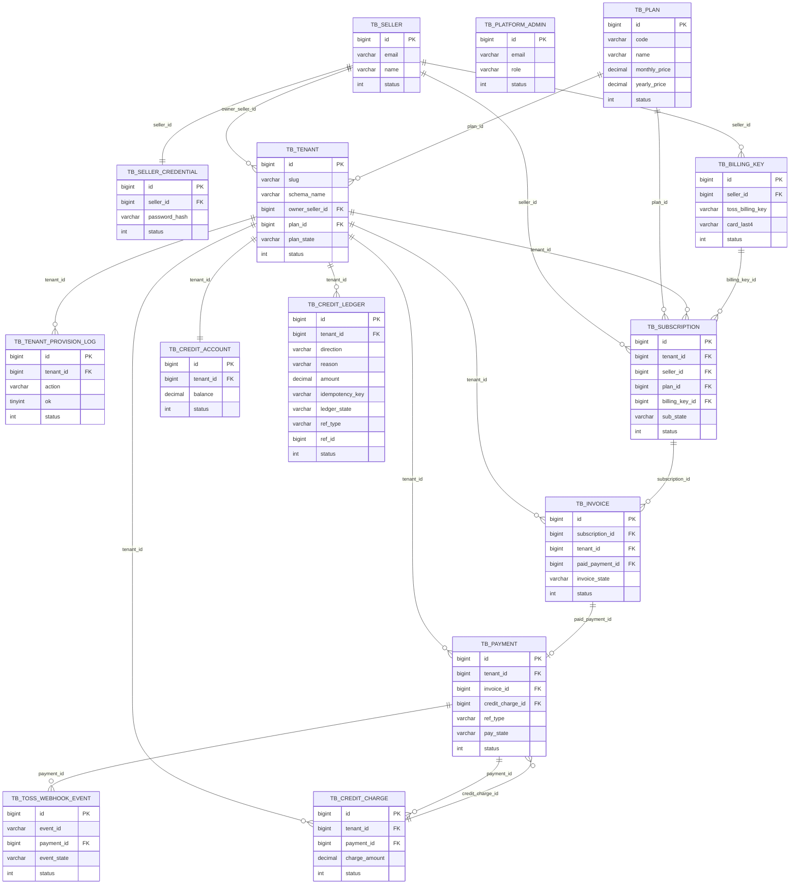
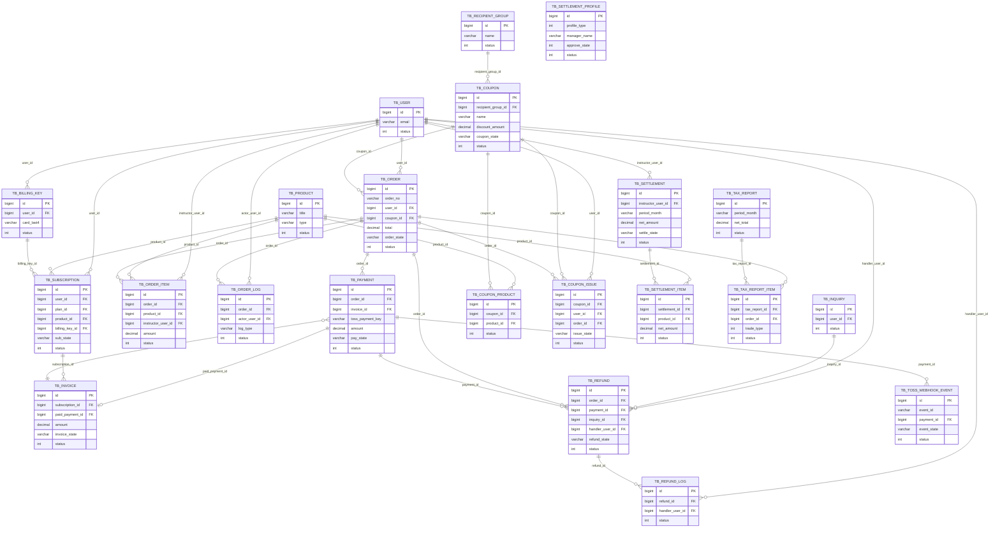
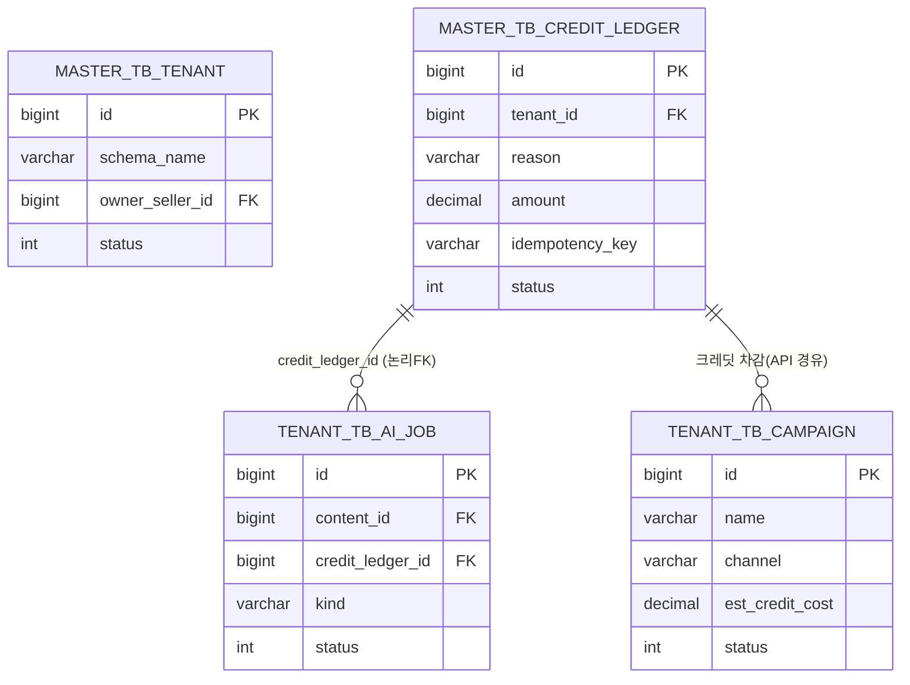

# 쏠쏠 크리에이터 LMS — ERD (Mermaid)

> 생성일: 2026-06-29 | 정본: `master.sql`(14테이블) + `tenant_template.sql`(90테이블)
> 파서 스크립트(`parse_schema.py`) 실행 결과 기반 자동 추출 후 수기 검수 완료.

---

## 1. 개요

### 아키텍처: schema-per-tenant

| 스키마 | 기본 DB명 | 테이블 수 | 역할 |
|---|---|---|---|
| 마스터 | `solsol_master` (dev: `solsol`) | 14 | 플랫폼 공통 — 테넌트 레지스트리, 셀러, SaaS 요금제·구독·청구·결제, 크레딧 |
| 테넌트 | `solsol_t{ID}` (dev: `solsol_lms`) | 90 | 크리에이터 사이트 운영 전체 — 회원·상품·콘텐츠·학습·주문·정산·마케팅·커뮤니티 등 |

**dev 스키마 매핑(확정 2026-06-29):** 마스터 → `solsol`, 개발 단일 테넌트 → `solsol_lms`

> 동명 테이블 주의: `TB_BILLING_KEY`, `TB_INVOICE`, `TB_PAYMENT`, `TB_SUBSCRIPTION`, `TB_TOSS_WEBHOOK_EVENT` 는 마스터·테넌트 양쪽에 존재하며 **별도 엔티티**다.
> - 마스터 쪽: SaaS(셀러-플랫폼) 결제·구독 담당
> - 테넌트 쪽: 수강생 상품 구매·구독 담당

### 범례

- **논리 FK**: DB `FOREIGN KEY` 제약 없음. 네이밍 규칙 + 인덱스로만 관리.
- **관계 추론 방법**: 컬럼명 → FK resolver 맵 → `*_user_id` 접미사 패턴 → `parent_id`(self).
- **폴리모픽 컬럼**: 엣지로 표현 불가. 해당 테이블 설명에 주석으로 표기.
  - `TB_ATTACHMENT.owner_id` (+owner_type): post/comment/inquiry/inquiry_reply 중 하나
  - `TB_NOTIFICATION.ref_id` (+ref_type): inquiry/order/refund/content/campaign/settlement 중 하나
  - `TB_INQUIRY.ref_id` (+ref_type): product/post/comment/order 중 하나
  - `TB_CREDIT_LEDGER.ref_id` (+ref_type): campaign/ai_job 중 하나 (테넌트 스키마 리소스)
  - `TB_SEO_OVERRIDE.target_id` (+target_type): page/product 중 하나
- **크로스 스키마 참조**: 테넌트 → 마스터 논리 참조(예: `TB_AI_JOB.credit_ledger_id → master.TB_CREDIT_LEDGER`). 5절 별도 기술.
- Mermaid `erDiagram` 사용. 속성은 핵심만(PK·FK·대표 컬럼 1~3개). 전 컬럼 나열 금지.

---

## 2. 마스터 스키마 ERD

플랫폼 중앙 관리 DB(`solsol_master`). 크리에이터(셀러)와 플랫폼 간 관계를 보관한다.

---

## 3. 테넌트 스키마 ERD — 도메인별

크리에이터 1개 사이트 운영 전체(`solsol_lms` 등). 도메인 그룹별 5개 다이어그램으로 분할한다.
`site_id` 컬럼 없음(스키마 자체가 테넌트 경계).

---

### 3-1. 인증 · 회원 · 권한 · 사이트설정

회원 통합 엔티티 `TB_USER`(수강생/강사/서브강사/운영자), 인증 수단, RBAC, 사이트 표시 설정.

```mermaid
erDiagram
    TB_SITE_CONFIG {
        bigint id PK
        varchar name
        varchar url
        varchar description
        int status
    }
    TB_USER {
        bigint id PK
        varchar user_type
        varchar email
        varchar nickname
        varchar name
        int status
    }
    TB_USER_SOCIAL {
        bigint id PK
        bigint user_id FK
        varchar provider
        varchar provider_uid
        int status
    }
    TB_USER_CREDENTIAL {
        bigint id PK
        bigint user_id FK
        bigint invited_by_user_id FK
        varchar password_hash
        int status
    }
    TB_USER_AGREEMENT {
        bigint id PK
        bigint user_id FK
        varchar agreement_key
        tinyint agreed
        int status
    }
    TB_ROLE {
        bigint id PK
        varchar code
        varchar name
        int status
    }
    TB_USER_ROLE {
        bigint id PK
        bigint user_id FK
        bigint role_id FK
        int status
    }
    TB_ADMIN_PERMISSION {
        bigint id PK
        bigint user_id FK
        varchar menu_key
        tinyint allowed
        varchar data_scope
        int status
    }
    TB_AUTH_CODE {
        bigint id PK
        varchar purpose
        varchar target
        datetime expires_at
        int status
    }
    TB_PASSWORD_RESET_TOKEN {
        bigint id PK
        bigint user_id FK
        varchar token
        datetime expires_at
        int status
    }
    TB_INVITE_TOKEN {
        bigint id PK
        bigint role_id FK
        bigint inviter_user_id FK
        varchar email
        varchar token
        int status
    }
    TB_SESSION {
        bigint id PK
        bigint user_id FK
        varchar refresh_token_hash
        datetime expires_at
        int status
    }
    TB_DEVICE_TOKEN {
        bigint id PK
        bigint user_id FK
        varchar token
        varchar platform
        int status
    }

    TB_USER ||--o{ TB_USER_SOCIAL : "user_id"
    TB_USER ||--|| TB_USER_CREDENTIAL : "user_id"
    TB_USER ||--o{ TB_USER_AGREEMENT : "user_id"
    TB_USER ||--o{ TB_USER_ROLE : "user_id"
    TB_USER ||--o{ TB_ADMIN_PERMISSION : "user_id"
    TB_USER ||--o{ TB_PASSWORD_RESET_TOKEN : "user_id"
    TB_USER ||--o{ TB_SESSION : "user_id"
    TB_USER ||--o{ TB_DEVICE_TOKEN : "user_id"
    TB_USER ||--o{ TB_INVITE_TOKEN : "inviter_user_id"
    TB_USER ||--o{ TB_USER_CREDENTIAL : "invited_by_user_id"
    TB_ROLE ||--o{ TB_USER_ROLE : "role_id"
    TB_ROLE ||--o{ TB_INVITE_TOKEN : "role_id"
```

---

### 3-2. 상품 · 콘텐츠 · 학습

상품 7종(CTI 패턴), 콘텐츠 라이브러리, 강의 구조, 학습 진도, 수료증.

```mermaid
erDiagram
    TB_CATEGORY {
        bigint id PK
        bigint parent_id FK
        varchar name
        int status
    }
    TB_PRODUCT {
        bigint id PK
        bigint owner_user_id FK
        bigint category_id FK
        varchar type
        varchar title
        varchar visibility
        varchar sale_status
        int status
    }
    TB_PRODUCT_LIVE {
        bigint id PK
        bigint product_id FK
        varchar live_kind
        datetime start_at
        varchar live_status
        int status
    }
    TB_PRODUCT_DIGITAL_FILE {
        bigint id PK
        bigint product_id FK
        bigint content_id FK
        varchar file_name
        int status
    }
    TB_PACKAGE_ITEM {
        bigint id PK
        bigint package_product_id FK
        bigint item_product_id FK
        int sort_order
        int status
    }
    TB_MEMBERSHIP_TIER {
        bigint id PK
        bigint product_id FK
        varchar name
        decimal monthly_fee
        int status
    }
    TB_MEMBERSHIP_CATEGORY {
        bigint id PK
        bigint tier_id FK
        bigint category_id FK
        int status
    }
    TB_PRODUCT_COMMUNITY {
        bigint id PK
        bigint product_id FK
        decimal monthly_fee
        int status
    }
    TB_PRODUCT_BENEFIT {
        bigint id PK
        bigint product_id FK
        varchar benefit_text
        int status
    }
    TB_SECTION {
        bigint id PK
        bigint product_id FK
        varchar title
        int sort_order
        int status
    }
    TB_LECTURE {
        bigint id PK
        bigint section_id FK
        bigint product_id FK
        bigint content_id FK
        varchar title
        int status
    }
    TB_COMPLETION_RULE {
        bigint id PK
        bigint product_id FK
        bigint certificate_template_id FK
        int min_progress_rate
        int status
    }
    TB_CONTENT_FOLDER {
        bigint id PK
        bigint parent_id FK
        varchar name
        int status
    }
    TB_CONTENT {
        bigint id PK
        bigint folder_id FK
        varchar name
        varchar media_type
        varchar upload_status
        int status
    }
    TB_SUBTITLE {
        bigint id PK
        bigint content_id FK
        varchar lang
        tinyint is_ai_generated
        int status
    }
    TB_SUBTITLE_LINE {
        bigint id PK
        bigint subtitle_id FK
        int seq
        int status
    }
    TB_AI_JOB {
        bigint id PK
        bigint content_id FK
        bigint credit_ledger_id FK
        varchar kind
        varchar job_status
        int status
    }
    TB_COURSE_RESOURCE {
        bigint id PK
        bigint product_id FK
        varchar file_name
        int status
    }
    TB_PLAYER_SETTING {
        bigint id PK
        tinyint auto_next
        tinyint restrict_skip
        int status
    }
    TB_ENROLLMENT {
        bigint id PK
        bigint user_id FK
        bigint product_id FK
        bigint order_id FK
        varchar learn_status
        int progress_rate
        int status
    }
    TB_LECTURE_PROGRESS {
        bigint id PK
        bigint enrollment_id FK
        bigint lecture_id FK
        bigint user_id FK
        tinyint completed
        int status
    }
    TB_CERTIFICATE_TEMPLATE {
        bigint id PK
        varchar name
        varchar cert_title
        varchar issuer_name
        int status
    }
    TB_CERTIFICATE {
        bigint id PK
        bigint enrollment_id FK
        bigint user_id FK
        bigint product_id FK
        bigint template_id FK
        varchar cert_no
        int status
    }
    TB_WISHLIST {
        bigint id PK
        bigint user_id FK
        bigint product_id FK
        int status
    }
    TB_USER {
        bigint id PK
        varchar user_type
        varchar email
        int status
    }
    TB_ORDER {
        bigint id PK
        varchar order_no
        bigint user_id FK
        int status
    }

    TB_CATEGORY ||--o{ TB_CATEGORY : "parent_id(self)"
    TB_CATEGORY ||--o{ TB_PRODUCT : "category_id"
    TB_CATEGORY ||--o{ TB_MEMBERSHIP_CATEGORY : "category_id"
    TB_USER ||--o{ TB_PRODUCT : "owner_user_id"
    TB_USER ||--o{ TB_ENROLLMENT : "user_id"
    TB_USER ||--o{ TB_LECTURE_PROGRESS : "user_id"
    TB_USER ||--o{ TB_CERTIFICATE : "user_id"
    TB_USER ||--o{ TB_WISHLIST : "user_id"
    TB_ORDER ||--o{ TB_ENROLLMENT : "order_id"
    TB_PRODUCT ||--|| TB_PRODUCT_LIVE : "product_id"
    TB_PRODUCT ||--o{ TB_PRODUCT_DIGITAL_FILE : "product_id"
    TB_PRODUCT ||--o{ TB_PACKAGE_ITEM : "package_product_id"
    TB_PRODUCT ||--o{ TB_PACKAGE_ITEM : "item_product_id"
    TB_PRODUCT ||--o{ TB_MEMBERSHIP_TIER : "product_id"
    TB_PRODUCT ||--|| TB_PRODUCT_COMMUNITY : "product_id"
    TB_PRODUCT ||--o{ TB_PRODUCT_BENEFIT : "product_id"
    TB_PRODUCT ||--o{ TB_SECTION : "product_id"
    TB_PRODUCT ||--|| TB_COMPLETION_RULE : "product_id"
    TB_PRODUCT ||--o{ TB_COURSE_RESOURCE : "product_id"
    TB_PRODUCT ||--o{ TB_ENROLLMENT : "product_id"
    TB_PRODUCT ||--o{ TB_CERTIFICATE : "product_id"
    TB_PRODUCT ||--o{ TB_WISHLIST : "product_id"
    TB_MEMBERSHIP_TIER ||--o{ TB_MEMBERSHIP_CATEGORY : "tier_id"
    TB_SECTION ||--o{ TB_LECTURE : "section_id"
    TB_CONTENT_FOLDER ||--o{ TB_CONTENT_FOLDER : "parent_id(self)"
    TB_CONTENT_FOLDER ||--o{ TB_CONTENT : "folder_id"
    TB_CONTENT ||--o{ TB_LECTURE : "content_id"
    TB_CONTENT ||--o{ TB_PRODUCT_DIGITAL_FILE : "content_id"
    TB_CONTENT ||--o{ TB_SUBTITLE : "content_id"
    TB_CONTENT ||--o{ TB_AI_JOB : "content_id"
    TB_SUBTITLE ||--o{ TB_SUBTITLE_LINE : "subtitle_id"
    TB_CERTIFICATE_TEMPLATE ||--o{ TB_COMPLETION_RULE : "certificate_template_id"
    TB_CERTIFICATE_TEMPLATE ||--o{ TB_CERTIFICATE : "template_id"
    TB_ENROLLMENT ||--o{ TB_LECTURE_PROGRESS : "enrollment_id"
    TB_ENROLLMENT ||--|| TB_CERTIFICATE : "enrollment_id"
    TB_LECTURE ||--o{ TB_LECTURE_PROGRESS : "lecture_id"
```

---

### 3-3. 결제 · 정산 · 쿠폰

수강생 상품 구매 주문, 테넌트 측 결제(PG), 정산, 쿠폰.

---

### 3-4. 마케팅 · 설문 · 알림 · 통계

캠페인 발송, 수신자 그룹, 설문, 알림 라우팅, 일별 통계.

```mermaid
erDiagram
    TB_USER {
        bigint id PK
        varchar email
        int status
    }
    TB_RECIPIENT_GROUP {
        bigint id PK
        varchar name
        varchar update_mode
        int status
    }
    TB_RECIPIENT_GROUP_MEMBER {
        bigint id PK
        bigint recipient_group_id FK
        bigint user_id FK
        varchar added_by
        int status
    }
    TB_MESSAGE_TEMPLATE {
        bigint id PK
        varchar name
        varchar channel
        int status
    }
    TB_CAMPAIGN {
        bigint id PK
        bigint recipient_group_id FK
        bigint message_template_id FK
        varchar name
        varchar channel
        varchar send_state
        int status
    }
    TB_CAMPAIGN_RECIPIENT {
        bigint id PK
        bigint campaign_id FK
        bigint user_id FK
        varchar send_result
        int status
    }
    TB_SURVEY {
        bigint id PK
        varchar name
        varchar respondent_type
        int status
    }
    TB_SURVEY_QUESTION {
        bigint id PK
        bigint survey_id FK
        int seq
        varchar qtype
        int status
    }
    TB_SURVEY_RESPONSE {
        bigint id PK
        bigint survey_id FK
        bigint user_id FK
        int status
    }
    TB_SURVEY_ANSWER {
        bigint id PK
        bigint survey_response_id FK
        bigint survey_question_id FK
        int status
    }
    TB_LANDING_PAGE {
        bigint id PK
        varchar name
        varchar page_type
        varchar headline
        int status
    }
    TB_LANDING_PRODUCT {
        bigint id PK
        bigint landing_page_id FK
        bigint product_id FK
        int seq
        int status
    }
    TB_MARKETING_TOOL {
        bigint id PK
        varchar tool_type
        tinyint connected
        int status
    }
    TB_NOTIFICATION_ROUTE {
        bigint id PK
        bigint message_template_id FK
        varchar code
        varchar channel
        varchar category
        int status
    }
    TB_NOTIFICATION {
        bigint id PK
        bigint recipient_user_id FK
        varchar route_code
        varchar channel
        varchar ref_type
        bigint ref_id
        tinyint is_read
        int status
    }
    TB_NOTIFICATION_SETTING {
        bigint id PK
        bigint user_id FK
        varchar category
        varchar channel
        tinyint enabled
        int status
    }
    TB_STAT_DAILY {
        bigint id PK
        date stat_date
        varchar metric_key
        decimal metric_value
        int status
    }
    TB_PRODUCT {
        bigint id PK
        varchar title
        int status
    }

    TB_USER ||--o{ TB_RECIPIENT_GROUP_MEMBER : "user_id"
    TB_USER ||--o{ TB_CAMPAIGN_RECIPIENT : "user_id"
    TB_USER ||--o{ TB_SURVEY_RESPONSE : "user_id"
    TB_USER ||--o{ TB_NOTIFICATION : "recipient_user_id"
    TB_USER ||--o{ TB_NOTIFICATION_SETTING : "user_id"
    TB_PRODUCT ||--o{ TB_LANDING_PRODUCT : "product_id"
    TB_RECIPIENT_GROUP ||--o{ TB_RECIPIENT_GROUP_MEMBER : "recipient_group_id"
    TB_RECIPIENT_GROUP ||--o{ TB_CAMPAIGN : "recipient_group_id"
    TB_MESSAGE_TEMPLATE ||--o{ TB_CAMPAIGN : "message_template_id"
    TB_MESSAGE_TEMPLATE ||--o{ TB_NOTIFICATION_ROUTE : "message_template_id"
    TB_CAMPAIGN ||--o{ TB_CAMPAIGN_RECIPIENT : "campaign_id"
    TB_SURVEY ||--o{ TB_SURVEY_QUESTION : "survey_id"
    TB_SURVEY ||--o{ TB_SURVEY_RESPONSE : "survey_id"
    TB_SURVEY_RESPONSE ||--o{ TB_SURVEY_ANSWER : "survey_response_id"
    TB_SURVEY_QUESTION ||--o{ TB_SURVEY_ANSWER : "survey_question_id"
    TB_LANDING_PAGE ||--o{ TB_LANDING_PRODUCT : "landing_page_id"
```

---

### 3-5. 커뮤니티 · 지원 · 사이트 · 운영

게시판, 게시글, 댓글, FAQ, 1:1 문의, 사이트 디자인(메뉴·페이지·팝업·배너), 공지, 첨부.

```mermaid
erDiagram
    TB_USER {
        bigint id PK
        varchar email
        int status
    }
    TB_PRODUCT {
        bigint id PK
        varchar title
        int status
    }
    TB_PAGE {
        bigint id PK
        varchar name
        varchar slug
        int status
    }
    TB_RECIPIENT_GROUP {
        bigint id PK
        varchar name
        int status
    }
    TB_BOARD {
        bigint id PK
        bigint product_id FK
        int type
        varchar name
        int status
    }
    TB_POST {
        bigint id PK
        bigint board_id FK
        bigint user_id FK
        varchar title
        int status
    }
    TB_COMMENT {
        bigint id PK
        bigint post_id FK
        bigint parent_id FK
        bigint user_id FK
        int status
    }
    TB_POST_LIKE {
        bigint id PK
        bigint post_id FK
        bigint user_id FK
        int status
    }
    TB_FAQ_CATEGORY {
        bigint id PK
        varchar name
        int status
    }
    TB_FAQ {
        bigint id PK
        bigint faq_category_id FK
        varchar question
        int status
    }
    TB_ADMIN_NOTICE {
        bigint id PK
        bigint created_user_id FK
        varchar title
        int target
        int status
    }
    TB_ADMIN_NOTICE_READ {
        bigint id PK
        bigint admin_notice_id FK
        bigint user_id FK
        int status
    }
    TB_INQUIRY {
        bigint id PK
        bigint user_id FK
        bigint assignee_user_id FK
        int type
        varchar ref_type
        bigint ref_id
        int status
    }
    TB_INQUIRY_REPLY {
        bigint id PK
        bigint inquiry_id FK
        bigint parent_id FK
        bigint user_id FK
        int author_type
        int status
    }
    TB_ATTACHMENT {
        bigint id PK
        bigint user_id FK
        varchar owner_type
        bigint owner_id
        varchar r2_key
        int status
    }
    TB_SITE_FOOTER {
        bigint id PK
        varchar company
        tinyint show_footer
        int status
    }
    TB_SITE_META {
        bigint id PK
        varchar meta_key
        int status
    }
    TB_SEO_OVERRIDE {
        bigint id PK
        int target_type
        bigint target_id
        varchar title
        int status
    }
    TB_MENU {
        bigint id PK
        bigint parent_id FK
        bigint page_id FK
        bigint board_id FK
        bigint product_id FK
        bigint recipient_group_id FK
        varchar name
        int status
    }
    TB_PAGE_SECTION {
        bigint id PK
        bigint page_id FK
        varchar section_type
        int status
    }
    TB_POPUP {
        bigint id PK
        varchar name
        date start_date
        date end_date
        int status
    }
    TB_BANNER {
        bigint id PK
        varchar name
        varchar position
        int status
    }

    TB_USER ||--o{ TB_POST : "user_id"
    TB_USER ||--o{ TB_COMMENT : "user_id"
    TB_USER ||--o{ TB_POST_LIKE : "user_id"
    TB_USER ||--o{ TB_ADMIN_NOTICE : "created_user_id"
    TB_USER ||--o{ TB_ADMIN_NOTICE_READ : "user_id"
    TB_USER ||--o{ TB_INQUIRY : "user_id"
    TB_USER ||--o{ TB_INQUIRY : "assignee_user_id"
    TB_USER ||--o{ TB_INQUIRY_REPLY : "user_id"
    TB_USER ||--o{ TB_ATTACHMENT : "user_id"
    TB_PRODUCT ||--o{ TB_BOARD : "product_id"
    TB_PRODUCT ||--o{ TB_MENU : "product_id"
    TB_PAGE ||--o{ TB_PAGE_SECTION : "page_id"
    TB_PAGE ||--o{ TB_MENU : "page_id"
    TB_RECIPIENT_GROUP ||--o{ TB_MENU : "recipient_group_id"
    TB_BOARD ||--o{ TB_POST : "board_id"
    TB_BOARD ||--o{ TB_MENU : "board_id"
    TB_POST ||--o{ TB_COMMENT : "post_id"
    TB_POST ||--o{ TB_POST_LIKE : "post_id"
    TB_COMMENT ||--o{ TB_COMMENT : "parent_id(self)"
    TB_FAQ_CATEGORY ||--o{ TB_FAQ : "faq_category_id"
    TB_ADMIN_NOTICE ||--o{ TB_ADMIN_NOTICE_READ : "admin_notice_id"
    TB_INQUIRY ||--o{ TB_INQUIRY_REPLY : "inquiry_id"
    TB_INQUIRY_REPLY ||--o{ TB_INQUIRY_REPLY : "parent_id(self)"
    TB_MENU ||--o{ TB_MENU : "parent_id(self)"
```

---

## 4. 테넌트 내부 Self 관계 요약

| 테이블 | 컬럼 | 의미 |
|---|---|---|
| `TB_CATEGORY` | `parent_id` | 상품 카테고리 최대 2단계 트리 |
| `TB_CONTENT_FOLDER` | `parent_id` | 콘텐츠 폴더 최대 2단계 트리 |
| `TB_COMMENT` | `parent_id` | 댓글 → 답글 1단계 |
| `TB_INQUIRY_REPLY` | `parent_id` | 문의 답변 → 추가 답변 |
| `TB_MENU` | `parent_id` | 사이트 메뉴 트리 |

---

## 5. 크로스 스키마 참조 (테넌트 → 마스터)

테넌트 스키마에는 `site_id`가 없으므로(스키마 자체가 테넌트 경계), 마스터 참조는 전부 **논리 FK**다.
DB 레벨 FOREIGN KEY 제약 없음.

| 테넌트 테이블 | 컬럼 | 마스터 테이블 | 설명 |
|---|---|---|---|
| `TB_AI_JOB` | `credit_ledger_id` | `master.TB_CREDIT_LEDGER` | AI 작업 크레딧 차감 원장 연결 |
| `TB_CAMPAIGN` | (크레딧 소모) | `master.TB_CREDIT_LEDGER` | 캠페인 발송 시 크레딧 차감(ledger via API) |
| (모든 테넌트 테이블) | — | `master.TB_TENANT` | 테넌트 스키마 자체가 `TB_TENANT.schema_name` 1행에 귀속 |
| (모든 테넌트 테이블) | — | `master.TB_SELLER` | 테넌트 소유자는 `master.TB_TENANT.owner_seller_id` |

> `MASTER_` / `TENANT_` 접두사는 다이어그램 내 스키마 구분을 위한 표기용이며 실제 테이블명이 아니다.

---

## 6. 검증 보고

### 6-1. 104개 테이블 커버리지 (목표: 누락 0)

파서 실행 결과: **마스터 14 + 테넌트 90 = 104행** (중복 명칭 포함).
논리적으로 **마스터 14 + 테넌트 고유 85 + 양쪽 공존 5종(각 2개) = 104개** CREATE TABLE.

각 다이어그램에 등장하는 테이블:

| 도메인 | 노드 수 | 테이블 목록 (요약) |
|---|---|---|
| 마스터(§2) | 14 | TB_SELLER, TB_SELLER_CREDENTIAL, TB_PLATFORM_ADMIN, TB_PLAN, TB_TENANT, TB_TENANT_PROVISION_LOG, TB_BILLING_KEY(m), TB_SUBSCRIPTION(m), TB_INVOICE(m), TB_PAYMENT(m), TB_CREDIT_ACCOUNT, TB_CREDIT_CHARGE, TB_CREDIT_LEDGER, TB_TOSS_WEBHOOK_EVENT(m) |
| 인증·회원(§3-1) | 14 | TB_SITE_CONFIG, TB_USER, TB_USER_SOCIAL, TB_USER_CREDENTIAL, TB_USER_AGREEMENT, TB_ROLE, TB_USER_ROLE, TB_ADMIN_PERMISSION, TB_AUTH_CODE, TB_PASSWORD_RESET_TOKEN, TB_INVITE_TOKEN, TB_SESSION, TB_DEVICE_TOKEN |
| 상품·콘텐츠·학습(§3-2) | 26 | TB_CATEGORY, TB_PRODUCT, TB_PRODUCT_LIVE, TB_PRODUCT_DIGITAL_FILE, TB_PACKAGE_ITEM, TB_MEMBERSHIP_TIER, TB_MEMBERSHIP_CATEGORY, TB_PRODUCT_COMMUNITY, TB_PRODUCT_BENEFIT, TB_SECTION, TB_LECTURE, TB_COMPLETION_RULE, TB_CONTENT_FOLDER, TB_CONTENT, TB_SUBTITLE, TB_SUBTITLE_LINE, TB_AI_JOB, TB_COURSE_RESOURCE, TB_PLAYER_SETTING, TB_ENROLLMENT, TB_LECTURE_PROGRESS, TB_CERTIFICATE_TEMPLATE, TB_CERTIFICATE, TB_WISHLIST + TB_USER, TB_ORDER(참조) |
| 결제·정산·쿠폰(§3-3) | 22 | TB_ORDER, TB_ORDER_ITEM, TB_ORDER_LOG, TB_PAYMENT(t), TB_INVOICE(t), TB_SUBSCRIPTION(t), TB_BILLING_KEY(t), TB_REFUND, TB_REFUND_LOG, TB_COUPON, TB_COUPON_PRODUCT, TB_COUPON_ISSUE, TB_SETTLEMENT_PROFILE, TB_SETTLEMENT, TB_SETTLEMENT_ITEM, TB_TAX_REPORT, TB_TAX_REPORT_ITEM, TB_TOSS_WEBHOOK_EVENT(t) + TB_USER, TB_PRODUCT, TB_RECIPIENT_GROUP, TB_INQUIRY(참조) |
| 마케팅·설문·알림·통계(§3-4) | 16 | TB_RECIPIENT_GROUP, TB_RECIPIENT_GROUP_MEMBER, TB_MESSAGE_TEMPLATE, TB_CAMPAIGN, TB_CAMPAIGN_RECIPIENT, TB_SURVEY, TB_SURVEY_QUESTION, TB_SURVEY_RESPONSE, TB_SURVEY_ANSWER, TB_LANDING_PAGE, TB_LANDING_PRODUCT, TB_MARKETING_TOOL, TB_NOTIFICATION_ROUTE, TB_NOTIFICATION, TB_NOTIFICATION_SETTING, TB_STAT_DAILY + TB_USER, TB_PRODUCT(참조) |
| 커뮤니티·지원·사이트(§3-5) | 22 | TB_BOARD, TB_POST, TB_COMMENT, TB_POST_LIKE, TB_FAQ_CATEGORY, TB_FAQ, TB_ADMIN_NOTICE, TB_ADMIN_NOTICE_READ, TB_INQUIRY, TB_INQUIRY_REPLY, TB_ATTACHMENT, TB_SITE_FOOTER, TB_SITE_META, TB_SEO_OVERRIDE, TB_MENU, TB_PAGE, TB_PAGE_SECTION, TB_POPUP, TB_BANNER + TB_USER, TB_PRODUCT, TB_RECIPIENT_GROUP(참조) |

**전 테이블 커버리지: 달성.** 마스터 14 + 테넌트 90 총 104개 CREATE TABLE 모두 어느 다이어그램에 1회 이상 등장.

### 6-2. 미해소 `*_id` 컬럼 (5건)

| 테이블 | 컬럼 | 사유 |
|---|---|---|
| `master.TB_PAYMENT` | `toss_order_id` | 토스 측 외부 ID(문자열 VARCHAR 64). FK 아님, 외부 PG 식별자 |
| `master.TB_TOSS_WEBHOOK_EVENT` | `toss_order_id` | 동일 — 토스 주문 ID |
| `tenant.TB_PAYMENT` | `toss_order_id` | 동일 — 토스 주문 ID |
| `tenant.TB_REFUND_LOG` | `refund_id` | `TB_REFUND.id` 참조 — resolver 맵에 `refund_id` 미등록(신규 발견) |
| `tenant.TB_TOSS_WEBHOOK_EVENT` | `toss_order_id` | 동일 — 토스 주문 ID |

> `toss_order_id`(×4): 토스 PG 외부 주문 식별자로 FK가 아님. ERD 엣지 불필요.
> `TB_REFUND_LOG.refund_id`: `TB_REFUND.id` 논리 FK. 3-3 다이어그램에 `TB_REFUND ||--o{ TB_REFUND_LOG : "refund_id"` 엣지로 반영 완료.

### 6-3. 섹션 구성 요약

| 섹션 | 내용 |
|---|---|
| §1 개요 | schema-per-tenant 아키텍처, dev 매핑, 범례 |
| §2 마스터 ERD | 14테이블, SaaS 구독·결제·크레딧 |
| §3-1 인증·회원 | 13테이블(+ TB_USER 허브) |
| §3-2 상품·콘텐츠·학습 | 24테이블(+ TB_USER, TB_ORDER 참조) |
| §3-3 결제·정산·쿠폰 | 18테이블(+ 참조 노드 포함) |
| §3-4 마케팅·설문·알림·통계 | 16테이블(+ 참조 노드) |
| §3-5 커뮤니티·지원·사이트 | 19테이블(+ 참조 노드) |
| §4 Self 관계 요약 | 5종 self FK 정리 |
| §5 크로스 스키마 참조 | 테넌트→마스터 논리 참조 목록 + ERD |
| §6 검증 보고 | 커버리지 + 미해소 목록 |
