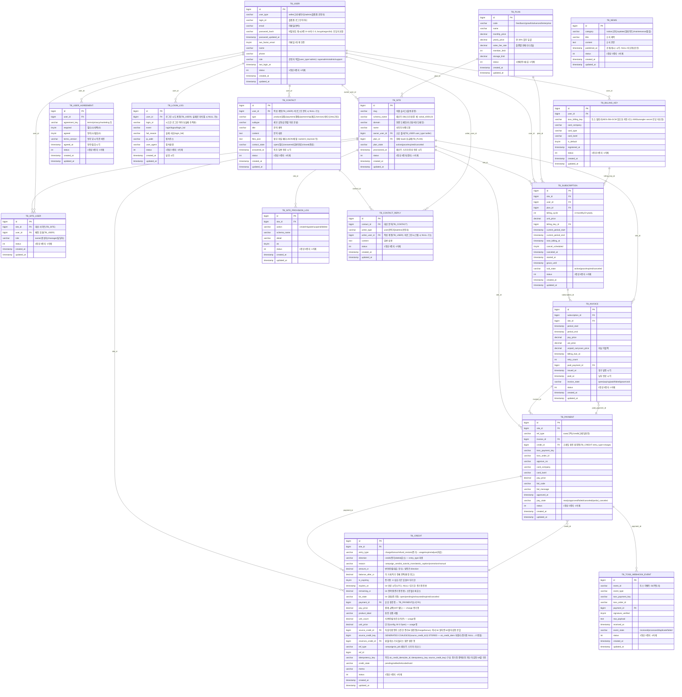

# 쏠쏠 크리에이터 LMS — ERD (Mermaid)

> 갱신일: 2026-07-01 | 정본: `master.sql`(16테이블) + `tenant_template.sql`(92테이블)에서 파생.
> 표준 Mermaid `erDiagram`(속성 = `자료형 컬럼명 PK/FK "코멘트"`). 전 컬럼 표기.
>
> **개정이력**: 2026-07-01 — 브랜드 `TB_CONTACT`·`TB_CONTACT_REPLY`·`TB_NEWS` 추가(마스터 2. 브랜드 문의/소식). 마스터 13→16. · `TB_OAUTH_CONFIG` 추가(테넌트 인증·회원 3-1, 멀티테넌트 OAuth 자격증명). 테넌트 91→92.

---

## 1. 개요 — schema-per-tenant

| 스키마 | 기본 DB명 | 테이블 수 | 역할 |
|---|---|---|---|
| 마스터 | `solsol_master`(dev: `solsol`) | 16 | 플랫폼 공유 마스터 — **사이트(테넌트) 레지스트리(`TB_SITE`)**·셀러·SaaS 요금제/구독/청구/결제·크레딧(단일 원장 `TB_CREDIT`)·프로비저닝·브랜드 문의/소식(테넌트 무관 플랫폼 레벨) |
| 테넌트 | `solsol_t{ID}`(dev: `solsol_lms`) | 92 | 크리에이터 사이트 운영 전체 — 회원·상품·콘텐츠·학습·주문/정산·마케팅·커뮤니티·사이트 |

**컨벤션**: `TB_` 단수 · `id BIGINT AI PK` · `status INT`(1정상/0중지/-1삭제) · 통화 `DECIMAL(18,6)` **`*_price`** · 일시 **`TIMESTAMP`(내부 UTC)**·날짜 `DATE` · **약한 FK**(논리 FK, 제약 없음) · utf8mb4.

> 동명 테이블 주의: `TB_BILLING_KEY`·`TB_INVOICE`·`TB_PAYMENT`·`TB_SUBSCRIPTION`·`TB_TOSS_WEBHOOK_EVENT`는 마스터·테넌트 양쪽에 **별도 엔티티**(마스터=셀러↔플랫폼 SaaS/크레딧, 테넌트=수강생 상품구매/구독).
> 영상 콘텐츠는 **위캔디오(Wecandeo) VOD**(`TB_CONTENT.wecandeo_video_key`), 자막은 위캔디오가 보관(별도 테이블 없음).

---

## 2. 마스터 스키마 ERD

---

## 3. 테넌트 스키마 ERD (도메인별)

### 3-1. 인증·회원·권한

```mermaid
erDiagram
    TB_SITE_CONFIG {
        bigint id PK
        varchar name "사이트명(로고 텍스트 바인딩)"
        varchar url "사이트 URL"
        varchar description "사이트 설명(검색엔진용)"
        varchar email "대표 이메일"
        varchar logo_key "로고 R2 키"
        varchar favicon_key "파비콘 R2 키"
        varchar sns_youtube
        varchar sns_instagram
        varchar sns_twitter
        varchar sns_facebook
        varchar seo_title
        varchar seo_description
        varchar og_image_key "OG 이미지 R2 키(1200x630)"
        int status "1정상 0중지 -1삭제"
        timestamp created_at
        timestamp updated_at
    }
    TB_USER {
        bigint id PK
        varchar user_type "learner(수강생)/staff(강사·서브강사·운영자)"
        varchar login_id "로그인 아이디. staff=별도 아이디(변경불가) / learner=소셜 이메일과 동일(login_id=email)"
        varchar email "이메일(연락·소셜 통합 키). learner=소셜 이메일(login_id와 동일)"
        varchar nickname "2~15자 단일규칙(C-1)·중복/금칙어"
        varchar name "실명"
        varchar phone
        varchar dept "부서(staff)"
        text intro "소개글(강사)"
        varchar avatar_key "프로필 이미지 R2 키"
        varchar google_uid "Google 소셜 고유 ID(연동 시 비NULL)"
        varchar kakao_uid "Kakao 소셜 고유 ID(연동 시 비NULL)"
        varchar naver_uid "Naver 소셜 고유 ID(연동 시 비NULL)"
        varchar apple_uid "Apple 소셜 고유 ID(연동 시 비NULL)"
        varchar facebook_uid "Facebook 소셜 고유 ID(연동 시 비NULL)"
        varchar primary_provider "대표(최초 연동) SNS: google/kakao/naver/apple/facebook"
        tinyint marketing_agreed "마케팅 수신 동의 스냅샷(정본은 TB_USER_AGREEMENT)"
        timestamp last_login_at
        timestamp withdrawn_at "탈퇴 시각(status=-1 연동)"
        int status "1활성 0중지(suspended) -1탈퇴"
        timestamp created_at "가입일"
        timestamp updated_at
    }
    TB_USER_CREDENTIAL {
        bigint id PK
        bigint user_id FK
        varchar password_hash "영문·숫자·특수문자 3종 8~16자(C-3) 해시. 응답 미포함"
        timestamp password_updated_at
        tinyint two_factor_email "이메일 2단계 인증"
        bigint invited_by_user_id "초대한 관리자(TB_USER)"
        int status "1정상 0중지 -1삭제"
        timestamp created_at
        timestamp updated_at
    }
    TB_ROLE {
        bigint id PK
        varchar code "owner/instructor/sub_instructor/learner"
        varchar name
        int status "1정상 0중지 -1삭제"
        timestamp created_at
        timestamp updated_at
    }
    TB_USER_ROLE {
        bigint id PK
        bigint user_id FK
        bigint role_id FK
        int status "1정상 0중지 -1삭제"
        timestamp created_at
        timestamp updated_at
    }
    TB_ADMIN_PERMISSION {
        bigint id PK
        bigint user_id FK "대상 staff"
        varchar menu_key "dashboard/users/products/contents/sales/operation/marketing/site_design/stats/settlement/settings"
        tinyint allowed "노출 허용(1)/차단(0)"
        varchar data_scope "all(전사)/own(본인 담당)"
        int status "1정상 0중지 -1삭제"
        timestamp created_at
        timestamp updated_at
    }
    TB_USER_AGREEMENT {
        bigint id PK
        bigint user_id FK
        varchar agreement_key "age14/terms/privacy/marketing"
        tinyint required "필수(1)/선택(0)"
        tinyint agreed
        varchar terms_version "동의 당시 약관 버전"
        timestamp agreed_at
        int status "1정상 0중지 -1삭제"
        timestamp created_at
        timestamp updated_at
    }
    TB_AUTH_CODE {
        bigint id PK
        varchar purpose "signup/email_change/reset"
        varchar target_type "email/phone"
        varchar target "이메일/휴대폰"
        varchar code_hash "인증코드 해시(원문 미저장)"
        timestamp expires_at "C-2 TTL"
        timestamp verified_at
        int send_count "연속 발송(10회 초과 제한)"
        int verify_count "검증 시도 횟수(무차별 방지)"
        int status "1정상 0중지 -1삭제"
        timestamp created_at
        timestamp updated_at
    }
    TB_PASSWORD_RESET_TOKEN {
        bigint id PK
        bigint user_id FK
        varchar token_hash "재설정 토큰 해시(원문 미저장)"
        timestamp expires_at "발급+30분"
        timestamp used_at
        int status "1정상 0중지 -1삭제"
        timestamp created_at
        timestamp updated_at
    }
    TB_INVITE_TOKEN {
        bigint id PK
        varchar email
        bigint role_id FK "초대 역할"
        varchar token_hash "초대 토큰 해시(원문 미저장)"
        bigint inviter_user_id "초대자(TB_USER)"
        timestamp expires_at "발급+48시간"
        timestamp accepted_at
        int status "1정상 0중지 -1삭제"
        timestamp created_at
        timestamp updated_at
    }
    TB_SESSION {
        bigint id PK
        bigint user_id FK
        varchar refresh_token_hash "리프레시 토큰 해시"
        varchar user_agent
        varchar ip
        tinyint remember
        timestamp expires_at
        timestamp revoked_at
        int status "1정상 0중지 -1삭제"
        timestamp created_at
        timestamp updated_at
    }
    TB_DEVICE_TOKEN {
        bigint id PK
        bigint user_id FK
        varchar device_id
        varchar token "FCM/APNs 토큰"
        varchar platform "ios/android"
        int status "1정상 0중지 -1삭제"
        timestamp created_at
        timestamp updated_at
    }
    TB_OAUTH_CONFIG {
        bigint id PK
        varchar provider "google/kakao/naver/apple/facebook. UNIQUE uk_oauth_provider(테넌트당 provider별 1행)"
        varchar client_id "OAuth 앱 클라이언트 ID"
        text client_secret "AES-GCM 암호문 저장(평문 금지)"
        varchar redirect_uri "콜백 리다이렉트 URI"
        text extra_json "provider별 추가값. apple={teamId,keyId,privateKey(암호문)}"
        tinyint enabled "소셜 로그인 노출/사용(1)/미사용(0). default 0. idx_oauth_enabled"
        int status "1정상 0중지 -1삭제. default 1"
        timestamp created_at
        timestamp updated_at
    }

    TB_USER ||--o{ TB_USER_CREDENTIAL : "user_id"
    TB_USER ||--o{ TB_USER_ROLE : "user_id"
    TB_ROLE ||--o{ TB_USER_ROLE : "role_id"
    TB_USER ||--o{ TB_ADMIN_PERMISSION : "user_id"
    TB_USER ||--o{ TB_USER_AGREEMENT : "user_id"
    TB_USER ||--o{ TB_PASSWORD_RESET_TOKEN : "user_id"
    TB_ROLE ||--o{ TB_INVITE_TOKEN : "role_id"
    TB_USER ||--o{ TB_SESSION : "user_id"
    TB_USER ||--o{ TB_DEVICE_TOKEN : "user_id"
```

> **`TB_OAUTH_CONFIG`(멀티테넌트 OAuth 자격증명)**: 테넌트당 provider(google/kakao/naver/apple/facebook)별 1행(UNIQUE `uk_oauth_provider`)으로 소셜 로그인의 **앱 자격증명 소스**(client_id/secret·redirect_uri). `client_secret`·apple `privateKey`는 **AES-GCM 암호문**으로만 저장(평문 금지). `TB_USER.google_uid` 등 소셜 비정규화 컬럼과는 **역할이 다름** — TB_USER는 연동된 **개별 사용자 계정 식별**, TB_OAUTH_CONFIG는 그 소셜 인증을 수행할 **앱(테넌트) 자격증명**. user FK 없음(사용자별 행 아님).

### 3-2. 상품·콘텐츠·학습

```mermaid
erDiagram
    TB_CATEGORY {
        bigint id PK
        bigint parent_id FK "상위 카테고리(self). 최대 2단계"
        varchar name
        int sort_order
        int status "1정상 0중지 -1삭제"
        timestamp created_at
        timestamp updated_at
    }
    TB_PRODUCT {
        bigint id PK
        bigint owner_user_id FK "담당 강사(TB_USER). 데이터스코프 기준"
        bigint category_id FK "1상품 1카테고리(멤버십 제외)"
        varchar type "course/live/video_call/digital/package/membership/community"
        varchar title
        varchar sub_title
        text description
        varchar thumbnail_key "R2 키(16:9)"
        varchar price_type "free/paid"
        decimal list_price "정가"
        int discount_rate "할인율(%) UI 표시 전용·결제 계산 미사용(C-4 정액 only)"
        varchar visibility "public/partial/private. 신규 기본 private"
        varchar sale_status "on_sale/sale_closed/sale_stopped/sale_ended"
        tinyint allow_review
        tinyint allow_qna
        int enroll_period_days "수강기간(일). NULL=무제한"
        decimal avg_rating "평균 별점(파생)"
        int status "1정상 0중지 -1삭제"
        timestamp created_at
        timestamp updated_at
    }
    TB_PRODUCT_LIVE {
        bigint id PK
        bigint product_id FK "상품(TB_PRODUCT type=live)"
        varchar youtube_url "유튜브 라이브 URL"
        varchar youtube_video_id "유튜브 영상 ID"
        timestamp start_at "방송 시작"
        timestamp end_at "방송 종료"
        int enter_open_min "입장 활성(시작 N분 전) 10~60"
        varchar live_status "upcoming/live/ended"
        tinyint instant_complete "입장 즉시 자동수료"
        bigint certificate_template_id FK "수료증 템플릿(TB_CERTIFICATE_TEMPLATE). NULL=수료증 미사용, 설정 시 자동발급"
        bigint recorded_content_id FK "종료 후 녹화본(TB_CONTENT)"
        int status "1정상 0중지 -1삭제"
        timestamp created_at
        timestamp updated_at
    }
    TB_PRODUCT_VIDEO_CALL {
        bigint id PK
        bigint product_id FK "상품(TB_PRODUCT type=video_call)"
        varchar platform "zoom/google_meet"
        varchar meeting_url "접속 URL"
        timestamp start_at
        timestamp end_at
        int capacity "모집인원"
        int enter_open_min "입장 활성(시작 N분 전)"
        int status "1정상 0중지 -1삭제"
        timestamp created_at
        timestamp updated_at
    }
    TB_PRODUCT_DIGITAL_FILE {
        bigint id PK
        bigint product_id FK
        bigint content_id FK "라이브러리 콘텐츠 연결"
        varchar file_name
        varchar r2_key
        int download_limit "파일별 최대 다운로드(0=무제한, 1~100)"
        int status "1정상 0중지 -1삭제"
        timestamp created_at
        timestamp updated_at
    }
    TB_DIGITAL_DOWNLOAD_LOG {
        bigint id PK
        bigint digital_file_id FK "디지털 파일(TB_PRODUCT_DIGITAL_FILE)"
        bigint product_id FK "상품(TB_PRODUCT) 비정규화"
        bigint user_id FK "다운로드 회원(TB_USER)"
        bigint order_id FK "구매 주문(TB_ORDER) — 구매권 근거·정산/환불 추적"
        bigint order_item_id FK "구매 주문항목(TB_ORDER_ITEM) — 해당 디지털 상품 라인"
        varchar file_name "다운로드 파일명 스냅샷"
        varchar ip_addr "접속주소"
        varchar user_agent "접속환경"
        int status "1정상 0중지 -1삭제"
        timestamp created_at "다운로드 시각"
        timestamp updated_at
    }
    TB_PACKAGE_ITEM {
        bigint id PK
        bigint package_product_id FK "패키지 상품"
        bigint item_product_id FK "구성 상품"
        int sort_order
        int status "1정상 0중지 -1삭제"
        timestamp created_at
        timestamp updated_at
    }
    TB_MEMBERSHIP_TIER {
        bigint id PK
        bigint product_id FK
        varchar name
        decimal monthly_price
        int sort_order
        int status "1정상 0중지 -1삭제"
        timestamp created_at
        timestamp updated_at
    }
    TB_MEMBERSHIP_CATEGORY {
        bigint id PK
        bigint tier_id FK
        bigint category_id FK
        int status "1정상 0중지 -1삭제"
        timestamp created_at
        timestamp updated_at
    }
    TB_PRODUCT_COMMUNITY {
        bigint id PK
        bigint product_id FK
        decimal monthly_price "월 구독료(자동결제)"
        tinyint auto_payment
        int status "1정상 0중지 -1삭제"
        timestamp created_at
        timestamp updated_at
    }
    TB_PRODUCT_BENEFIT {
        bigint id PK
        bigint product_id FK
        varchar benefit_text
        int sort_order
        int status "1정상 0중지 -1삭제"
        timestamp created_at
        timestamp updated_at
    }
    TB_COURSE {
        bigint id PK
        bigint product_id FK "상품(TB_PRODUCT type=course)"
        varchar level "난이도(beginner/intermediate/advanced)"
        int total_section_cnt "섹션수(캐시)"
        int total_lesson_cnt "강의수(캐시)"
        int total_duration_sec "총 재생시간 초(캐시)"
        int min_progress_rate "수료 최소 진도율 10~100"
        varchar watch_mode "시청방식 free/sequential(순차시청)"
        bigint certificate_template_id FK "수료증 템플릿(TB_CERTIFICATE_TEMPLATE). NULL=수료증 미사용, 설정 시 자동발급"
        int status "1정상 0중지 -1삭제"
        timestamp created_at
        timestamp updated_at
    }
    TB_COURSE_TUTOR {
        bigint id PK
        bigint course_id FK "강좌(TB_COURSE)"
        bigint user_id FK "강사(TB_USER)"
        varchar type "구분(main 주강사/sub 보조강사 등)"
        varchar class "분반"
        decimal ratio "정산비율(%)"
        int sort_order "정렬순서"
        tinyint is_display "노출여부"
        int status "1정상 0중지 -1삭제"
        timestamp created_at
        timestamp updated_at
    }
    TB_SECTION {
        bigint id PK
        bigint course_id FK "강좌(TB_COURSE)"
        varchar title
        int sort_order
        int status "1정상 0중지 -1삭제"
        timestamp created_at
        timestamp updated_at
    }
    TB_LESSON {
        bigint id PK
        bigint section_id FK "섹션(TB_SECTION)"
        bigint course_id FK "강좌(TB_COURSE) 비정규화"
        bigint content_id FK "연결 콘텐츠(강의당 1개)"
        varchar title
        int seq "섹션 내 순번"
        tinyint is_preview "맛보기(무료공개)"
        int status "1정상 0중지 -1삭제"
        timestamp created_at
        timestamp updated_at
    }
    TB_CONTENT_FOLDER {
        bigint id PK
        bigint parent_id FK "상위 폴더(self). 최대 2단계"
        varchar name
        int sort_order
        int status "1정상 0중지 -1삭제"
        timestamp created_at
        timestamp updated_at
    }
    TB_CONTENT {
        bigint id PK
        bigint folder_id FK
        varchar name
        varchar media_type "video/doc/image/etc"
        varchar source_type "wecandeo(영상 VOD)/youtube(임베드)/upload(문서·이미지 R2)"
        varchar wecandeo_video_key "위캔디오 VOD 키/ID(영상)"
        varchar r2_key "문서·이미지 R2 키(upload)"
        varchar youtube_url
        varchar upload_status "위캔디오 인코딩/업로드 상태 pending/processing/done/failed"
        int duration_sec
        bigint size_bytes "용량(한도 집계)"
        varchar thumbnail_key "썸네일(위캔디오 제공/R2)"
        tinyint has_ai_tutor
        tinyint has_ai_translate
        int status "1정상 0중지 -1삭제"
        timestamp created_at
        timestamp updated_at
    }
    TB_COURSE_USER {
        bigint id PK
        bigint product_id FK "수강 상품(TB_PRODUCT)"
        bigint course_id FK "강좌(TB_COURSE) — type=course일 때"
        bigint package_id FK "패키지 상품(TB_PRODUCT type=package) 경유 구매 시"
        bigint user_id FK "수강생(TB_USER)"
        bigint order_id FK "주문(TB_ORDER)"
        bigint order_item_id FK "주문항목(TB_ORDER_ITEM)"
        bigint subscription_id FK "정기구독(TB_SUBSCRIPTION) — 구독 부여 시"
        varchar grant_source "purchase/subscription/package/membership"
        varchar learn_status "before/learning/completed(편의 상태)"
        date start_date "수강시작일"
        date end_date "수강종료일"
        int renew_cnt "연장횟수(학습기간 추가)"
        decimal progress_ratio "진도율(완료 기준 — 시험 미사용)"
        tinyint is_complete "수료여부(1수료 0미수료)"
        varchar complete_no "수료번호"
        timestamp complete_date "수료일"
        int status "1정상 0중지 -1삭제"
        timestamp created_at "구매/등록일"
        timestamp updated_at
    }
    TB_LESSON_PROGRESS {
        bigint id PK
        bigint course_user_id FK "수강(TB_COURSE_USER)"
        bigint lesson_id FK "강의(TB_LESSON)"
        bigint course_id FK "강좌(TB_COURSE) 비정규화"
        bigint user_id FK "회원(TB_USER) 비정규화"
        int chapter "장"
        bigint ai_session_id "AI튜터 세션"
        varchar lesson_type "영상/콘텐츠 타입"
        int study_page "학습페이지 수"
        int study_time "학습시간(초)"
        varchar curr_page "현재 페이지(문서형)"
        int curr_time "현재 위치(초, 이어보기)"
        int last_time "최대 위치(초)"
        varchar paragraph "수강한 절 번호"
        decimal ratio "진도율"
        tinyint is_complete "완료여부"
        timestamp complete_date "완료일"
        int view_cnt "수강 횟수"
        timestamp last_date "마지막 수강일"
        bigint change_user_id FK "임의변경자(TB_USER)"
        int status "1정상 0중지 -1삭제"
        timestamp created_at
        timestamp updated_at
    }
    TB_COURSE_USER_LOG {
        bigint id PK
        bigint course_user_id FK "수강(TB_COURSE_USER)"
        bigint user_id FK "회원(TB_USER)"
        bigint course_id FK "강좌(TB_COURSE)"
        bigint lesson_id FK "강의(TB_LESSON)"
        int chapter "차시(장)"
        decimal progress_ratio "차시진도율"
        tinyint is_progress_complete "차시완료여부"
        varchar ip_addr "접속주소"
        varchar user_agent "접속환경"
        int status "1정상 0중지 -1삭제"
        timestamp created_at "접속일"
        timestamp updated_at
    }
    TB_CERTIFICATE_TEMPLATE {
        bigint id PK
        varchar name
        varchar design_theme
        varchar cert_title
        varchar issuer_name
        varchar signer_name
        varchar signature_key
        varchar logo_key
        json display_items "표시항목 토글"
        tinyint is_active
        int status "1정상 0중지 -1삭제"
        timestamp created_at
        timestamp updated_at
    }
    TB_CERTIFICATE {
        bigint id PK
        bigint course_user_id FK "수강(TB_COURSE_USER)"
        bigint user_id FK
        bigint product_id FK
        bigint template_id FK "발급 시점 템플릿"
        varchar cert_no "수료번호"
        varchar learner_name "수료자명 스냅샷"
        varchar product_title "상품명 스냅샷"
        decimal study_hours
        timestamp started_at
        timestamp completed_at
        tinyint revoked "무효(환불/취소 시)"
        timestamp issued_at
        int status "1정상 0중지 -1삭제"
        timestamp created_at
        timestamp updated_at
    }
    TB_WISHLIST {
        bigint id PK
        bigint user_id FK
        bigint product_id FK
        int status "1정상 0중지 -1삭제"
        timestamp created_at
        timestamp updated_at
    }
    TB_REVIEW {
        bigint id PK
        bigint user_id FK "작성 수강생(TB_USER)"
        bigint product_id FK "대상 상품(TB_PRODUCT)"
        bigint course_user_id FK "수강(TB_COURSE_USER). NULL=구매 없이 작성 불가 정책 적용 시 NOT NULL로 변경"
        int rating "별점 1~5"
        text content "후기 본문"
        int status "1공개 0숨김(운영자) -1삭제"
        timestamp created_at
        timestamp updated_at
    }
    TB_AI_JOB {
        bigint id PK
        bigint content_id FK
        varchar kind "ai_tutor/ai_caption/ai_translate"
        varchar target_lang
        varchar job_status "pending/processing/done/failed"
        bigint credit_id FK "크레딧 차감 원장행(master.TB_CREDIT) 논리참조"
        int status "1정상 0중지 -1삭제"
        timestamp created_at
        timestamp updated_at
    }
    TB_COURSE_RESOURCE {
        bigint id PK
        bigint product_id FK
        varchar file_name
        varchar r2_key
        int sort_order
        int status "1정상 0중지 -1삭제"
        timestamp created_at
        timestamp updated_at
    }
    TB_PLAYER_SETTING {
        bigint id PK
        tinyint auto_next
        tinyint remember_position
        tinyint allow_speed
        tinyint show_subtitle
        tinyint progress_save
        tinyint restrict_skip "구간 탐색 제한"
        tinyint force_watch_order "순차 시청 강제"
        int status "1정상 0중지 -1삭제"
        timestamp created_at
        timestamp updated_at
    }
    TB_USER {
        bigint id PK
        varchar user_type "learner(수강생)/staff(강사·서브강사·운영자)"
        varchar email "이메일(연락·소셜 통합 키). learner=소셜 이메일(login_id와 동일)"
        varchar nickname "2~15자 단일규칙(C-1)·중복/금칙어"
    }
    TB_ORDER {
        bigint id PK
        varchar order_no "ORD-YYYYMMDD-NNNN"
    }
    TB_ORDER_ITEM {
        bigint id PK
    }
    TB_SUBSCRIPTION {
        bigint id PK
        varchar sub_state "active/grace/expired/canceled"
    }
    TB_CREDIT {
        bigint id PK
    }

    TB_CATEGORY ||--o{ TB_CATEGORY : "parent_id"
    TB_USER ||--o{ TB_PRODUCT : "owner_user_id"
    TB_CATEGORY ||--o{ TB_PRODUCT : "category_id"
    TB_PRODUCT ||--o{ TB_PRODUCT_LIVE : "product_id"
    TB_CERTIFICATE_TEMPLATE ||--o{ TB_PRODUCT_LIVE : "certificate_template_id"
    TB_CONTENT ||--o{ TB_PRODUCT_LIVE : "recorded_content_id"
    TB_PRODUCT ||--o{ TB_PRODUCT_VIDEO_CALL : "product_id"
    TB_PRODUCT ||--o{ TB_PRODUCT_DIGITAL_FILE : "product_id"
    TB_CONTENT ||--o{ TB_PRODUCT_DIGITAL_FILE : "content_id"
    TB_PRODUCT_DIGITAL_FILE ||--o{ TB_DIGITAL_DOWNLOAD_LOG : "digital_file_id"
    TB_PRODUCT ||--o{ TB_DIGITAL_DOWNLOAD_LOG : "product_id"
    TB_USER ||--o{ TB_DIGITAL_DOWNLOAD_LOG : "user_id"
    TB_ORDER ||--o{ TB_DIGITAL_DOWNLOAD_LOG : "order_id"
    TB_ORDER_ITEM ||--o{ TB_DIGITAL_DOWNLOAD_LOG : "order_item_id"
    TB_PRODUCT ||--o{ TB_PACKAGE_ITEM : "package_product_id"
    TB_PRODUCT ||--o{ TB_PACKAGE_ITEM : "item_product_id"
    TB_PRODUCT ||--o{ TB_MEMBERSHIP_TIER : "product_id"
    TB_MEMBERSHIP_TIER ||--o{ TB_MEMBERSHIP_CATEGORY : "tier_id"
    TB_CATEGORY ||--o{ TB_MEMBERSHIP_CATEGORY : "category_id"
    TB_PRODUCT ||--o{ TB_PRODUCT_COMMUNITY : "product_id"
    TB_PRODUCT ||--o{ TB_PRODUCT_BENEFIT : "product_id"
    TB_PRODUCT ||--o{ TB_COURSE : "product_id"
    TB_CERTIFICATE_TEMPLATE ||--o{ TB_COURSE : "certificate_template_id"
    TB_COURSE ||--o{ TB_COURSE_TUTOR : "course_id"
    TB_USER ||--o{ TB_COURSE_TUTOR : "user_id"
    TB_COURSE ||--o{ TB_SECTION : "course_id"
    TB_SECTION ||--o{ TB_LESSON : "section_id"
    TB_COURSE ||--o{ TB_LESSON : "course_id"
    TB_CONTENT ||--o{ TB_LESSON : "content_id"
    TB_CONTENT_FOLDER ||--o{ TB_CONTENT_FOLDER : "parent_id"
    TB_CONTENT_FOLDER ||--o{ TB_CONTENT : "folder_id"
    TB_PRODUCT ||--o{ TB_COURSE_USER : "product_id"
    TB_COURSE ||--o{ TB_COURSE_USER : "course_id"
    TB_PRODUCT ||--o{ TB_COURSE_USER : "package_id"
    TB_USER ||--o{ TB_COURSE_USER : "user_id"
    TB_ORDER ||--o{ TB_COURSE_USER : "order_id"
    TB_ORDER_ITEM ||--o{ TB_COURSE_USER : "order_item_id"
    TB_SUBSCRIPTION ||--o{ TB_COURSE_USER : "subscription_id"
    TB_COURSE_USER ||--o{ TB_LESSON_PROGRESS : "course_user_id"
    TB_LESSON ||--o{ TB_LESSON_PROGRESS : "lesson_id"
    TB_COURSE ||--o{ TB_LESSON_PROGRESS : "course_id"
    TB_USER ||--o{ TB_LESSON_PROGRESS : "user_id"
    TB_USER ||--o{ TB_LESSON_PROGRESS : "change_user_id"
    TB_COURSE_USER ||--o{ TB_COURSE_USER_LOG : "course_user_id"
    TB_USER ||--o{ TB_COURSE_USER_LOG : "user_id"
    TB_COURSE ||--o{ TB_COURSE_USER_LOG : "course_id"
    TB_LESSON ||--o{ TB_COURSE_USER_LOG : "lesson_id"
    TB_COURSE_USER ||--o{ TB_CERTIFICATE : "course_user_id"
    TB_USER ||--o{ TB_CERTIFICATE : "user_id"
    TB_PRODUCT ||--o{ TB_CERTIFICATE : "product_id"
    TB_CERTIFICATE_TEMPLATE ||--o{ TB_CERTIFICATE : "template_id"
    TB_USER ||--o{ TB_WISHLIST : "user_id"
    TB_PRODUCT ||--o{ TB_WISHLIST : "product_id"
    TB_USER ||--o{ TB_REVIEW : "user_id"
    TB_PRODUCT ||--o{ TB_REVIEW : "product_id"
    TB_COURSE_USER ||--o{ TB_REVIEW : "course_user_id"
    TB_CONTENT ||--o{ TB_AI_JOB : "content_id"
    TB_CREDIT ||--o{ TB_AI_JOB : "credit_id"
    TB_PRODUCT ||--o{ TB_COURSE_RESOURCE : "product_id"
```

### 3-3. 결제·구독·정산

```mermaid
erDiagram
    TB_SUBSCRIPTION {
        bigint id PK
        bigint user_id FK "구독 주체(학습자 멤버십/커뮤니티). 판매자 플랜은 사이트 소유자"
        int subject_type "2=MEMBERSHIP/3=COMMUNITY (테넌트는 SELLER_PLAN 미사용 — 마스터 전담)"
        bigint plan_id
        bigint product_id FK
        int billing_cycle "1=monthly/2=yearly"
        decimal unit_price "구독료 스냅샷"
        bigint billing_key_id FK
        timestamp current_period_start
        timestamp current_period_end
        timestamp next_billing_at
        tinyint cancel_scheduled "기간종료후 해지 예약"
        timestamp canceled_at
        timestamp started_at "최초 구독 시작일"
        timestamp grace_until "유예 종료일"
        int status "1정상 0중지 -1삭제 (구독상태는 sub_state)"
        varchar sub_state "active/grace/expired/canceled"
        timestamp created_at
        timestamp updated_at
    }
    TB_ORDER {
        bigint id PK
        varchar order_no "ORD-YYYYMMDD-NNNN"
        bigint user_id FK "주문자"
        varchar ref_type "product/credit_charge"
        decimal list_price "정가 합계"
        decimal shop_discount_price
        bigint coupon_id FK
        decimal coupon_discount_price
        decimal vat_price
        decimal pay_price "총 결제금액"
        tinyint is_subscription
        timestamp paid_at
        varchar order_state "pending/paying/paid/failed/grace/unpaid/canceled/refunded/partial_refund"
        int status "1정상 0중지 -1삭제"
        timestamp created_at
        timestamp updated_at
    }
    TB_ORDER_ITEM {
        bigint id PK
        bigint order_id FK
        bigint product_id FK
        int product_type "1일반/2라이브/3화상/4패키지/5디지털/6멤버십/7커뮤니티"
        varchar product_name "상품명 스냅샷"
        bigint instructor_user_id "담당 강사(정산 스코프)(=06 §1.9 instructor_admin_id)"
        decimal list_price "정가 스냅샷"
        decimal discount_price
        decimal pay_price "항목 결제금액"
        int status "1정상 0중지 -1삭제"
        timestamp created_at
        timestamp updated_at
    }
    TB_INVOICE {
        bigint id PK
        bigint subscription_id FK
        timestamp period_start
        timestamp period_end
        decimal pay_price
        decimal vat_price
        decimal unpaid_carryover_price "미납 이월액"
        timestamp billing_due_at
        int retry_count "재시도 회차(최대 6)"
        bigint paid_payment_id
        timestamp issued_at "청구 발행 시각"
        timestamp paid_at "납부 완료 시각"
        varchar invoice_state "open/paying/paid/failed/grace/void"
        int status "1정상 0중지 -1삭제"
        timestamp created_at
        timestamp updated_at
    }
    TB_PAYMENT {
        bigint id PK
        bigint order_id FK
        bigint invoice_id FK
        varchar toss_payment_key
        varchar toss_order_id "토스 orderId(=order_no 매핑)"
        varchar approve_no
        varchar acquirer
        varchar card_company
        varchar card_last4 "카드 뒤 4자리만(마스킹)"
        int install_months
        decimal pay_price
        int method "1=card(계좌이체 미지원)"
        int retry_count
        varchar fail_code
        varchar fail_message
        timestamp approved_at
        varchar pay_state "ready/approved/failed/canceled/partial_canceled"
        int status "1정상 0중지 -1삭제"
        timestamp created_at
        timestamp updated_at
    }
    TB_ORDER_LOG {
        bigint id PK
        bigint order_id FK
        varchar log_type
        varchar description
        int actor_type "1=system/2=admin"
        bigint actor_user_id
        int status "1정상 0중지 -1삭제"
        timestamp created_at
        timestamp updated_at
    }
    TB_BILLING_KEY {
        bigint id PK
        bigint user_id FK
        varchar toss_billing_key "토스 빌링키(AES-256-GCM 암호화 저장·키는 KMS/wrangler secret·응답 미포함)"
        varchar card_company
        varchar card_type "신용/체크"
        varchar card_last4 "뒤 4자리(표시)"
        tinyint is_default "대표카드"
        timestamp registered_at
        int status "1정상 0중지 -1삭제"
        timestamp created_at
        timestamp updated_at
    }
    TB_REFUND {
        bigint id PK
        bigint order_id FK
        bigint payment_id FK
        int refund_type "1=full/2=partial"
        decimal requested_price
        decimal refund_price
        varchar reason
        varchar transfer_note "이체내역(저장 전 계좌/예금주 마스킹)"
        int channel "1=self/2=inquiry"
        bigint inquiry_id "(1:1문의=TB_POST board_type=qna 의 게시물 id)"
        tinyint revoke_course "수강권 회수"
        tinyint void_certificate "수료증 무효"
        timestamp requested_at
        timestamp refunded_at
        bigint handler_user_id
        varchar refund_state "requested/completed/rejected"
        int status "1정상 0중지 -1삭제"
        timestamp created_at
        timestamp updated_at
    }
    TB_REFUND_LOG {
        bigint id PK
        bigint refund_id FK
        timestamp processed_at
        bigint handler_user_id
        decimal refund_price
        varchar transfer_note "이체내역(저장 전 계좌/예금주 마스킹)"
        varchar content
        int status "1정상 0중지 -1삭제"
        timestamp created_at
        timestamp updated_at
    }
    TB_COUPON {
        bigint id PK
        varchar name
        varchar description
        int discount_type "1=AMOUNT only(C-4). 정률 미사용"
        decimal discount_price "정액 할인액"
        decimal min_order_price
        int scope_type "1=ALL/2=SPECIFIC"
        int target_type "1=ALL_MEMBER/2=GROUP"
        bigint recipient_group_id FK
        int issue_quantity "NULL=제한없음"
        timestamp use_period_start
        timestamp use_period_end
        int valid_days "발급 후 유효일수"
        varchar coupon_state "active/suspended/revoked"
        int status "1정상 0중지 -1삭제"
        timestamp created_at
        timestamp updated_at
    }
    TB_COUPON_PRODUCT {
        bigint id PK
        bigint coupon_id FK
        bigint product_id FK
        int status "1정상 0중지 -1삭제"
        timestamp created_at
        timestamp updated_at
    }
    TB_COUPON_ISSUE {
        bigint id PK
        bigint coupon_id FK
        bigint user_id FK
        varchar coupon_code
        bigint order_id FK
        decimal discount_price
        timestamp issued_at
        timestamp expires_at
        timestamp used_at
        varchar issue_state "issued/used/revoked"
        int status "1정상 0중지 -1삭제"
        timestamp created_at
        timestamp updated_at
    }
    TB_SETTLEMENT_PROFILE {
        bigint id PK
        bigint instructor_user_id "소유 강사(TB_USER)"
        int profile_type "1개인사업자/2법인사업자/3개인"
        varchar biz_no
        varchar company_name
        varchar ceo_name
        varchar biz_address
        varchar biz_category
        varchar biz_item
        varchar biz_license_key "사업자등록증 R2 키"
        date birth_date
        varchar telecom
        tinyint identity_verified
        varchar manager_name
        varchar manager_phone
        varchar manager_email
        tinyint email_verified
        varchar bank_name
        varchar account_no "계좌번호(저장 암호화·조회 시 부분마스킹)"
        varchar account_holder
        tinyint account_verified
        varchar bankbook_key "통장 사본 R2 키"
        int approve_state "0=none/1=pending/2=approved/3=rejected"
        timestamp approved_at
        int status "1정상 0중지 -1삭제"
        timestamp created_at
        timestamp updated_at
    }
    TB_SETTLEMENT {
        bigint id PK
        bigint instructor_user_id "강사 스코프(NULL=전사)(=06 §1.9 instructor_admin_id)"
        varchar period_month "YYYY-MM"
        timestamp period_start
        timestamp period_end
        timestamp pay_date "지급 예정(익월 10일)"
        int settle_count
        int payment_count
        int cancel_count
        decimal gross_price
        decimal supply_price
        decimal vat_price
        decimal sales_fee_price
        decimal sales_fee_rate
        decimal pg_fee_price
        decimal canceled_price
        decimal net_price
        varchar bank_snapshot
        varchar settle_state "pending/approved/paid"
        timestamp approved_at
        int status "1정상 0중지 -1삭제"
        timestamp created_at
        timestamp updated_at
    }
    TB_SETTLEMENT_ITEM {
        bigint id PK
        bigint settlement_id FK
        bigint product_id FK
        varchar product_name
        int product_type
        int sold_count
        decimal gross_price
        decimal sales_fee_price
        decimal pg_fee_price
        decimal net_price
        int status "1정상 0중지 -1삭제"
        timestamp created_at
        timestamp updated_at
    }
    TB_TAX_REPORT {
        bigint id PK
        varchar period_month "YYYY-MM"
        int approve_count
        int cancel_count
        int net_count
        decimal paid_price
        decimal canceled_price
        decimal net_price
        int status "1정상 0중지 -1삭제"
        timestamp created_at
        timestamp updated_at
    }
    TB_TAX_REPORT_ITEM {
        bigint id PK
        bigint tax_report_id FK
        bigint order_id FK
        int trade_type "1=approve/2=cancel"
        decimal pay_price
        timestamp traded_at
        int status "1정상 0중지 -1삭제"
        timestamp created_at
        timestamp updated_at
    }
    TB_TOSS_WEBHOOK_EVENT {
        bigint id PK
        varchar event_id "토스 이벤트 ID(멱등키)"
        varchar event_type
        varchar toss_payment_key
        varchar toss_order_id
        bigint payment_id FK
        tinyint signature_verified
        text raw_payload
        timestamp received_at
        varchar event_state "received/processed/duplicate/failed"
        int status "1정상 0중지 -1삭제"
        timestamp created_at
        timestamp updated_at
    }
    TB_USER {
        bigint id PK
        varchar user_type "learner(수강생)/staff(강사·서브강사·운영자)"
        varchar email "이메일(연락·소셜 통합 키). learner=소셜 이메일(login_id와 동일)"
        varchar nickname "2~15자 단일규칙(C-1)·중복/금칙어"
    }
    TB_PRODUCT {
        bigint id PK
        varchar type "course/live/video_call/digital/package/membership/community"
        varchar title
    }
    TB_RECIPIENT_GROUP {
        bigint id PK
        varchar name
    }

    TB_USER ||--o{ TB_SUBSCRIPTION : "user_id"
    TB_PRODUCT ||--o{ TB_SUBSCRIPTION : "product_id"
    TB_BILLING_KEY ||--o{ TB_SUBSCRIPTION : "billing_key_id"
    TB_USER ||--o{ TB_ORDER : "user_id"
    TB_COUPON ||--o{ TB_ORDER : "coupon_id"
    TB_ORDER ||--o{ TB_ORDER_ITEM : "order_id"
    TB_PRODUCT ||--o{ TB_ORDER_ITEM : "product_id"
    TB_SUBSCRIPTION ||--o{ TB_INVOICE : "subscription_id"
    TB_ORDER ||--o{ TB_PAYMENT : "order_id"
    TB_INVOICE ||--o{ TB_PAYMENT : "invoice_id"
    TB_ORDER ||--o{ TB_ORDER_LOG : "order_id"
    TB_USER ||--o{ TB_BILLING_KEY : "user_id"
    TB_ORDER ||--o{ TB_REFUND : "order_id"
    TB_PAYMENT ||--o{ TB_REFUND : "payment_id"
    TB_REFUND ||--o{ TB_REFUND_LOG : "refund_id"
    TB_RECIPIENT_GROUP ||--o{ TB_COUPON : "recipient_group_id"
    TB_COUPON ||--o{ TB_COUPON_PRODUCT : "coupon_id"
    TB_PRODUCT ||--o{ TB_COUPON_PRODUCT : "product_id"
    TB_COUPON ||--o{ TB_COUPON_ISSUE : "coupon_id"
    TB_USER ||--o{ TB_COUPON_ISSUE : "user_id"
    TB_ORDER ||--o{ TB_COUPON_ISSUE : "order_id"
    TB_SETTLEMENT ||--o{ TB_SETTLEMENT_ITEM : "settlement_id"
    TB_PRODUCT ||--o{ TB_SETTLEMENT_ITEM : "product_id"
    TB_TAX_REPORT ||--o{ TB_TAX_REPORT_ITEM : "tax_report_id"
    TB_ORDER ||--o{ TB_TAX_REPORT_ITEM : "order_id"
    TB_PAYMENT ||--o{ TB_TOSS_WEBHOOK_EVENT : "payment_id"
```

### 3-4. 마케팅·알림·설문·통계

```mermaid
erDiagram
    TB_RECIPIENT_GROUP {
        bigint id PK
        varchar name
        varchar update_mode "auto(조건 동적)/manual(명단)"
        json condition_logic "조건 트리(auto)"
        int member_count "추출/등록 인원(캐시)"
        int status "1정상 0중지 -1삭제"
        timestamp created_at
        timestamp updated_at
    }
    TB_RECIPIENT_GROUP_MEMBER {
        bigint id PK
        bigint recipient_group_id FK
        bigint user_id FK
        varchar added_by "manual/condition"
        int status "1정상 0중지 -1삭제"
        timestamp created_at
        timestamp updated_at
    }
    TB_MESSAGE_TEMPLATE {
        bigint id PK
        varchar name
        varchar channel "email/sms/alimtalk"
        varchar subject
        text content
        tinyint include_unsubscribe
        varchar alimtalk_template_code "카카오 승인 템플릿코드"
        int status "1정상 0중지 -1삭제"
        timestamp created_at
        timestamp updated_at
    }
    TB_CAMPAIGN {
        bigint id PK
        varchar name
        varchar channel "email/sms/mms/alimtalk"
        bigint recipient_group_id FK
        bigint message_template_id FK
        varchar subject
        text content
        varchar schedule_type "now/scheduled/condition"
        timestamp scheduled_at "예약(>= now+10분)"
        json send_condition
        decimal est_credit_cost "예상 크레딧 소모"
        int recipient_count
        int success_count
        int fail_count
        int open_count
        varchar send_state "reserved/sending/sent/stopped/failed"
        int status "1정상 0중지 -1삭제"
        timestamp created_at
        timestamp updated_at
    }
    TB_CAMPAIGN_RECIPIENT {
        bigint id PK
        bigint campaign_id FK
        bigint user_id FK
        varchar contact
        varchar recipient_name
        varchar send_result "success/fail"
        tinyint opened
        timestamp opened_at
        tinyint excluded
        int resent_count
        int status "1정상 0중지 -1삭제"
        timestamp created_at
        timestamp updated_at
    }
    TB_SURVEY {
        bigint id PK
        varchar name
        varchar respondent_type "all/learner/completer/subscriber"
        tinyint is_public
        tinyint published
        int response_count
        int status "1정상 0중지 -1삭제"
        timestamp created_at
        timestamp updated_at
    }
    TB_SURVEY_QUESTION {
        bigint id PK
        bigint survey_id FK
        int seq
        varchar text
        varchar qtype "text/long/radio/check/rating"
        int rating_max "rating 척도 최대(예 5). qtype=rating"
        varchar option1 "보기1(radio/check)"
        varchar option2 "보기2"
        varchar option3 "보기3"
        varchar option4 "보기4"
        varchar option5 "보기5"
        varchar option6 "보기6"
        varchar option7 "보기7"
        varchar option8 "보기8"
        varchar option9 "보기9"
        varchar option10 "보기10"
        tinyint required
        int status "1정상 0중지 -1삭제"
        timestamp created_at
        timestamp updated_at
    }
    TB_SURVEY_RESPONSE {
        bigint id PK
        bigint survey_id FK
        bigint user_id FK
        timestamp submitted_at
        int status "1정상 0중지 -1삭제"
        timestamp created_at
        timestamp updated_at
    }
    TB_SURVEY_ANSWER {
        bigint id PK
        bigint survey_response_id FK
        bigint survey_question_id FK
        int option_no "선택 보기 번호(1~10, TB_SURVEY_QUESTION.option*) — radio/check. check는 보기당 1행"
        text answer_text "주관식 답(text/long)"
        int rating_value "척도 답(rating)"
        int status "1정상 0중지 -1삭제"
        timestamp created_at
        timestamp updated_at
    }
    TB_LANDING_PAGE {
        bigint id PK
        varchar name
        varchar page_type "basic/extended"
        varchar headline
        varchar sub_title
        text body
        varchar visual_image_key
        varchar cta_text
        tinyint is_visible
        int signup_count
        int status "1정상 0중지 -1삭제"
        timestamp created_at
        timestamp updated_at
    }
    TB_LANDING_PRODUCT {
        bigint id PK
        bigint landing_page_id FK
        bigint product_id FK
        int seq "진열 순서(0~3)"
        int status "1정상 0중지 -1삭제"
        timestamp created_at
        timestamp updated_at
    }
    TB_MARKETING_TOOL {
        bigint id PK
        varchar tool_type "kakao_channel/google_analytics/google_tag_manager/meta_pixel"
        tinyint connected
        varchar config_value
        int status "1정상 0중지 -1삭제"
        timestamp created_at
        timestamp updated_at
    }
    TB_NOTIFICATION_ROUTE {
        bigint id PK
        varchar code "N-01~N-10/N-F1/N-F2/MKT-CAMPAIGN"
        varchar event "트리거 이벤트"
        varchar audience "operator/instructor/learner"
        varchar data_scope "all/own(M-2)"
        varchar channel "inapp/email/push/sms/alimtalk"
        varchar category "transactional(필수)/marketing(선택)"
        tinyint is_required "필수 트랜잭션(OFF 불가)"
        bigint message_template_id FK
        tinyint night_block "야간발송 차단(21~08)"
        int status "1활성 0비활성 -1삭제"
        timestamp created_at
        timestamp updated_at
    }
    TB_NOTIFICATION {
        bigint id PK
        varchar route_code "생성 라우팅 코드"
        bigint recipient_user_id
        varchar channel
        varchar title
        text body
        varchar ref_type "post(1:1문의)/order/refund/content/campaign/settlement"
        bigint ref_id
        varchar filter_type "inquiry/payment/system"
        tinyint is_read
        timestamp read_at
        varchar send_result
        int status "1정상 0중지 -1삭제"
        timestamp created_at
        timestamp updated_at
    }
    TB_NOTIFICATION_SETTING {
        bigint id PK
        bigint user_id FK
        varchar category
        varchar channel "email/push/sms/alimtalk/inapp"
        tinyint is_required "true면 항상 enabled"
        tinyint enabled
        int status "1정상 0중지 -1삭제"
        timestamp created_at
        timestamp updated_at
    }
    TB_STAT_DAILY {
        bigint id PK
        date stat_date
        varchar metric_key "sales/orders/signups/completions ..."
        decimal metric_value
        int status "1정상 0중지 -1삭제"
        timestamp created_at
        timestamp updated_at
    }
    TB_USER {
        bigint id PK
        varchar user_type "learner(수강생)/staff(강사·서브강사·운영자)"
        varchar email "이메일(연락·소셜 통합 키). learner=소셜 이메일(login_id와 동일)"
        varchar nickname "2~15자 단일규칙(C-1)·중복/금칙어"
    }
    TB_PRODUCT {
        bigint id PK
        varchar type "course/live/video_call/digital/package/membership/community"
        varchar title
    }

    TB_RECIPIENT_GROUP ||--o{ TB_RECIPIENT_GROUP_MEMBER : "recipient_group_id"
    TB_USER ||--o{ TB_RECIPIENT_GROUP_MEMBER : "user_id"
    TB_RECIPIENT_GROUP ||--o{ TB_CAMPAIGN : "recipient_group_id"
    TB_MESSAGE_TEMPLATE ||--o{ TB_CAMPAIGN : "message_template_id"
    TB_CAMPAIGN ||--o{ TB_CAMPAIGN_RECIPIENT : "campaign_id"
    TB_USER ||--o{ TB_CAMPAIGN_RECIPIENT : "user_id"
    TB_SURVEY ||--o{ TB_SURVEY_QUESTION : "survey_id"
    TB_SURVEY ||--o{ TB_SURVEY_RESPONSE : "survey_id"
    TB_USER ||--o{ TB_SURVEY_RESPONSE : "user_id"
    TB_SURVEY_RESPONSE ||--o{ TB_SURVEY_ANSWER : "survey_response_id"
    TB_SURVEY_QUESTION ||--o{ TB_SURVEY_ANSWER : "survey_question_id"
    TB_LANDING_PAGE ||--o{ TB_LANDING_PRODUCT : "landing_page_id"
    TB_PRODUCT ||--o{ TB_LANDING_PRODUCT : "product_id"
    TB_MESSAGE_TEMPLATE ||--o{ TB_NOTIFICATION_ROUTE : "message_template_id"
    TB_USER ||--o{ TB_NOTIFICATION_SETTING : "user_id"
```

### 3-5. 커뮤니티·게시판·사이트·운영

```mermaid
erDiagram
    TB_BOARD {
        bigint id PK
        varchar code "코드"
        varchar board_nm "게시판명"
        varchar layout "레이아웃"
        varchar breadcrumb "현재경로명"
        varchar board_type "게시판타입(notice/faq/qna/free 등)"
        varchar admin_idx "게시판관리자"
        varchar auth_list "목록권한"
        varchar auth_read "읽기권한"
        varchar auth_write "쓰기권한"
        varchar auth_reply "답글권한"
        varchar auth_comm "댓글권한"
        varchar auth_download "다운로드권한"
        int list_num "게시물수"
        tinyint is_notice "공지글사용"
        tinyint is_reply "답글사용"
        tinyint is_delete "덧글달린글삭제가능"
        tinyint is_comment "댓글사용"
        tinyint is_category "카테고리사용"
        tinyint is_upload "파일첨부사용"
        tinyint is_image "목록이미지노출"
        tinyint is_captcha "자동등록방지"
        tinyint is_private "작성자글만보기"
        tinyint is_point "포인트부여"
        varchar allow_type "허용확장자"
        varchar deny_ext "거부확장자"
        varchar header_html "상단HTML"
        varchar footer_html "하단HTML"
        mediumtext user_template "사용자단 게시물템플릿"
        varchar sort_type "정렬타입"
        int sort "정렬순서"
        int status "1공개 0비공개 -1삭제"
        timestamp created_at
        timestamp updated_at
    }
    TB_BOARD_CATEGORY {
        bigint id PK
        bigint board_id FK "게시판(TB_BOARD)"
        varchar category_nm "카테고리명"
        int sort "순서"
        int status "1정상 0중지 -1삭제"
        timestamp created_at
        timestamp updated_at
    }
    TB_POST {
        bigint id PK
        bigint board_id FK "FK(TB_BOARD)"
        bigint category_id FK "FK(TB_BOARD_CATEGORY)"
        int thread "쓰레드"
        varchar depth "깊이"
        bigint user_id FK "FK(TB_USER)"
        varchar writer "글쓴이"
        varchar subject "제목"
        text content "내용"
        varchar youtube_cd "유튜브코드"
        tinyint is_notice "공지글"
        tinyint is_secret "비밀글(1:1문의 등)"
        int hit_cnt "조회수"
        int comm_cnt "댓글수"
        int recomm_cnt "추천수"
        int report_cnt "신고수"
        int file_cnt "첨부수"
        tinyint is_display "노출여부"
        int sort "순서"
        int proc_status "진행상태(1:1문의 답변상태 등)"
        int status "1공개 0비공개 -1삭제"
        timestamp created_at
        timestamp updated_at
    }
    TB_COMMENT {
        bigint id PK
        bigint parent_id FK "답글대상"
        varchar module "모듈"
        bigint module_id "모듈아이디"
        bigint post_id FK "FK(TB_POST) 게시물(편의)"
        bigint user_id FK "FK(TB_USER)"
        varchar writer "작성자"
        bigint reply_user_id FK "답글대상회원"
        mediumtext content "내용"
        int status "1정상 0중지 -1삭제"
        timestamp created_at
        timestamp updated_at
    }
    TB_FILE {
        bigint id PK
        varchar module "모듈"
        bigint module_id "모듈아이디"
        tinyint is_main "메인여부"
        varchar file_nm "표시 파일명"
        varchar filename "원본파일명"
        varchar realname "서버 실파일명(R2 키)"
        bigint filesize "파일크기(byte)"
        varchar filetype "파일종류"
        varchar file_uuid "파일UUID"
        int download_cnt "다운로드횟수"
        tinyint is_download "다운로드가능"
        int status "1정상 0중지 -1삭제"
        timestamp created_at
        timestamp updated_at
    }
    TB_COMMUNITY_CATEGORY {
        bigint id PK
        bigint product_id FK "커뮤니티 상품(TB_PRODUCT type=community)"
        varchar category_nm "카테고리명"
        int sort "순서"
        int status "1정상 0중지 -1삭제"
        timestamp created_at
        timestamp updated_at
    }
    TB_COMMUNITY_POST {
        bigint id PK
        bigint product_id FK "FK 커뮤니티 상품(TB_PRODUCT type=community)"
        bigint category_id FK "FK(TB_COMMUNITY_CATEGORY)"
        bigint user_id FK "FK 작성자(TB_USER)"
        varchar subject "제목"
        text content "내용"
        tinyint is_notice "공지"
        tinyint is_secret "비밀글"
        int hit_cnt "조회수"
        int comm_cnt "댓글수"
        int recomm_cnt "추천수"
        int report_cnt "신고수"
        int file_cnt "첨부수"
        tinyint is_display "노출여부"
        int sort "순서"
        int status "1공개 0비공개 -1삭제"
        timestamp created_at
        timestamp updated_at
    }
    TB_COMMUNITY_COMMENT {
        bigint id PK
        bigint community_post_id FK "FK 커뮤니티 게시물"
        bigint parent_id FK "답글대상"
        bigint user_id FK "FK(TB_USER)"
        bigint reply_user_id FK "답글대상회원"
        mediumtext content "내용"
        int status "1정상 0중지 -1삭제"
        timestamp created_at
        timestamp updated_at
    }
    TB_ADMIN_NOTICE {
        bigint id PK
        int target "1all/2instructor/3admin (변경불가)"
        varchar title
        text content
        tinyint is_pinned
        tinyint is_important
        int read_count
        bigint created_user_id FK "작성 운영자"
        int status "1정상 0중지 -1삭제"
        timestamp created_at
        timestamp updated_at
    }
    TB_ADMIN_NOTICE_READ {
        bigint id PK
        bigint admin_notice_id FK
        bigint user_id FK
        timestamp read_at
        int status "1정상 0중지 -1삭제"
        timestamp created_at
        timestamp updated_at
    }
    TB_SITE_FOOTER {
        bigint id PK
        varchar company
        varchar ceo
        varchar biz_no
        varchar mail_order_no
        varchar address
        varchar tel
        varchar email
        tinyint show_footer
        int status "1정상 0중지 -1삭제"
        timestamp created_at
        timestamp updated_at
    }
    TB_SITE_META {
        bigint id PK
        varchar meta_key
        text meta_value
        int status "1정상 0중지 -1삭제"
        timestamp created_at
        timestamp updated_at
    }
    TB_SEO_OVERRIDE {
        bigint id PK
        int target_type "1page/2product"
        bigint target_id
        varchar title
        varchar description
        varchar og_image_key
        int status "1정상 0중지 -1삭제"
        timestamp created_at
        timestamp updated_at
    }
    TB_MENU {
        bigint id PK
        bigint parent_id FK "상위 메뉴(self)"
        varchar name
        int link_type "1page/2board/3product/4url"
        bigint page_id FK
        bigint board_id FK
        bigint product_id FK
        varchar link_url
        tinyint new_tab
        int audience "1all/2member/3guest/4group"
        bigint recipient_group_id FK
        tinyint is_default
        int sort_order
        int status "1노출 0숨김 -1삭제"
        timestamp created_at
        timestamp updated_at
    }
    TB_PAGE {
        bigint id PK
        varchar name
        varchar slug
        varchar description
        text html
        tinyint is_default
        tinyint menu_linked
        int status "1발행 0임시저장 -1삭제"
        timestamp created_at
        timestamp updated_at
    }
    TB_PAGE_SECTION {
        bigint id PK
        bigint page_id FK
        varchar section_type "hero/text/products/board/review/survey/address/banner/html"
        int sort_order
        json config
        int status "1정상 0중지 -1삭제"
        timestamp created_at
        timestamp updated_at
    }
    TB_POPUP {
        bigint id PK
        varchar name
        varchar image_key
        varchar link_url
        date start_date
        date end_date
        int display_rule "1always/2once_day/3once_week/4once_visit"
        int status "1공개 0비공개 -1삭제"
        timestamp created_at
        timestamp updated_at
    }
    TB_BANNER {
        bigint id PK
        varchar name
        varchar position "product_top/page_section/main_hero ..."
        varchar image_key
        varchar title
        varchar link_url
        date start_date
        date end_date
        int sort_order
        int status "1노출 0숨김 -1삭제"
        timestamp created_at
        timestamp updated_at
    }
    TB_USER {
        bigint id PK
        varchar user_type "learner(수강생)/staff(강사·서브강사·운영자)"
        varchar email "이메일(연락·소셜 통합 키). learner=소셜 이메일(login_id와 동일)"
        varchar nickname "2~15자 단일규칙(C-1)·중복/금칙어"
    }
    TB_PRODUCT {
        bigint id PK
        varchar type "course/live/video_call/digital/package/membership/community"
        varchar title
    }
    TB_RECIPIENT_GROUP {
        bigint id PK
        varchar name
    }

    TB_BOARD ||--o{ TB_BOARD_CATEGORY : "board_id"
    TB_BOARD ||--o{ TB_POST : "board_id"
    TB_BOARD_CATEGORY ||--o{ TB_POST : "category_id"
    TB_USER ||--o{ TB_POST : "user_id"
    TB_COMMENT ||--o{ TB_COMMENT : "parent_id"
    TB_POST ||--o{ TB_COMMENT : "post_id"
    TB_USER ||--o{ TB_COMMENT : "user_id"
    TB_USER ||--o{ TB_COMMENT : "reply_user_id"
    TB_PRODUCT ||--o{ TB_COMMUNITY_CATEGORY : "product_id"
    TB_PRODUCT ||--o{ TB_COMMUNITY_POST : "product_id"
    TB_COMMUNITY_CATEGORY ||--o{ TB_COMMUNITY_POST : "category_id"
    TB_USER ||--o{ TB_COMMUNITY_POST : "user_id"
    TB_COMMUNITY_POST ||--o{ TB_COMMUNITY_COMMENT : "community_post_id"
    TB_COMMUNITY_COMMENT ||--o{ TB_COMMUNITY_COMMENT : "parent_id"
    TB_USER ||--o{ TB_COMMUNITY_COMMENT : "user_id"
    TB_USER ||--o{ TB_COMMUNITY_COMMENT : "reply_user_id"
    TB_USER ||--o{ TB_ADMIN_NOTICE : "created_user_id"
    TB_ADMIN_NOTICE ||--o{ TB_ADMIN_NOTICE_READ : "admin_notice_id"
    TB_USER ||--o{ TB_ADMIN_NOTICE_READ : "user_id"
    TB_MENU ||--o{ TB_MENU : "parent_id"
    TB_PAGE ||--o{ TB_MENU : "page_id"
    TB_BOARD ||--o{ TB_MENU : "board_id"
    TB_PRODUCT ||--o{ TB_MENU : "product_id"
    TB_RECIPIENT_GROUP ||--o{ TB_MENU : "recipient_group_id"
    TB_PAGE ||--o{ TB_PAGE_SECTION : "page_id"
```

---

## 4. 크로스 스키마 참조 (테넌트 → 마스터)

schema-per-tenant라 물리 FK 없음. 테넌트가 마스터를 **논리 참조**:
- `tenant.TB_AI_JOB.credit_id` → `master.TB_CREDIT` (AI 작업 크레딧 차감 원장)
- `tenant.TB_CAMPAIGN.est_credit_cost` — 크레딧 소모 예상(원장은 마스터에서 종량 차감)

## 5. 폴리모픽 컬럼 (엣지 미표현)

- `TB_NOTIFICATION.ref_id`(+ref_type): post/order/refund/content/campaign/settlement
- `TB_SEO_OVERRIDE.target_id`(+target_type): page/product
- `TB_FILE.module_id`(+module): post/comment/community_post
- `TB_COMMENT.module_id`(+module) · `master.TB_CREDIT.ref_id`(+ref_type): campaign/ai_job
