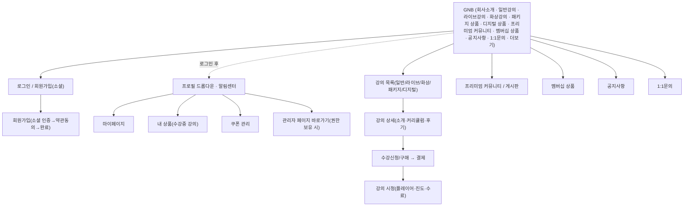

# 01. Customer Front 화면설계서

| 항목 | 내용 |
|------|------|
| 문서 ID | 01_customer-front |
| 영역 | [FR01] Customer Front (수강생/고객용 학습 프론트) |
| 작성자 | 송기획 (책임 서비스기획자, proj-service-planner-senior) |
| 지시자 | 사용자(운영자) |
| 작성일 | 2026-06-24 |
| 버전 | v1.0 (Draft) |
| 입력 문서 | CreatorLMS Figma — Customer Front(p001~p369) · `00_화면목록.md`(FR01) · `03_brand-site.md`(공통 패턴 본보기) |
| 후속 작업자 | 송기획(주관) · 윤UX(컴포넌트/토큰) · 강테크(게이트) |
| 상태 | **FR01 증류 완료** (p001~p369 전 구간) · 검토 요청 |

> 마스킹 규칙(개인정보 화면)·디자인 토큰 정합은 **추후 증류 단계에서 적용**한다.
> 화면ID·UI/DEV 타입·헤더 7필드 규약은 `DOCS-화면설계서작성표준.md`를 따른다.

---

## 0. 정렬 / 에스컬레이션

> 입력(Figma) 간 범위 충돌·미확정 사항을 여기에 모은다. 팀장(강테크) 컨펌 전제.

1. **데모 브랜드명 `monzo`** — Figma 캡처의 GNB/Footer 로고가 데모용 `monzo`/`(주)MONOZO`로 그려져 있다. 실제 제품은 **쏠쏠(CreatorLMS)** 이며, **로고·사업자명은 어드민(커스터머 운영자)에서 설정하는 가변값**이다(p016 1-1, p022 1-1, p025 §1). 본 문서는 화면 의미를 우선하고 `monzo`는 placeholder로 본다.
2. **멀티테넌트(커스터머 사이트) 전제** — Front는 **커스터머(강의 판매자)별 독립 사이트**다. 도메인 유형(서브도메인/독립도메인)과 무관하게 회원가입 소셜 로직은 동일하나 **회원 계정은 각 커스터머 사이트별로 개별 관리**(p033). 동일 사용자가 사이트 A/B에 각각 가입 가능. GNB 메뉴 노출/페이지 콘텐츠는 어드민 템플릿 커스텀 결과로 사이트마다 다를 수 있다(p025~p027 "어드민>사이트>페이지에서 정의한 템플릿 커스텀하여 최초 세팅").
3. **약관 본문 SoT** — 회원가입/푸터의 이용약관·개인정보처리방침·마케팅정보수신동의는 **맑은소프트 정책만 동의받음**(커스터머 회사명 약관 제거, p024/p038). 본문 전문은 `creatorlms-brand/data/*.json`(terms/privacy/marketing) 연동 `[→ 강테크/biz-legal]`.
4. **소셜 인증 외부 화면** — 구글/카카오/네이버/애플/페이스북 OAuth 화면(p034·p037 등)은 **외부 IdP 제공 화면**으로 자체 설계 대상 아님. 본 문서는 진입/콜백/실패 처리만 정의(소셜 인증 공통 블록).
5. **결제/PG 연동 범위** — 강의/멤버십/패키지/디지털 상품 구매, 쿠폰, 결제내역 등 결제 흐름은 PG(토스페이먼츠 추정) 연동 전제. 빌링키·토큰·환불 흐름은 06_API계약 확정 필요 `[→ 강테크/오백개]`.
6. **유예/만료 인트로 차단** — 커스터머의 구독이 유예기간 만료 상태이면 Front 진입 시 전용 인트로(이용 제한) 페이지로 차단(p023~p025). 사이트 단위 상태머신 `[→ 임기획/오백개]`.
7. **알림 설정 페이지 폐기** — 마이페이지>설정>알림(강의 알림 토글, p366~p369)은 **개정이력 "알림 페이지 제거(26-04-23, p365)"로 현재 버전에서 삭제**됨. 화면 설계 대상에서 제외하나, 자동메일 발송(라이브/화상 시작 1시간 전·강의 변동) 정책 자체의 존속 여부는 미확정 → 백엔드 알림 정책으로 이관 검토 `[→ 임기획/오백개]`.
8. **자료실 링크/재다운로드 폐기** — 강의실·라이브 강의실 자료실의 외부링크 자료·[재다운로드] 버튼은 개정이력 "링크 디자인 제거/재 다운로드 버튼 제거(26-04-23, p256)"로 폐기. 최신=파일 행 + [다운로드] 단일.
9. **본인 화면 마스킹 예외** — 프로필/1:1문의의 본인 이메일·이름·휴대폰·수료증 이름은 '본인이 자기 정보를 보는 화면'이므로 마스킹 예외 가능성 있음. `DOCS-화면설계서작성표준` §7 마스킹과 충돌 가능 → 본인 조회 화면의 비마스킹 허용 범위를 팀장 컨펌 `[→ 강테크]`.

---

## 1. IA / 화면 맵

> 이 영역의 정보구조(메뉴 계층)와 화면 흐름. 화면목록(`00_화면목록.md` §3.1)과 정합.
> Customer Front = 커스터머별 학습 판매/수강 프론트. GNB 메뉴는 어드민에서 노출/순서 설정 가능(아래는 캡처 기준 풀세트).

**시스템/공통 페이지군**: 로딩 · 빈 상태(상품/검색/후기/게시글/공지) · 결제유예 이용제한 인트로 · (404·네트워크·점검은 brand-site와 공통 추정).
**인증/계정 화면군**: 회원가입(소셜) · 약관동의 · 알림센터 · 마이페이지 · 쿠폰/내 상품.

---

## 2. 화면상세설계

> 화면마다 아래 블록 템플릿을 복사해 채운다.
> - **헤더 7필드** 모두 기입(REQUIREMENT ID는 SI 산출물에만 — 사내 SM은 미작성 가능, 그 경우 `-`).
> - **좌(SCREEN DESIGN)**: 와이어/스크린샷 경로 (`screenshots/customer-front/{번호-설명}.png`).
> - **우(DESCRIPTION)**: 번호 위계(`1` / `1.1` / `a`)로 동작·정책. **행복경로뿐 아니라 빈/로딩/에러/예외 상태까지** 빠짐없이.

<!-- ===== 화면 블록 템플릿 (복사해서 사용) =====================================

### S-FR01-[Depth]-[번호] [화면명]

| 필드 | 값 |
|------|----|
| SCREEN | [화면명] |
| SCREEN ID | S-FR01-______-___ |
| SCREEN TYPE | [UI: P/PU/LPU/BS] / [DEV: W] |
| LOCATION | [메뉴경로] |
| REQUIREMENT ID | -  (SI만 기입, SM 미작성 시 `-`) |
| WRITER | 강테크 |
| UPDATE | 2026-06-24 |

**SCREEN DESIGN** (좌)

> [추출 후 채움] — 와이어/캡처 경로

**DESCRIPTION** (우)
1. [화면 진입·기본 동작]
   1.1. [세부 동작/정책]
2. [상태별 처리]
   2.1. 빈 상태(Empty): [추출 후 채움]
   2.2. 로딩 상태(Loading): [추출 후 채움]
   2.3. 에러 상태(Error): [추출 후 채움]
   2.4. 예외/엣지 케이스: [추출 후 채움]
3. [외부 인터페이스(API)] — 06_API계약과 1:1 (해당 시)
4. [개인정보 표기 시 마스킹] — 추후 증류 단계에서 적용

============================================================================= -->

### 2.0 공통 컴포넌트 (1회 정의 · 전 화면 공통)

> 화면이 아니라 **재사용 UI 컴포넌트**. Alert/Confirm/Toast(MPU)는 **화면ID 미부여**(모화면 종속). GNB/Footer는 레이아웃 고정요소. 모든 캡처는 `_exports/png/customer-front/`.

#### C-1. GNB / Header (글로벌 내비) — `p016.png`(명세), `p025.png`(실화면)
- 좌: 로고(어드민 설정 — 텍스트 또는 로고 이미지, p015 수정메모). 클릭 → 메인.
- 중앙 메뉴(어드민 노출/순서 설정): **회사소개 · 일반강의 · 라이브강의 · 화상강의 · 패키지 상품 · 디지털 상품 · 프리미엄 커뮤니티 · 멤버십 상품 · 공지사항 · 1:1문의**. 메뉴 개수가 GNB 영역 초과 시 일부 메뉴를 **[더보기]▾** 버튼으로 자동 그룹화(하위 메뉴 목록 드롭다운, p016 1-3).
- 우(**비로그인**): [로그인](outline) · [회원가입](primary, p016 1-4/1-5).
- 우(**로그인 후**): **알림센터 아이콘**(읽지 않은 알림 배지, p016 2-1) · **프로필 아이콘▾**(p016 2-2/3) → 드롭다운: 프로필(계정명, 마이페이지 이동) / **관리자 페이지 바로가기**(권한 보유 시) / **내 상품** / **쿠폰 관리** / (구분선) / **로그아웃**. 로그아웃 클릭 시 컨펌("로그아웃 하시겠습니까?", p016 1-a) → 확인 시 즉시 처리.
- 모바일: **햄버거(☰) → 드로어**(전체 메뉴 세로 나열, p016 6). 로그인 시 드로어 상단 프로필/관리자 바로가기/알림센터, 하단 [로그아웃](p016 5). 외부클릭·Esc 닫힘.

#### C-2. Footer — `p017.png`(명세), `p022.png`(Description)
- **1-1 사업자명**: 어드민 입력값(`(주)MONOZO` 자리), 타 영역 대비 크고 볼드 강조.
- **1-2 사업자정보**: 대표자·사업자등록번호·통신판매업신고번호·주소·개인정보책임자·이메일·전화·팩스·원격평생교육시설번호. 어드민 설정, **미입력 항목은 hide**.
- **1-3 SNS 버튼**: YouTube/Instagram/X/Facebook — 어드민 설정, 클릭 시 입력 링크 이동.
- **1-4 정책 링크**: 맑은소프트 이용약관 / 개인정보처리방침 / 마케팅정보수신동의 → 클릭 시 해당 정책 **모달(LPU)** 호출(PC) / **바텀시트**(MO, p019).
- Copyright © 맑은소프트. Hosting by MALGNSOFT Corp.

#### C-3. 모달 (LPU) — `p005.png`
- 카드형(타이틀 + ✕ + 내용 + 버튼). PC/MO 각각 **버튼 1개**(primary 전폭) / **버튼 2개**(좌 outline 보조 + 우 primary) 2형. Esc·✕·외부클릭 닫힘, `role="dialog" aria-modal="true"`, 열림 중 body 스크롤 잠금.

#### C-4. 컨펌 (Confirm / MPU, ID 미부여) — `p006.png`
- 아이콘 + 내용 + [취소](outline) / [확인](primary) 2버튼. 비가역·중요 액션 직전(로그아웃·구매취소 등).
- **★ 얼럿(Alert)은 폐지됨** — 개정이력(p007) "얼럿 제거(얼럿 → 토스트로 모두 변경됨)". 단방향 고지는 전부 토스트로 대체.

#### C-5. 토스트 (Toast / MPU, ID 미부여) — `p006.png`, `p008.png`
- 중앙 하단(bottom 160px±20px) info 배너. ⓘ 아이콘 + 내용 + ✕. **3초 후 자동 소멸**, ✕ 클릭 시 즉시 숨김. 모든 경량/완료/실패 피드백(저장됨·회원가입 완료·실패 등).

#### C-6. 버튼 세트 — `p008.png`
- 2개(활성: outline+solid / 비활성: solid 회색 disabled), 1개(활성/비활성 solid 전폭), **더보기 버튼**(텍스트+▾, 목록 확장). 화면당 solid 주 액션 1개 원칙.

#### C-7. 빈 상태(Empty) 패턴 — 일러스트 + 카피
- **상품 없음**(`p009.png`): "아직 비어있어요 / 조금만 기다려 주세요. 알찬 상품으로 채워질 예정이에요."
- **검색 결과 없음**(`p010.png`): "검색 결과가 없어요 / 다른 검색어로 다시 시도해 주세요."
- **상품 후기 없음**(`p011.png`): "아직 작성된 후기가 없어요. / 모두에게 도움이 되는 상품 후기를 남겨주세요!"
- **게시글 없음**(`p012.png`): "아직 등록된 게시글이 없어요 / 이 공간의 첫 이야기를 시작해 보세요." · **공지사항 없음**: "아직 등록된 공지사항이 없어요".

#### C-9. 마이페이지 사이드 네비 (마이페이지 전 화면 공통) — `p207.png`(PC), `p210.png`(MO PU)
> 마이페이지 하위 모든 화면(구독관리/내 상품/수료증/찜하기/쿠폰/결제내역/결제정보/내 게시글/1:1 문의내역/프로필)에 공통으로 붙는 좌측 네비(PC) / 메뉴 PU(MO). 현재 화면 메뉴 항목은 **active 하이라이트**.
- **프로필 요약**: 프로필 이미지 + 닉네임 + 이메일(마스킹 — P-32) + [로그아웃](클릭 시 컨펌, C-4).
- **구독 바로가기 2종**: 멤버십 / 프리미엄 커뮤니티 — 우측에 상태(`구독전` / 구독중) + (>) 이동. 클릭 시 구독관리(또는 해당 상품) 이동.
- **요약 카운트**: 내 상품 {n} · 보유 쿠폰 {n}(미사용 쿠폰 수 배지).
- **메뉴 그룹**: 상품 관리(내 상품 · 수료증 · 찜하기) / 결제 관리(쿠폰 · 결제 내역 · 결제 정보) / 커뮤니티(내 게시글 · 1:1 문의내역) / 설정(프로필).
- **MO**: 별도 전체화면 메뉴(PU) — 7-1 뒤로(<) · 7-2 닫기(✕) · 7-3 메뉴 항목(active). GNB 프로필/햄버거에서 진입.

#### C-8. 상품(강의) 카드 — `p056.png`(컴포넌트), `p062.png`(Description)
> 일반/라이브/화상/패키지/디지털 상품 목록·연관 영역에서 공통 사용하는 카드.
- **1-1 구매상태**: 좌상단 배지 — `판매마감`(마감 시), 판매중이면 미표시.
- **1-2 찜하기**: 우상단 하트(♡/♥) on/off 토글. 비로그인 클릭 시 로그인 유도(추정).
- **1-3 카테고리명**: 어드민 설정 카테고리 노출.
- **1-4 상품명**: 2줄까지 표시, 이후 말줄임(…).
- **1-5 수강기간**: ① 무제한 수강 ② 시작~종료(YYYY.MM.DD~) ③ N일 수강(수강기간 일수). 어드민 설정.
- **1-6 강사**: 1명=`{강사명} 강사` / 2명 이상=`{강사명} 강사 외 {강사수}명`.
- **1-7 커리큘럼 정보**: `총 {강의 수}강 · {시간}분`.
- **1-8 상품금액**: 정가 / 할인율(%)+취소선 정가 / 할부(월 N원, N개월 할부) / 무료 — 어드민 설정 따라 상이.
- **1-9 상품후기**: ★ 평점 (후기수). 후기 0건이면 hide(추정).
- **1-10 멤버십 무료상품 배지**: 멤버십 회원에게 무제한 이용 카테고리 내 상품일 때 `멤버십 무료상품` 배지.
- 디자인: 기본 썸네일(이미지 미등록 시) placeholder 필요.

---

<!-- ▼▼▼ 시스템/공통 화면군 ▼▼▼ -->

### S-FR01-9001-001 결제 유예기간 이용 제한 인트로

| 필드 | 값 |
|------|----|
| SCREEN | 결제 유예기간 서비스 이용 제한 안내(인트로) |
| SCREEN ID | S-FR01-9001-001 |
| SCREEN TYPE | P / W |
| LOCATION | (시스템 공통 · 사이트 진입 차단) |
| REQUIREMENT ID | - |
| WRITER | 송기획 |
| UPDATE | 2026-06-24 |

**SCREEN DESIGN** — `_exports/png/customer-front/p023.png`(PC), `p024.png`(MO), `p025.png`(Description)

**DESCRIPTION**
1. 진입 조건 — 커스터머 구독이 **유예기간 만료 상태**에서 Front 진입 시, 일반 화면 대신 본 인트로로 차단(p025 #).
2. 구성 — 상단 GNB(로고=사업자명 어드민 입력값) + 중앙 일러스트 + 카피 "현재 사이트는 쏠쏠 운영 정책에 따라 이용이 제한된 상태입니다. 자세한 사항은 {사이트명}로 문의해 주세요." + Footer.
3. 액션 — 별도 진행 버튼 없음(차단 화면). 보조문 "본 서비스는 개별 운영자에 의해 관리되며, 쏠쏠은 운영 및 결제에 직접 관여하지 않습니다."
4. 정책 메모 — 사업자명/문의 연락처는 어드민 설정값 바인딩. 상태 = 사이트(커스터머) 단위. 결제 정상화 시 자동 해제 `[→ 오백개]`.

---

<!-- ▼▼▼ 인증/계정 화면군 ▼▼▼ -->

### S-FR01-0301-001 회원가입 (소셜 시작)

| 필드 | 값 |
|------|----|
| SCREEN | 회원가입 - 소셜 로그인 시작 |
| SCREEN ID | S-FR01-0301-001 |
| SCREEN TYPE | P / W |
| LOCATION | GNB > 회원가입 |
| REQUIREMENT ID | - |
| WRITER | 송기획 |
| UPDATE | 2026-06-24 |

**SCREEN DESIGN** — `_exports/png/customer-front/p031.png`(PC), `p032.png`(MO), `p033.png`(Description)

**DESCRIPTION**
1. 구성 — 로고 + "회원가입" + 소셜 시작 버튼 5종 세로 나열: **구글 / 카카오 / 네이버 / 애플 / 페이스북**(각 브랜드 컬러·아이콘).
   1.1. 구글 버튼 하단 주의문 "⚠ 유튜브 멤버십 회원은 구글로 시작하셔야 혜택을 받으실 수 있습니다."(p031 1).
2. 정책(p033) — **소셜 로그인 방식만 제공, 이메일 ID/PW 가입 미지원**. 지원 채널 5종. 도메인 유형/커스터머 사이트와 무관하게 가입 로직 동일하나 **계정은 커스터머 사이트별 개별 관리**(동일 이메일이라도 신규 사이트는 최초 가입 절차).
3. 동선 — 버튼 클릭 → 소셜 인증(외부) → 신규면 약관동의(S-FR01-0301-002), 기존 가입 이력이면 로그인 처리.
4. 상태
   4.1. 에러/취소: 인증 실패·사용자 취소 시 **토스트**("회원가입 과정에서 문제가 발생하였습니다. 다시 시도해 주세요", p035) 후 회원가입 페이지 잔류(p036). 5채널 동일 로직.
5. 외부 인터페이스 — 소셜 OAuth(IdP 화면 p034 구글 / p037 카카오 등, 외부) `[→ 강테크: 06_API계약 콜백/토큰 발급]`.

### S-FR01-0301-002 회원가입 - 약관 동의

| 필드 | 값 |
|------|----|
| SCREEN | 회원가입 - 약관 동의 |
| SCREEN ID | S-FR01-0301-002 |
| SCREEN TYPE | P / W |
| LOCATION | GNB > 회원가입 > 소셜인증 > 약관 동의 |
| REQUIREMENT ID | - |
| WRITER | 송기획 |
| UPDATE | 2026-06-24 |

**SCREEN DESIGN** — `_exports/png/customer-front/p038.png`(PC), `p039.png`(MO), `p041.png`(Description)

**DESCRIPTION**
1. 구성 — 로고 + "회원가입" + 동의 체크박스: **전체동의** / [필수] 이용약관(보기) / [필수] 개인정보처리방침(보기) / [선택] 마케팅정보수신동의(보기) + [회원가입] 버튼.
   1.1. **전체동의 연동**: 전체동의 체크 → 개별 일괄 체크 / 개별 해제 → 전체동의 자동 해제 / 개별 모두 체크 → 전체동의 자동 체크(p041 1).
2. [회원가입] 버튼
   2.1. 최초 **비활성**. 필수 2종(이용약관·개인정보처리방침) 모두 체크 시 **활성**.
   2.2. **밸리데이션**: 필수 미충족 상태에서(예: 일부만 체크) 노출 "**필수 약관에 동의해 주세요.**"(p038 2-1, p039 하단).
   2.3. 활성 버튼 클릭 → **토스트**("회원가입이 완료되었습니다", p040) 후 메인페이지 이동.
3. 약관 [보기] 모달(LPU, p041 3) — 내용에 따라 모달명 상이(이용약관/개인정보처리방침/마케팅정보수신동의). 본문 + [동의함] 버튼 → 클릭 시 해당 약관 자동 동의 체크.
4. 정책 — **맑은소프트 정책만 동의받음**(커스터머 회사명 약관 제거, p038 수정메모). MO에서 [회원가입] 버튼 하단 Fixed↓.
5. 개인정보 — 동의 이력(약관 버전·시각) 저장 `[→ 오백개]`.

### S-FR01-0302-001 로그인 (소셜)

| 필드 | 값 |
|------|----|
| SCREEN | 로그인 - 소셜 로그인 |
| SCREEN ID | S-FR01-0302-001 |
| SCREEN TYPE | P / W |
| LOCATION | GNB > 로그인 |
| REQUIREMENT ID | - |
| WRITER | 송기획 |
| UPDATE | 2026-06-24 |

**SCREEN DESIGN** — `_exports/png/customer-front/p049.png`(PC), `p050.png`(MO), `p052.png`(Description) · 변형 `p053.png`/`p054.png`(최근 이력), `p055.png`(최근 이력 Description)

**DESCRIPTION**
1. 구성 — 회원가입과 동일한 소셜 시작 버튼 5종(구글/카카오/네이버/애플/페이스북) + 구글 하단 주의문.
2. 계정 분기(p052) — 소셜 인증 완료 후 **기존 가입 이력 있으면 로그인 처리** / **이력 없으면 회원가입(약관동의) 절차로 이동**.
3. 상태
   3.1. 에러: 로그인 오류 시 **토스트**("로그인 과정에서 문제가 발생하였습니다. 다시 시도해 주세요", p051) 후 로그인 페이지 잔류.
   3.2. **변형(최근 이력)**: 로그인 페이지 진입 시 가장 최근 로그인 1건의 소셜 버튼에 `최근` 말풍선 배지 표시(p053~p055).
4. 외부 인터페이스 — 소셜 OAuth(외부 IdP 화면 5종) `[→ 강테크: 06_API계약]`.

### S-FR01-9002-001 알림센터

| 필드 | 값 |
|------|----|
| SCREEN | 알림센터 |
| SCREEN ID | S-FR01-9002-001 |
| SCREEN TYPE | P / W |
| LOCATION | GNB(로그인 후) > 알림 아이콘 |
| REQUIREMENT ID | - |
| WRITER | 송기획 |
| UPDATE | 2026-06-24 |

**SCREEN DESIGN** — `_exports/png/customer-front/p028.png`(PC), `p029.png`(MO·tall), `p030.png`(Description)

**DESCRIPTION**
1. 구성 — 페이지 타이틀 "알림센터" + 월(YYYY.MM) 그룹 헤더 + 알림 목록 + [더보기].
2. [날짜] — 연.월(YYYY.MM) 기준 월 단위 그룹핑 구분.
3. [알림 목록]
   3.1. 개별 항목 = 제목 + 내용 + 등록일. 최신(내림차순) 정렬.
   3.2. **미읽음 알림은 배경 컬러로 시각 구분**.
   3.3. 랜딩 페이지가 있는 알림은 우측에 이동 아이콘(>) 표시 → 클릭 시 해당 페이지 이동.
   3.4. 등록일 상대 표기: 5분 이내=`방금 전` / 5분 초과~1시간 미만=`N분 전` / 1시간 이상~당일=`N시간 전` / 당일 초과=`YYYY.MM.DD`.
4. **자동 읽음 정책**: 알림센터 진입 후 **타 페이지 이동 시 모든 알림 자동 읽음 처리**.
5. [더보기] — 알림 10건 초과 시 노출, 클릭 시 10건씩 추가 펼침.
6. 상태 — 빈 상태(알림 0건): 빈 상태 패턴(C-7) 준용 `[미확정 — 전용 카피 미확인]`.

---

<!-- ▼▼▼ 강의/상품 목록·상세 화면군 ▼▼▼ -->

### S-FR01-0102-001 일반강의 목록

| 필드 | 값 |
|------|----|
| SCREEN | 일반강의 목록 |
| SCREEN ID | S-FR01-0102-001 |
| SCREEN TYPE | P / W |
| LOCATION | GNB > 일반강의 |
| REQUIREMENT ID | - |
| WRITER | 송기획 |
| UPDATE | 2026-06-24 |

**SCREEN DESIGN** — `_exports/png/customer-front/p057.png`(PC), `p058.png`(MO·tall), `p062.png`~`p064.png`(Description·tall)

**DESCRIPTION**
1. 구성 — 상단 **상품 배너**(어드민 백그라운드 이미지·텍스트, 노출 on/off) + **메뉴명**(어드민 커스텀) + 필터/정렬 영역 + 검색 + **상품 카드 그리드(PC 4×3=12개)** + 더보기 + 페이지네이션.
2. 상품 카드 — 공통 카드 컴포넌트(C-8). 마감/수강기간/강사/금액 상태별 상이 UI.
3. [필터 및 정렬] — 다중 필터·정렬 **동시 적용**, 하단 리스트 **실시간 변경**.
   3.1. **카테고리 필터**(전체 카테고리 디폴트 / 카테고리 1~N).
   3.2. **구매상태 필터**(전체 / 판매중 / 마감).
   3.3. **정렬**: 추천순 / 등록 최신순 / 등록 오래된순 / 별점 높은순 / 별점 낮은순 / 금액 높은순 / 금액 낮은순.
   3.4. **우선순위 규칙**: 필터만 적용 시 정렬 우선순위 `최신 등록순`. `추천순` 정렬 설정 시 추천순으로 정렬 우선.
   3.5. 리셋 버튼 — 필터·정렬 설정값 초기화.
4. [검색] — **모든 상품 페이지 공통**. 2자 이상 입력 시 검색, **2자 미만 입력 후 실행 시 토스트**("검색어는 2자 이상 입력해 주세요", p061). enter로 실행. **상품명 부분일치(LIKE), 공백 무시·대소문자 구분 없음**.
5. [더보기] — 상품 12개 초과 시 노출, 클릭 시 12개씩 추가 펼침.
6. 상태
   6.1. 빈 상태(상품 0건): "아직 비어있어요 / 조금만 기다려 주세요…"(C-7, p009).
   6.2. 검색 결과 없음: "검색 결과가 없어요 / 다른 검색어로…"(C-7, p010).
7. 모바일 — 필터/정렬은 **바텀시트**로 호출(p059 필터 / p060 정렬), [확인] Fixed↓. 초기화 버튼 별도.
8. 정책 메모 — 일반강의 외 라이브/화상/패키지/디지털 목록도 본 화면 구조·필터·검색 패턴 공통 적용(상품 유형별 카드 필드 차이만). 메뉴명·배너는 어드민 설정.

### S-FR01-0102-002 일반강의 상세

| 필드 | 값 |
|------|----|
| SCREEN | 일반강의 상세 |
| SCREEN ID | S-FR01-0102-002 |
| SCREEN TYPE | P / W (+P01 공유하기 LPU · +MPU 다수) |
| LOCATION | GNB > 일반강의 > 상세 |
| REQUIREMENT ID | - |
| WRITER | 송기획 |
| UPDATE | 2026-06-24 |

**SCREEN DESIGN** — `_exports/png/customer-front/p063.png`(PC·tall), `p064.png`(MO·tall), `p073.png`(Description·tall), `p074.png`(공유 모달)

**DESCRIPTION** *(p073 Description 전체 1~23 + p064~p072 부속 정밀화)*

**■ 상단 상품정보 영역**
1. **썸네일**(1) — 상품 등록 이미지. 미등록 시 기본 썸네일. 화면 크기 따라 비율 유지 자동 리사이징.
2. **상품 기본정보 영역**(2) — 스크롤 시 상단 기준 위치에서 **sticky 적용**(말줄임 없음).
   2.1. **상품명**(2-1) — 등록된 상품명 전체 노출.
   2.2. **상품 노출상태**(2-2) — 상품 노출상태 비공개/판매공개 따라 표시(비공개=과금이 들어가는 기능으로 눈에 띄게 디자인).
   2.3. **상품금액 정보**(2-3) — 상품 리스트 카드 내 금액(C-8) 표기 기준 동일 적용: 무료 / 할부 적용된 경우 / 할인 적용 시 / 정가.
   2.4. **멤버십 구독 시 무료이용 상품 표시**(2-4) — 상품 리스트 카드 표시와 동일 기준 적용.
   2.5. **구매하기 버튼**(2-5) — 상품 상태·구매여부에 따라 버튼 상이 노출.
       a. **2-a**: 모집일정/모집인원 조건 모두 충족 시 노출. 클릭 시 결제 페이지 이동. 비회원 클릭 시 **로그인 페이지 이동**.
       b. **2-b**: 해당 상품 구매 완료 시 노출. 클릭 시 마이페이지 > 내 상품 페이지 이동.
       c. **2-c**: 멤버십 상품 구독 시 무료이용 가능한 경우 노출. `[개발]` 클릭 시 결제 로직 타지 않고 **바로 수강신청 처리**됨. 클릭 시 마이페이지 > 내 상품 페이지 이동.
       d. **2-d**: 모집일정/모집인원 조건 중 하나라도 미충족 시 노출 → **비활성화 버튼**.
       e. **2-e**: 모집 시작일 미도래 시 노출 → **비활성화 버튼**.
3. **찜하기 버튼**(2-4) — 클릭 시 버튼 활성화 on/off 토글. 활성화 시 마이페이지 > 찜하기 해당 상품 노출. 비회원 클릭 시 **2-e 컨펌**("로그인이 필요합니다 로그인 하시겠어요?", p067 22-e) → 로그인 페이지 이동.
4. **공유하기 버튼**(2-5) — 클릭 시 공유하기 모달(23, p074) 호출.
5. **모집인원**(2-6) — 상품 등록 모집일정 종류 따라 상이 노출: 시작/종료일만 미설정(무제한) / 종료일만 설정(`~ YYYY.MM.DD 오전·오후 HH:MM 까지`) / 시작일만(`YYYY.MM.DD 오전·오후 HH:MM 부터`) / 시작·종료 모두(`YYYY.MM.DD 오전·오후 HH:MM ~ YYYY.MM.DD …`).
6. **모집인원**(2-7) — 미설정(인원 제한 없음) / 설정(`정원 {인원수}명`).
7. **수강기간**(2-8) — 미설정(무제한) / 시작·종료일 설정(`YYYY.MM.DD ~ YYYY.MM.DD`) / 일수 단위 설정(`{일수}일`, `[개발]` 결제완료일 1일 차용).
8. **강사**(2-9) — 상품 등록 설정한 단독/외 N명 대표강사·서브강사 닉네임 노출.
9. **커리큘럼**(2-10) — 표기 형식 `총 {강의 수}강 · {총 수강 시간}시간`.
10. **수료증**(2-11) — 제공 여부 노출.

**■ 쿠폰 영역**(3)
11. 기본정렬: 쿠폰 최신 등록순. 어드민 쿠폰 등록 시 개별 상품에 설정한 쿠폰 노출. 쿠폰 발급 시 마이페이지 > 쿠폰 > 사용가능한 쿠폰에서 확인.
   11.1. 쿠폰 카드 = `~YYYY.MM.DD 오후 HH:MM 까지` + 쿠폰명 + **할인액(-10,000원)** + 최소주문금액 + **[쿠폰받기↓]**(p064 19). PC=가로 나열, MO=가로 스와이프 이동(20).

**■ 상품 정보 탭/버튼 영역**(4)
12. 스크롤 시 상단 기준 위치에서 **sticky 적용**.
   12.1. **탭 메뉴**(4) — 탭 클릭 시 해당 콘텐츠 영역으로 스크롤 이동(상품소개/커리큘럼/상품후기). 사용자가 직접 스크롤 시 콘텐츠 영역 상단 도달하면 해당 탭 자동 활성화.
   12.2. **상품후기 개수**(4-1) — 후기 존재 시 탭 우측에 후기 개수 표시, 0건이면 미노출.
   12.3. **문의하기 버튼**(4-2) — 클릭 시 해당 상품명이 자동 입력된 상태로 마이페이지 > 1:1문의 페이지 진입.

**■ 상품소개 영역**(5)
13. 상품 등록 시 에디터에 입력한 내용 그대로 노출. 이미지의 경우 등록된 이미지 비율 유지 자동 리사이징.

**■ 커리큘럼 영역**(6)
14. 상품 등록 설정 커리큘럼 정보 노출. 최초 진입 시 1뎁스 하위 강의 **펼침 상태**로 노출.
   14.1. **전체 커리큘럼 개수/시간 정보**(6-1) — `총 {강의 수}강 · {시간}분`(시간 1분 미만이면 분 단위만, 0일 경우 생략).
   14.2. **전체 접기/펼치기 버튼**(6-2) — 모두 펼치기(클릭 시 2뎁스 전체 항목 펼쳐짐) / 모두 접기(클릭 시 2뎁스 전체 항목 접힘).
   14.3. **커리큘럼 섹션 영역**(6-3) — 클릭 시 해당 2뎁스 영역 토글(접기/펼치기). 각 섹션 전체 강의 개수·총 강의 정보 노출 `{섹션 강의 수}강·{n}시간 {n}분`.
   14.4. **맛보기 버튼**(6-4) — 어드민 상품 등록 시 맛보기 설정된 강의에 한해 노출. 맛보기 개수 제한 없음. 클릭 시 맛보기 영상 재생 띄움.
   14.5. **영상 시간**(6-5) — 강의 별 영상 재생 시간 노출 `HH:MM`.

**■ 상품후기 작성 영역**(7)
15. `[개발]` 상품 구매자에게만 노출되며 최초 1회만 작성 가능.
   15.1. **프로필**(7-1) — 사용자 유형 + 닉네임(사용유형 기본 프로필: 학습자/강사/관리자).
   15.2. **별점 표시**(7-2) — 별점 선택한 점수만큼 활성 별 표시. 기준=최소 1점·최대 5점·1점씩 단위.
   15.3. **상품후기 인풋**(7-3) — 줄바꿈 시 인풋 높이 영역 함께 변경.
   15.4. **등록 버튼**(7-4) — 인풋 텍스트 입력 시 버튼 활성화. 클릭 시 **7-a 토스트**("상품 후기가 등록되었습니다", p069) 후 등록 실행.

**■ 상품 평균 별점 점수**(8)
16. 최대 5점 만점 기준. 해당 상품 등록된 전체 후기 평점의 평균값. 소수점 한자리까지 반올림(예 4.741→4.7). 4점 이상=★ 채워짐, 미만=빈 별(예 평균 4.7→★ 4개 활성).

**■ 상품후기**(9) — 해당페이지에서 상품후기 작성·답글·수정/삭제는 **학습자만나** 가능.
17. 학습자=내가 작성한 댓글/답글 수정·삭제 가능. 강사/관리자=어드민에서만 댓글/답글 수정·삭제 가능.
   17.1. **작성내용**(9-1) — 프로필+사용유형+닉네임+작성시간+별점 구성. 수정 이력 있을 경우 `(수정됨)` 형식 노출. 작성시간 상대표기(방금전/N분전/N시간전/날짜 — 5분이내 방금전 / 5분초과~1시간미만 N분전 / 1시간이상~당일 N시간전 / 당일초과 YYYY.MM.DD).
   17.2. **상품후기 답글 버튼**(9-2) — 클릭 시 해당 상품후기 하단 답글 입력창 생성.
   17.3. **더보기 버튼**(9-3, p064/p065/p066) — 작성자 여부 따라 옵션 상이.
       a. 작성자 본인(9-a): **수정**(p070 21-a, 입력 UI로 전환) / **삭제**(9-c 컨펌 "상품 후기를 삭제하시겠어요?"(p071) → 9-d 토스트 "상품 후기가 삭제되었습니다"(p072)).
       b. 작성자 아닐 경우(9-b, p066 21-b): **신고** → 해당 답글 정보 자동입력된 1:1문의 페이지 이동. 비회원=2-e 컨펌 로그인 페이지 이동.
   17.4. **내용**(9-4) — 3줄 초과 시 `[전체보기]` 버튼 처리(클릭 시 전체 내용 영역 노출).
   17.5. **답글 아코디언 버튼**(9-5) — 답글 개수 표시, 없을 경우 숨김처리. 최초 진입 시 닫힘 상태. 답글 10개 펼쳐짐 후 `[답글 더보기]` 버튼 처리. 모두 펼쳐졌을 경우 `[답글 숨기기]` 버튼으로 변경.
18. **상품 후기 수정**(10) — 9-a 수정 클릭 시 입력창 생성, 별점·내용 수정 가능. [취소](10-1) / [수정하기](10-2, 인풋 입력값 있을 때만 활성, p064_s05).
19. **상품 후기 답글 작성**(11) — 답글 버튼 클릭 시 입력창 생성. [등록하기](11-1, 최초 비활성→인풋 입력 시 활성, 클릭 시 **11-a 토스트** 후 등록).
20. **답글 작성**(14) — 답글 11-1·12 작성자 닉네임 상단 표시 `@닉네임`(영역 수정 불가·자동입력 고정값).
21. **답글 내용**(15, 16) — `@닉네임` 영역 본문과 구분되도록 색상 강조.

**■ 더보기 버튼**(18)
22. 상품후기 목록 5개 이상일 경우 노출. 클릭 시 상품후기 5개 추가 펼쳐짐(p064_s08 22번 하단 Fixed CTA = 찜♥+공유+구매하기).

**■ 모바일 영역**
23. **MO 쿠폰 영역**(19) — 가로 스와이프하여 위치 이동. **MO 상품 정보 탭/버튼**(20) — 가로 스와이프 위치 이동, PC와 동일 sticky. **MO 더보기 모달 호출**(21) — 클릭 시 작성여부 따라 21-a/21-b 바텀시트. **MO 구매하기 버튼 영역**(22) — 스크롤 시 화면 하단 기준 sticky, 22-1 공유는 iOS/Android별 공유 UI 노출.

**상태/예외**
- **빈 상태**: 후기 0건 → C-7(p011) "아직 작성된 후기가 없어요". 커리큘럼/소개 미등록 시 영역 hide(추정).
- **비로그인**: 구매/찜/신고 클릭 시 2-e 컨펌(로그인 유도).
- **판매마감/미충족**: 구매 버튼 비활성(2-d), 모집 미도래(2-e).
- 정책 메모 — 라이브/화상/패키지/디지털 상세도 본 구조 공통(상품 유형별 정보행 차이) `[추정 — 후속 배치 검증]`.

#### S-FR01-0102-002-P01 공유하기 모달 (LPU)
**SCREEN DESIGN** — `_exports/png/customer-front/p074.png`
**DESCRIPTION**
1. 모달(23, PC 공유하기 모달 p074·p078) "공유하기" + ✕ + 3버튼: **카카오톡으로 링크 공유하기**(23-1 — 클릭 시 카카오 공유 팝업 23-a 외부) / **페이스북으로 링크 공유하기**(23-2 — 클릭 시 페이스북 공유 팝업 23-b 외부) / **공유 링크 복사**(23-3) → 클릭 시 **23-c 토스트**("공유링크가 복사 되었습니다", p068).
2. Esc·✕·외부클릭 닫힘(C-3).
3. **MO 공유하기(24, p075·p078)** — 22-1(MO Fixed CTA 공유) 클릭 시 **iOS / Android 기기 OS 기본 공유 UI 호출**(앱 내 LPU 미사용). 공유 가능한 앱 목록은 기기 시스템 설정에 따름.

#### S-FR01-0102-002-P02 맛보기 영상 모달 (PC LPU / MO BS, p076·p077·p078)
**SCREEN DESIGN** — `_exports/png/customer-front/p076.png`(PC) · `_exports/png/customer-front/p077.png`(MO)
**DESCRIPTION**
1. 일반강의 상품 상세페이지 내 맛보기 영상 버튼(커리큘럼 6-4 맛보기) 클릭 시 띄움. 맛보기 설정된 전체 영상만 조회 가능.
   - 1.1 PC=LPU(좌 플레이어 / 우 목록 2단), MO=BS(상단 플레이어 / 하단 목록 스크롤).
2. **25-1 영상 영역** — 최초 진입 시 클릭한 맛보기 영상 썸네일 우선 노출. 리스트 항목 선택 시 해당 영상으로 교체 재생.
3. **25-2 영상 리스트 영역** — 헤더 "맛보기 영상 총 {N}개". 리스트 항목 = 영상 제목 + 재생시간(HH:MM). 현재 재생 중 항목은 강조색(파랑) 표시.
   - 3.1 일정 개수 초과 시 리스트 영역 내부 스크롤 처리.
4. Esc·✕·외부클릭 닫힘(C-3).

**상태/예외(P01·P02 공통)** — 맛보기 0건이면 맛보기 버튼/모달 노출 안 함. 외부 공유 팝업(23-a/23-b) 차단 시 토스트로 재시도 안내(추정).

---

### S-FR01-0103-001 / -002 라이브강의 목록·상세

> 일반강의(S-FR01-0102-001/002)와 **레이아웃·기능 동일 영역은 별도 작성하지 않고 상이 기능만 정의**(p085·p088 명시). 상품 유형 차이 = 수강상태(LIVE/예정/종료) + 수강일시.

| 항목 | 내용 |
|------|------|
| SCREEN | 라이브강의 목록 / 상세 |
| SCREEN ID | S-FR01-0103-001(목록) · S-FR01-0103-002(상세) |
| SCREEN TYPE | P / W |
| LOCATION | GNB>라이브강의 ( >상세 ) |
| WRITER | 송기획 |
| UPDATE | 2026-06-24 |

**SCREEN DESIGN** — 목록 `_exports/png/customer-front/p084.png`(PC)·`p085.png`(Desc) / 상세 `p086.png`(PC)·`p087.png`(MO)·`p088.png`(Desc) / 카드 컴포넌트 `p083.png`

**DESCRIPTION — 라이브강의 카드(C-6 변형, p083)**
1. 기본 썸네일(이미지 미등록 시) 라이브용 별도 디자인 제작 필요 `[→ 윤UX]`.
2. **1-1 수강 상태 배지** — `LIVE`(상품 설정 수강기간 내) / `예정`(수강기간 시작 이전) / `종료`(어드민에서 라이브 종료처리). 카드 좌상단.
3. 찜하기(♥), 강사(1명 / "외 N명").
4. **1-2 수강일시** — 상품 등록 시 설정한 라이브 시작 일시. 형식 `YYYY.MM.DD 오전/오후 HH:MM`.
5. 상품 금액 변형(정가/할인/월 할부/무료/멤버십 무료)은 공통 카드 규칙(C-6/P-11) 동일.

**DESCRIPTION — 목록(S-FR01-0103-001, p084·p085)**
6. 일반강의 목록(S-FR01-0102-001)과 그리드·검색·더보기 동일.
7. **2-1 수강 필터** — 최초 "전체 수강 상태" 디폴트 선택. 구성: 전체 수강 상태 / LIVE / 예정 / 종료. (정렬은 공통 규칙 P-10)

**DESCRIPTION — 상세(S-FR01-0103-002, p086·p087·p088)**
8. 일반강의 상세(S-FR01-0102-002)와 상단 상품정보·소개·후기·쿠폰·공유·구매 동일.
9. **차이점**: ① 수강상태(LIVE/예정/종료) 표시 ② 수강일시(`YYYY.MM.DD 오전/오후 HH:MM`) ③ **상품정보 탭 = 상품소개 / 상품후기 2개만**(일반강의의 커리큘럼·수료증 탭 없음).

**상태/예외** — 비로그인 구매/찜은 로그인 컨펌(2-e, 공통). 후기 0건 빈 상태 C-7. 종료 상태는 구매 버튼 정책 P-12 준용(추정).

---

### S-FR01-0104-001 / -002 화상강의 목록·상세

> 라이브강의와 동일 골격. 차이 = **플랫폼 종류(Googlemeet / Zoom)** + 모집인원 노출.

| 항목 | 내용 |
|------|------|
| SCREEN | 화상강의 목록 / 상세 |
| SCREEN ID | S-FR01-0104-001(목록) · S-FR01-0104-002(상세) |
| SCREEN TYPE | P / W |
| LOCATION | GNB>화상강의 ( >상세 ) |
| WRITER | 송기획 |
| UPDATE | 2026-06-24 |

**SCREEN DESIGN** — 목록 `_exports/png/customer-front/p090.png`(PC)·`p091.png`(Desc) / 상세 `p092.png`(PC)·`p093.png`(Desc) / 카드 컴포넌트 `p089.png`

**DESCRIPTION — 화상강의 카드(C-6 변형, p089)**
1. 기본 썸네일(이미지 미등록 시) 화상용 별도 디자인 제작 필요 `[→ 윤UX]`.
2. 수강 상태 배지 LIVE/예정/종료(라이브 동일), 찜하기.
3. **1-1 플랫폼 종류** — 상품 등록 시 설정한 강의 종류 표시. `Googlemeet` / `Zoom`. 강사·수강일시 표기.
4. **1-2 모집인원** — 상품 등록 시 설정한 모집인원. 형식 "모집인원 {n}명".
5. 상품 금액 변형 = 공통 카드 규칙 동일.

**DESCRIPTION — 목록(S-FR01-0104-001, p090·p091)**
6. 라이브강의 목록과 그리드·검색·더보기 동일.
7. **2-1 수강상태 필터** — 전체 수강 상태 / LIVE / 예정 / 종료 (디폴트=전체).
8. **2-2 플랫폼 필터** — 전체 플랫폼 / Googlemeet / Zoom (디폴트=전체 플랫폼).

**DESCRIPTION — 상세(S-FR01-0104-002, p092·p093)**
9. 라이브강의 상세와 동일 골격. **차이**: ① 수강상태 표시 ② **플랫폼 표시**(Googlemeet/Zoom) ③ 수강일시 ④ 상품정보 탭 = 상품소개 / 상품후기 2개.

**상태/예외** — 라이브강의와 공통(비로그인 컨펌·후기 빈 상태·종료 구매 비활성).

---

### S-FR01-0105-001 / -002 패키지상품 목록·상세

> 일반강의와 동형. 핵심 차이 = **여러 상품 유형을 하나로 묶은 패키지** + 상세에 "상품 구성" 탭.

| 항목 | 내용 |
|------|------|
| SCREEN | 패키지상품 목록 / 상세 |
| SCREEN ID | S-FR01-0105-001(목록) · S-FR01-0105-002(상세) |
| SCREEN TYPE | P / W |
| LOCATION | GNB>패키지 상품 ( >상세 ) |
| WRITER | 송기획 |
| UPDATE | 2026-06-24 |

**SCREEN DESIGN** — 목록 `_exports/png/customer-front/p095.png`(PC)·`p096.png`(Desc) / 상세 `p097.png`(PC)·`p098.png`(MO)·`p099.png`(Desc) / 카드 `p094.png`

**DESCRIPTION — 패키지상품 카드(C-6 변형, p094)**
1. 기본 썸네일(이미지 미등록 시) 패키지용 별도 디자인 제작 필요 `[→ 윤UX]`.
2. 구매 상태(마감 등) 배지·찜하기.
3. **1-1 상품 묶음** — 묶음 개수 표시. 형식 "{n}개 상품 묶음".
4. **1-2 패키지 강의 금액** — 상품 등록 시 설정한 금액에 따라 상이 노출. "개별 구매 대비 N% 할인" 비교가 + (정가/월할부/무료) 변형.
5. **(개발 제약)** 패키지상품은 멤버십 무료상품에 포함되지 않으므로 **멤버십 무료 배지 미표시**(p096).

**DESCRIPTION — 목록(S-FR01-0105-001, p095·p096)** — 일반강의 목록과 그리드·검색·필터·더보기 동일.

**DESCRIPTION — 상세(S-FR01-0105-002, p097·p098·p099)**
6. 상단 상품정보·소개·후기·쿠폰·공유·구매 = 일반강의 상세 공통.
7. **상품정보 탭 = 상품소개 / 상품구성 / 상품후기 3개.**
8. **1 상품 구성 표시** — 구성 상품 개수 "{n}개 묶음".
9. **2 상품 구성 영역(개발)** — 다른 유형 상품(일반/라이브/화상/디지털/프리미엄 커뮤니티)을 하나의 영역에 카드 UI로 묶어 노출. 별도 더보기 없이 등록된 전체 노출.
   - 9.1 각 상품은 **기존 상품 정책(수강기간·모집정원·모집인원 등)을 그대로 유지**해 등록·운영. 프리미엄 커뮤니티는 각 구독/결제 정책도 동일 적용.
   - 9.2 **2-1** 해당 묶음 포함 상품 개수 표시.
   - 9.3 **2-2 상품 유형 라벨** — 카드에 유형 라벨. 각 상품별 해당 유형 라벨 디자인 필요 `[→ 윤UX]`.
   - 9.4 **2-3 프리미엄 커뮤니티** — 전용 카드 UI로 별도 구성(상품명 + 월 구독료 표시) `[→ 윤UX]`.

**상태/예외** — 후기 0건 C-7. 구성 0개는 상품 등록 시 차단(추정). 마감 상태 구매 비활성(P-12 준용).

---

### S-FR01-0106-001 / -002 디지털 상품 목록·상세

> 일반강의와 동형. 차이 = **다운로드 제한** + 상세 "상품 구성"(파일 목록).

| 항목 | 내용 |
|------|------|
| SCREEN | 디지털 상품 목록 / 상세 |
| SCREEN ID | S-FR01-0106-001(목록) · S-FR01-0106-002(상세) |
| SCREEN TYPE | P / W |
| LOCATION | GNB>디지털 상품 ( >상세 ) |
| WRITER | 송기획 |
| UPDATE | 2026-06-24 |

**SCREEN DESIGN** — 목록 `_exports/png/customer-front/p102.png`(PC)·`p103.png`(Desc) / 상세 `p104.png`(PC)·`p105.png`(MO)·`p106.png`(Desc) / 카드 `p101.png`

**DESCRIPTION — 디지털상품 카드(C-6 변형, p101)**
1. 기본 썸네일(이미지 미등록 시) 디지털용 별도 디자인 제작 필요 `[→ 윤UX]`.
2. 수강 상태(마감)·찜하기·강사·상품금액(멤버십 무료 배지 포함).
3. **1-1 다운로드 제한** — 상품 등록 시 설정한 다운로드 제한 여부 표시. "무제한 다운로드" / "{n}회 다운로드".

**DESCRIPTION — 목록(S-FR01-0106-001, p102·p103)** — 일반강의 목록과 동일.

**DESCRIPTION — 상세(S-FR01-0106-002, p104·p105·p106)**
4. 상단 상품정보·소개·후기·쿠폰·공유·구매 = 공통.
5. **상품정보 탭 = 상품소개 / 상품구성 / 상품후기 3개.**
6. **1 다운로드 표시** — "무제한 다운로드 / {n}회 다운로드".
7. **2 상품 구성** — 등록한 파일 내역 표시, 별도 더보기 없이 전체 노출.
   - 7.1 **2-1** 파일 전체 개수 표시.
   - 7.2 **2-2 파일명** — 파일 아이콘 + 파일명+확장자. **클릭 이벤트 없음**(상세에서는 미리보기/다운로드 불가, 구매 후 내 상품에서 다운로드 추정).

**상태/예외** — 후기 0건 C-7(p104 "아직 작성된 후기가 없어요"). 구성 파일 0개는 등록 차단(추정).

---

### S-FR01-0107-001 프리미엄 커뮤니티 (소개·구독)

> **프리미엄 커뮤니티 = 월 구독형 게시판 상품**(여러 개 등록 가능). 어드민 메뉴 설정 시 커뮤니티 상품 1개 또는 여러 개로 구성. **(개발) 단일 상품 메뉴로 구성 시 게시판 리스트 페이지로 바로 랜딩**(소개 페이지 생략).

| 항목 | 내용 |
|------|------|
| SCREEN | 프리미엄 커뮤니티 (소개/구독) |
| SCREEN ID | S-FR01-0107-001 |
| SCREEN TYPE | P / W |
| LOCATION | GNB>프리미엄 커뮤니티 |
| WRITER | 송기획 |
| UPDATE | 2026-06-24 |

**SCREEN DESIGN** — `_exports/png/customer-front/p108.png`(PC)·`p109.png`(MO)·`p112.png`(Desc)

**DESCRIPTION**
1. **상품정보(1)** — 어드민 등록 정보 노출. 상품 여러 개일 경우 카드형 반복부.
   - 1.1 **1-1 상품 썸네일** — 기본 썸네일(이미지 미등록 시) 제작 필요 `[→ 윤UX]`.
   - 1.2 **1-2 카테고리명** / **1-3 상품명**(2줄까지, 이후 말줄임) / **1-4 월 구독료**(`W 5,000 / 월`).
   - 1.3 **1-5 혜택** — 미한정 수, 등록 항목 있을 경우 줄간 처리, **최대 10개**까지 작성 가능.
2. **구독하기 버튼(2)** — 클릭 시 상품정보가 입력된 결제 페이지로 이동.
   - 2.1 구독중인 상품이 있는 상태에서 클릭 시 **2-a 컨펌**("멤버십 변경은 현재 이용 기간 종료 후 적용됩니다 / 멤버십을 변경하시겠어요?", 취소/확인, p110) 후 상품 변경.
   - 2.2 비회원 클릭 시 **2-b 컨펌**("로그인이 필요합니다 / 로그인 하시겠어요?", p111) 후 로그인 페이지 이동.
3. **구독중 표시(3)** — 구독중일 경우 배지 표시.
4. **바로가기 버튼(4)** — 해당 상품 구독중일 경우 노출. 클릭 시 해당 커뮤니티 게시판 리스트(S-FR01-0107-002)로 이동.
5. **구독정보(5)** — 구독 시작일·유지기간 표시. 취소 후 재구독 시 유지기간·시작기간 리셋. 유지기간=구독 시작일부터 당일까지 계산.
   - 5.1 **5-1 결제 예정일** — 구독중 상태일 경우 다음 결제 예정일. 구독 취소 시 5-2(만료일)로 변경.
   - 5.2 **5-2 만료일(기간 잔여)** — 구독기간 남아있을 경우. (디자인) **빨간색 강조** `[→ 윤UX]`.
   - 5.3 **5-3 만료일(기간 경과)** — 구독기간 지났을 경우. (디자인) **연한 회색 처리** `[→ 윤UX]`.

**상태/예외** — 혜택 0개 시 영역 hide(추정). 비로그인 2-b. 구독중 상품 변경은 현 이용기간 종료 후 적용(P-20).

---

### S-FR01-0107-002 프리미엄 커뮤니티 게시판 리스트

| 항목 | 내용 |
|------|------|
| SCREEN | 커뮤니티 게시판 리스트 |
| SCREEN ID | S-FR01-0107-002 |
| SCREEN TYPE | P / W |
| LOCATION | 프리미엄 커뮤니티>리스트 |
| WRITER | 송기획 |
| UPDATE | 2026-06-24 |

**SCREEN DESIGN** — `_exports/png/customer-front/p113.png`(PC)·`p114.png`(MO)·`p115.png`(Desc)

**DESCRIPTION**
1. **1 커뮤니티 상품명** 헤더.
2. **2 글쓰기 이동 버튼** — 페이지 진입 가능한(구독중) 회원 모두 노출. **강사·관리자는 어드민에서만 글쓰기 가능.** 클릭 시 글쓰기 페이지(S-FR01-0107-003) 이동.
3. **3 검색 영역** — 일반강의 검색과 동일. 제목+내용 부분일치(LIKE)·공백무시·대소문자 무시.
4. **4 게시판 리스트** — 최초 10개, 10개 초과 시 [더보기].
   - 4.1 **4-1 작성 정보** — 프로필+사용자 유형+닉네임+작성시간. (디자인) **강사/학습자/관리자 유형 상이 노출** `[→ 윤UX]`. 작성시간: 수정이력 있으면 "최초작성시간(수정됨)" / 5분 이내=방금 전 / 5분~1시간=N분 전 / 1시간~당일=N시간 전 / 당일 초과=YYYY.MM.DD.
   - 4.2 **4-2 게시물 제목** — 한 줄 이상 말줄임. **고정글 설정 시 제목 우측 고정 아이콘**(26-04-20 고정글 제거 → 비고).
   - 4.3 **4-3 게시물 내용** — 2줄 초과 말줄임.
   - 4.4 **4-4 이미지** — 게시물 내 첫 번째 이미지 노출(영상 제외). (디자인) 리스트 내 이미지 비율 통일 `[→ 윤UX]`.
   - 4.5 **4-5 조회수(view)·댓글수** 표시.
5. **5 더보기 버튼** — 10개 초과 시 노출, 클릭 시 10개씩 추가.

**상태/예외** — 비구독자 진입 차단(소개로 회귀, 추정). 게시글 0건 빈 상태 C-7(추정).

---

### S-FR01-0107-003 커뮤니티 게시글 글쓰기 (PC P / MO PU)

| 항목 | 내용 |
|------|------|
| SCREEN | 커뮤니티 게시글 글쓰기 |
| SCREEN ID | S-FR01-0107-003 |
| SCREEN TYPE | P(PC) / PU(MO) / W |
| LOCATION | 프리미엄 커뮤니티>리스트>글쓰기 |
| WRITER | 송기획 |
| UPDATE | 2026-06-24 |

**SCREEN DESIGN** — `_exports/png/customer-front/p116.png`(PC)·`p117.png`(MO)·`p124.png`(Desc)·`p123.png`(PC 파일선택 팝업)·`p121.png`(MO 파일 UI)

**DESCRIPTION**
1. **1 제목** — 필수, 최대 100자.
2. **2 내용 에디터** — 필수. **어드민/프론트 모든 에디터 기능 동일**(B/I/U/S·리스트·링크·이미지·정렬·Tx). 텍스트·이미지 첨부 가능.
   - 2.1 (개발) 유튜브 영상 링크 입력 시 상세에 **썸네일로 노출**. 미리보기 기능 제공(에디터 기본).
   - 2.2 입력 서식 그대로 상세에 노출.
   - 2.3 **2-1 사용 용량** — 50MB 제한(개발 변경 가능). 이미지/영상 등록 시 차감. (개발) 어드민>콘텐츠 라이브러리>콘텐츠 용량에서 차감. 26-04-29부터 용량 표기를 에디터 안으로 배치.
3. **3 파일등록(선택)** — 모든 확장자 가능, 최대 용량 개발 정책.
   - 3.1 **3-1 파일 선택 버튼** — 클릭 시 로컬 PC 파일 선택 창(p123). 최대 용량 초과 시 **3-a 토스트**("파일 용량이 업로드 가능한 최대 용량을 초과했습니다", p118).
   - 3.2 **3-2 업로드 파일 정보** — 묶음 형태. 구성=파일명.확장자 + 노출 파일명 인풋 + 삭제(✕). 노출 파일명: 원본 파일명 placeholder, 수정 가능, 빈 값 포커스아웃 시 원본명 복원, 입력 시 그 값으로 사용자 화면 노출.
4. **4 저장하기 버튼**(26-04-29 "등록"→"저장하기") — 제목/내용 미입력 시 **4-a 토스트**("제목 또는 내용을 입력해 주세요", p119). 필수값 충족 후 클릭 시 **4-b 토스트**("게시글이 등록되었습니다", p120) + 등록 처리.
5. **5 모바일 팝업(PU)** — ✕ 클릭 시 글쓰기 팝업 닫힘.
6. **6 모바일 파일 등록** — 클릭 시 iOS/Android 시스템 파일 선택 모달(p121). 선택 범위·접근 권한은 기기 OS 정책.

**상태/예외** — 미입력 4-a. 용량 초과 3-a. 작성 권한 없음(비구독·미허용 역할)은 진입 차단(추정).

---

### S-FR01-0107-004 커뮤니티 게시글 상세 (댓글·답글)

> 매우 긴 화면. 게시글 본문 + 댓글 + 답글(대댓글) 3계층. 더보기(⋮)는 **작성자 여부에 따라 옵션 분기**(본인=수정/삭제, 타인=신고).

| 항목 | 내용 |
|------|------|
| SCREEN | 커뮤니티 게시글 상세 |
| SCREEN ID | S-FR01-0107-004 |
| SCREEN TYPE | P / W |
| LOCATION | 프리미엄 커뮤니티>리스트>상세 |
| WRITER | 송기획 |
| UPDATE | 2026-06-24 |

**SCREEN DESIGN** — `_exports/png/customer-front/p128.png`(PC)·`p136.png`(MO)·`p144.png`(Desc)·`p137.png`(MO 더보기 작성자)·`p138.png`(MO 더보기 비작성자)

**DESCRIPTION — 게시글 본문(1)**
1. 게시글 등록 시 입력 내용 노출. 고정글이면 제목 좌측 고정 마크(고정글은 26-04-20 비고).
   - 1.1 **1-1 작성정보** — 닉네임 + 사용자유형(학습자/강사/관리자, 디자인 상이) + 작성시간 + 조회수(view) + 댓글수. 작성시간 상대표기(수정이력 시 "최초작성시간(수정됨)" / 방금전 / N분전 / N시간전 / YYYY.MM.DD).
   - 1.2 **1-2 더보기(⋮)** — (개발) 작성자 여부 분기. **1-a 본인**: 수정(해당 게시글 수정 페이지 S-FR01-0107-005 이동) / 삭제(**1-c 컨펌** "작성하신 게시글을 삭제하시겠어요?" p129 → **1-d 토스트** "게시글이 삭제되었습니다" p132). **1-b 타인**: 신고(해당 게시글 정보가 자동 입력된 **1:1 문의 페이지**로 이동).
   - 1.3 **1-3 게시물 내용** — 에디터 작성 서식 그대로. 이미지=디바이스 해상도에 맞게 자동 리사이징. 유튜브 링크=썸네일로 자동 노출.
   - 1.4 **1-4 첨부 파일** — 파일 블록 클릭 시 파일 다운로드 실행. **개별 다운로드만 지원**(일괄 다운로드 없음).

**DESCRIPTION — 댓글 작성 영역(2)**
2. **2-1** 프로필+사용자유형+닉네임. **2-2** 댓글 인풋(줄바꿈 시 높이 자동 확장). **2-3** 이미지 파일 선택(jpg/jpeg/png, 최대 용량 개발 정책). **2-4** 등록 버튼(텍스트 입력 시 활성화, 클릭 시 **2-a 토스트** "댓글이 등록되었습니다" p133 후 등록).

**DESCRIPTION — 댓글(3) / 댓글 수정(4) / 답글(5~7) / 대댓글(8~10)**
3. **댓글(3)** — 3-1 구성(프로필+사용자유형+닉네임+작성시간). **3-2 답글 버튼**: **학습자만** 사용, 관리자·강사는 어드민에서만. 클릭 시 하단 답글 입력창(5) 생성. **3-3 더보기(⋮)**: 3-a 본인(수정→댓글 수정창 4로 전환 / 삭제→**3-c 컨펌** "작성하신 댓글을 삭제하시겠어요?" p134 → **3-d 토스트** "댓글이 삭제되었습니다" p135) / 3-b 타인(신고→자동입력 1:1 문의). **3-4 댓글 내용**: (디자인) 일정 이상 줄바꿈 시 [전체보기] 처리, 유튜브 썸네일 자동 노출. **3-5 답글 아코디언**: 답글 총 개수 표시, 0이면 숨김. 최초 닫힘, 클릭 시 10개 펼침, 초과분 [답글 더보기], 전부 펼침 시 [답글 숨기기].
4. **댓글 수정창(4)** — 3-a 수정 클릭 시 입력창 생성, 이미지·내용 수정 가능. 4-1 취소. 4-2 수정(입력값 있을 때만 활성, 클릭 시 **4-a 토스트** "댓글이 수정되었습니다" p139).
5. **답글 작성창(5)** — 3-2 답글 클릭 시 생성. 5-1 등록(최초 비활성, 입력 시 활성, 클릭 시 **5-a 토스트** "답글이 등록되었습니다" p140).
6. **답글 내용(6)** — 6-1 이미지(첨부 이미지 노출, 리스트 이미지와 동일 비율/사이즈, 클릭 시 원본 비율 확대).
7. **답글 수정창(7)** — 7-1 등록(이미지 1개만 첨부, 새 이미지 등록 시 기존 교체, 미리보기 ✕로 삭제).
8. **대댓글 입력창(8)** — (개발) 대댓글 영역 클릭 시 댓글 영역으로 화면 이동. 답글의 답글 버튼 클릭 시 생성. 8-1 작성 시 클릭한 답글 작성자 닉네임 상단 표시(`@닉네임`, 수정 불가·고정값).
9. **대댓글 내용(9)** — (디자인) `@닉네임` 영역은 본문과 구분되게 색상 강조.
10. **대댓글 수정창(10)**.
11. **더보기 버튼(11)** — 답글 목록 10개 이상 시 노출, 10개씩 추가.
12. **모바일 사진 선택(12)** — 클릭 시 iOS/Android 시스템 갤러리 선택 모달.
14. **더보기 모달 호출 버튼(14)** — 클릭 시 작성자 여부에 따라 상이한 모달(MO 바텀시트: 작성자=수정/삭제 p137, 비작성자=신고 p138).

**상태/예외** — 삭제 1-c/3-c 컨펌. 신고는 1:1 문의로 정보 자동 입력 이동. 답글 0건 아코디언 숨김. 비구독자 진입 차단(추정).

---

### S-FR01-0107-005 커뮤니티 게시글 수정 (PC P / MO PU)

> 글쓰기(S-FR01-0107-003)와 기능 동일 + 기존 내용 프리필. **프론트에서 수정은 학습자(작성자 본인)만 가능, 강사·관리자는 어드민에서만**(p143).

| 항목 | 내용 |
|------|------|
| SCREEN | 커뮤니티 게시글 수정 |
| SCREEN ID | S-FR01-0107-005 |
| SCREEN TYPE | P(PC) / PU(MO) / W |
| LOCATION | 프리미엄 커뮤니티>리스트>상세>수정 |
| WRITER | 송기획 |
| UPDATE | 2026-06-24 |

**SCREEN DESIGN** — `_exports/png/customer-front/p141.png`(PC)·`p131.png`(Desc)

**DESCRIPTION**
1. 글쓰기 페이지와 기능 동일(제목·에디터·파일등록·용량). 기존 작성 내용 프리필.
2. **1 수정하기 버튼**(26-04-29 "수정"→"수정하기") — 모든 필수값 입력 시 **1-a 토스트** "게시글이 수정되었습니다"(p130) 후 게시글 수정.

**상태/예외** — 필수 미입력 시 검증 토스트(글쓰기 4-a 준용). 작성자(학습자) 외 접근 차단.

---

### S-FR01-0108-001 멤버십 상품 (구독)

> 멤버십 = 월 구독형 카테고리 무제한 이용권(어드민 등록, **최대 6개** 구성). 좌측 멤버십 목록 + 우측 선택 멤버십 상세.

| 항목 | 내용 |
|------|------|
| SCREEN | 멤버십 상품 |
| SCREEN ID | S-FR01-0108-001 |
| SCREEN TYPE | P / W |
| LOCATION | GNB>멤버십 상품 |
| WRITER | 송기획 |
| UPDATE | 2026-06-24 |

**SCREEN DESIGN** — `_exports/png/customer-front/p147.png`(PC)·`p148.png`(MO)·`p151.png`(Desc)

**DESCRIPTION**
1. **상품 탭(1)** — 어드민 설정 활성상태 구독 상품 목록(상품명+월 구독료). (개발) 학습자 화면에는 **활성 구독 상품만** 노출. PC=좌측 세로 목록, MO=상단 가로 탭.
   - 1.1 **1-1 구독중** 배지 — 현재 구독중 상품에 표시.
   - 1.2 **1-2 미리보기용 비공개 탭** — (개발) 어드민>멤버십 상세>미리보기 버튼 클릭 시 비공개 상태 정보 노출. **판매 마감 상태면 미리보기 불가.**
2. **상품 정보(2)** — 어드민 설정 상품별 정보. 월 구독료·혜택=필수값, 무제한 이용가능 카테고리=미필수.
   - 2.1 **2-1 구독 시작하기 버튼** — 미구독 상태일 때 노출. 클릭 시 선택 구독 상품 정보가 자동 입력된 결제 페이지로 이동. 구독중 상품 있으면 **2-a 컨펌**("멤버십 변경은 현재 이용 기간 종료 후 적용됩니다 / 멤버십을 변경하시겠어요?" p149) 후 결제 이동. 비회원이면 **2-b 컨펌**("로그인이 필요합니다 / 로그인 하시겠어요?" p150) 후 로그인 이동.
   - 2.2 **2-2 구독중 버튼** — 현재 구독중일 때 노출, **비활성화(클릭 불가).**
   - 2.3 **2-3 무제한 이용가능 카테고리** — 멤버십 설정 카테고리 내 상품은 별도 구매 없이 무제한 이용. "카테고리명 (카테고리 내 상품 N개)" 형식.

**상태/예외** — 비공개/마감 멤버십은 목록 비활성(p147 1-2). 혜택 0개 불가(필수값). 구독중 변경은 현 이용기간 종료 후 적용(P-20과 동일 규칙).

---

<!-- ▼▼▼ 게시판군(공지사항 · 자유게시판) ▼▼▼ -->

### S-FR01-0109-001 / -002 공지사항 목록·상세

> 프리미엄 커뮤니티 게시판(S-FR01-0107-*)과 레이아웃·기능 동일. 상이 기능만 정의(p156). **공지사항은 어드민에서만 작성/수정/삭제, 댓글 작성 불가(읽기 전용), 전체 회원 공개.**

| 항목 | 내용 |
|------|------|
| SCREEN | 공지사항 목록 / 상세 |
| SCREEN ID | S-FR01-0109-001(목록) · S-FR01-0109-002(상세) |
| SCREEN TYPE | P / W |
| LOCATION | GNB>공지사항 ( >상세 ) |
| REQUIREMENT ID | - |
| WRITER | 송기획 |
| UPDATE | 2026-06-24 |

**SCREEN DESIGN** — 목록 `_exports/png/customer-front/tall/p154_s01.png`(PC)·`p155.png`(MO) / 상세 `p157.png`(PC)·`tall/p158_s01.png`(MO) / Description `p156.png`

**DESCRIPTION — 목록(S-FR01-0109-001, p154·p155)**
1. 구성 — 페이지 타이틀 "공지사항" + 검색(제목 또는 내용) + 게시물 리스트 + [더보기].
2. **작성정보** — 프로필 + 사용자 유형 배지(관리자/강사/학습자, 유형별 색상 상이) + 닉네임 + 작성시간(상대표기, P-7과 동일 규칙). **공지는 어드민 작성이므로 통상 관리자 유형.**
3. **게시물 행** — 제목 + 내용 미리보기 + 첫 번째 이미지 썸네일(있을 시) + 조회수(view) + 댓글수(읽기전용이므로 통상 0). 고정글 설정 시 제목 좌측 고정 마크.
4. [검색] — 제목·내용 부분일치(LIKE)·공백무시·대소문자 무시(P-9 공통).
5. [더보기] — 10개 초과 시 노출, 10개씩 추가.

**DESCRIPTION — 상세(S-FR01-0109-002, p157·p158)**
6. 구성 — 고정글 마크(고정 시) + 제목 + 작성정보(프로필+[관리자]+닉네임+작성일+조회수) + 본문(에디터 서식 그대로, 이미지 자동 리사이징) + **첨부파일 다운로드 목록**(파일 블록 + [다운로드], 개별 다운로드만 지원).
7. **댓글 영역 없음** — 공지사항은 읽기 전용(p156).

**상태/예외** — 게시글 0건 빈 상태 C-7("아직 등록된 공지사항이 없어요"). 비회원 진입 가능 여부=전체 회원 공개이나 노출 범위는 어드민 설정 따름 `[추정]`.

---

### S-FR01-0110-001 / -002 / -003 / -004 / -005 자유게시판 (목록·상세·글쓰기·수정)

> 프리미엄 커뮤니티 게시판과 레이아웃·기능 동일. **상이 기능 = 비밀글/비밀댓글 + 어드민 등급 기반 권한**(p165·p169·p175). 어드민 설정으로 ①글 읽기/쓰기 ②댓글 쓰기 ③비밀글·비밀댓글 쓰기 기능을 각각 on/off.

| 항목 | 내용 |
|------|------|
| SCREEN | 자유게시판 목록 / 상세 / 글쓰기 / 수정 |
| SCREEN ID | S-FR01-0110-001(목록) · -002(상세) · -003(글쓰기) · -005(수정) |
| SCREEN TYPE | 목록·상세 P/W · 글쓰기/수정 P(PC)/PU(MO)/W |
| LOCATION | GNB>더보기>자유게시판 ( >상세 / >글쓰기 / >수정 ) |
| REQUIREMENT ID | - |
| WRITER | 송기획 |
| UPDATE | 2026-06-24 |

**SCREEN DESIGN** — 목록 `tall/p161_s01.png`(PC)·`tall/p164_s01.png`(MO)·`p165.png`(Desc) / 글쓰기 `p167.png`(PC)·`tall/p168_s01.png`(MO)·`p169.png`(Desc) / 상세 `p171.png`(PC)·`p172.png`(MO)·`p175.png`(Desc)·`p173.png`(MO더보기 작성자)·`p174.png`(MO더보기 비작성자) / 비밀글 열람불가 토스트 `p162.png`

**DESCRIPTION — 목록(S-FR01-0110-001, p161·p164·p165)**
1. **1 자유게시판명** — 어드민에서 설정한 자유게시판명 노출.
2. **2 글쓰기 이동 버튼** — 어드민 설정에 따라 글쓰기 가능한 회원에게만 노출. 클릭 시 글쓰기 페이지(S-FR01-0110-003) 이동.
3. **3 게시판 리스트** — 최초 10개, 10개 초과 시 [더보기] 10개씩.
   3.1. 비밀글 설정 게시물: **작성자 또는 운영자**(어드민에 권한 주어진 회원)만 상세페이지 이동. 작성자/운영자 아니면 **3-a 토스트**("해당 게시글은 작성자 또는 운영자만 열람 가능합니다", p162).
   3.2. **작성정보** — 프로필 + 사용자 유형 배지(학습자/강사/관리자, 유형별 색상 상이 `[→ 윤UX]`) + 닉네임 + 작성시간(상대표기, "(수정됨)" 포함).
   3.3. **3-1 게시물 제목** — **고정글 기능 없음**. 비밀글 설정 시 좌측 자물쇠 아이콘 + 제목은 모두 노출.
   3.4. **3-2 게시물 내용** — 2줄 초과 말줄임. **비밀글 설정 시 내용/이미지 미노출**, 대신 문구 노출("해당 내용은 작성자와 운영자만 볼 수 있습니다.", p164).
   3.5. 조회수(view)·댓글수 표시.
4. [검색] — 제목·내용 부분일치(LIKE)·공백무시·대소문자 무시(P-9).

**DESCRIPTION — 글쓰기(S-FR01-0110-003, p167·p168·p169)**
5. 커뮤니티 글쓰기(S-FR01-0107-003)와 기능 동일(제목 100자·에디터·파일등록·미리보기·용량 50MB·저장하기). 단 글쓰기는 **비회원 제외 모든 회원 작성 가능**(어드민 on/off 전제).
6. **1 비밀글 토글 버튼** — 활성화 시 ①리스트 내 게시글 제목 우측 비밀글 아이콘 표시 ②상세페이지 게시글 제목 상단 비밀글 표시 ③게시글 열람 등급=**작성자, 운영자(자유게시판 운영 등급 허용자)**.
7. 26-04-29 개정: 용량 표기(0MB 사용중/50MB)를 에디터 내부로 배치, [등록]→[저장하기]로 변경.

**DESCRIPTION — 상세(S-FR01-0110-002, p171·p172·p173·p174·p175)**
8. 커뮤니티 게시글 상세(S-FR01-0107-004)와 본문·댓글·답글·대댓글·첨부 다운로드 동일. 더보기(⋮): 본인=수정/삭제(MO 바텀시트 p173), 타인=신고(MO 바텀시트 p174). 신고=자동입력 1:1 문의 이동.
9. **1 상세페이지 비밀글 표시** — 비밀글이면 제목 상단 비밀글 표기.
10. **2 비밀 댓글 토글 버튼** — 댓글 작성 시 비밀댓글 토글. 활성 시 **작성자 및 커스터머/운영자**(어드민 게시글 메뉴 접근 가능자)만 읽기·답글 허용.
11. **3 비밀글 설정 댓글 열람·수정/삭제 권한** — `[개발]` **작성자 / 운영자(자유게시판 권한 부여받은 회원)** 만.

**DESCRIPTION — 수정(S-FR01-0110-005)**
12. 글쓰기와 기능 동일 + 기존 내용 프리필. 작성자 본인만(학습자), 강사·관리자는 어드민에서만(커뮤니티 수정 정책 P-23 준용).

**상태/예외**
- **비밀글 열람 차단**: 권한 없는 사용자가 비밀글 진입 시 3-a 토스트.
- 게시글 0건 빈 상태 C-7. 글쓰기 권한 없는 회원에게 [글쓰기] 미노출.
- 작성 필수값 미입력·용량초과는 커뮤니티 글쓰기(S-FR01-0107-003) 토스트 준용.

---

<!-- ▼▼▼ FAQ ▼▼▼ -->

### S-FR01-0111-001 FAQ (자주 묻는 질문)

| 항목 | 내용 |
|------|------|
| SCREEN | FAQ |
| SCREEN ID | S-FR01-0111-001 |
| SCREEN TYPE | P / W |
| LOCATION | GNB>더보기>FAQ |
| REQUIREMENT ID | - |
| WRITER | 송기획 |
| UPDATE | 2026-06-24 |

**SCREEN DESIGN** — `_exports/png/customer-front/p180.png`(PC)·`p181.png`(MO)·`p182.png`(Desc)

**DESCRIPTION**
1. 구성 — 페이지 타이틀 "FAQ" + 검색(제목 또는 내용) + Q&A 아코디언 리스트 + [더보기].
2. 데이터 — **어드민에서 Q&A 설정한 내용 노출.** `[개발]` 최초 세팅은 추가 기획 필요 `[→ 임기획]`.
3. **1 Q&A 리스트** — 질문·답변 모두 어드민 설정. 최초 진입 시 10개, 10개 초과 시 [더보기].
   3.1. **1-1 질문** — 클릭 시 펼침. **말줄임 없이 전체 내용 노출.**
   3.2. **1-2 답변** — 1-1 영역 클릭 시 펼쳐짐. **아코디언은 단일 확장 방식** — 다른 항목 클릭 시 기존에 열린 항목 자동 닫힘.
4. **2 더보기 버튼** — 목록 10개 초과 시 노출, 클릭 시 10개씩 추가.
5. [검색] — 제목·내용 부분일치(P-9 공통, 추정).

**상태/예외** — Q&A 0건 빈 상태 C-7(추정). 검색 결과 없음 C-7.

---

<!-- ▼▼▼ 결제 화면군 ▼▼▼ -->

### S-FR01-0201-001 결제 (주문/결제)

> **정책 밀도 최상 화면.** 여러 상품(일반/라이브/화상/패키지/디지털 + 멤버십 + 프리미엄 커뮤니티)을 한 번에 결제. 멤버십·커뮤니티는 **정기(구독) 결제** → 다음 결제 예정일 자동 산정. PG=**토스페이먼츠(toss)**, 본인확인=**NICE 본인확인 API**.

| 항목 | 내용 |
|------|----|
| SCREEN | 결제(주문/결제) |
| SCREEN ID | S-FR01-0201-001 |
| SCREEN TYPE | P / W (+카드추가 모달 LPU · +약관 모달 LPU · +쿠폰선택 모달 LPU) |
| LOCATION | (상품 상세>구매하기 / 멤버십·커뮤니티>구독하기) > 결제 |
| REQUIREMENT ID | - |
| WRITER | 송기획 |
| UPDATE | 2026-06-24 |

**SCREEN DESIGN** — `_exports/png/customer-front/tall/p183_s01.png`·`p183_s02.png`(PC) / `tall/p184_s01.png`(MO) / Desc `tall/p185_s01.png`~`p185_s03.png`

**DESCRIPTION**

**■ 1·2·3 상품정보 영역** (구매 상품 유형별 카드, 한 결제에 복수 상품 표시)
1. **상품정보 1**(1) — 일반/라이브/화상/패키지/디지털 상품일 때 노출.
   1.1. **1-1 상품 썸네일** — 해당 상품 썸네일 + 상품유형 라벨. `[디자인]` 커스터머 직접 등록한 썸네일 없으면 각 상품의 기본 썸네일 노출 `[→ 윤UX]`.
   1.2. **1-2 상품명** — 2줄까지 말줄임 표시.
   1.3. **1-3 상품 상세보기 이동 버튼** — 클릭 시 해당 상품 상세로 이동.
2. **상품정보 2**(2) — **멤버십 상품**일 때 노출. 2-1 멤버십 공통 썸네일 고정 노출, 2-2 상품명, 2-3 상품유형(멤버십)·**월 구독료**·**다음 결제 예정일**(한 달 후).
   2.1. `[개발]` 결제방식=**정기 결제**. 다음 결제일=**최초 결제일 기준 자동 산정**. 표시 형식 `YYYY.MM.DD`.
3. **상품정보 3**(3) — **프리미엄 커뮤니티 상품**일 때 노출. 구조는 상품정보 2와 동일(상품유형=프리미엄커뮤니티, 정기 결제).

**■ 4 구매자 정보 + 본인확인**
4. 탭 — 본인인증 / 간편 인증. **4-1 구매자 정보** = 이름·이메일·휴대폰번호.
   4.1. **나이스(NICE) 본인확인 API 호출**(4) — 본인인증은 **최초 결제 시 1회 진행**. 최초 인증 완료 이후 재결제 시에는 **인증 없이 진행**(기존 인증 정보 4-1 이용/휴대전화 자동 노출). [본인인증] 버튼 클릭 시 NICE 본인확인 API 호출 → 본인인증 진행, 완료 시 인증완료 표시.
   4.2. 안내문 "보다 나은 서비스 이용을 위해서 최초 1회 본인인증이 필요합니다."

**■ 5 쿠폰**
5. 쿠폰=마이페이지>내 쿠폰 또는 상품 상세에서 **사전 다운로드 후 사용 가능**.
   5.1. **5-1 쿠폰 선택 버튼** — 클릭 시 쿠폰 선택 모달(보유 쿠폰 목록 노출). **1개만 선택, 복수 적용 불가.**
   5.2. **5-2 사용 가능 쿠폰 개수** — `사용 가능 쿠폰 {n}장`.
   5.3. **5-3 적용 쿠폰** — 모달에서 선택 후 쿠폰명 + 할인금액 표시. **할인금액=정률/정액 관계없이 최종 적용 금액을 숫자로 표시(-{n}원)**. ✕ 버튼 클릭 시 적용 쿠폰 삭제. 다른 쿠폰 선택 시 기존 쿠폰 해제 후 신규로 교체.

**■ 6 결제 정보(카드)**
6. 최초 진입 시 마이페이지>결제정보 **대표카드 기본 선택** 상태로 노출. 등록 카드 라디오 목록, 카드번호 **마스킹 처리**(예 `**********5547`). 카드 선택 변경 가능.
   6.1. **6-1 빈 상태** — 등록 카드 없으면 "⚠ 등록된 카드가 없습니다" 문구 + [+ 카드 추가].
   6.2. **6-2 카드 추가** — 클릭 시 카드 추가 모달, 카드 정보 입력·등록 완료 시 카드 목록에 추가. (카드번호/유효기간/CVC 등 입력 시 **마스킹** — P-29.)

**■ 7 결제 금액 + 약관**
7. **7-1 결제 금액**
   - 총 상품 금액 = **할인 적용 전 정가 합계**.
   - 결제 즉시 할인 = 상품 등록 시 상점 할인 기준 차감 금액.
   - 쿠폰 할인 금액 = 쿠폰 선택 시 **실시간 계산되어 표시**되는 할인 금액.
   - 총 결제 금액 = (총 상품 금액 − 결제 즉시 할인 − 쿠폰 할인) **최종 + 부가세(VAT 포함)**. 선택 변경에 따라 **실시간 갱신**.
8. **7-2 결제 약관 정보** — 주문 내용 확인 동의 / 플랜 구매 시 유의사항. **각 항목 클릭 시 해당 약관 내용 모달(LPU) 띄움.**

**■ 8 결제 버튼**
9. 최초 진입 시 **비활성** → **본인인증 완료 + 카드 등록 완료** 시 활성. 활성 버튼 클릭 시 **toss 결제창** 띄움.
   9.1. 결제 성공 → **결제 완료 페이지**(S-FR01-0201-002 추정) 이동.
   9.2. 결제 실패 → **결제 실패 페이지** 이동.
10. **9 모바일 결제 버튼** — `[디자인]` 스크롤 시 화면 하단 기준 위치에 **sticky 적용**.

**상태/예외**
- **빈 상태**: 등록 카드 없음(6-1), 사용 가능 쿠폰 0장(5-2=0장, 쿠폰 영역 hide 추정).
- **비활성**: 본인인증 미완료 또는 카드 미등록 시 결제 버튼 비활성.
- **에러**: toss 결제 실패 → 결제 실패 페이지. 본인확인 실패 → 재시도(추정).
- **정기결제(멤버십·커뮤니티)**: 최초 결제일 기준 다음 결제일 자동 산정, 정기 빌링 `[→ 강테크/오백개: 06_API계약 빌링키]`.

**외부 인터페이스** — toss 결제 위젯/승인, NICE 본인확인 API `[→ 강테크: 06_API계약]`.

#### S-FR01-0201-001-P01 본인확인 모달 (NICE/PASS, 외부)
**SCREEN DESIGN** — `_exports/png/customer-front/p186.png`(PC)
**DESCRIPTION**
1. 결제>구매자 정보의 [본인인증] 클릭 시 호출. **외부 NICE 본인확인 API 제공 화면**(PASS — 통신사 선택 SKT/KT/LGU+/알뜰폰 + 약관 동의 + PASS 인증/문자(SMS) 인증). 자체 설계 대상 아님(§0-4 외부 IdP 준용).
2. 인증 성공 → 인증 정보 저장 + **1-a 토스트**("본인인증이 완료되었습니다", p187). 인증 실패 → **1-b 토스트**("본인인증 과정에서 문제가 발생하였습니다. 다시 시도해 주세요", p189).

#### S-FR01-0201-001-P02 쿠폰 선택 모달 (PC LPU / MO BS)
**SCREEN DESIGN** — `_exports/png/customer-front/p191.png`(PC)·`tall/p192_s01.png`(MO)·`p196.png`(Desc)·`p193_s01.png`(빈 상태)
**DESCRIPTION**
1. **2 쿠폰선택 모달** — 최초 진입 시 **[선택 안 함] 기본 선택**. **사용 가능한 쿠폰만 활성화 노출, 사용 불가 쿠폰은 비노출.**
2. **2-1 쿠폰 내용** — 쿠폰 카드 = 남은기간(`DDD일 HH시간 MM분 남음`) + 쿠폰 제목(전체 쿠폰명 그대로) + 할인금액(정률/정액 무관 최종 할인 적용 금액 `-{n}원`) + 최소 주문금액(쿠폰 등록 시 설정 조건).
3. **2-2 빈 상태** — "⚠ 사용 가능한 쿠폰이 없습니다".
4. **2-3 [선택 쿠폰 사용하기]** — 클릭 시 **2-a 토스트**("쿠폰 등록이 완료되었습니다", p188) 노출 후 모달 닫힘. 선택 결과는 결제 페이지 5-3 적용 쿠폰에 반영.
5. Esc·✕·외부클릭 닫힘(C-3).

#### S-FR01-0201-001-P03 결제 항목별 약관 모달 (PC LPU / MO BS)
**SCREEN DESIGN** — `_exports/png/customer-front/p194.png`(PC)·`p195.png`(MO)
**DESCRIPTION**
1. 결제>7-2 약관 항목 클릭 시 호출. 모달명="유료약정상품 구매 약관동의"(항목에 따라 상이) + 본문 + [동의하기].
2. **`[미확정 — 상세 내용 기획 예정]`**(p194 "상세 내용 기획 예정") — 약관 본문 SoT는 맑은소프트 정책 `[→ 강테크/biz-legal]`.

#### S-FR01-0201-001-P04 카드 등록 모달 (toss payments, 외부)
**SCREEN DESIGN** — `_exports/png/customer-front/p197.png`(PC)
**DESCRIPTION**
1. 결제>6-2 [카드 추가] 또는 6-1 빈 상태에서 호출. **외부 toss payments 카드 등록 화면**(개인/법인 탭, 카드번호·유효기간·(법인)사업자번호 + 전자금융거래/개인신용정보/자동승인(정기결제) 약관 동의 + [다음]). 자체 설계 대상 아님.
2. 등록 완료 시 결제 페이지 카드 목록에 추가(6-2). **카드번호·유효기간 마스킹**(P-29).

### S-FR01-0201-002 결제 완료

| 항목 | 내용 |
|------|----|
| SCREEN | 결제 완료 |
| SCREEN ID | S-FR01-0201-002 |
| SCREEN TYPE | P / W |
| LOCATION | 결제 > (toss 성공) > 결제 완료 |
| REQUIREMENT ID | - |
| WRITER | 송기획 |
| UPDATE | 2026-06-24 |

**SCREEN DESIGN** — `_exports/png/customer-front/p198.png`(PC)·`tall/p199_s01.png`(MO)·`p200.png`(Desc)

**DESCRIPTION**
1. 진입 — toss 결제 모달창 **결제 성공 시** 이동(p200 2).
2. 구성 — ✓ 체크 아이콘 + "결제가 완료되었습니다" + **2-1 결제 완료 정보** + 버튼 2종.
   2.1. **2-1 결제 완료 정보** — 주문번호(**고유값 자동 생성**, 어드민/마이페이지>주문내역에 동일 노출·관리) / 결제상품 / 주문일시(`YYYY.MM.DD HH:MM:SS` — **결제 승인 완료 시점 기준 저장**) / 결제금액(천단위 콤마, 원) / 결제수단(신용카드, **카드번호 마스킹** `현대 3333 **** **** ****, 일시불`).
   2.2. **2-2 [메인페이지 바로가기]**(outline).
   2.3. **2-3 [내 상품 바로가기]**(solid) — 결제 완료된 상품은 **즉시 이용 가능 상태**로 노출(마이페이지>내 상품).

**상태/예외** — 정상 진입은 결제 성공 후에만. 직접 URL 진입 차단(추정).

### S-FR01-0201-003 결제 실패

| 항목 | 내용 |
|------|----|
| SCREEN | 결제 실패 |
| SCREEN ID | S-FR01-0201-003 |
| SCREEN TYPE | P / W |
| LOCATION | 결제 > (toss 실패) > 결제 실패 |
| REQUIREMENT ID | - |
| WRITER | 송기획 |
| UPDATE | 2026-06-24 |

**SCREEN DESIGN** — `_exports/png/customer-front/p203.png`(PC)·`p200.png`(Desc)

**DESCRIPTION**
1. 진입 — toss 결제 모달창 **결제 실패 시** 이동(p200 3). 구성 — ⓘ 아이콘 + "결제에 실패했습니다" + 3-1 주문 정보 + 버튼 2종 + 3-3 고객센터 문구.
2. **3-1 실패 정보** — 주문번호 / 결제상품 / 결제금액 / 결제수단(**카드번호 마스킹** `현대 3333 **** **** ****, 일시불`) / **실패사유**(빨간색 강조, **toss에서 전달받은 결제 실패 사유 코드/메시지** 예 "주문정보 조회 실패").
3. **[메인페이지 바로가기]**(outline) · **3-2 [다시 결제하기]**(solid) — **동일 주문 건 기준 결제 재시도**(기존 선택 카드/쿠폰 유지).
4. **3-3 고객센터 문구** — "결제 재시도를 하신 후에도 계속해서 같은 오류가 발생한다면 고객센터로 연락주세요." + 이메일(p203 예시 `support@gmail.com`) + 운영시간(예 평일 09:00–18:00). `[디자인]` 영역 UI 우선, **실제 문구/연락처는 추후 확정** `[미확정]`.

---

<!-- ▼▼▼ 마이페이지 화면군 (좌측 사이드 네비 C-9 공통) ▼▼▼ -->

### S-FR01-0301-101 마이페이지 - 구독 관리

> 마이페이지 진입 기본 화면(추정). 멤버십·프리미엄 커뮤니티 **구독중 상품**을 모아 보여줌. 정기 결제 상태·다음 결제일·만료일 관리.

| 항목 | 내용 |
|------|----|
| SCREEN | 마이페이지 - 구독 관리 |
| SCREEN ID | S-FR01-0301-101 |
| SCREEN TYPE | P / W (+구독 취소 모달 LPU/BS · +더보기 BS) |
| LOCATION | GNB(로그인)>프로필>마이페이지 > 구독 관리 |
| REQUIREMENT ID | - |
| WRITER | 송기획 |
| UPDATE | 2026-06-24 |

**SCREEN DESIGN** — `_exports/png/customer-front/tall/p207_s01.png`(PC)·`tall/p208_s01.png`(MO)·`p218.png`(빈 상태 PC) / 구독취소 모달 `p211.png`(멤버십)·`p214.png`(커뮤니티)·`tall/p212_s01.png`(MO) / 더보기 BS `tall/p209_s02.png`

**DESCRIPTION**
1. 좌측 = **마이페이지 사이드 네비(C-9)**, 우측 = 구독 관리 본문(멤버십 영역 + 프리미엄 커뮤니티 영역).
2. **멤버십 구독 카드**(4)
   2.1. **4-1 썸네일** + **4-2 상품명** + **4-4 월 구독료**(`W {n} / 월`).
   2.2. **4-3 구독 정보** — 시작일 / 구독 유지기간(`{n}일`, 시작일~당일) / **결제 예정일**(구독중, 강조색) / 만료일(취소 시 — 잔여=빨강 / 경과=회색, P-20·p216).
   2.3. 안내문 "본 상품은 정기 결제로 진행되며, 이용 중 언제든지 취소 가능합니다. 혜택 내용은 크리에이터 정책에 따라 변경될 수 있습니다."
   2.4. 혜택 목록 + 무제한 이용가능 카테고리("카테고리명 (상품 {n}개)").
   2.5. **4-5 더보기(⋮)** — [상품 더보기] / [구독 취소](MO 바텀시트 p209). 상단 [상품 더보기](상품 상세 이동) / [구독 취소](취소 모달 호출).
3. **프리미엄 커뮤니티 구독 카드**(5) — 멤버십과 동일 구조 + **5-2 유형(카테고리)명/배지**(예 비즈니스) + **5-4 [바로가기]**(해당 커뮤니티 게시판 리스트 이동, **만료일 지난 경우 비활성화**). **멤버십은 단일 구독**(구독 신청순 정렬), **프리미엄 커뮤니티는 복수 구독 가능**(p220).
4. **빈 상태**(p218) — 멤버십 영역 "구독중인 멤버십이 없어요" / 커뮤니티 영역 "구독중인 프리미엄 커뮤니티가 없어요"(각 일러스트 + 카피).

#### S-FR01-0301-101-P01 구독 취소 모달 (PC LPU / MO BS)
**SCREEN DESIGN** — `p211.png`(멤버십)·`p214.png`(커뮤니티)·`tall/p212_s01.png`(MO)
**DESCRIPTION**
1. 모달명 "멤버십 구독 취소" / "프리미엄 커뮤니티 구독 취소"(상품 유형별). **8-1 상품명**(또는 현재 구독 멤버십명, MO에 "Pro 멤버십 (6개월)" 등) + **8-2 이용 가능 기간**(`YYYY.MM.DD 까지`, 강조색).
2. 안내문 "구독 취소 시 자동 결제가 중지되며, 남은 이용 기간 동안 혜택을 계속 이용하실 수 있습니다. / 구독을 취소하시겠습니까?"
3. **8-3 [구독 취소]** — 클릭 시 **8-a 토스트**("구독 취소가 완료되었습니다", p213). 취소 후에도 **남은 이용 기간까지 혜택 유지**, 자동 결제만 중지(P-33).
4. Esc·✕·외부클릭 닫힘(C-3).

**상태/예외(구독관리)** — 구독 0건 빈 상태(p218). 취소는 자동 결제 중지(비가역 아님 — 재구독 시 유지기간 리셋, P-20). 결제 예정일/만료일 색상 규칙(P-20·p216).

---

### S-FR01-0301-102 마이페이지 - 내 상품

> 구매/수강 중인 상품(일반/라이브/화상/패키지/디지털) 목록. 카드 유형별 진도율·수강일시·상태별 액션 버튼.

| 항목 | 내용 |
|------|----|
| SCREEN | 마이페이지 - 내 상품 |
| SCREEN ID | S-FR01-0301-102 |
| SCREEN TYPE | P / W (+필터 BS · +정렬 BS · +패키지/디지털 상품 리스트 모달 LPU) |
| LOCATION | 마이페이지 > 내 상품 |
| REQUIREMENT ID | - |
| WRITER | 송기획 |
| UPDATE | 2026-06-24 |

**SCREEN DESIGN** — `_exports/png/customer-front/p224.png`(PC)·`tall/p225_s01.png`(MO)·`tall/p229_s01.png`(Desc) / 카드 컴포넌트 `tall/p222_s01.png`·`p223_s01.png`(카드 Desc) / 필터 BS `p226.png` / 정렬 BS `p227.png`

**DESCRIPTION**

**■ 내 상품 카드(유형별)** (p222·p223)
1. **일반강의 카드** — 1-1 유형 라벨 / **1-2 수료 상태**(어드민 설정 수료 기준 충족 시 `수료` 배지) / 1-3 상품명(2줄 말줄임) / 1-4 수강기간(무제한 / 시작~종료 / N일) / **1-5 진도율**(전체 커리큘럼 기준 % + 프로그래스바) / **1-6 상태별 버튼** — `[강의실 바로가기]`(수강 가능) / `마감된 상품입니다`(수강기간 만료, 비활성) / `아직 수강기간 전이 아닙니다`(수강 전, 비활성).
2. **라이브강의 카드** — 2-1 라벨 / 2-2 수강일시(`YYYY.MM.DD 오전/오후 HH:MM`) / **2-3 상태별 버튼** — `[라이브 참여하기]`(진행중, 클릭 시 강의실 새창) / `라이브 준비중입니다`(시작 전, 비활성) / `라이브가 종료되었습니다`(종료).
3. **화상강의 카드** — 3-1 라벨 / 3-2 수강일시 / **3-3 상태별 버튼** — `[화상강의 참여하기]`(진행중, 클릭 시 Zoom/구글미트 새창) / `화상강의 준비중입니다`(시작 전, 비활성) / `화상강의가 종료되었습니다`(종료).
4. **패키지 상품 카드** — 4-1 라벨 / 4-2 상품 구성(`{n}개 묶음`) / **4-3 [상품 리스트 보기]**(클릭 시 패키지 상품 리스트 모달).
5. **디지털 상품 카드** — 5-1 라벨 / 5-2 다운로드(무제한 / `{n}회`) / **5-3 [상품 리스트 보기]**(클릭 시 디지털 상품 리스트 모달).

**■ 필터/정렬/검색/리스트** (p229)
6. **1 필터 및 정렬** — 다중 동시 적용, 실시간 변경. 기본 우선순위="최근 학습 순". 상품·수료상태 필터는 **AND 조건**.
   6.1. **1-1 상품 필터** — 전체 상품(디폴트) / 일반강의 / 라이브강의 / 화상강의 / 패키지 상품 / ….
   6.2. **1-2 구매·수료상태 필터** — 전체 상품 상태(디폴트) / 수료 / 미수료 / 수강중 / 수강만료.
   6.3. **1-3 정렬** — 최근 학습순(디폴트) / 최근 구매순 / 수강 종료일 임박순.
   6.4. **1-4 리셋** — 필터·정렬 초기화.
7. **2 상품명 검색** — 2자 이상, 2자 미만 시 **2-a 토스트**("검색어는 2자 이상 입력해 주세요", p228). enter 실행. 상품명 부분일치(포함)·공백 무시·대소문자 무시.
8. **3 상품 리스트** — 3×3 배열, **9개 초과 시 [더보기]**(9개씩 추가, 4).
9. **MO** — 5 필터 모달(BS) 5-1 [확인](선택값 필터 적용+자동 닫힘) / 6 정렬 모달(BS, 옵션 선택 시 자동 닫힘) / 7 초기화.

**상태/예외** — 빈 상태(구매 상품 0건) C-7(추정). 검색 결과 없음 C-7. 수료/마감/종료 등 상태별 버튼 분기(위 1-6/2-3/3-3).

#### S-FR01-0301-102-P01 패키지 상품 리스트 모달 (PC LPU / MO BS)
**SCREEN DESIGN** — `p230.png`(PC)·`p231.png`(MO)·`p234.png`(Desc)
**DESCRIPTION**
1. 내 상품>패키지 카드 [상품 리스트 보기] 클릭 시 호출. **패키지에 묶인 상품 리스트** 노출(일반/라이브/화상/디지털 등). **상품별 카드 기능은 내 상품 카드(1~5)와 동일**(강의실 바로가기/상품 리스트 보기 등 유형별 버튼).

#### S-FR01-0301-102-P02 디지털 상품 리스트 모달 (PC LPU / MO BS)
**SCREEN DESIGN** — `p232.png`(PC)·`p233.png`(MO)·`p234.png`(Desc)
**DESCRIPTION**
1. 내 상품>디지털 카드 [상품 리스트 보기] 클릭 시 호출. **2-1 전체 파일 개수** 표시.
2. **2-2 [선택 다운로드]** — 체크된 전체 파일을 **ZIP 압축하여 다운로드**. 다운로드 제한 있으면 **체크된 파일 다운로드 1회 차감**.
3. **2-3 전체 선택** — 전체선택 체크 시 일괄 체크 / 개별 해제 시 전체선택 자동 해제 / 활성 파일 모두 체크 시 전체선택 자동 체크 / **잔여 횟수 0이면 해당 항목 비활성** / 무제한이면 무제한 표시.
4. **2-4 개별 [다운로드]** — 클릭 시 해당 파일 즉시 다운로드, 완료 시 **해당 파일 잔여 횟수 1회 차감**. 잔여 표기 `{사용}/{제한}`(예 1/10).
5. **2-5 만료(소진) 파일** — 잔여 10/10 등 소진 시 체크박스·다운로드 **비활성(회색)**.

**내 상품 빈 상태 보완**(p258 PC, `tall/p259_s01.png` MO) — 구매 상품 0건 시 일러스트(선물상자) + "아직 구매한 상품이 없어요" + "나를 성장시켜줄 새로운 상품을 확인해보세요." (S-FR01-0301-102 상태/예외 빈 상태 = 이 카피 확정).

---

<!-- ▼▼▼ 강의 시청(강의실) 화면군 ▼▼▼ -->

### S-FR01-0301-201 강의실 (영상 플레이어 · 커리큘럼/AI튜터/자료실)

> 내 상품>일반강의 카드 [강의실 바로가기] 진입. **좌=영상 플레이어 / 우=탭 패널(커리큘럼·AI튜터·자료실)** 2단(PC), MO=영상 상단 + 하단 탭바 BS. 강의 시청·진도·순차 잠금의 핵심 화면.

| 항목 | 내용 |
|------|----|
| SCREEN | 강의실 (강의 시청) |
| SCREEN ID | S-FR01-0301-201 |
| SCREEN TYPE | P / W (+영상 전체보기 P · +MO 커리큘럼/AI튜터/자료실 BS) |
| LOCATION | 마이페이지 > 내 상품 > 일반강의 > 강의실 바로가기 |
| REQUIREMENT ID | - |
| WRITER | 송기획 |
| UPDATE | 2026-06-24 |

**SCREEN DESIGN** — `_exports/png/customer-front/p240.png`(PC 커리큘럼 탭)·`p241.png`(MO)·`p242.png`(MO 커리큘럼 BS)·`p244.png`(PC AI튜터)·`p245.png`(MO AI튜터 BS)·`p246.png`(PC 자료실)·`p247.png`(MO 자료실 BS)·`tall/p257_s01~s03.png`(Description)

**DESCRIPTION**

**■ 1 영상 플레이어 영역 (좌, `[개발]` 위젯)**
1. 영상 플레이어 — 기능·진도 정책은 **위젯/CP(콘텐츠 보호) 정책**을 따름. 커리큘럼 탭 강의 리스트 항목 클릭 시 해당 영상 즉시 변경.
   1.1. **1-1 영상 전체보기 UI** — 강의탭(커리큘럼/AI튜터/자료실) 영역 중앙 하단 배치. PC=클릭 시 최초 진입 화면 `1.1` 영상 전체보기로 전환 / MO=클릭 시 `1-a` 화면으로 전환(가로 전체화면, 커리큘럼 사이드 패널 동반).
2. **상단 [대시보드 바로가기]** — 클릭 시 강의실 **대시보드**(S-FR01-0301-202)로 전환.

**■ 2 강의명 + 이전/다음 (`[개발]`)**
3. **2-1 강의명** — 현재 재생 중인 강의명 노출. 1줄 고정, 초과 시 말줄임(…).
4. **2-2 이전/다음 버튼** — 클릭 시 해당 순서의 강의로 즉시 전환.
   4.1. **순차 수강(잠금) 정책** — 어드민 설정값에 따라 분기.
       a. **순차 설정 없음**: 이전/다음 버튼 항상 활성, 영상 재생 여부·관계없이 이동 가능.
       b. **순차 설정 있음**: **이전 강의 수강완료해야** 다음 버튼 활성(미완료 시 비활성). 첫 영상=[이전] 비활성, 마지막 영상=[다음] 비활성. 비활성/미완료 강의 클릭 시 **5-a 토스트**("이전 강의를 완료해야 다음 강의를 수강할 수 있습니다", p243).

**■ 3 강의 탭 (우)**
5. 탭 구성 — **커리큘럼 / AI튜터 / 자료실**. 최초 진입 시 **커리큘럼 디폴트 선택**.
   5.1. **AI튜터 탭** — 어드민이 해당 영상에 AI튜터 기능을 **활성화한 경우에만 노출**, 비활성 시 **탭 자체 숨김**(영상마다 노출 상이).
   5.2. **자료실 탭** — 어드민에 자료 업로드 내역이 있을 경우에만 노출, 업로드 내역 없으면 **탭 숨김**.

**■ 4 전체 진도율 (커리큘럼 탭 상단)**
6. **4-1 전체 진도율** — `{완료 개수}/{전체 개수}` (예 6/27), 전체 커리큘럼 기준.
   6.1. **4-2 진도율 %** — 전체 커리큘럼 기준 진도율 % + 프로그래스 바. 진도율은 영상 완료 실시간 반영.

**■ 5 커리큘럼 (탭 콘텐츠)**
7. 일반강의 상품 등록 시 어드민에 설정한 커리큘럼 구조 그대로 반영. 최초 진입 시 **2뎁스(강의) 전체 펼침 상태** 노출. 1뎁스 단위 펼침/닫힘 가능. 각 항목명은 말줄임 없이 전체 노출.
   7.1. **5-1 섹션(1뎁스)** — 섹션명 + 영상 개수 + 영상 합계 시간(`nn시간 nn분`, 해당 1뎁스 하위 강의 러닝타임 합산, 초 단위 반올림 처리 후 분 단위 표시).
   7.2. **5-2 강의(2뎁스)** — 구성요소: **수강상태 아이콘/배지**(① 수강전=재생아이콘 회색·기본상태 / ② 수강중=재생아이콘 파랑·완료 전까지 미충족 / ③ 수강완료=초록 ✓ + `수강완료` 배지) + 강의명 + 영상 시간(`nn:nn`). 현재 재생 중 강의는 행 배경 강조.

**■ 6 모바일 강의 탭바 (`[디자인]`)**
8. MO=화면 하단 sticky 탭바(커리큘럼/AI튜터/자료실). 클릭 시 해당 영역이 **BS(바텀시트)로 띄워짐**(6-1 커리큘럼 BS p242 / AI튜터 BS p245 / 자료실 BS p247). ✕·외부클릭 닫힘.

**■ 7 AI튜터 (탭 콘텐츠, p244)**
9. 어드민이 영상에 AI튜터 활성화 시만 노출(5.1). 구성 — 상단 보조 탭(목표 / 요약 / 추천 / 퀴즈) + 채팅 영역(질문/답변 말풍선) + 하단 [메시지 입력] + 전송(▶). `[개발]` AI튜터 기능은 **API 연동 정책에 따름** `[→ 강테크/오백개: 06_API계약 AI튜터]`.

**■ 8 자료실 (탭 콘텐츠, p246)**
10. 어드민 자료 업로드 내역 있을 때만 노출(5.2). 업로드 유형=**파일 업로드 / 외부 링크 등록**. **파일 다운로드 제한 없음**(횟수 무제한).
    10.1. **8-1 [한번에 다운로드]** — 우상단, 다운로드 가능한 전체 파일을 **ZIP 압축하여 다운로드**.
    10.2. **8-2 첨부 파일** — 파일명(폴더 아이콘) + [다운로드]. **파일명/[다운로드] 클릭 시 즉시 다운로드 실행**(횟수 제한 없음).
    10.3. **변경 이력(26-04-23, p256)** — 자료실 **링크형 자료 디자인 제거 + [재다운로드] 버튼 제거**. p247(MO 구버전, 🔗 외부링크 행·`재다운로드` 라벨)은 폐기. 최신은 파일 행 + [다운로드] 단일.

**상태/예외**
- **빈 상태**: AI튜터·자료실은 어드민 설정/업로드가 없으면 **탭 자체가 노출되지 않음**(빈 탭 없음).
- **순차 잠금**: 위 4.1.b — 미완료 강의 클릭 시 5-a 토스트, 버튼 비활성.
- **로딩**: 영상 버퍼링·AI튜터 응답 대기 `[추정 — 캡처 미표기]`.

**외부 인터페이스** — 영상 플레이어(콘텐츠 보호 위젯), AI튜터 API `[→ 강테크: 06_API계약]`.

#### S-FR01-0301-201-P01 영상 전체보기 (전체화면 플레이어)
**SCREEN DESIGN** — `_exports/png/customer-front/p253.png`(PC)·`p254.png`(MO 가로)·`p255.png`(MO 가로+커리큘럼 패널)
**DESCRIPTION**
1. 강의실 1-1 [영상 전체보기] 클릭 시 진입. PATH="...강의실 바로가기 > 영상 전체보기".
2. 컨트롤 — **10초 뒤로(↺10) / 재생·일시정지(▶) / 10초 앞으로(↻10)** + 하단 진행바(현재/총 시간 `MM:SS`, 예 38:47).
3. 우측 탭 아이콘(커리큘럼/AI튜터/자료실) — 전체화면 유지한 채 패널 호출. MO 가로=커리큘럼 패널 우측 슬라이드(p255 1-a).
4. 종료 — 전체보기 해제 시 강의실(S-FR01-0301-201) 복귀.

---

### S-FR01-0301-202 강의실 - 대시보드

> 강의실 [대시보드 바로가기] 진입. 해당 상품의 **학습 현황(진도율·총 학습시간·수료) + 상품정보 요약 + 상품후기**를 모아 보는 화면. 상품 상세페이지와 동일 상품정보 + 학습 데이터.

| 항목 | 내용 |
|------|----|
| SCREEN | 강의실 - 대시보드 |
| SCREEN ID | S-FR01-0301-202 |
| SCREEN TYPE | P / W (+상품후기 작성 모달 LPU/BS · +수료증 보기) |
| LOCATION | 마이페이지 > 내 상품 > 일반강의 > 강의실 바로가기 - 대시보드 |
| REQUIREMENT ID | - |
| WRITER | 송기획 |
| UPDATE | 2026-06-24 |

**SCREEN DESIGN** — `_exports/png/customer-front/p235.png`(PC)·`tall/p251_s01~s04.png`(MO)·`tall/p252_s01~s03.png`(Description) / 후기작성 모달 `p236.png`(PC)·`p237.png`(MO BS)

**DESCRIPTION**
1. **1 사이트 로고** — 클릭 시 메인 페이지 이동. **2 [대시보드 바로가기] 버튼** — 클릭 시 영상 재생 영역(강의실, S-FR01-0301-201)으로 전환.
2. **3 일반강의 정보** — 해당 일반강의 **상품 상세페이지와 동일한 내용**으로 노출(상품정보 카드·금액·모집일정·강사·커리큘럼·수료증 등 C-8/상세 기준).
3. **4 진도율** — **4-1 전체 진도율**(전체 커리큘럼 기준 진도율 % + 프로그래스 바, 도넛 게이지 67%) + **4-2 상세 진도율**(전체 커리큘럼 개수 `27` / 시청 완료 개수 `18` / 시청 미완료 개수 `9`).
4. **5 총 학습시간** — 노출 형식 `H시간 MM분`(예 7시간 40분). `[개발]` 산정 기준 = 사용자가 실제로 강의 콘텐츠를 재생한 시간의 합산값(플레이어 상태/일시정지·탭 비활성에 따라 미과금 상태 제외, 배속 재생 처리 기준은 개발 정책에 따름).
5. **6 강의 수료 정보** — 강의 수료 여부에 따라 상이 노출.
   5.1. **6-1 미수료 상태** — 수료증 제공하는 강의의 미수료 상태일 경우 표시. **[수료증 보기] 비활성화 버튼**.
   5.2. **6-2 수료 상태** — 수료증을 제공하는 강의의 수료 상태일 경우 표시. [수료증 보기] 활성(클릭 시 수료증 모달/페이지). 수료완료 표시 `YYYY.DD.MM HH:MM:SS 수료 완료`.
   5.3. **6-3 수료증 미제공** — 수료증을 미제공하는 강의일 경우 문구 표시.
6. **7 상품후기** — 해당 강의의 상품후기 최신 등록순 3개 노출. 후기 없을 경우 빈 상태 문구("아직 후기가 등록되지 않은 상품입니다. 모두에게 도움이 되는 상품 후기를 남겨주세요!") + [더보기].
   6.1. 후기 항목 = 프로필+사용자유형+닉네임+작성시간+별점+내용. 3줄 이상 시 말줄임. 작성시간 상대표기(P-13 동일).
7. **8 강의 탭 영역(MO)** — 화면 하단 sticky 탭바(커리큘럼/AI튜터/자료실, S-FR01-0301-201과 공통).

**■ 9 상품후기 작성 모달(LPU/BS, p236 PC·p237 MO)** — `[개발]` 상품후기 최초 1회만 작성 가능. 모달 노출 시점 = 강의실>대시보드 후기영역 [상품후기 남기기] 클릭 시 또는 영상 시청 후 수료 기준 충족 시 자동 노출.
8. **9-1 프로필** — 프로필 + 사용유형 배지(`학습자`) + 닉네임. **9-2 별점** — 별점 선택한 점수만큼 활성 표시. 기준=최소 1점·최대 5점·1점씩 단위.
9. **9-3 상품후기 인풋** — placeholder "상품 후기를 남겨주세요.". 줄바꿈 시 높이 가변.
10. **9-4 [저장하기] 버튼**(26-04-29 등록→저장하기 변경) — 후기 텍스트 입력 시 활성화. 활성 버튼 클릭 시 **9-a/8-a 토스트**("상품 후기가 등록되었습니다", p238) 노출 후 등록 처리.
11. Esc·✕·외부클릭 닫힘(C-3).

**상태/예외** — 미수료(6-1 비활성)/수료(6-2 활성)/미제공(6-3 문구) 분기. 후기 0건 빈 상태(7). 후기 최초 1회 작성 후 재작성 불가(9 단서).

---

### S-FR01-0301-203 라이브 강의실 (라이브 참여하기 · 채팅/자료실)

> 내 상품>라이브강의 카드 [라이브 참여하기] 진입. **좌=라이브 영상 / 우=탭(채팅·자료실)**. 일반 강의실(S-FR01-0301-201)과 별도 — 진도/커리큘럼이 아니라 **실시간 채팅** 중심.

| 항목 | 내용 |
|------|----|
| SCREEN | 라이브 강의실 (라이브 참여하기) |
| SCREEN ID | S-FR01-0301-203 |
| SCREEN TYPE | P / W (+MO 채팅/자료실 BS) |
| LOCATION | 마이페이지 > 내 상품 > 라이브강의 > 라이브 참여하기 |
| REQUIREMENT ID | - |
| WRITER | 송기획 |
| UPDATE | 2026-06-24 |

**SCREEN DESIGN** — `_exports/png/customer-front/p260.png`(PC 채팅 탭)·`p261.png`(MO)·`p262.png`(MO 채팅 BS)·`p263.png`(PC 자료실)·`p264.png`(MO 자료실 BS)·`p265.png`(Description)

**DESCRIPTION**
1. **1 라이브 영상 영역 (좌, `[개발]`)** — **YouTube Live 영상 플레이어** 노출. 라이브 기능은 YouTube Live 정책을 따름. 영상 위에 노출되는 채팅/자료실 아이콘 등 서비스 UI 레이어는 **전체보기 시 노출되지 않음**.
2. **2 강의명** — 현재 재생 중인 강의명 노출. 1줄 고정, 초과 시 말줄임.
3. **3 강의 탭 (우)** — 탭 구성 = **채팅 / 자료실**. 최초 진입 시 **채팅 디폴트 선택**. 자료실은 자료 업로드 내역 있을 경우에만 노출(없으면 숨김).
4. **4 채팅 (`[개발]`)** — 실시간 채팅 기능(YouTube Live 채팅 연동, 개발 환경에 따라 게시판 기반 대체 구조로 구현하되 실시간 채팅 UI 형태로 제공).
   4.1. 채팅 기본 구조 — 메시지 가장 최신 메시지가 하단에 배치, 과거 메시지는 상단←스크롤 시 무한 스크롤 방식으로 로딩, 읽음 상태 표시 기능 미제공.
   4.2. **4-1 업데이트 정보** — 채팅 내용 N초 주기로 자동 업데이트(예 "10초전 업데이트" + 새로고침 아이콘), 리프레시 버튼 클릭 시 채팅 내용 즉시 갱신.
   4.3. **메시지 구성** — 닉네임 영역 + 작성시간(오전/오후 HH:MM). **4-2 내가 쓴 채팅**(우측 정렬, 말풍선 구분) / **4-3 상대방이 쓴 채팅**(좌측 정렬).
   4.4. 하단 [메시지 입력] placeholder "궁금한 점을 실시간으로 질문해 보세요!" + 전송(▶).
5. **5 모바일 강의 탭바 (`[디자인]`)** — 화면 하단 sticky(채팅/자료실), 클릭 시 5-1 영역(채팅 BS p262 / 자료실 BS p264) 띄움.
6. **6 자료실** — **일반강의 강의실(S-FR01-0301-201 ■8)과 기능 동일**(어드민 업로드 내역 있을 때만 노출, [한번에 다운로드] ZIP + 개별 [다운로드], 제한 없음).

**상태/예외**
- 라이브 미진행·종료 상태 시 영상 영역 처리 `[추정 — 캡처 미표기, 내 상품 카드 상태(준비중/종료)와 정합]`.
- 자료실 업로드 0건이면 자료실 탭 숨김.
- p263/p264 MO 구버전(링크형 자료·`재다운로드`)은 p256 변경이력(링크/재다운로드 제거)에 따라 폐기, 최신은 파일 행 + [다운로드] 단일(S-FR01-0301-201 8-2 정합).

**외부 인터페이스** — YouTube Live 플레이어/채팅 API `[→ 강테크: 06_API계약]`.

> **화상 강의실** — 화상강의(Googlemeet/Zoom) 참여는 **내 상품 카드 [화상강의 참여하기] 클릭 시 외부 플랫폼 새창**으로 진행(S-FR01-0301-102 카드 3-3). 별도 사내 강의실 화면 없음.

---

<!-- ▼▼▼ 마이페이지 - 수료증 ▼▼▼ -->

### S-FR01-0301-103 마이페이지 - 수료증

> 수료 완료한 **강의 단위**로 수료증 카드 노출. 패키지는 구성 강의 중 수료 완료된 강의만 개별 카드 표시. 카드 [수료증 보기] → 수료증 모달(어드민 설정 디자인 + PDF 다운로드).

| 항목 | 내용 |
|------|----|
| SCREEN | 마이페이지 - 수료증 |
| SCREEN ID | S-FR01-0301-103 |
| SCREEN TYPE | P / W (+필터 BS · +정렬 BS · +수료증 모달 LPU/BS) |
| LOCATION | 마이페이지 > 수료증 |
| REQUIREMENT ID | - |
| WRITER | 송기획 |
| UPDATE | 2026-06-24 |

**SCREEN DESIGN** — `_exports/png/customer-front/p267.png`(PC)·`tall/p269_s01~s04.png`(MO)·`tall/p273_s01~s02.png`(Description) / 카드 컴포넌트 `p266.png` / 필터 BS `p270.png` / 정렬 BS `p271.png` / 빈 상태 `p268.png`

**DESCRIPTION**
1. 좌측 = 마이페이지 사이드 네비(C-9), 우측 = 수료증 본문.
2. **1 수료증 카드(공통)** — 수료증 관리 페이지 내 카드는 **개별 강의 단위로 노출**. 패키지 상품일 경우 **구성 강의 중 수료 완료된 강의만** 개별 카드로 표시(**미수료 강의는 노출되지 않음**).
   2.1. **1-1 상품 라벨** — 일반강의/라이브강의/화상강의 등 상품 유형 라벨(썸네일 좌상단).
   2.2. **1-2 상품명** — 최대 2줄 노출, 초과 시 말줄임.
   2.3. **1-3 수료일** — 수료 충족한 날짜 노출. 형식 `YYYY.DD.MM`(캡처 표기 그대로 — 자릿수 순서 확정 필요 `[미확정 — YYYY.MM.DD 오타 가능성, 강테크 확인]`).
   2.4. **1-4 [수료증 보기] 버튼** — 클릭 시 해당 강의의 수료증 모달 띄움.
3. **2 필터 및 정렬 (`[개발]`)** — 다중 필터/정렬 동시 적용, 하단 리스트 실시간 변경. 정렬 우선순위는 `최근 학습 순`.
   3.1. **2-1 상품 필터** — 최초 전체 상품 디폴트 선택. 구성: 전체 상품 / 일반강의 / 라이브강의 / 화상강의 / 패키지 상품 / 디지털 상품(p270).
   3.2. **2-2 발급상태 필터** — 최초 전체 발급상태 디폴트(p268 PC). `[미확정 — 발급상태 옵션 세부값 미열람]`.
   3.3. **2-3 정렬** — 발급일 최신순(디폴트) / 발급일 오래된순(p271).
   3.4. **2-4 [초기화]** — 필터 및 정렬 설정값 초기화.
4. **검색** — 상품명 입력(돋보기). `[추정 — 2자 이상 등 공통 검색 규칙(P-9) 준용]`.
5. **상품 리스트** — 3×3 배열, 리스트 9개 이상 시 [더보기](9개씩 추가 펼침).
6. **MO** — 필터 모달(BS) 호출 → [확인](7-1, 선택값 필터 적용) / 정렬 모달(BS, 옵션 선택 시 자동 닫힘) / 초기화.

**상태/예외**
- **빈 상태**(p268) — 발급 가능 수료증 0건: 일러스트 + "아직 발급 가능한 수료증이 없어요 / 첫 수료증을 만들어 보세요."
- 검색 결과 없음 C-7(추정).

#### S-FR01-0301-103-P01 수료증 모달 (PC LPU / MO BS)
**SCREEN DESIGN** — `p274.png`(PC 모달)·`p272.png`(변경이력)·`tall/p273_s02.png`(8 Description)
**DESCRIPTION**
1. 카드 [수료증 보기] 클릭 시 호출. **어드민에서 설정한 강의별 수료증** 노출 — 구성: **이름 / 상품명 / 수료번호 / 교육시간 / 시작일 / 수료일 / 로고**.
2. `[디자인]` 수료증 디자인은 **어드민 화면과 함께 작업 예정**(p272 "수료증 예시 제거 — 어드민에서 설정한 수료증으로 노출됨").
3. **8-1 [PDF 다운로드] 버튼** — 클릭 시 PDF 다운로드 실행.
4. Esc·✕·외부클릭 닫힘(C-3).
5. **개인정보** — 수료증 내 '이름'은 실명 노출(수료 증빙 목적) `[→ 강테크: 마스킹 예외 여부 확인 — 본인 발급분 한정 비마스킹 가능성, P-7 마스킹 규칙과 정합 검토]`.

---

### S-FR01-0301-104 마이페이지 - 찜하기

> 상품 페이지에서 찜한 상품을 모아 보는 그리드. **정렬/필터/검색 미제공**(단순 리스트). 하트 클릭으로 해제(컨펌→토스트).

| 항목 | 내용 |
|------|----|
| SCREEN | 마이페이지 - 찜하기 |
| SCREEN ID | S-FR01-0301-104 |
| SCREEN TYPE | P / W (+찜 해제 컨펌 MPU) |
| LOCATION | 마이페이지 > 찜하기 |
| REQUIREMENT ID | - |
| WRITER | 송기획 |
| UPDATE | 2026-06-24 |

**SCREEN DESIGN** — `_exports/png/customer-front/p275.png`(PC)·`tall/p276_s01~s03.png`(MO)·`p279.png`(Description) / 빈 상태 `p280.png`

**DESCRIPTION**
1. 좌측 = 마이페이지 사이드 네비(C-9), 우측 = 찜하기 본문.
2. 노출 규칙 — **상품 페이지에서 찜하기 활성화한 상품만 노출**. 각 카드는 찜하기 활성 상태(♥)로 표시. 모든 상품 유형(일반/라이브 LIVE 배지/화상/패키지/디지털) 혼재, 카드는 공통 상품 카드(C-8) 사용(멤버십 무료상품 배지·마감/판매마감 배지 동일).
3. **정렬 / 필터 / 검색 기능 제공하지 않음**(명시).
4. **1 상품 리스트** — 3×3 배열, 리스트 9개 이상 시 [더보기](9개씩). 기본 정렬 = **최근 찜하기 순**.
   4.1. 카드 클릭 시 해당 상품 상세 페이지 이동.
   4.2. **1-1 찜하기 버튼(♥)** — 활성 상태에서 클릭 시 **1-a 컨펌**("찜하기를 해제하시겠어요?", [취소]/[확인], p277). [확인] 시 **1-b 토스트**("찜하기가 해제되었습니다", p278) + 찜 상태 해제 + **해당 리스트에서 즉시 제거** + 리스트 재정렬 적용.

**상태/예외**
- **빈 상태**(p280) — 찜 0건: 일러스트 + "찜한 목록이 비어있어요 / 나를 성장시켜줄 새로운 상품을 확인해보세요."

---

<!-- ▼▼▼ 마이페이지 - 쿠폰 ▼▼▼ -->

### S-FR01-0301-105 마이페이지 - 쿠폰

> 마이페이지 사이드네비 '보유 쿠폰 {n}' 배지와 연동. 두 섹션 = **받을 수 있는 쿠폰**(미발급, [쿠폰받기]) + **사용 가능한 쿠폰**(발급 완료분). 결제 페이지의 쿠폰 선택(P-30)과 연결.

| 항목 | 내용 |
|------|----|
| SCREEN | 마이페이지 - 쿠폰 |
| SCREEN ID | S-FR01-0301-105 |
| SCREEN TYPE | P / W |
| LOCATION | 마이페이지 > 쿠폰 |
| REQUIREMENT ID | - |
| WRITER | 송기획 |
| UPDATE | 2026-06-24 |

**SCREEN DESIGN** — `_exports/png/customer-front/p281.png`(PC)·`tall/p283_s01~s03.png`(MO)·`p285.png`(Description) / 빈 상태 `p282.png` / 쿠폰받기 토스트 `p284.png`

**DESCRIPTION**
1. 좌측 = 마이페이지 사이드 네비(C-9), 우측 = 쿠폰 본문(2개 섹션 세로 배치).
2. 공통 — 쿠폰 정보는 어드민 등록 기준으로 노출. 사용 완료/만료된 쿠폰은 리스트에서 숨김 처리. MO=두 섹션 리스트 전체 스크롤 방식.
3. **1 [받을 수 있는 쿠폰]** — 아직 발급받지 않은 쿠폰 노출. 기본 정렬 = 쿠폰 최신 등록순.
   3.1. **1-1 사용기간** — 어드민에서 설정한 쿠폰 사용 기간. 형식 `YYYY.MM.DD 오후 HH:MM 까지`.
   3.2. **1-2 쿠폰명** — 1줄 초과 시 말줄임.
   3.3. **1-3 할인정보** — 정률 `{n}% 할인` / 정액 `-{n}원`.
   3.4. **1-4 최소 주문금액** — 어드민 설정 최소 금액 노출(`최소 주문금액 {n}원`).
   3.5. **1-5 쿠폰 발급 상태** — [쿠폰받기↓] 클릭 시 **1-a 토스트**("쿠폰 발급이 완료되었습니다", p284). 확인 시: 해당 리스트에서 제거 + 사용 가능한 쿠폰 목록에 생성 + 버튼 상태 **[받기완료]**(비활성)로 변경.
4. **2 [사용 가능한 쿠폰]** — 발급 완료되어 사용 가능한 쿠폰 리스트. **클릭 이벤트 없음**(표시 전용). 노출 항목 구성은 받을 수 있는 쿠폰과 동일(1-1~1-4). 기본 정렬 = 쿠폰 최신 발급 순.

**상태/예외**
- **빈 상태**(p282) — 각 섹션 0건: "받을수 있는 쿠폰이 비어있어요" / "사용 가능한 쿠폰이 비어있어요"(섹션별 일러스트 + 카피).

---

<!-- ▼▼▼ 마이페이지 - 결제 내역 ▼▼▼ -->

### S-FR01-0301-106 마이페이지 - 결제 내역

> 상단 요약(총 결제금액/완료·취소 건수) + 필터/정렬/검색 + 결제 내역 리스트. **부분 취소(환불) 진입점** — 조건부 [취소하기] 또는 [환불 문의하기]. 영수증=toss 외부 모달.

| 항목 | 내용 |
|------|----|
| SCREEN | 마이페이지 - 결제 내역 |
| SCREEN ID | S-FR01-0301-106 |
| SCREEN TYPE | P / W (+필터 BS · +정렬 BS · +더보기 BS · +결제취소 컨펌 MPU · +영수증 모달 LPU(외부)) |
| LOCATION | 마이페이지 > 결제 내역 |
| REQUIREMENT ID | - |
| WRITER | 송기획 |
| UPDATE | 2026-06-24 |

**SCREEN DESIGN** — `_exports/png/customer-front/p286.png`(PC)·`tall/p287_s01~s03.png`(MO)·`tall/p294_s01~s02.png`(Description) / 필터 BS `p288.png` / 정렬 BS `p289.png` / 결제취소 컨펌 `p290.png` / 결제취소 토스트 `p291.png` / 영수증 모달 `p293.png`

**DESCRIPTION**
1. 좌측 = 마이페이지 사이드 네비(C-9), 우측 = 결제 내역 본문.
2. **1 결제내역 요약** — **1-1 총 결제 금액** / **1-2 결제 완료 건수** / **1-3 결제 취소 건수**.
3. **2 필터 및 정렬 (`[개발]`)** — 다중 필터/정렬 동시 적용, 하단 리스트 실시간 변경. 정렬 우선순위 `최근 결제일순`. 상품·결제상태 필터는 **AND 조건**.
   3.1. **2-1 상품 필터** — 전체 상품(디폴트) / 일반강의 / 라이브강의 / 화상강의 / 패키지 상품 / 디지털 상품 / 멤버십 상품 / …(p288).
   3.2. **2-2 결제상태 필터** — 전체 결제상태(디폴트) / 결제완료 / 결제취소.
   3.3. **2-3 정렬** — 결제일 최신순(디폴트) / 결제일 오래된순 / 결제금액 높은순 / 결제금액 낮은순(p289).
   3.4. **2-4 [초기화]** — 필터/정렬 설정 초기화. **검색** — 상품명 입력(2자 이상 공통 규칙 P-9 준용 추정).
4. **3 결제내역 리스트** — 최초 진입 시 리스트 10개 노출, 10개 이상 시 [더보기](10개씩).
   4.1. **3-1 주문번호** — 결제 시 생성된 고유 주문번호 노출(P-31 결제완료 주문번호와 동일 SoT).
   4.2. **3-2 상품 정보** — 썸네일 + 상품유형 라벨 + 상품명.
   4.3. **3-3 결제상태** — `[개발]` 결제상태값은 어드민>주문에 정의된 것과 동일하게 노출(결제완료 파랑 / 결제취소 회색, p292 결제상태 추가).
   4.4. **3-4 결제일시** — 형식 `YYYY.MM.DD HH:MM`. 결제취소 상태는 취소일시 별도 표기.
   4.5. **3-5 결제금액** — 결제 금액 노출. 결제완료 상태일 경우 하단에 **[영수증 보기]** 버튼 배치(클릭 시 toss 영수증 모달, P01).
   4.6. **3-6 더보기 버튼(⋮)** — 취소 가능 상태에 따라 옵션 상이.
       a. **3-a 취소 가능 상태**(`[개발]` **7일(변수) 이내 + 사용이력 없을 경우만**): [문의하기](해당 상품 자동 입력된 1:1 문의 페이지 이동) / **[취소하기]**(→ **3-c 결제취소 컨펌** "취소 완료 시 전액 환불 처리되며, 카드사 정책에 따라 영업일 기준 3~7일 내 반영됩니다. 결제를 취소하시겠어요?", p290 → [확인] 시 **3-d 토스트** "결제 취소가 완료되었습니다", p291).
       b. **3-b 취소 불가능 상태**: [문의하기]만(해당 상품 자동 입력된 **1:1 문의 페이지 이동** — 환불은 1:1 문의로 처리).

**상태/예외**
- **환불 정책(핵심)** — 셀프 결제취소(전액 환불)는 **7일(변수) 이내 + 사용이력 없는 경우에만** 가능. 그 외 환불은 모두 **1:1 문의로 처리**(자동 취소 버튼 미노출). 위약금·일할 환불 등 세부 규칙은 약관/billing `[→ 강테크/biz-legal: creatorlms-brand billing.md 정합]`.
- **빈 상태**(p295) — 결제 0건: 일러스트 + "조회 가능한 결제 내역이 없어요 / 결제 후 내역은 이곳에서 확인할 수 있어요." 결제취소는 비가역(전액환불·카드사 3~7일) → 컨펌 게이트 필수.

**외부 인터페이스** — toss 결제취소/환불 API, toss 영수증/매출전표 `[→ 강테크: 06_API계약]`.

#### S-FR01-0301-106-P01 영수증 모달 (toss payments, 외부)
**SCREEN DESIGN** — `_exports/png/customer-front/p293.png`(PC)
**DESCRIPTION**
1. 결제내역 3-5 [영수증 보기] 클릭 시 호출. **외부 toss payments 영수증 화면** — 구매상품 / 결제금액 / 결제수단 / 결제카드(**카드번호 마스킹** `현대카드 4330`) / 할부기간 / 결제일시 / 승인번호 / 주문번호 / [매출전표] / 판매자 / 상품문의. 자체 설계 대상 아님(§0-5).
2. 매출전표=신용카드 영수증(세금계산서 대체, 회사정책 §3).

---

<!-- ▼▼▼ 마이페이지 - 결제 정보 ▼▼▼ -->

### S-FR01-0301-107 마이페이지 - 결제 정보

> 등록 카드 관리(대표카드 지정·삭제·추가). 결제 페이지(P-29)의 카드 선택 SoT. 카드번호 마스킹 필수(P-29).

| 항목 | 내용 |
|------|----|
| SCREEN | 마이페이지 - 결제 정보 |
| SCREEN ID | S-FR01-0301-107 |
| SCREEN TYPE | P / W (+카드 삭제 컨펌 MPU · +대표카드 설정 컨펌 MPU · +카드 등록 모달 LPU(외부 toss)) |
| LOCATION | 마이페이지 > 결제 정보 |
| REQUIREMENT ID | - |
| WRITER | 송기획 |
| UPDATE | 2026-06-24 |

**SCREEN DESIGN** — `_exports/png/customer-front/p296.png`(PC)·`tall/p297_s01~s02.png`(MO)·`p303.png`(Description) / 카드삭제 컨펌 `p298.png`·토스트 `p299.png` / 정기구독 삭제차단 토스트 `p301.png` / 대표카드 설정 컨펌 `p302.png`·토스트 `p304.png`

**DESCRIPTION**
1. 좌측 = 마이페이지 사이드 네비(C-9), 우측 = 결제 정보 본문(등록 카드 리스트 + 카드 등록).
2. **1 카드 정보**
   2.1. **1-1 카드 이미지** — `[디자인]` 공통으로 노출될 카드 이미지 작업 필요(카드 브랜드별).
   2.2. **1-2 카드 정보** — 카드 브랜드(MASTER/VISA 등) + 카드번호 + 등록일. **카드번호: 뒤 4자리 제외 마스킹**(예 `**** **** **** 1234`). 등록일 형식 `YYYY.MM.DD`.
   2.3. **1-3 대표카드 표시** — 최초 등록 카드 기본 대표카드 설정. 대표카드 변경 가능. 대표카드 설정 시 **결제 페이지 진입 시 기본 선택 상태로 노출**(P-29 6 연동). 대표카드는 `대표 카드` 배지, 그 외는 [대표 카드 설정] 버튼.
   2.4. **1-4 [삭제] 버튼** — 클릭 시 **1-a 컨펌**("카드를 삭제하시겠어요?", p298) 후 카드 삭제 → **1-b 토스트**("카드정보가 정상적으로 삭제되었습니다", p299). **정기구독 상품 결제 중인 카드는 삭제 불가** → **1-c 토스트**("해당 카드는 정기구독 상품 결제에 사용 중입니다 / 구독 결제 수단을 변경하거나 구독을 해지한 후 삭제할 수 있습니다", p301).
   2.5. **1-5 [대표카드 설정] 버튼** — 클릭 시 **1-d 컨펌**("대표카드로 설정하시겠어요?", p302) 후 대표카드 변경 → **1-e 토스트**("대표카드로 설정되었습니다", p304). 대표카드로 설정된 카드는 리스트 상단으로 이동, 기존 대표카드는 일반 카드 상태로 자동 전환.
3. **2 [+ 카드 등록] 버튼** — `[개발]` 카드등록 로직은 결제 > 카드등록과 동일(외부 toss payments 카드 등록 모달, S-FR01-0201-001-P04 준용).

**상태/예외**
- **빈 상태**(p305) — 등록 카드 0건: 일러스트 + "아직 등록된 카드가 없어요 / 카드를 등록하고 간편하게 결제해 보세요." + [카드 등록 하기] 버튼.
- **삭제 차단** — 정기구독(멤버십·커뮤니티) 결제 중 카드는 삭제 불가(1-c). 마지막 카드 삭제 시 처리 `[미확정 — 캡처 미표기]`.

**외부 인터페이스** — toss payments 카드 등록 `[→ 강테크: 06_API계약]`.

---

<!-- ▼▼▼ 마이페이지 - 내 게시글 ▼▼▼ -->

### S-FR01-0301-108 마이페이지 - 내 게시글

> 내가 작성한 글을 **3개 탭**으로 모아 봄: ① 상품후기 ② 프리미엄 커뮤니티 ③ 게시판. 각 탭은 해당 영역의 작성/수정/삭제/신고/답글 기능을 인라인 제공(원본 화면과 동일).

| 항목 | 내용 |
|------|----|
| SCREEN | 마이페이지 - 내 게시글 |
| SCREEN ID | S-FR01-0301-108 |
| SCREEN TYPE | P / W (+탭별 필터 BS · +정렬 BS) |
| LOCATION | 마이페이지 > 내 게시글 |
| REQUIREMENT ID | - |
| WRITER | 송기획 |
| UPDATE | 2026-06-24 |

**SCREEN DESIGN** — `_exports/png/customer-front/tall/p318_s01~s02.png`(PC)·`tall/p319_s01~s06.png`(MO) / Description: 상품후기 탭 `p309.png` · 프리미엄 커뮤니티 탭 `p312.png` · 게시판 탭 `p315.png` / 필터 BS `p307.png`(상품후기)·`p310.png`(커뮤니티)·`p313.png`(게시판) / 정렬 BS `p308.png`(상품후기, 별점 포함)·`p311.png`(커뮤니티)·`p314.png`(게시판)

**DESCRIPTION**
1. 좌측 = 마이페이지 사이드 네비(C-9), 우측 = 내 게시글 본문. 상단 **탭 3종**: 상품후기 / 프리미엄 커뮤니티 / 게시판(어드민 메뉴 구성에 따라 탭 노출).
2. **공통 — 필터 및 정렬 (`[개발]`)** — 다중 필터/정렬 동시 적용, 하단 리스트 실시간 변경. 정렬 우선순위 `작성일 최신순`.
   2.1. **2-1 상품/게시판 필터** — 최초 전체 디폴트. 탭별 구성: 상품후기=전체 상품/상품 유형(일반/라이브/화상/패키지/디지털, p307) · 프리미엄 커뮤니티=전체 상품/프리미엄 커뮤니티 상품명 1~N(p310) · 게시판=전체 게시판/게시판명 1~N(p313).
   2.2. **2-2 정렬** — 최초 작성일 최신순 디폴트. **상품후기 탭**=작성일 최신순/오래된순/**별점 높은순/별점 낮은순**(p308). **커뮤니티·게시판 탭**=작성일 최신순/오래된순(p311·p314, 별점 없음).
   2.3. **2-3 [리셋]** — 필터·정렬 설정 초기화.
3. **검색** — 상품후기 탭=상품명 입력 / 커뮤니티·게시판 탭=**제목 및 내용 검색 인풋**.
4. **리스트** — 최초 진입 시 10개 노출, 10개 초과 시 [더보기]. 리스트 클릭 시 해당 게시물 상세페이지 이동.
   4.1. **상품후기 탭**(p309) — 로그인 회원이 구매 상품에 작성한 상품후기 리스트. `[개발]` 더보기/수정/삭제/신고 기능은 **일반강의 상세 > 상품후기 작성 영역과 동일**(P-14). 항목 = 상품종류 라벨 + 상품명 + 별점 + 작성일(`YYYY.MM.DD`) + 내용(3줄 초과 전체보기) + 답글 N개 아코디언. 학습자/강사/관리자 구분 표시(p317).
   4.2. **프리미엄 커뮤니티 탭**(p312) — 구독 커뮤니티 게시판에 작성한 게시글 리스트. `[개발]` 커뮤니티 상품명 제외 기능은 **프리미엄 게시판 리스트(S-FR01-0107-002)와 동일**. 3-1 = 어드민 생성 프리미엄 커뮤니티 상품명.
   4.3. **게시판 탭**(p315) — 게시판별 작성 게시글 리스트. `[개발]` 게시판명 제외 기능은 **자유게시판(S-FR01-0110)과 동일**. 3-1 = 어드민 생성 자유게시판명.

**상태/예외**
- 빈 상태(작성 글 0건) C-7(추정, 캡처 미표기). 검색 결과 없음 C-7.
- 신고는 1:1 문의로 이동(P-22 준용). 수정/삭제는 작성자(학습자) 본인만(P-23).

---

<!-- ▼▼▼ 마이페이지 - 1:1 문의 ▼▼▼ -->

### S-FR01-0301-109 1:1 문의하기 (작성)

> 마이페이지>1:1문의내역>1:1문의하기, 또는 신고(게시글/댓글)·결제내역 [문의하기]에서 진입(관련 정보 자동 입력). 게시판 글쓰기와 동일 에디터.

| 항목 | 내용 |
|------|----|
| SCREEN | 1:1 문의하기 (작성) |
| SCREEN ID | S-FR01-0301-109 |
| SCREEN TYPE | P(PC) / PU(MO) / W |
| LOCATION | 마이페이지 > 1:1 문의내역 > 1:1 문의하기 |
| REQUIREMENT ID | - |
| WRITER | 송기획 |
| UPDATE | 2026-06-24 |

**SCREEN DESIGN** — `_exports/png/customer-front/p332.png`(PC)·`tall/p333_s01.png`(MO PU)·`tall/p334_s01.png`(Description) / 접수 토스트 `p329.png`

**DESCRIPTION**
1. **1 문의유형** — 라디오 4종: **상품 / 결제 (구매 및 환불) / 신고하기 / 기타**. 진입 경로에 따라 1-1 관련 정보·기본 선택값 상이.
   1.1. **1-1 관련 정보 노출 영역** — 신고 또는 결제내역 > 문의하기로 진입했을 경우 관련 정보 노출.
       a. 기본 진입(마이페이지>문의내역>1:1문의하기): 1-1 없음, 기본유형 '상품'.
       b. **댓글 신고** 진입: 유형 '신고하기' + 신고 대상 댓글 내용(1줄 초과 말줄임), 어드민에서 해당 댓글 클릭 시 실제 댓글 위치 이동 가능.
       c. **게시글 신고** 진입: 유형 '신고하기' + 게시판 종류(일반 게시판/프리미엄 커뮤니티) + 게시글 제목.
       d. **결제내역** 문의 진입: 유형 '결제 (구매 및 환불)' + 주문번호.
2. **2 제목** — 제목 입력(필수, 최대 100자).
3. **3 이메일** — 대표 소셜 이메일 자동 노출(**수정 불가**). (개인정보 — 마스킹 예외: 본인 이메일 표시 `[→ 강테크: P-32 마스킹과 정합 — 본인 화면 비마스킹 허용 여부 확인]`.)
4. **4 내용** — 에디터(B/I/U/S·리스트·링크·이미지·정렬·Tx + [미리보기] + 용량 표기 `0MB 사용중 / 50MB`). `[개발]` 프리미엄 커뮤니티 글쓰기(S-FR01-0107-003)와 기능 동일(50MB, 콘텐츠 라이브러리 차감 P-21).
5. **파일등록(선택)** — [파일선택] + 파일 행(아이콘 + 원본명 + ✕) + 노출 파일명 입력(빈값=원본명).
6. **5 [문의하기] 버튼** — 모든 필수값(유형·제목·내용) 입력 시 활성. 활성 클릭 시 **5-a 토스트**("문의가 정상적으로 접수되었습니다. / 답변은 이메일 또는 마이페이지 > 문의내역에서 확인하실 수 있습니다", p329) 후 마이페이지>1:1문의내역(S-FR01-0301-110) 이동.

**상태/예외** — 필수 미충족 시 버튼 비활성. 첨부 용량 초과 처리(추정). MO=PU(✕ 닫기).

---

### S-FR01-0301-110 1:1 문의내역 (목록)

| 항목 | 내용 |
|------|----|
| SCREEN | 1:1 문의내역 (목록) |
| SCREEN ID | S-FR01-0301-110 |
| SCREEN TYPE | P / W (+더보기 BS · +삭제 컨펌 MPU) |
| LOCATION | 마이페이지 > 1:1 문의내역 |
| REQUIREMENT ID | - |
| WRITER | 송기획 |
| UPDATE | 2026-06-24 |

**SCREEN DESIGN** — `tall/p331_s01~s02.png`(Description) / 빈 상태 `p336.png` / 더보기 BS `p327.png` / 삭제 컨펌 `p328.png`·토스트 `p330.png`

**DESCRIPTION**
1. 좌측 = 마이페이지 사이드 네비(C-9), 우측 = 1:1 문의내역 본문.
2. **문의 상태 정의** — **답변대기**(최초 등록·관리자 미답변) / **답변중**(관리자 답변 이후 학습자가 마지막으로 추가 댓글 작성) / **답변완료**(관리자 댓글이 등록되어 있고 현재 마지막 작성자가 관리자) / **예외**(어드민에서 상태 수동 변경: 답변대기/답변중/답변완료/문의종료). **1:1문의 수정 불가**.
3. **1 [1:1문의하기 버튼]** — 클릭 시 1:1 문의하기(S-FR01-0301-109) 이동.
4. **2 [요약]** — 답변대기 / 답변중 / 답변완료 상태별 개수 표시.
5. **3 [제목 및 내용 검색 인풋]**.
6. **4 [리스트]** — 로그인 회원 작성 문의 리스트. 클릭 시 1:1문의 상세 이동. 최초 10개·10개 초과 [더보기]. 정렬 작성일 최신순.
   6.1. **4-1 답변상태** 배지 + **4-2 더보기(⋮)** — [삭제](4-a) → **4-b 컨펌**("1:1 문의를 삭제하시겠어요?", p328) → **4-c 토스트**("1:1문의가 삭제되었습니다", p330).
   6.2. **4-3 문의유형 + 제목** — 유형구분(상품/결제(구매및환불)/신고하기/기타), 제목 1줄 초과 말줄임.
   6.3. **4-4 내용** — 본문 노출(2줄 초과 말줄임, 첨부 이미지/파일은 리스트에서 미노출).
   6.4. **4-5 작성시간·댓글수** — 작성시간 상대표기(방금전/N분전/N시간전/`YYYY.MM.DD`, P-13 동일), 댓글수 = 관리자+사용자 답글 합산.
   6.5. **5 [더보기]**(10개 초과) · **6 [모바일 더보기 버튼]**(6-1 모달).

**상태/예외**
- **빈 상태**(p336) — 문의 0건: 일러스트 + "등록된 1:1문의 내역이 없어요 / 궁금한 점이 있다면 1:1 문의를 남겨주세요." + [1:1 문의하기] 버튼.

---

### S-FR01-0301-111 1:1 문의 상세

> 문의글 + 관리자(운영자) 답변/학습자 답글 스레드. **문의글 수정 불가**(삭제만), 문의 종료 시 답글 비활성. 게시글 상세(S-FR01-0107-004) 댓글 구조 준용.

| 항목 | 내용 |
|------|----|
| SCREEN | 1:1 문의 상세 |
| SCREEN ID | S-FR01-0301-111 |
| SCREEN TYPE | P / W (+더보기 BS · +삭제 컨펌 MPU) |
| LOCATION | 마이페이지 > 1:1 문의내역 > 상세 |
| REQUIREMENT ID | - |
| WRITER | 송기획 |
| UPDATE | 2026-06-24 |

**SCREEN DESIGN** — `tall/p337_s01.png`(PC)·`tall/p338_s01~s03.png`(MO)·`p341.png`(Description) / 문의글 더보기 BS `p340.png`(삭제만) / 댓글 더보기 BS `p339.png`(수정/삭제)

**DESCRIPTION**
1. **1 문의 상세 내용**
   1.1. **1-1 기본 내용** — 답변상태 배지 + 문의유형 + 제목 + 작성시간 + 댓글수 + 더보기(⋮, [삭제]만 — 문의글 **수정 불가**, p340).
   1.2. **1-2 관련 정보** — 1:1문의하기 페이지 노출 정보 동일(신고=닉네임+게시판/게시글 제목 / 결제=주문번호). **수정 불가**, 참고 정보로만 노출.
   1.3. **1-3 내용** — 에디터로 등록된 서식 그대로 노출.
   1.4. **1-4 첨부 파일** — 파일명 클릭 시 다운로드 실행.
2. **2 댓글·답글 리스트 (`[개발]`)** — **문의상태 종료(문의종료) 시 답글 기능 비활성화**. 상품후기 댓글·답글과 동일(P-14).
   2.1. **2-1 댓글+답글 포함 총 개수** 표시.
   2.2. **2-2 관리자 댓글** — 관리자 계정으로 작성된 답변. 답글만 작성 가능, **수정/삭제 불가**(어드민에서만).
   2.3. **2-3 댓글 버튼** — 클릭 시 입력창. **2-4 1:1 문의 답글** — 작성자 본인 답글에 한해 수정/삭제 가능(더보기 [수정]/[삭제], p339). **2-5 수정** — 수정창.

**상태/예외** — 문의 종료 시 답글 입력 비활성. 학습자 답글만 본인 수정/삭제, 관리자 답변은 비편집.

---

<!-- ▼▼▼ 마이페이지 - 프로필 ▼▼▼ -->

### S-FR01-0301-112 마이페이지 - 프로필 (설정)

> 회원 기본정보(프로필 이미지·닉네임·휴대폰 본인인증·이름) + 연동 SNS + 마케팅 수신 동의 관리. 닉네임 변경/프로필 설정/계정 탈퇴 모달 포함. 본인확인=NICE API.

| 항목 | 내용 |
|------|----|
| SCREEN | 마이페이지 - 프로필 |
| SCREEN ID | S-FR01-0301-112 |
| SCREEN TYPE | P / W (+프로필 설정 모달 LPU/BS · +닉네임 변경 모달 LPU/BS · +계정탈퇴 모달 LPU/BS · +SNS 해제/탈퇴 컨펌 MPU · +본인확인 외부) |
| LOCATION | 마이페이지 > 설정 > 프로필 |
| REQUIREMENT ID | - |
| WRITER | 송기획 |
| UPDATE | 2026-06-24 |

**SCREEN DESIGN** — `_exports/png/customer-front/p344.png`(PC)·`tall/p345_s01~s04.png`(MO)·`tall/p347_s01~s02.png`(Description) / SNS 해제 컨펌 `p346.png`·토스트 `p359.png` / 저장 토스트 `p361.png`

**DESCRIPTION**

**■ 기본정보**
1. **1 프로필** — 기본 프로필 이미지 표시·변경 가능. [프로필 설정] 버튼 클릭 시 프로필 설정 모달(P01) 띄움. `[디자인]` 최초 기본 프로필 이미지 제작 필요.
2. **2 이메일** — 최초 회원가입한 소셜 아이콘 + 이메일 노출. [계정탈퇴] 클릭 시 계정탈퇴 모달(P03) 띄움.
3. **3 닉네임** — 최초 자동 설정된 닉네임 노출, 변경 가능. [변경하기] 버튼 클릭 시 닉네임 변경 모달(P02) 띄움.
4. **4 휴대폰** — 본인 인증 여부에 따라 UI·동작 상이.
   4.1. **4-1 본인 인증 완료 상태** — 인증 시 사용한 휴대폰 번호 노출(마스킹 — P-32 휴대폰 마스킹 적용 대상 `[→ 강테크 확인]`). [재인증] 버튼(클릭 시 NICE 본인확인 API 호출 → 휴대폰 번호 갱신).
   4.2. **4-2 본인 인증 미완료 상태** — 휴대폰 번호 미노출 + [본인인증] 버튼. 클릭 시 NICE 본인확인 API 호출(S-FR01-0201-001-P01 준용), 완료 시 4-1 상태로 전환.
5. **5 이름** — 본인 인증 완료 상태에서만 노출(미완료 시 이름 영역 숨김). NICE 본인확인 API 통해 인증된 실명 표시(**개인정보 — 실명 노출, 본인 화면 한정** `[→ 강테크: P-32 마스킹 정합]`).

**■ 6 연동된 SNS** (※ 현재 로그인한 계정이 대표 계정으로 설정)
6. SNS 종류 = 구글 / 카카오 / 네이버 / 애플 / 페이스북. **최초 연동 계정 = 대표계정**. 닉네임·이름·본인인증 모두 대표계정에 따름.
   6.1. **6-1 대표계정 표시** — 최초 연동 계정을 대표계정으로 표시. 대표계정 아이콘 활성 + `대표계정` 표기. 대표계정은 기본 로그인 정보 수단으로 간주.
   6.2. **6-2 미연동 표시** — 비활성 아이콘 + [연결하기]. 클릭 시 해당 소셜 회원가입/연동 API 창 호출.
   6.3. **6-3 연동된 표시** — 활성 아이콘 + 연동일(`YYYY.MM.DD`) + [연결 해제]. [연결 해제] 클릭 시 **6-a 컨펌**("{SNS명} 계정 연결을 해제 하시겠어요?", p346) → **6-b 토스트**("{SNS명} 계정 연결이 해제되었습니다", p359). 연동 해제는 **탈퇴가 아닌 소셜 연동 해제**(연 재연결 시 신규 회원가입 처리).

**■ 7 선택 정보**
7. 마케팅 정보 수신 동의 — 선택 마케팅 정보 수신 여부 체크 ON/OFF(즉시 저장). 안내문 "이용약관의 변경이나 관계법령에 따라 회원님께 안내되어야 할 중요 고지사항은 메일 수신 동의와 상관없이 안내될 수 있습니다."
   7.1. **7-1** 마케팅 정보 수신 동의일시(`YYYY.MM.DD 오전/오후 HH:MM`) / 거부일시 표기.

**■ 8 [저장하기] 버튼**
8. 클릭 시 **8-a 토스트**("변경사항이 저장되었습니다", p361) 후 저장 실행.

**상태/예외** — 본인인증 미완료 시 이름 숨김. 대표계정 연결 해제 제한 `[추정 — 캡처 미표기, 마지막 1개 연동 해제 차단 가능성]`.

**외부 인터페이스** — NICE 본인확인 API, 소셜 연동 API `[→ 강테크: 06_API계약]`.

#### S-FR01-0301-112-P01 프로필 설정 모달 (PC LPU / MO BS)
**SCREEN DESIGN** — `p348.png`(PC)·`p349.png`(MO)·`tall/p364_s01.png`(Description) / 용량초과 토스트 `p350.png`·완료 토스트 `p351.png`
**DESCRIPTION**
1. **1-1 [파일 선택하기]** — 클릭 시 로컬 PC 파일 선택 창 호출. 업로드 가능 형식 jpg/png. 권장 사이즈 400×400px 이상(1:1 비율). 최대 용량 제한 초과 시 **1-a 토스트**("업로드 가능한 파일 최대 용량을 초과했습니다", p350).
2. **1-2 이미지 업로드** — 이미지 영역 드래그하여 1:1 크롭. 이미지 등록 방식은 콘텐츠 라이브러리 차감 기능 따름.
3. **1-3 [완료]** — 최초 비활성, 이미지 업로드 시 활성. 클릭 시 **1-b 토스트**("프로필 변경이 완료되었습니다", p351) 후 프로필 이미지 즉시 변경.
4. Esc·✕·외부클릭 닫힘(C-3).

#### S-FR01-0301-112-P02 닉네임 변경 모달 (PC LPU / MO BS)
**SCREEN DESIGN** — `p352.png`(PC)·`p353.png`(MO)·`tall/p364_s01.png`(Description) / 완료 토스트 `p354.png`·중복 토스트 `p355.png`
**DESCRIPTION**
1. **2-1 닉네임 입력** — placeholder "닉네임 2글자 이상 입력". **최소 2글자 이상** 입력 시 유효값(공백입력 불가), **최대 15자** 제한(변경 가능).
2. **2-2 [변경하기]** — 최초 비활성, 2글자 이상 입력 시 활성. 클릭 시 닉네임 중복 체크 → 중복 없을 경우 닉네임 즉시 변경 + **2-a 토스트**("닉네임 변경이 완료되었습니다", p354) / 중복 있을 경우 **2-b 토스트**("이미 사용중인 닉네임 입니다 / 다른 닉네임을 입력해 주세요", p355).
3. Esc·✕·외부클릭 닫힘(C-3).

#### S-FR01-0301-112-P03 계정 탈퇴 모달 (PC LPU / MO BS)
**SCREEN DESIGN** — `p356.png`(PC)·`p357.png`(MO)·`tall/p364_s02.png`(Description) / 최종 컨펌 `p358.png`·완료 토스트 `p360.png`
**DESCRIPTION**
1. "정말 탈퇴하시겠어요?" + 안내 3종 — ① 회원 탈퇴 시 **수강 예정/이미 결제한 상품의 이용 내역 및 학습 기록 모두 삭제**, 탈퇴 이후 해당 계정 서비스 이용 종료 ② **구독 상품이 있는 경우 자동 결제는 탈퇴와 함께 중단** ③ 탈퇴 후 동일 이메일 재가입해도 **기존 데이터 복구 안 됨**.
2. **3-1 탈퇴 사유 선택** — 필수, 셀렉트 박스(원하는 강의/콘텐츠 부족 / 이용 빈도 낮음 / 다른 플랫폼 이용 / 서비스 오류·불편 / 기타).
3. **3-2 탈퇴 사유 입력** — 필수, 텍스트 인풋. 최소 2글자 이상 유효(공백만 입력 무효).
4. **3-3 [탈퇴하기]** — 최초 비활성, 모든 필수값 입력 시 활성. 클릭 시 **3-a 최종 컨펌**("계정을 정말 탈퇴하시겠어요?", p358) → **3-b 토스트**("계정 탈퇴가 완료되었습니다", p360) + 계정 탈퇴 프로세스 진행 + **자동결제 중지**.
5. **비가역 게이트** — 계정 탈퇴는 데이터 영구 삭제·복구 불가. 이중 컨펌(모달 + 3-a) 필수. 진행 흐름·환불/구독 정산 정합 `[→ 강테크/biz-legal/오백개]`.
6. Esc·✕·외부클릭 닫힘(C-3).

---

> **✅ FR01 증류 완료 (p001~p369 전 구간).** p235~p369 = 강의실(대시보드/플레이어/전체보기/후기) · 라이브 강의실 · 수료증 · 찜하기 · 쿠폰 · 결제내역 · 결제정보 · 내 게시글 · 1:1 문의(작성/내역/상세) · 프로필(+설정/닉네임/탈퇴 모달) 증류완료.
> **폐기 화면(설계 제외)**: 마이페이지>설정>**알림**(p366~p369, 강의 알림 토글). p365 변경이력 "알림 페이지 제거(26-04-23)"에 따라 **현재 버전에서 삭제**됨 → 화면 설계 대상 아님(§0-7 참조). 알림 발송 정책(라이브/화상 1시간 전 자동메일·강의 변동)은 폐기되었으나 **자동메일 발송 자체는 잔존 가능** → 백엔드 알림 정책으로 이관 검토 `[→ 임기획/오백개]`.

---

## 3. 화면별 정책 메모

> 화면에서 발견된 정책 규칙은 여기에 적고, 단계 ③에서 `04_정책요약.md`로 합본한다(화면ID로 추적).

| # | 화면ID | 정책 규칙 |
|---|--------|-----------|
| P-01 | (공통 GNB) | 메뉴 개수가 GNB 폭 초과 시 [더보기]로 자동 그룹화. 메뉴 노출/순서·로고는 어드민 설정값. |
| P-02 | (공통) | 얼럿(Alert) 폐지 → 모든 단방향 고지는 **토스트**(3초 자동소멸, bottom 160±20px). 양방향만 컨펌. |
| P-03 | S-FR01-9001-001 | 커스터머 유예기간 만료 시 Front 진입을 이용제한 인트로로 차단. 사이트 단위 상태. |
| P-04 | S-FR01-0301-001 | 가입은 소셜 5종(Google/Kakao/Naver/Apple/Facebook)만. ID/PW 미지원. 계정은 커스터머 사이트별 개별 관리. |
| P-05 | S-FR01-0301-001 | 유튜브 멤버십 회원은 반드시 **구글**로 시작해야 혜택 연동. |
| P-06 | S-FR01-0301-002 | 필수 약관 2종 동의해야 가입 버튼 활성. 맑은소프트 정책만 동의받음. 전체동의 양방향 연동. |
| P-07 | S-FR01-9002-001 | 알림 월(YYYY.MM) 그룹·최신순. 미읽음 배경강조, 페이지 진입 후 이탈 시 전체 자동읽음. 10건 초과 시 [더보기] 10개씩. 등록일 상대표기(방금전/N분전/N시간전/날짜). |
| P-08 | S-FR01-0302-001 | 로그인=소셜 5종. 인증 후 기존 이력→로그인 / 무이력→회원가입 절차. 최근 로그인 1건에 `최근` 배지. |
| P-09 | S-FR01-0102-001 | 상품 검색은 전 상품 페이지 공통. 2자 이상·상품명 부분일치(LIKE)·공백무시·대소문자 무시. 2자 미만 토스트. |
| P-10 | S-FR01-0102-001 | 필터/정렬 다중 동시 적용·실시간 반영. 필터만 적용 시 기본 정렬=최신 등록순, 추천순 설정 시 추천 우선. PC 12개/더보기 12개씩. |
| P-11 | (공통 카드) | 멤버십 무료상품 배지=멤버십 회원의 무제한 이용 카테고리 내 상품. 금액=정가/할인/할부/무료 상태별 표기. |
| P-12 | S-FR01-0102-002 | 상세 구매 버튼은 상태별 분기: 구매가능/판매마감(비활성)/모집 미도래(비활성)/멤버십 무료(무료 수강 신청)/비로그인(로그인 컨펌). 비로그인 시 구매·찜·후기·신고 클릭은 모두 로그인 컨펌(2-e)으로 유도. |
| P-13 | S-FR01-0102-002 | 상품 평균 별점=소수점 한 자리 반올림, 4점 이상이면 별 채움 기준 적용. 후기 별점 평균과 후기 건수를 상단·후기영역 양쪽에 노출. |
| P-14 | S-FR01-0102-002 | 상품후기: 작성/수정/삭제는 **해당 상품 학습자 본인만** 가능. 강사·관리자 답글은 어드민에서만 작성(Front 비노출 입력). 후기 정렬 옵션 제공(26-04-20 추가). 신고는 비작성자 노출. |
| P-15 | S-FR01-0102-002 | 커리큘럼 섹션 접기/펼치기, 맛보기 영상은 맛보기 설정된 영상만 모달(P02)로 조회. 영상 시간(HH:MM) 표기. 맛보기 0건 시 버튼/모달 미노출. |
| P-16 | S-FR01-0102-002 | 공유: PC=앱 내 공유 모달(P01, 카카오/페이스북/링크복사), MO=OS 네이티브 공유 시트(24). 링크복사 성공 시 토스트(23-c). 외부 채널은 카카오/페이스북 공유 팝업으로 위임. |
| P-17 | S-FR01-0103-*, 0104-* | 라이브/화상강의는 일반강의와 동형, 상이 영역만 정의. 수강상태=LIVE(수강기간 내)/예정(시작 이전)/종료(어드민 종료처리). 화상강의는 플랫폼(Googlemeet/Zoom)·모집인원({n}명) 추가. 목록 필터=수강상태(+화상은 플랫폼). 상세 상품정보 탭=상품소개/상품후기 2개(커리큘럼·수료증 없음). |
| P-18 | S-FR01-0105-* | 패키지=여러 상품 유형(일반/라이브/화상/디지털/프리미엄커뮤니티)을 하나로 묶음. 묶인 각 상품은 **기존 상품 정책(수강기간·모집정원·구독/결제)을 그대로 유지**. 카드 금액은 "개별 구매 대비 N% 할인" 비교가 표기. **패키지는 멤버십 무료상품 미포함 → 멤버십 무료 배지 미표시.** 상세 탭=소개/구성/후기. |
| P-19 | S-FR01-0106-* | 디지털 상품 다운로드 제한=무제한/{n}회. 상세 "상품 구성"=등록 파일 목록(개수+파일명+확장자), 더보기 없이 전체 노출, **파일명 클릭 이벤트 없음**(상세 화면에서 미리보기/다운로드 불가 — 구매 후 내 상품에서 처리 추정). 상세 탭=소개/구성/후기. |
| P-20 | S-FR01-0107-001 | 프리미엄 커뮤니티=월 구독형 게시판. 구독중 상품 변경은 **현 이용기간 종료 후 적용**(2-a 컨펌). 유지기간=시작일~당일, 취소 후 재구독 시 리셋. 만료일은 기간 잔여=빨강/경과=회색. 혜택 최대 10개. **단일 상품 메뉴 구성 시 게시판 리스트로 바로 랜딩**(소개 생략). |
| P-21 | S-FR01-0107-002/003 | 게시판 글쓰기 권한: **구독중 회원은 모두 작성 가능, 강사·관리자는 어드민에서만 작성.** 작성시간 상대표기(방금전/N분전/N시간전/날짜), 수정 시 "(수정됨)". 본문 에디터 어드민/프론트 동일, 용량 50MB(콘텐츠 라이브러리 차감). 유튜브 링크=썸네일 노출. 첨부 노출 파일명 사용자 편집 가능(빈값=원본명). |
| P-22 | S-FR01-0107-004 | 게시글/댓글/답글 **더보기(⋮)는 작성자 본인=수정/삭제, 타인=신고로 분기.** 신고=해당 콘텐츠 정보가 자동 입력된 **1:1 문의 페이지로 이동**. 삭제는 컨펌(1-c/3-c) 후 토스트. 첨부 **개별 다운로드만** 지원. 댓글 답글은 **학습자만**(강사·관리자 어드민). 대댓글은 `@닉네임`(고정값) 멘션. 답글/대댓글 이미지=jpg/jpeg/png 1개만. |
| P-23 | S-FR01-0107-004/005 | **프론트 게시글/댓글 수정·삭제는 작성자(학습자) 본인만**, 강사·관리자는 어드민에서만(p143). 수정 후 "(수정됨)" 표기. 게시글 수정 페이지는 글쓰기와 동일 기능 + 프리필. |
| P-24 | S-FR01-0108-001 | 멤버십=월 구독형 카테고리 무제한 이용권, **최대 6개** 구성, 학습자에겐 활성 상품만 노출. 무제한 카테고리=별도 구매 없이 이용(P-11 멤버십 무료 배지와 연결). 구독중 변경은 현 이용기간 종료 후 적용(2-a). 비회원=2-b. 미리보기 비공개 탭은 어드민 미리보기 전용(판매마감 시 불가). |
| P-25 | S-FR01-0109-* | 공지사항=프리미엄 커뮤니티 게시판과 동형, 상이만 정의. **어드민에서만 작성/수정/삭제, 댓글 작성 불가(읽기 전용), 전체 회원 공개.** 작성자 유형 배지(관리자/강사/학습자) 노출. 상세 첨부파일은 개별 다운로드만. 고정글 마크 지원. |
| P-26 | S-FR01-0110-* | 자유게시판=프리미엄 커뮤니티 게시판과 동형, 상이=비밀글/비밀댓글 + 어드민 등급 기반 권한. 어드민 설정으로 ①글 읽기/쓰기 ②댓글 쓰기 ③비밀글·비밀댓글 쓰기를 각각 on/off. **고정글 기능 없음.** 글쓰기=비회원 제외 모든 회원(권한 on 전제). |
| P-27 | S-FR01-0110-* | **비밀글/비밀댓글 열람·수정/삭제 권한 = 작성자 + 운영자(자유게시판 운영 등급 부여 회원)** 만. 리스트에서 비밀글은 좌측 자물쇠 + 제목만 노출(내용/이미지는 "작성자와 운영자만 볼 수 있습니다" 문구로 대체), 권한 없는 사용자가 상세 진입 시도 시 3-a 토스트("작성자 또는 운영자만 열람 가능"). 비밀댓글도 동일 권한자만 읽기·답글. |
| P-28 | S-FR01-0111-001 | FAQ=어드민에서 Q&A 설정 노출. 아코디언 **단일 확장**(다른 항목 클릭 시 기존 자동 닫힘), 질문은 말줄임 없이 전체 노출. 10개+더보기 10개씩. 최초 세팅은 추가 기획 필요. |
| P-29 | S-FR01-0201-001 | 결제=복수 상품(일반/라이브/화상/패키지/디지털 + 멤버십 + 커뮤니티) 동시 결제. **멤버십·커뮤니티는 정기(구독) 결제** → 다음 결제 예정일=최초 결제일 기준 자동 산정(YYYY.MM.DD). PG=**토스페이먼츠(toss)**, 본인확인=**NICE 본인확인 API**(최초 1회, 이후 인증 없이 진행). **카드번호는 마스킹**(예 `**********5547`). |
| P-30 | S-FR01-0201-001 | 금액 계산: 총 결제 금액 = 총 상품 금액(정가 합) − 결제 즉시 할인(상점 할인) − 쿠폰 할인 + 부가세(VAT). 쿠폰은 **1개만**(복수 불가), 할인금액은 정률/정액 무관 최종 금액으로 표시(-{n}원), 사전 다운로드한 쿠폰만 사용. 카드 미등록·본인인증 미완료 시 결제 버튼 비활성. 결제 성공→완료 페이지/실패→실패 페이지. MO 결제 버튼 하단 sticky. |
| P-31 | S-FR01-0201-002/003 | 결제 완료: 주문번호=고유값 자동 생성(어드민·마이페이지>주문내역 공통), 주문일시=결제 승인 완료 시점(YYYY.MM.DD HH:MM:SS), 완료 상품은 즉시 이용 가능. 결제 실패: toss 전달 실패 사유 코드/메시지 노출 + 동일 주문 건 다시 결제하기(카드·쿠폰 유지). 카드 등록=외부 toss payments, 본인확인=외부 NICE/PASS. 결제 약관 모달 본문은 미확정(기획 예정). |
| P-32 | (공통 마이페이지 C-9) | 마이페이지 전 화면에 좌측 사이드 네비(C-9) 공통(MO는 전체화면 메뉴 PU). 프로필 요약(닉네임/이메일/로그아웃) + 구독 바로가기(멤버십/커뮤니티, 구독전/구독중 상태) + 요약 카운트(내 상품/보유 쿠폰) + 메뉴 그룹(상품관리/결제관리/커뮤니티/설정). 현재 화면 메뉴 active. 이메일은 마스킹(계정 첫 2자 이후) 적용 대상. |
| P-33 | S-FR01-0301-101 | 구독 관리=멤버십·커뮤니티 구독중 상품 노출. 구독 취소 시 **자동 결제 중지 + 남은 이용 기간까지 혜택 유지**(즉시 박탈 아님). 취소 완료 토스트(8-a). 결제 예정일=구독중 강조, 만료일=잔여 빨강/경과 회색. 정기 결제는 정책상 언제든 취소 가능. 빈 상태 카피 2종. 멤버십 단일 구독, 프리미엄 커뮤니티 복수 구독. |
| P-34 | S-FR01-0301-102 | 내 상품=구매 상품 유형별 카드(일반=진도율+강의실 바로가기/라이브·화상=수강일시+참여하기/패키지·디지털=상품 리스트 보기 모달). 상태별 버튼(수강가능/마감/수강전·진행중/준비중/종료). 필터(상품유형 AND 수료상태)·정렬(최근 학습순 기본/최근 구매순/수강 종료일 임박순)·검색(2자 이상). 9개 초과 더보기. |
| P-35 | S-FR01-0301-102-P02 | 디지털 상품 다운로드=파일별 **잔여 횟수 차감**(`{사용}/{제한}`, 무제한 별도 표시). 개별 다운로드=1회 차감, 선택 다운로드=체크 파일 ZIP 압축+각 1회 차감. **잔여 0(소진) 시 해당 파일 체크박스·다운로드 비활성.** 전체선택은 활성 파일에만 적용. |
| P-36 | S-FR01-0301-201 | 강의실=좌 영상 플레이어 + 우 탭(커리큘럼/AI튜터/자료실). **순차 수강 잠금**: 어드민 '순차 설정' 시 이전 강의 수강완료해야 다음 강의 활성, 미완료 클릭 시 토스트("이전 강의를 완료해야 다음 강의를 수강할 수 있습니다"). 수강상태=수강전/수강중/수강완료(✓). 전체 진도율=완료/전체 + %. **AI튜터·자료실 탭은 어드민이 활성화/업로드한 경우에만 노출**(없으면 탭 숨김). 자료실=일괄 ZIP + 개별 즉시 다운로드, 제한 없음(링크/재다운로드 폐기 §0-8). |
| P-37 | S-FR01-0301-202 | 강의실 대시보드=상품정보 요약 + 진도율(완료/전체/미완료 + 도넛) + 총 학습시간(실제 재생 시간 합산) + 수료(수료증 보기: 미수료=비활성/수료=활성+`YYYY.DD.MM HH:MM:SS 수료완료`/미제공=문구) + 상품후기(3개+더보기, 후기 작성 모달 최초 1회). |
| P-38 | S-FR01-0301-203 | 라이브 강의실=YouTube Live 플레이어 + 탭(채팅/자료실). 채팅=실시간(N초 자동 업데이트+리프레시), 내/상대 말풍선 좌우 구분, 읽음표시 미제공. 화상강의는 별도 강의실 없이 내 상품 카드에서 외부 플랫폼(Zoom/구글미트) 새창. |
| P-39 | S-FR01-0301-103 | 수료증=**개별 강의 단위** 카드(패키지는 구성 강의 중 수료 완료분만, 미수료 미노출). 카드=유형 라벨+상품명+수료일+[수료증 보기]. 모달=어드민 설정 수료증(이름/상품명/수료번호/교육시간/시작일/수료일/로고)+[PDF 다운로드]. 필터(상품/발급상태)·정렬(발급일 최신/오래된순)·9개+더보기. 디자인은 어드민과 동시 작업. |
| P-40 | S-FR01-0301-104 | 찜하기=상품 페이지에서 찜한 상품만 노출. **정렬/필터/검색 미제공.** 기본 정렬=최근 찜하기 순, 3×3·9개+더보기. 하트 클릭 시 해제 컨펌→토스트→리스트 즉시 제거·재정렬. |
| P-41 | S-FR01-0301-105 | 쿠폰=받을수있는(미발급, [쿠폰받기]→토스트→받기완료 비활성·사용가능 목록 생성) + 사용가능(발급분, 표시 전용) 2섹션. 카드=사용기간(`YYYY.MM.DD HH:MM 까지`)+쿠폰명+할인(정률 {n}%/정액 -{n}원)+최소주문금액. 최신 등록/발급순. 결제 쿠폰 선택(P-30) 연동. |
| P-42 | S-FR01-0301-106 | 결제내역=요약(총 결제금액/완료·취소 건수)+필터(상품 AND 결제상태)+정렬(결제일 최신/오래/금액 높은/낮은순)+10개 더보기. 영수증=toss 외부 모달. **환불 정책**: 셀프 결제취소(전액 환불·카드사 3~7일)는 **7일(변수) 이내 + 사용이력 없는 경우만** ([취소하기]→컨펌→토스트), 그 외는 [문의하기]로 **1:1 문의 처리**. |
| P-43 | S-FR01-0301-107 | 결제정보=등록 카드 관리. **카드번호 뒤 4자리 제외 마스킹**(`**** **** **** 1234`), 등록일 `YYYY.MM.DD`. 최초 등록 카드=기본 대표카드(결제 기본 선택). 삭제(컨펌→토스트, **정기구독 사용 카드는 삭제 불가**→차단 토스트). 대표카드 설정(컨펌→토스트, 리스트 상단 이동·기존 대표 일반 전환). 카드 등록=외부 toss. |
| P-44 | S-FR01-0301-108 | 내 게시글=3탭(상품후기/프리미엄 커뮤니티/게시판). 탭별 필터(상품/커뮤니티명/게시판명)·정렬(작성일 최신/오래순, **상품후기 탭만 별점 높은/낮은순 추가**). 10개+더보기. 각 탭 기능=원본 영역(상품후기 작성/프리미엄 게시판/자유게시판)과 동일. 작성자 본인만 수정/삭제(P-23). |
| P-45 | S-FR01-0301-109/110/111 | 1:1 문의=유형 4종(상품/결제(구매및환불)/신고하기/기타). 신고·결제내역 진입 시 관련 정보 자동 입력. 제목 필수 100자·이메일 자동(수정불가)·에디터 50MB(커뮤니티 글쓰기 동일). 접수 토스트. 내역=요약(답변대기/중/완료)+상태 자동 산정. **1:1 문의 수정 불가(삭제만)**, 관리자 답변 스레드(어드민만 작성·학습자 답글 본인 수정/삭제), 문의종료 시 답글 비활성. |
| P-46 | S-FR01-0301-112 | 프로필=프로필 이미지([프로필 설정] 모달, jpg/png·1:1·용량제한)+닉네임(2~15자, 중복체크)+휴대폰 본인인증(NICE, 인증 시 이름 노출)+이름(인증 시만)+연동 SNS(구글/카카오/네이버/애플/페이스북, **최초 연동=대표계정**, 닉네임/이름/본인인증 대표계정 따름, 연결/해제). 마케팅 수신 동의(동의/거부 일시). 저장 토스트. |
| P-47 | S-FR01-0301-112-P03 | **계정 탈퇴(비가역)**: 이용내역·학습기록 영구 삭제·복구 불가, 자동결제 중지, 동일 이메일 재가입해도 복구 안 됨. 탈퇴 사유(필수 셀렉트)+상세 사유(필수 2자↑)+이중 컨펌(모달→최종 컨펌)→토스트. 비가역 게이트 — 환불/구독 정산 정합 후속 확인 필요. |
| P-48 | (폐기) | 마이페이지>설정>**알림**(강의 알림 토글: 라이브/화상 시작 1시간 전·강의 변동 자동메일) = 개정이력 "알림 페이지 제거(26-04-23)"로 삭제(§0-7). 화면 비대상. 자동메일 발송 정책 존속 여부 미확정 → 백엔드 이관 검토. |
