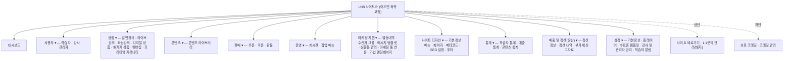

# 02. Customer Admin 화면설계서

| 항목 | 내용 |
|------|------|
| 문서 ID | 02_customer-admin |
| 영역 | [AD01] Customer Admin (고객 운영자/강사용 관리자) |
| 작성자 | 송기획 (책임 서비스기획자, proj-service-planner-senior) |
| 지시자 | 사용자(운영자) |
| 작성일 | 2026-06-24 |
| 버전 | v1.0 (Draft) |
| 입력 문서 | CreatorLMS Figma — Customer Admin(p001~p759) · `00_화면목록.md`(AD01) · `01_customer-front.md`(공통 패턴 본보기) |
| 후속 작업자 | 송기획(주관) · 윤UX(컴포넌트/토큰) · 강테크(게이트) |
| 상태 | **AD01 증류 완료 (p001~p759 전수 처리)** · 검토 요청 |

> 마스킹 규칙(개인정보 화면)·디자인 토큰 정합은 **추후 증류 단계에서 적용**한다.
> 화면ID·UI/DEV 타입·헤더 7필드 규약은 `DOCS-화면설계서작성표준.md`를 따른다.

> **모달/팝업 `_pu` 화면ID 추적(2026-06-25, DJ 지시)**: 본문 SCREEN TYPE 줄·Description에 정의된 고유 콘텐츠 모달은 `00_화면목록.md §3.2.2`에서 `부모화면ID_pu##`로 채번됐고, 여러 화면이 재사용하는 콘텐츠형 LPU(간단메모/수신자그룹/카테고리·상품선택/연결대상/카카오채널연결/어드민공지)는 §3.2.3 공유 컴포넌트(`S-AD01-C10~C15`)로 1회 채번됐다. AD 모달/팝업 56건(부모종속 50 + 공유 6). 매핑 SoT는 §3.2.2/§3.2.3(재증류 없이 ID 추적키만 부착). 본문 `(P-AD-NN)`은 정책ID로 팝업과 무관.

---

## 0. 정렬 / 에스컬레이션

> 입력(Figma) 간 범위 충돌·미확정 사항을 여기에 모은다. 팀장(강테크) 컨펌 전제.

1. **데모 브랜드명 가변** — LNB 상단 로고가 `맑은소프트`, GNB 로고가 `DJ테크트리`/`PATH`, 문의 버튼이 `SOLSOL 문의하기` 등 캡처마다 placeholder가 섞여 있다. 실제 제품은 **쏠쏠(CreatorLMS)** 이며, 사이트명/로고는 어드민 설정 가변값. 본 문서는 화면 의미 우선, 데모명은 placeholder로 본다.
2. **역할(Role) 배지 4종 — 관리자/강사/학습자/서브강사** — p016 배지 컴포넌트: `관리자`(핑크)·`강사`(보라)·`학습자`(하늘)·`서브강사`(배지없음 회색). 어드민 접속 주체는 관리자·강사(서브강사 포함), 학습자 배지는 사용자 목록에서 대상 표기용. 강사/서브강사 계정의 LNB 메뉴·기능 노출 범위는 **05 M-2 확정(역할별 메뉴 화이트리스트 RBAC)** — 강사 default 허용=대시보드·상품·콘텐츠·본인 정산·본인 강좌 통계·본인 주문 조회, 차단=마케팅·사이트 디자인·사용자 관리·전사 정산·설정. 서브강사=강사−운영/정산/사용자관리. 상세 매트릭스는 C-1 LNB·P-AD-02·P-AD-19 참조.
3. **크레딧(C) 경제** — LNB 하단 `보유 크레딧 120,000 C` + [크레딧 관리]. 마케팅(메시지 발송 등) 차감용 추정. 크레딧 충전/차감 정책·정산 연동은 미확정 `[→ 임기획]`.
4. **마스킹** — 사용자/판매(주문·환불)/정산/1:1문의 화면의 개인정보(이름·이메일·휴대폰·카드·계좌)는 `DOCS-화면설계서작성표준` §7 마스킹 적용 대상. 본 배치 캡처는 데모 더미(`닉네임`/`seoyeon.lee@example.com`)라 실값 마스킹은 구현 단계 적용 표기.
5. **외부 인터페이스(API)** — 통계/매출/정산/마케팅 발송/PG·정산 연동은 06_API계약 확정 필요 `[→ 강테크/오백개]`. 본 문서는 화면 동작·정책만 정의.
6. **Description 주석 페이지** — p001 등 일부는 설명 텍스트만 있는 명세 페이지로, 정책 메모로 흡수하고 화면블록은 만들지 않는다.

---

## 1. IA / 화면 맵

> 이 영역의 정보구조(메뉴 계층)와 화면 흐름. 화면목록(`00_화면목록.md` §3.2)과 정합. LNB 전체 메뉴는 p002 기준.

> **메뉴 1depth 11개 + 상단 2 + 하단 1.** 각 1depth는 클릭 시 펼침(아코디언, p002 각 컬럼이 펼침 변형). 2depth 항목 클릭 시 우측 콘텐츠 영역 전환.
> **모바일**: 상단 로고+검색+알림+프로필 / 하단 탭바(홈·가이드·사이트·1:1문의·대시보드·메뉴) / [메뉴] 탭 → 전체 메뉴 바텀시트 → 2depth 드릴다운(p004).

---

## 2. 화면상세설계

> 화면마다 아래 블록 템플릿을 복사해 채운다.
> - **헤더 7필드** 모두 기입(REQUIREMENT ID는 SI 산출물에만 — 사내 SM은 미작성 가능, 그 경우 `-`).
> - **좌(SCREEN DESIGN)**: 와이어/스크린샷 경로 (`screenshots/customer-admin/{번호-설명}.png`).
> - **우(DESCRIPTION)**: 번호 위계(`1` / `1.1` / `a`)로 동작·정책. **행복경로뿐 아니라 빈/로딩/에러/예외 상태까지** 빠짐없이.

<!-- ===== 화면 블록 템플릿 (복사해서 사용) =====================================

### S-AD01-[Depth]-[번호] [화면명]

| 필드 | 값 |
|------|----|
| SCREEN | [화면명] |
| SCREEN ID | S-AD01-______-___ |
| SCREEN TYPE | [UI: P/PU/LPU/BS] / [DEV: W] |
| LOCATION | [메뉴경로] |
| REQUIREMENT ID | -  (SI만 기입, SM 미작성 시 `-`) |
| WRITER | 강테크 |
| UPDATE | 2026-06-24 |

**SCREEN DESIGN** (좌)

> [추출 후 채움] — 와이어/캡처 경로

**DESCRIPTION** (우)
1. [화면 진입·기본 동작]
   1.1. [세부 동작/정책]
2. [상태별 처리]
   2.1. 빈 상태(Empty): [추출 후 채움]
   2.2. 로딩 상태(Loading): [추출 후 채움]
   2.3. 에러 상태(Error): [추출 후 채움]
   2.4. 예외/엣지 케이스: [추출 후 채움]
3. [권한/역할별 노출] — 관리자 영역: 역할(운영자/강사 등)별 분기 명시
4. [외부 인터페이스(API)] — 06_API계약과 1:1 (해당 시)
5. [개인정보 표기 시 마스킹] — 추후 증류 단계에서 적용

============================================================================= -->

### 2.0 공통 컴포넌트 (1회 정의 · 전 화면 공통)

> 화면이 아니라 **재사용 UI 컴포넌트/레이아웃**. Alert/Confirm/Toast(MPU)는 **화면ID 미부여**. LNB/GNB는 레이아웃 고정요소. 모든 캡처는 `_exports/png/customer-admin/`.

#### C-1. LNB / 사이드바 (좌측 글로벌 내비) — `p002.png`
- **상단**: 사이트 로고(어드민 설정, 데모 `맑은소프트`) / [↗ 사이트 바로가기](Front 새 탭 열기) / [① 1:1문의 관리](미답변 건수 빨강 배지).
- **메뉴(1depth, 아코디언)**: 대시보드 · 사용자 · 상품 · 콘텐츠 · 판매 · 운영 · 마케팅 지원 · 사이트 디자인 · 통계 · 매출 및 정산 · 설정. 클릭 시 펼침(▾/▲), 2depth 노출. 현재 화면 메뉴는 **active 하이라이트**(파랑 배경).
- **2depth**(펼침 시): IA §1 참조(예: 사용자>학습자/강사/관리자, 상품>일반강의/라이브강의/화상강의/디지털 상품/패키지 상품/앰버십(멤버십)/프리미엄 커뮤니티 등). **사이트 디자인>기본정보·메뉴·페이지·메타코드·SEO 설정·푸터**(p607 확인).
- **하단 고정**: `보유 크레딧 {n} C` + [크레딧 관리] 링크.
- 권한(P-AD-02, 05 M-2 확정): **역할별 메뉴 화이트리스트 RBAC — 권한 없는 메뉴는 숨김(hide)**(비활성 노출 아님, 정보 누수 방지). 강사(default) 노출=대시보드·상품·콘텐츠·본인 정산 정보/내역·본인 강좌 통계·본인 상품 주문 조회(△ 본인 범위 한정) / 강사 차단=마케팅 지원·사이트 디자인·사용자 관리(전체)·전사 매출/정산·설정. 서브강사=강사−운영/정산/사용자관리. 관리자(소유자)=전체. 데이터는 본인 담당 상품/강좌/수강생/정산으로 스코프, **직접 URL 접근 차단(EXC-06)**. 계정별 가감은 P-AD-19 권한 모달.

#### C-2. GNB / Header (상단바) — `p003.png`
- 좌: 뒤로(<) + 메뉴명(현재 화면명) + [가이드] 배지(있는 화면).
- 중앙: 검색바("닉네임, 이름으로 검색" — 사용자 검색 컨텍스트).
- 우: [SOLSOL 문의하기](브랜드사 문의) · 알림 아이콘(미읽음 배지) · 프로필▾.
- **프로필 드롭다운**: 역할 배지(`관리자` 핑크 / `강사` 보라) + 계정명(djkim) + 이메일 / [내 정보] / [로그아웃](컨펌 후 처리 추정). **역할별 배지·진입 메뉴 분기**(P-AD-03).

#### C-3. 모바일 레이아웃 — `p004.png`
- 상단: 로고 + 검색/알림/프로필. **하단 탭바**: 홈 · 가이드 · 사이트 · 1:1문의(배지) · 대시보드 · 메뉴.
- [메뉴] 탭 → **전체 메뉴 바텀시트**(1depth 리스트, → 화살표) → 항목 탭 시 **2depth 드릴다운**(< 뒤로, active 하이라이트).
- 프로필 레이어: 드롭다운 + 보유 크레딧 카드.
- 콘텐츠 영역은 모바일에서 단일 컬럼(Contents Area).

#### C-4. 모달 (LPU) — `p007.png`
- 카드형(타이틀 + ✕ + 내용 + 버튼). **버튼 1개형**(primary 전폭) / **버튼 2개형**(좌 outline 보조 + 우 primary). Esc·✕·외부클릭 닫힘, `role="dialog" aria-modal="true"`, 열림 중 body 스크롤 잠금.

#### C-5. 얼럿 (Alert / MPU, ID 미부여) — `p008.png`
- 아이콘(!) + 얼럿 내용 + [확인] 1버튼. 단방향 고지. (Front는 얼럿 폐지·토스트화됐으나 **어드민은 얼럿 존속**.)

#### C-6. 컨펌 (Confirm / MPU, ID 미부여) — `p009.png`
- 아이콘(!) + 컨펌 내용 + [취소](outline) / [확인](primary). 비가역·중요 액션 직전(삭제·상태변경 등).

#### C-7. 토스트 (Toast / MPU, ID 미부여) — `[추정]`
- 경량 완료/실패 피드백(저장됨·발송됨 등). 캡처 미확인 — Front 패턴(중앙 하단·3초 자동소멸) 준용 추정.

#### C-8. 공통 테이블/목록 패턴 (대다수 관리 화면 공통)
- 헤더(컬럼명) + 행 + 행 우측 액션. 정렬 토글(컬럼 헤더)·체크박스 일괄선택·페이지네이션·행 클릭 시 상세. (각 목록 화면에서 컬럼만 명시, 패턴은 여기 1회 정의.)
- 상태 배지 색 규약: 진행/긍정=초록, 대기=빨강/주황, 진행중=파랑, 종료/비활성=회색.

#### C-9. 조회기간 필터 패턴 (통계·내역 화면 공통)
- 기간 프리셋 버튼(1개월/3개월/6개월/12개월) + 시작일~종료일 date picker + [조회] 버튼. 차트류는 일별/주별/월별 집계 토글 동반.

#### C-10. 간단 메모 모달 (LPU) — `p039.png`
> 회원(학습자)·주문·환불·1:1문의 상세에서 운영자가 메모를 남기는 공통 모달.
- **회원 요약**: 프로필 + 닉네임(실명) + 가입일·마지막 로그인·수강 강좌 수·멤버십 이용중·커뮤니티 구독 수.
- **메모 목록**: 구분 필터(전체/학습자/주문/환불/1:1문의) + 컬럼(구분·메모·작성일·작성자(역할배지+닉네임)) + 정렬(등록 최신순▾) + 페이지네이션.
- **메모 작성**: textarea(0/200자 카운트) + [메모 저장]. **구분은 작성 위치에 따라 자동 저장**(1depth 기준: 사용자>학습자, 판매>주문/환불, 1:1문의 — 목록 제외, **상세페이지에서만** 노출).
- 닫힘: ✕·Esc·외부클릭.

#### C-11. 수신자 그룹 선택 모달 (LPU) — `p407.png`·`p623.png`(메뉴/쿠폰 공통)
> 쿠폰 등록(S-AD01-0402-002)·마케팅 캠페인 발송·사이트 디자인>메뉴 등록 등에서 **공통 재사용**되는 대상 그룹 선택 모달.
- 검색(그룹명·설명) + [검색] + 그룹 목록(체크박스·**그룹명+설명**·수신자수·**도달 성공률**·**유효 반응률**) + 페이지네이션 + 선택된 수신자 그룹 {n}(칩 ✕) + [확인]. **다중 선택**.
- **도달 성공률** = 발송 성공 건수 / 전체 발송 시도 건수 × 100(소수 1자리, 시도 0건이면 "-"). **유효 반응률** = 링크 클릭 수 / 링크 포함 메시지 발송 성공 건수 × 100(소수 1자리, 발송 성공 0건이면 "-"·링크 미포함 캠페인은 집계 제외)(P-AD-98). 설명 없으면 "-".
- 수신자 그룹의 실체는 마케팅 지원>수신자 그룹에서 관리. 닫힘: ✕·Esc·외부클릭.

#### C-13. 연결 대상 선택 모달 (LPU) — `p617.png`(페이지), `p619.png`(게시판)
> 사이트 디자인>메뉴 생성/수정의 연결 페이지 지정 시 호출. 페이지/게시판은 **1개만 선택**(카테고리는 C-12 다중·개별상품은 C-12 다중·수신자그룹은 C-11 다중).
- **페이지 선택 모달**(p617): 안내 "페이지는 1개만 선택 가능". 검색(페이지명) + 목록(체크박스·페이지명+[미리보기]·설명·등록일, default 최신순) + 페이지네이션 + 선택된 페이지 {n}(칩 ✕) + [확인]. **다른 페이지 선택 시 기존 해제·교체**(라디오처럼 단일).
- **게시판 선택(연결) 모달**(p619): 검색(게시판명) + 유형 필터 + 목록(게시판명·유형·게시글 수·공개상태·등록일) + [확인]. 동일하게 1개만 선택.
- 예외: 미선택 [확인] 시 "페이지를 선택해주세요." / 조회 실패 "페이지 목록을 불러오는 중 오류가 발생했어요. 잠시 후 다시 시도해주세요." / 빈 "선택된 페이지가 없습니다." 닫힘: ✕·Esc·외부클릭.

#### C-12. 카테고리 선택 / 개별상품 선택 모달 (LPU) — `p536.png`(카테고리), `p538.png`(개별상품)
> 사이트>페이지 등록·수신자 그룹 조건별 추출(진도율/특정상품) 등에서 **공통 재사용**(Description "사이트>페이지>등록/상세>모달 UI와 동일"). 패키지 구성 검색(P-AD-45)과도 동형.
- **카테고리 선택 모달**(p536/p537): 1depth/2depth **체크트리**(상위 체크 시 하위 전체 연동·부분 선택 시 1depth는 회색 체크박스). 각 항목 (n개) 상품 수 카운트 + [확인].
- **개별상품 선택 모달**(p538/p539) = **상품 검색 모달**: 안내 "공개='공개'·판매='판매중'인 상품만 검색 가능". 상품명 검색 + 상품유형 필터(전체/일반강의/라이브/화상/디지털/패키지/멤버십/프리미엄 커뮤니티) + 목록(섬네일·상품명·상품유형·카테고리·금액·공개상태·판매상태·[추가]) + 선택된 상품 {n}(번호·`[유형] 상품명`·✕) + [확인]. 검색어 입력 전 default=전체 상품 최신순.
- 닫힘: ✕·Esc·외부클릭.

#### C-15. 어드민 공지 확인 모달 (LPU, 로그인 시) — `p748.png`·`p749.png`
> 강사/관리자가 어드민 **로그인 시 항상 노출되는 공지 확인 모달**(설정>강사 및 관리자 공지에서 등록한 공지, P-AD-116). 알림센터(S-AD01-9002-*)와 별개.
- LNB 영역 제외 전체 화면 오버레이. 공지 미닫힘 상태면 메뉴 이동 시에도 모달 유지·외부 클릭 닫힘 불가(개발 주석).
- ① [닫기]: 모든 공지 읽음 처리. ② 공지 목록(확인 가능 공지): 고정글 공지(고정 설정 시 최상단·내 정렬 기준 등록일 최신순)·중요 공지(배경색/강조)·읽은/안 읽은 공지·[더보기](+10개). 닫힘: ✕·[닫기].

---

<!-- ▼▼▼ 대시보드 / 통계 ▼▼▼ -->

### S-AD01-0100-001 대시보드

| 필드 | 값 |
|------|----|
| SCREEN | 대시보드(메인) |
| SCREEN ID | S-AD01-0100-001 |
| SCREEN TYPE | P / W |
| LOCATION | LNB>대시보드 |
| REQUIREMENT ID | - |
| WRITER | 송기획 |
| UPDATE | 2026-06-24 |

**SCREEN DESIGN** — `_exports/png/customer-admin/p005.png`(화면), `p006.png`(Description)

**DESCRIPTION**
1. 진입: 최고관리자 계정으로 로그인 시 최초 노출되는 메인 페이지(P-AD-04). **강사 계정도 대시보드 진입 허용(05 M-2 확정 — 대시보드는 강사 default 허용, 단 데이터는 본인 강좌 범위로 스코프). 권한 없는 LNB 메뉴는 숨김.**
2. **조회기간 검색 영역**: 기간 프리셋(C-9). 당일 기준 **최대 90일 이내 데이터만 조회 가능**, 미선택 시 기본값 **최근 7일**.
   2.1. 기간 자동 선택 버튼: 클릭 시 선택한 기간 기준으로 조회기간 자동 설정. 직접 날짜를 선택한 경우 기간 자동 선택 상태 해제.
   2.2. 날짜 직접 설정: 시작일은 당일 기준 이전 날짜만 선택 가능(중요), 종료일은 시작일~당일 기준 최대 90일 범위 내. 시작일>종료일·종료일<시작일 선택 불가.
3. **기간 합계 정보 카드**: 설정 기간의 총 결제액/순매출액/취소액/구매건수 노출(4개).
4. **기간별 거래 통계**: 결제 현황 라인+바 차트. X축은 기간 길이에 따라 자동 집계(당일=시간대별, 7일=일별, 30일=주별, 90일=월별). 구매건수(라인)·결제액(바)·툴팁(마우스 오버 시 해당 구간 구매건수+결제액).
5. **많이 팔린 상품 top10**: 판매량 기준 상위 10개 상품(섬네일·상품명·취소완료건 제외).
6. **가입 통계**: 기간 내 회원 가입/탈퇴 현황 막대그래프(회원가입수·회원탈퇴수).
7. **방문 통계**: 순 방문자/신규 방문자/페이지뷰 라인차트. 페이지뷰=발생 전체 페이지 조회수(동일 사용자 반복·새로고침 모두 집계).
8. **1:1문의**: 설정·관계없이 1:1문의 관리 페이지 데이터 기준 동일 노출. 운영중 1:1문의 현황 확인 가능. 컬럼=답변상태/문의유형/제목/작성자/담당자/접수일/최근업데이트일. 답변상태 배지: 답변대기(빨강)/답변완료(초록)/답변중(파랑)/문의종료(회색). [전체보기 >] → 1:1문의 페이지 이동.
9. 상태:
   9.1. 빈 상태: 기간 내 데이터 없음 시 차트/카드 0 또는 "데이터 없음" 표기 `[추정]`.
   9.2. 로딩: 조회 시 차트 스켈레톤/스피너 `[추정]`.
   9.3. 에러: 통계 API 실패 시 재시도 안내 `[추정]`.
10. [외부 API] 통계 집계 조회 `[→ 강테크: 06_API계약 — 대시보드 집계]`.

---

### S-AD01-0901-001 통계 - 학습자 통계

| 필드 | 값 |
|------|----|
| SCREEN | 학습자 통계 |
| SCREEN ID | S-AD01-0901-001 |
| SCREEN TYPE | P / W |
| LOCATION | LNB>통계>학습자 통계 |
| REQUIREMENT ID | - |
| WRITER | 송기획 |
| UPDATE | 2026-06-24 |

**SCREEN DESIGN** — `_exports/png/customer-admin/p010.png`

**DESCRIPTION**
1. 진입: LNB>통계>학습자 통계. 상단 PATH(통계 > 학습자 통계).
2. **KPI 카드 3종**: 1-1 총 학습자 / 1-2 활성 학습자 / 1-3 최근 7일 신규 학습자(각 전기 대비 증감 표시 ▲▼).
3. **조회기간 필터**(C-9): 1/3/6/12개월 프리셋 + 시작~종료일 + [조회]. **최대 1년 이전 데이터까지 조회 가능**, 미선택 기본값 **최근 1개월**(p017). 시작일=당일 이전만, 종료일=시작일 기준 최대 365일 범위 내(시작>종료·종료<시작 불가).
4. **기간별 신규 및 활성 학습자**: 라인차트(활성 학습자/신규 학습자 2계열). 우상단 **일별/주별/월별** 집계 토글. 툴팁(해당 시점 활성/신규 수).
   4.1. 집계 단위는 조회기간 길이에 따라 사용 가능 단위 자동 노출(14일 이하=일별, 15~60일=일/주별, 60일 이상=일/주/월별 — p012/p017 준용).
5. **멤버십 등급 분포**: 도넛차트. 범례=기본 + 멤버십명1~5(어드민 설정 등급명). 툴팁(등급별 인원·비율%).
6. **요일별 학습 패턴**: 막대그래프(월~일). 최고 요일 강조(하늘색). 툴팁(요일·학습자 수).
7. **시간대별 학습 패턴**: 막대그래프(00:00~24:00 2시간 단위 12구간). 최고 구간 강조. 툴팁(시간대·학습자 수).
8. 상태: 빈/로딩/에러 — 대시보드 9 준용 `[추정]`.
9. [외부 API] 학습자 통계 집계 `[→ 강테크]`.

---

### S-AD01-0902-001 통계 - 매출 통계

| 필드 | 값 |
|------|----|
| SCREEN | 매출 통계 |
| SCREEN ID | S-AD01-0902-001 |
| SCREEN TYPE | P / W |
| LOCATION | LNB>통계>매출 통계 |
| REQUIREMENT ID | - |
| WRITER | 송기획 |
| UPDATE | 2026-06-24 |

**SCREEN DESIGN** — `_exports/png/customer-admin/p011.png`(화면), `p012.png`(Description)

**DESCRIPTION**
1. 진입: LNB>통계>매출 통계. 매출 관련 통계 확인 페이지.
2. **KPI 카드 3종**: 1 총 매출 / 2 총 판매 수 / 3 총 취소액(각 전기 대비 증감 ▲▼). 조회기간·관계없이 매출/판매/취소액 집계 제공.
3. **조회기간 필터**(C-9). 학습자 통계 3 준용.
4. **상품 요약 카드 2종**: 매출이 가장 높았던 상품 / 찜하기가 가장 많은 상품.
5. **기간별 매출**: 라인차트(매출액 좌Y축 + 주문건수 우Y축 2계열). 일별/주별/월별 토글. 툴팁(구간 매출액·주문건수). 집계단위는 학습자 통계 4.1 준용.
6. **상품 평점 분포**: 막대그래프(5점~1점) + 우측 상품별 평점 리스트(상품유형배지·상품명·평점·총매출액). Y축=상품 수.
7. **상품 유형별 매출 비중**: 도넛차트. 범례 7유형(일반강의/라이브강의/화상강의/디지털상품/패키지상품/멤버십/프리미엄 커뮤니티). 툴팁(유형명·금액·비율%).
8. **매출 상위 상품**: 테이블 — 순위(1~3위 메달)·상품유형배지·상품명·판매건수·총매출액·**공개상태배지**(공개 초록/일부공개💎 핑크아웃라인/비공개 회색). [더보기▾]로 추가 로드.
9. 상태: 빈/로딩/에러 — 대시보드 9 준용 `[추정]`.
10. 마스킹: 매출 금액은 천단위 `,` + ₩ 표기.
11. [외부 API] 매출 통계 집계 `[→ 강테크]`.

---

### S-AD01-0903-001 통계 - 콘텐츠 통계

| 필드 | 값 |
|------|----|
| SCREEN | 콘텐츠 통계 |
| SCREEN ID | S-AD01-0903-001 |
| SCREEN TYPE | P / W |
| LOCATION | LNB>통계>콘텐츠 통계 |
| REQUIREMENT ID | - |
| WRITER | 송기획 |
| UPDATE | 2026-06-24 |

**SCREEN DESIGN** — `_exports/png/customer-admin/p018.png`(화면), `p019.png`(Description)

**DESCRIPTION**
1. 진입: LNB>통계>콘텐츠 통계.
2. **KPI 카드 5종**: 총 콘텐츠 / 동영상 / 이미지 / 파일 / 유튜브링크(각 증감 ▲▼).
3. **조회기간 필터**(C-9). 학습자 통계 3 준용.
4. **기간별 콘텐츠 업로드**: 라인차트 4계열(동영상/이미지/파일/유튜브링크). 일별/주별/월별 토글. 툴팁(유형별 수).
5. **콘텐츠 유형 비중**: 도넛차트(동영상/이미지/파일/유튜브링크). 툴팁(유형·수·비율%).
6. **인기 콘텐츠**: 테이블 — 순위(1~3 메달)·콘텐츠유형배지·콘텐츠명·사용건수·상태배지(공개/비공개).
7. 상태: 빈/로딩/에러 — 대시보드 9 준용 `[추정]`.
8. [외부 API] 콘텐츠 통계 집계 `[→ 강테크]`.

---

<!-- ▼▼▼ 시스템 공통 ▼▼▼ -->

### S-AD01-9001-001 결제 유예기간 서비스 이용 제한 (어드민 진입 차단)

| 필드 | 값 |
|------|----|
| SCREEN | 결제 유예기간 서비스 이용 제한 안내(최고관리자) |
| SCREEN ID | S-AD01-9001-001 |
| SCREEN TYPE | P / W |
| LOCATION | (시스템 공통 · 어드민 진입 차단) |
| REQUIREMENT ID | - |
| WRITER | 송기획 |
| UPDATE | 2026-06-24 |

**SCREEN DESIGN** — `_exports/png/customer-admin/p020.png`

**DESCRIPTION**
1. 진입: 커스터머 구독이 결제 유예/만료 상태이면 어드민 진입 시 이 차단 인트로로 전환(P-AD-05).
2. 본문: "현재 사이트는 운영 정책에 따라 이용이 제한된 상태입니다. / 자세한 사항은 쏠쏠에게 문의해 주세요." + 일러스트.
3. [내 사이트 관리 바로가기] → 브랜드사이트(쏠쏠) 결제/구독 관리로 이동(추정).
4. **역할별 변형**(P-AD-05):
   a. 최고관리자(p020): 문구 "...쏠쏠에게 문의..." + [내 사이트 관리 바로가기] 버튼 노출.
   b. 강사(p021): 문구 "...{사이트명}에게 문의..." + 바로가기 버튼 **미노출**(강사는 구독 결제 권한 없음 → 관리자에게 문의 유도).
5. 연계: Front 측 동형 인트로(S-FR01-9001-001)와 사이트 단위 상태머신 공유 `[→ 임기획/오백개]`.

---

<!-- ▼▼▼ 어드민 인증 ▼▼▼ -->

### S-AD01-0301-001 어드민 로그인

| 필드 | 값 |
|------|----|
| SCREEN | 어드민 로그인 |
| SCREEN ID | S-AD01-0301-001 |
| SCREEN TYPE | P / W |
| LOCATION | (어드민 진입 · 비로그인) |
| REQUIREMENT ID | - |
| WRITER | 송기획 |
| UPDATE | 2026-06-24 |

**SCREEN DESIGN** — `_exports/png/customer-admin/p022.png`(텍스트형), `p026.png`(로고형), `p023.png`(Description)

**DESCRIPTION**
1. **사이트명 영역**: 어드민 설정 사이트명 표기 — ① 이미지형(브라우저 폭에 따라 리사이징) ② 텍스트형(디자인 폰트 자동 설정). 어드민>설정>기본정보에서 지정.
2. **회원 유형 선택(라디오)**: 강사 / 관리자. **default focus = 강사**. 선택 유형에 따라 로그인 후 진입할 대시보드 메뉴 구성·권한 범위 결정(P-AD-06).
3. **입력 폼**:
   3.1. 이메일: placeholder "example@email.com", **Auto focus**(페이지 진입 시 즉시 입력 가능). 형식 위반 시 "이메일 형식을 준수하여 작성해 주세요".
   3.2. 비밀번호: placeholder "비밀번호를 입력하세요", 입력 시 마스킹(●), **보기 토글(👁)**.
   3.3. 이메일 기억하기(체크박스): 체크 시 이메일을 로컬스토리지/쿠키 저장, 재방문 시 입력란 자동 입력. (cf. p024 비번찾기에서는 "아이디 기억하기" 체크박스 삭제됨 26-04-25.)
4. **[로그인] 버튼**: 회원유형+이메일+비밀번호 서버 인증 요청. **활성 조건=필수 항목 모두 입력 시**(미입력 비활성).
   4.1. 결과 처리: 성공(admin) → 메인 대시보드 이동. 실패 → 버튼 하단 에러 메시지.
   4.2. 에러 메시지(P-AD-07): 미등록="가입한 적 없는 이메일입니다" / 비번 불일치="비밀번호를 한 번 더 확인해주세요" / 유형 오류="계정 정보는 일치하나 회원 유형이 다릅니다" / 정지="정지된 계정입니다".
   4.3. [비밀번호 재설정] → 비밀번호 찾기 화면(S-AD01-0302-001) 이동.
5. 상태: 로딩(인증 중 버튼 스피너) `[추정]`, 네트워크 실패 토스트 `[추정]`.
6. 마스킹: 비밀번호 입출력 항상 마스킹.

---

### S-AD01-0302-001 비밀번호 찾기 (재설정 메일 발송)

| 필드 | 값 |
|------|----|
| SCREEN | 비밀번호 찾기 / 인증 메일 발송 완료 |
| SCREEN ID | S-AD01-0302-001 |
| SCREEN TYPE | P / W |
| LOCATION | 로그인>비밀번호 찾기 |
| REQUIREMENT ID | - |
| WRITER | 송기획 |
| UPDATE | 2026-06-24 |

**SCREEN DESIGN** — `_exports/png/customer-admin/p024.png`(2단: 입력 → 발송완료)

**DESCRIPTION**
1. 진입: 로그인>[비밀번호 재설정].
2. 입력 화면: "비밀번호 재설정하기" — 회원 유형 라디오(강사/관리자) + 안내문("가입하신 이메일 주소를 입력하시면, 비밀번호를 재설정할 수 있는 인증 메일을 보내드립니다") + 이메일 주소 입력.
   2.1. [인증 메일 발송] → 발송 처리 후 완료 화면 전환.
   2.2. [← 로그인 화면으로 돌아가기].
3. 발송 완료 화면(개정 26-04-25 신규): "인증 메일이 발송되었습니다 / {입력한 이메일 주소}" + [← 로그인 화면으로 돌아가기].
4. 입력 검증·에러(p025, P-AD-08): 미입력="이메일 주소를 입력해주세요" / 형식 위반="이메일 형식을 준수하여 작성해 주세요" / 미등록="가입한 적 없는 이메일입니다" / 유형 오류="계정 정보는 일치하나 회원 유형이 다릅니다" / 정지="정지된 계정입니다" / **연속 10회 이상 발송="인증 메일 발송 횟수를 초과했습니다. 10분 후 다시 시도해주세요"** / 서버오류="시스템 오류로 인해 메일 발송에 실패했습니다. 다시 시도해주세요".
5. [인증 메일 발송] 버튼 활성: 이메일 입력 + 유효성 통과 시 활성. 발송 중 중복 클릭 방지.
6. 메일 본문(p027/p028, 이메일 템플릿 §2.E-1): "비밀번호 재설정을 위한 인증 안내" + "안녕하세요 {역할}님"(강사/관리자 — 발송 요청 시 선택한 유형과 동일) + [비밀번호 재설정] 버튼(클릭 → 새 비밀번호 설정 화면) + 미클릭 시 URL 복사 안내(`https://admin.{사이트도메인}/reset-password?token=…&expires=…`, 새 창 열기) + 보안 안내. **링크 발송 후 30분 유효**(초과 시 재요청).
7. [외부 API] 비밀번호 재설정 메일 발송 `[→ 강테크]`.

---

### S-AD01-0302-002 새 비밀번호 설정

| 필드 | 값 |
|------|----|
| SCREEN | 새 비밀번호 설정 |
| SCREEN ID | S-AD01-0302-002 |
| SCREEN TYPE | P / W |
| LOCATION | 로그인>비밀번호 찾기>새 비밀번호 설정 |
| REQUIREMENT ID | - |
| WRITER | 송기획 |
| UPDATE | 2026-06-24 |

**SCREEN DESIGN** — `_exports/png/customer-admin/p029.png`(화면), `p030.png`(Description), `p031.png`(성공/실패 모달)

**DESCRIPTION**
1. 진입: 이메일 인증 링크 클릭(메일 30분 유효 토큰) → 이 화면. 헤드라인 "{강사/관리자} 로그인을 위한 새 비밀번호를 설정하세요" + 안내("보안을 위해 이전에 사용하지 않은 새로운 비밀번호를 설정해 주세요").
2. **새 비밀번호 입력**:
   2.1. 입력 즉시 마스킹(●), 보기 토글(👁). **강도 바**(약/보통/강 실시간) 노출. 규칙 안내 "8~16자, 영문 대소문자·숫자·특수문자 조합 필수" — 실시간 검증.
   2.2. 새 비밀번호 확인: 2-1과 일치 검증, 불일치 시 경고 문구.
3. **[비밀번호 변경 완료]**: 입력 데이터 최종 검증 후 DB 반영 요청.
   3.1. 모든 유효성 통과 → DB 업데이트 + **성공 모달**(p031, "비밀번호가 변경되었습니다 / 새로운 비밀번호로 로그인하실 수 있습니다" + [로그인]) → 로그인 화면 리다이렉트.
   3.2. 실패 → **오류 모달**(p031, 신규 26-04-25: "오류가 발생했습니다 / 비밀번호는 영문, 숫자, 특수문자를 포함하여 8자 이상이어야 합니다" + [확인]). `(C-3 표준문구: 영문·숫자·특수문자 3종 조합 8~16자 — 원 화면 "8자 이상" supersede)`
4. [← 로그인 화면으로 돌아가기].
5. 마스킹: 비밀번호 입출력 항상 마스킹.
6. [외부 API] 비밀번호 변경(토큰 검증) `[→ 강테크]`.

---

### S-AD01-0303-001 어드민 회원가입

| 필드 | 값 |
|------|----|
| SCREEN | 어드민 회원가입(강사/관리자) |
| SCREEN ID | S-AD01-0303-001 |
| SCREEN TYPE | P / W |
| LOCATION | (어드민 진입 · 비로그인)>회원가입 |
| REQUIREMENT ID | - |
| WRITER | 송기획 |
| UPDATE | 2026-06-24 |

**SCREEN DESIGN** — `_exports/png/customer-admin/p034.png`(정상), `p033.png`(validation 에러), `p037.png`(인증메일 발송 완료 모달), `p038.png`(검증규칙 Description)

**DESCRIPTION**
1. 헤더: 사이트명(어드민 설정) + "회원가입" + **역할 라디오(강사/관리자, default 강사)**.
2. **입력 폼**(모두 필수 `*`):
   2.1. 성 / 이름: 실시간 유효성. 이름 최대 20자. 미입력="이름을 입력해 주세요" / 숫자·특수문자="이름은 한글로만 입력 가능합니다" / 공백="이름에 공백을 제거해 주세요".
   2.2. 닉네임: placeholder "닉네임을 입력하세요", 화면 안내 "2~15자, 다른 사용자에게 표시되는 이름입니다"(정책확정 C-1: 닉네임 2~15자 단일 / 원 Figma 가입화면 안내 "2~20자"·Description "최소 2자·최대 10자" 불일치는 2~15로 supersede). 실시간 유효성+중복 체크: 미입력="닉네임을 입력해주세요" / 특수문자="닉네임은 한글, 영문, 숫자만 사용 가능합니다" / 미달="닉네임은 최소 2자 이상 입력해주세요" / 초과="닉네임은 15자 이내로 입력해주세요" / 중복="이미 사용 중인 닉네임입니다" / **금칙어**(관리자·어드민·admin·고객센터·CS·공지사항·도우미·욕설/비속어/성적 언어, 공백/특수문자 제거 후 대조)="사용할 수 없는 단어가 포함되어 있습니다" / 공백="닉네임에 공백을 제거해 주세요".
   2.3. 이메일 주소: placeholder "example@email.com" + **[인증코드 발송]**(클릭 시 인증메일 발송 E-2 + **발송 완료 모달**(p037): "인증 메일을 발송했습니다 / {이메일}으로 인증코드를 포함한 이메일을 발송했습니다 / 인증코드는 10분간 유효 / 안 보이면 스팸 메일함 확인 / 발신주소 {최종관리자 이메일}" + 남은 유효시간 카운트 + [확인]). 형식 위반 "이메일 형식을 준수하여 작성해 주세요".
   2.4. 인증코드: placeholder "인증코드 6자리" + **[확인]** + 발송 후 카운트다운(예 02:36). 불일치="인증코드를 다시 한 번 작성해주세요", 미인증="이메일 인증을 완료해 주세요". 코드 10분 유효(E-2).
   2.5. 비밀번호: 마스킹+보기 토글, **강도 바**(위험Red=한 종류 숫자만 / 보통Orange=영문+숫자 2종 / 안전Green=10자↑ 3종 조합 / 강력Blue=12자↑ 대소문자+숫자+특수문자 모두). 규칙 "8~16자, 영문 대소문자·숫자·특수문자 조합 필수". 검증: 미입력="비밀번호를 입력해주세요" / 미달="비밀번호는 최소 8자 이상 입력해 주세요" / 초과="비밀번호는 20자 이내로 입력해 주세요" / 조합 위반="영문 대소문자, 숫자, 특수문자를 혼합하여 입력해 주세요" / 공백="비밀번호에 공백을 포함할 수 없습니다" / 개인정보 포함="아이디가 포함되지 않은 비밀번호로 사용해주세요".
   2.6. 비밀번호 확인: 미입력="비밀번호 확인을 위해 한 번 더 입력해 주세요" / 불일치="비밀번호가 일치하지 않습니다".
   2.7. 약관 동의 체크박스: "{사이트명}에서 정한 전체 약관에 동의합니다". 미동의 시 가입 불가.
3. **[회원가입]**: 전 필드 유효 + 이메일 인증 완료 + 약관 동의 시 활성 → 가입 처리(P-AD-09).
   3.1. [로그인 하기] → 로그인 화면.
4. 상태: validation 에러(p033)는 각 필드 하단 빨간 문구·테두리. 로딩(가입 중 버튼 스피너) `[추정]`. 가입 완료 후 이동/모달 `[미확정-p037이후]`.
5. 마스킹: 비밀번호 입출력 마스킹. 성/이름/이메일은 본인 입력값.
6. [외부 API] 이메일 인증코드 발송/검증·회원가입 `[→ 강테크]`.

> **참고**: 회원가입의 강사/관리자 구분, 약관은 "맑은소프트 정책" 동의 추정(Front 패턴 준용). 어드민 가입 후 승인 절차 유무 `[미확정]`.

---

<!-- ▼▼▼ 알림센터 ▼▼▼ -->

### S-AD01-9002-001 알림센터

| 필드 | 값 |
|------|----|
| SCREEN | 알림센터 |
| SCREEN ID | S-AD01-9002-001 |
| SCREEN TYPE | P / W |
| LOCATION | GNB>알림 아이콘 |
| REQUIREMENT ID | - |
| WRITER | 송기획 |
| UPDATE | 2026-06-24 |

**SCREEN DESIGN** — `_exports/png/customer-admin/p042.png`(화면), `p043.png`(Description)

**DESCRIPTION**
1. 진입: GNB 알림 아이콘 클릭. 쏠쏠(시스템)에서 발행되는 알림 확인 영역(상품 수정·신규상품 등록·문의 등록 등).
2. **날짜 그룹**: 연.월(YYYY.MM) 기준 월 단위 그룹핑.
3. **알림 목록**: 항목=제목+내용+등록일(상대시간). 미읽음=백그라운드 컬러 강조. **알림센터 진입 후 타 페이지 이동 시 모든 알림 자동 읽음처리**(P-AD-11). 랜딩 페이지가 있는 알림은 우측 (>) 아이콘 → 클릭 시 해당 페이지 이동.
4. **[더보기▾]**: 알림 10개 이상일 때 노출, 클릭 시 10개 추가 로드.
5. 상태:
   5.1. 빈 상태: 알림 없음 시 빈 상태 노출 `[추정]`.
   5.2. 로딩/에러: `[추정]`.
6. **미확정**: "알림 기획 미 진행 상태, 추후 기획 예정"(p043) → 알림 종류·발행 트리거 정책 미확정 `[미확정-알림기획 미진행]`.

---

### S-AD01-9003-001 내 정보 (계정 정보)

| 필드 | 값 |
|------|----|
| SCREEN | 내 정보(계정 정보) |
| SCREEN ID | S-AD01-9003-001 |
| SCREEN TYPE | P / W |
| LOCATION | GNB>프로필▾>내 정보 |
| REQUIREMENT ID | - |
| WRITER | 송기획 |
| UPDATE | 2026-06-24 |

**SCREEN DESIGN** — `_exports/png/customer-admin/p044.png`(화면), `p045.png`(Description), `p046.png`(프로필 설정 모달), `p047.png`(모달 Description)

**DESCRIPTION**
1. 진입: GNB 프로필 드롭다운>내 정보. 강사·관리자 본인 정보 수정 페이지.
2. **계정 정보**:
   2.1. 프로필: 기본 프로필 표시 + [프로필 설정] → **프로필 설정 모달(LPU, p046/p047)**: [파일 선택하기]/드래그(권장 400×400px 1:1) → 업로드 조건(파일 1개, jpg/jpeg/png, 최대 5MB — 초과 시 얼럿) → 크롭 UI(고정비율 5:5, 드래그 이동·크기 조절) → [등록](이미지 등록 시 활성). 크롭 영역 기준 최종 프로필 생성.
   2.2. 읽기 전용: 가입일시 · 마지막 로그인 · 이메일 · 사용자 유형(역할 배지).
   2.3. [비밀번호 재설정] → 비밀번호 변경 흐름(추정).
   2.4. 닉네임(필수): [n/15] 카운트(정책확정 C-1: 닉네임 2~15자 단일 / 원 Figma 가입화면값 최대10자는 supersede).
   2.5. 이름: placeholder "실명을 입력해 주세요".
   2.6. 연락처: placeholder "'-' 제외한 숫자만 입력해 주세요. 예) 010-0000-0000".
3. **[변경사항 저장]**: **모든 필수값 입력 시 활성**(미입력 회색 비활성). 클릭 시 저장 → 완료 얼럿(C-5/C-6).
4. 상태: 저장 실패 에러 `[추정]`.
5. **재사용 규칙**(P-AD-12): "사용자>강사/관리자>상세/수정>기본정보 탭과 기능이 동일한 영역은 별도 작성하지 않고, 상이한 기능만 디스크립션 작성"(p045).
6. 마스킹: 본인 조회 화면이므로 이메일·연락처 비마스킹 가능성(§0-4, 팀장 컨펌 `[→ 강테크]`).

---

<!-- ▼▼▼ 1:1 문의 관리 ▼▼▼ -->

### S-AD01-9004-001 1:1 문의 관리 (목록)

| 필드 | 값 |
|------|----|
| SCREEN | 1:1 문의 관리(목록) |
| SCREEN ID | S-AD01-9004-001 |
| SCREEN TYPE | P / W |
| LOCATION | LNB 상단>1:1문의 관리 |
| REQUIREMENT ID | - |
| WRITER | 송기획 |
| UPDATE | 2026-06-24 |

**SCREEN DESIGN** — `_exports/png/customer-admin/p048.png`(화면), `p049.png`(Description)

**DESCRIPTION**
1. 진입: LNB 상단 [1:1문의 관리](미답변 배지). 프론트에서 인입된 학습자 1:1문의 관리. 안내문 "문의 상태는 답변 진행에 따라 자동 변경되며, 필요 시 수동으로도 변경할 수 있습니다".
2. **상태 KPI 카드 4종**(P-AD-13 상태머신):
   a. 답변대기: 담당자 미답변(최초). b. 답변중: 사용자가 추가로 답변(질문)한 상태. c. 답변완료: 담당자가 마지막으로 답변한 상태. d. 문의종료: 더 이상 답변/질문 불가한 종료. 상태는 댓글 등록·마지막 작성자 권한 기준 자동 변경(관리자>1:1관리에서 수동 변경 우선 적용).
3. **검색/필터/정렬**:
   3.1. 검색: 문의 제목·작성자(텍스트 입력 후 Enter / 공백 무시 / 2자 미만 검색 시 얼럿).
   3.2. 답변상태 필터: 전체/답변대기/답변중/답변완료/문의종료.
   3.3. 문의유형 필터: 전체/상품/결제/신고/기타.
   3.4. 정렬(접수일 최신순▾) + 페이지크기(30개씩).
4. **문의 목록 테이블**: 체크박스 · 답변상태(배지) · 문의유형(상품/결제/신고/기타) · 문의 제목 · 작성자(역할배지+닉네임) · **담당자(최초 댓글 작성자)** · 접수일 · **최근 업데이트일(마지막 댓글 작성 일시)**. 행 클릭 → 문의 상세(추정). 페이지네이션.
5. **일괄 액션 플로팅바**(C-8): 체크 1개↑ 선택 시 노출(✕ {n}개 문의 선택됨). [문의종료] → 컨펌(C-6) → 처리완료 얼럿(C-5).
6. 상태:
   6.1. 빈 상태: 문의 0건/검색 결과 없음 시 빈 상태 `[추정]`.
   6.2. 로딩/에러: `[추정]`.
7. 마스킹: 작성자 닉네임(실명 노출 시 마스킹 검토), 결제·신고 문의의 개인정보 마스킹 `[→ 강테크]`.
8. [외부 API] 1:1문의 목록/상태변경/일괄종료 `[→ 강테크]`.

---

### S-AD01-9004-002 1:1 문의 상세

| 필드 | 값 |
|------|----|
| SCREEN | 1:1 문의 상세 |
| SCREEN ID | S-AD01-9004-002 |
| SCREEN TYPE | P / W |
| LOCATION | 1:1문의 관리>상세 |
| REQUIREMENT ID | - |
| WRITER | 송기획 |
| UPDATE | 2026-06-24 |

**SCREEN DESIGN** — `_exports/png/customer-admin/p050.png`(화면), `p051.png`(개정), `p052.png`(Description)

**DESCRIPTION**
1. 진입: 문의 목록 행 클릭.
2. **상단 액션**: **답변상태 셀렉트박스**(수동 변경, 개정 26-04-29 — 기존 버튼→셀렉트박스) + [삭제] + [수정].
3. **문의 본문**: 문의유형 배지 + 제목 + 작성자(역할배지)+조회수 + (결제/신고 문의면 관련 정보 영역) + 본문 + **첨부파일**(파일명 + [다운로드]).
4. **댓글(답변) 작성**: 작성자(역할배지+닉네임) + textarea("댓글을 입력해 주세요") + [등록](입력 시 활성). 댓글 등록 시 상태 자동 변경(답변완료 등, P-AD-13).
5. **댓글 스레드**(전체 {n}):
   5.1. 댓글: 작성자(역할배지)+작성일시+@멘션 본문 + [답글] + 더보기(⋮ 수정/삭제).
   5.2. 답글/대댓글: 댓글 하단 입력 영역 생성. 답글·대댓글 작성 UI.
   5.3. **수정**: ⋮>수정 → 작성 타입별 수정 UI(댓글/답글/대댓글).
   5.4. **삭제**: ⋮>삭제 → 삭제 컨펌(C-6) → 완료 얼럿(C-5). 삭제 시 작성자·작성일·내용 비노출, "삭제된 댓글 입니다 ({닉네임} 삭제)"로 영역·답글 구조 유지 + 삭제일시·삭제자 닉네임 표시.
6. 상태: 본문 로딩/에러 `[추정]`, 댓글 없음 빈 상태 `[추정]`.
7. 권한: 댓글 수정/삭제는 작성자 본인(관리자/강사) 기준 `[추정]`.
8. 마스킹: 결제/신고 문의 개인정보 마스킹 `[→ 강테크]`.
9. [외부 API] 문의 상세/댓글 CRUD/상태변경/파일 다운로드 `[→ 강테크]`.

---

### S-AD01-9004-003 1:1 문의 수정

| 필드 | 값 |
|------|----|
| SCREEN | 1:1 문의 수정 |
| SCREEN ID | S-AD01-9004-003 |
| SCREEN TYPE | P / W |
| LOCATION | 1:1문의 관리>상세>수정 |
| REQUIREMENT ID | - |
| WRITER | 송기획 |
| UPDATE | 2026-06-24 |

**SCREEN DESIGN** — `_exports/png/customer-admin/p053.png`(화면), `p054.png`(Description)

**DESCRIPTION**
1. 진입: 문의 상세>[수정]. 프론트 1:1문의하기(S-FR01-0301-109)와 기능 동일, 상이한 영역만 기술(P-AD-12 재사용).
2. **입력 폼**: 문의유형 라디오(상품/결제(구매 및 환불)/신고하기/기타) + 신고/결제 선택 시 관련 정보 입력 영역 + 제목([n/50]) + 내용(리치 에디터, 미리보기, 50MB) + 파일 업로드(원본/노출 파일명, 용량 표기).
3. **[수정]**: 모든 필수값 입력 시 활성 → 수정 컨펌(C-6) → 완료 얼럿(C-5).
4. 상태: 검증 에러·로딩·실패 — 프론트 패턴 준용 `[추정]`.
5. [외부 API] 문의 수정/파일 업로드 `[→ 강테크]`.

---

<!-- ▼▼▼ 크레딧 관리 ▼▼▼ -->

### S-AD01-9005-001 크레딧 관리

| 필드 | 값 |
|------|----|
| SCREEN | 크레딧 관리 |
| SCREEN ID | S-AD01-9005-001 |
| SCREEN TYPE | P / W |
| LOCATION | LNB 하단>크레딧 관리 |
| REQUIREMENT ID | - |
| WRITER | 송기획 |
| UPDATE | 2026-06-24 |

**SCREEN DESIGN** — `_exports/png/customer-admin/p056.png`(화면), `p057.png`(Description), `p058.png`(영수증 모달), `p059.png`(크레딧 상세 모달)

**DESCRIPTION**
1. 진입: LNB 하단 [크레딧 관리]. 안내문 "충전된 크레딧은 캠페인의 캠페인 발송, AI 튜터, AI 번역 서비스 이용 시 차감됩니다"(P-AD-14 크레딧 경제).
2. **보유 크레딧 카드**: 보유 크레딧(C) + [크레딧 충전](충전 페이지 이동).
3. **요약 정보**: 총 충전한 크레딧(누적) / 보너스 크레딧(이벤트 등 지급분 합산) / 이번 달 사용 크레딧. (소멸은 1일~말일 만월차 합산.)
4. **조회기간/검색 필터**:
   4.1. 기간: 오늘/1주일/이번 달/3개월 + 날짜 직접(시작>종료 차단). 직접 입력 시 프리셋 해제.
   4.2. 내용 검색(텍스트 Enter / 공백·부분일치 / 2자 미만 검색 시 얼럿).
   4.3. 구분 필터: 전체/충전/지급/사용/소멸/취소/관리자 지급/관리자 차감.
5. **충전 및 사용 내역 테이블**: 일시 · **구분**(충전/관리자 지급/관리자 차감/취소/사용/소멸) · **내용**(구분별 상세, 예 "크레딧 구매"·"이벤트 당첨 10,000원 충전"·"이메일 전송"·"유효기간 만료로 소멸처리" — 클릭 시 **크레딧 상세 모달**(p059): 일시/구분/내용/크레딧/유효기간, 충전 건은 +주문번호/주문상태(결제완료·결제취소)/결제금액/결제정보(카드 마스킹) 확장) · 크레딧(+/−) · **소멸일시**(소멸 대상만 노출) · **영수증**(충전 내역만 버튼 → 영수증 모달 p058). 페이지크기(30개씩) + 페이지네이션.
5.1. **결제 취소**(크레딧 상세 모달 충전 건, p060, P-AD-15): 충전 크레딧 **미사용 + 결제일 7일 이내**일 때만 [결제취소] 버튼 노출 → 취소 컨펌(C-6) → 완료 얼럿(C-5). 취소 시 충전 크레딧 즉시 차감.
6. 상태: 내역 없음 빈 상태 `[추정]`, 로딩/에러 `[추정]`. 값 없는 항목은 빈값 표시.
7. 마스킹: 결제 영수증 카드번호 마스킹(예 "현대 3333 **** **** ****").
8. [외부 API] 크레딧 잔액/내역/충전/영수증/결제취소 `[→ 강테크]`.

---

### S-AD01-9005-002 크레딧 충전

| 필드 | 값 |
|------|----|
| SCREEN | 크레딧 충전 |
| SCREEN ID | S-AD01-9005-002 |
| SCREEN TYPE | P / W |
| LOCATION | 크레딧 관리>크레딧 충전 |
| REQUIREMENT ID | - |
| WRITER | 송기획 |
| UPDATE | 2026-06-24 |

**SCREEN DESIGN** — `_exports/png/customer-admin/p061.png`(화면), `p062.png`(Description), `p063.png`(카드 등록 toss 모달)

**DESCRIPTION**
1. 진입: 크레딧 관리>[크레딧 충전].
2. **충전 금액 선택**(좌): 보유 크레딧 표시 + 충전 상품 카드(10,000 / 30,000(+보너스 3,000) / 50,000(+5,000) / 100,000(+10,000) / 300,000(+30,000) / 500,000(+50,000)). **보너스 지급 정책은 백오피스에서 설정**(가변). 선택 시 충전 크레딧+보너스 표시.
3. **결제 예정 금액**: 선택 금액 기준 최종 결제 금액(**VAT 포함**) 표시.
4. **결제정보**(우): 등록 카드 라디오 선택(카드번호 마스킹 "1234---5678") / [+ 카드 추가] → **toss payments 카드 등록 모달**(p063): 개인/법인 탭 + 카드번호/유효기간/(법인=사업자번호 10자리)/필수 약관 동의/[다음]. **등록 카드 없으면 "등록된 카드가 없습니다" 문구**(p062 4-1) + 카드 추가 유도.
5. 약관: "결제 및 환불안내 조건을 확인했습니다" 체크. **결제 및 환불안내**: 크레딧 유효기간 결제일 기준 1년(만료 시 자동 소멸) · 10,000원 단위 충전(VAT 별도) · 환불은 [서비스 이용약관] 위치 확인 · 기타 문의는 1:1문의.
6. **[결제하기]**: 결제정보 설정 + 약관 체크 시 활성 → 결제 진행 → 컨펌(C-6) → 성공=완료 페이지 이동 / 실패=실패 페이지 이동.
7. 상태: 카드 미등록·약관 미동의 시 버튼 비활성. 로딩/실패 `[추정]`.
8. 마스킹: 카드번호 마스킹.
9. [외부 API] 카드 조회/등록·크레딧 결제(PG) `[→ 강테크]`.

---

### S-AD01-9005-003 크레딧 충전 결제완료 / 결제실패

| 필드 | 값 |
|------|----|
| SCREEN | 크레딧 충전 결제완료 / 결제실패 |
| SCREEN ID | S-AD01-9005-003 |
| SCREEN TYPE | P / W |
| LOCATION | 크레딧 충전>결제완료 / 결제실패 |
| REQUIREMENT ID | - |
| WRITER | 송기획 |
| UPDATE | 2026-06-24 |

**SCREEN DESIGN** — `_exports/png/customer-admin/p064.png`(완료), `p068.png`(실패), `p065.png`(Description)

**DESCRIPTION**
1. **결제완료**(p064): "크레딧 결제가 완료되었습니다" + 결제 정보(주문번호(고유값 자동생성)·주문일시(YYYY.MM.DD HH:MM:SS, 결제 승인 시점)·결제금액(VAT 포함)·결제정보(카드 마스킹)·충전 크레딧·**크레딧 유효기간**(p065 개발 확인 필요 `[미확정-유효기간]`)) + **결제 전/후 크레딧** 비교 + [크레딧 관리 바로가기].
2. **결제실패**: 실패 사유(TOSS 전달 코드·메시지) + [다시 결제하기](동일 주문 건 기준 재시도, 기존 선택 카드/쿠폰 유지).
3. 마스킹: 카드번호 마스킹.
4. [외부 API] 결제 결과 콜백(toss) `[→ 강테크]`.

---

<!-- ▼▼▼ 사용자 ▼▼▼ -->

### S-AD01-0101-001 사용자 - 학습자 목록

| 필드 | 값 |
|------|----|
| SCREEN | 사용자 - 학습자 목록 |
| SCREEN ID | S-AD01-0101-001 |
| SCREEN TYPE | P / W |
| LOCATION | LNB>사용자>학습자 |
| REQUIREMENT ID | - |
| WRITER | 송기획 |
| UPDATE | 2026-06-24 |

**SCREEN DESIGN** — `_exports/png/customer-admin/p069.png`(화면), `p070.png`/`p093.png`(Description), `p074`~`p092.png`(일괄처리 얼럿/컨펌 변형)

**DESCRIPTION**
1. 진입: LNB>사용자>학습자. 가입 학습자 통합 조회 목록. 안내문(가입유형 안내) + [가이드보기].
2. **검색/필터**:
   2.1. 검색: 닉네임·이름·이메일(Enter, 검색 결과 KPI·목록 반영).
   2.2. 상태별 필터: 전체/활성/중지/탈퇴.
   2.3. 멤버십 필터: 멤버십 등급(어드민 설정).
   2.4. 유형별 필터: 일반/숏either(숏폼) 가입유형.
3. **KPI 카드 4종**: 총 학습자 / 활성 학습자 / 평균 진행률(%) / 이번 달 신규(각 지난달 대비 증감, 검색 조건 적용 후).
4. **학습자 목록 테이블**: 체크박스(헤더=전체선택) · 학습자(역할배지+닉네임+프로필) · 이메일(로그인 ID, 최초 가입 소셜이면 아이콘) · 연락처(휴대폰 인증 회원만, 없으면 "-") · 멤버십(등급명/없으면 "-") · 가입유형(일반=외부링크·회원가입 페이지 / 숏폼=유튜브 숏폼 링크·회원가입) · 소셜유형(Google/Kakao/Naver/Apple/Facebook) · 가입일시 · 구매수(완료 결제 건) · 평균 진도율(수강중 일반/라이브/화상 평균%, 라이브·화상은 시작 전 0%) · **상태**(활성/중지/탈퇴 배지). 정렬(정렬▾: 구매액순/등록순/가입순/멤버십 상위 등급순/가입일 최신순) + 페이지네이션. 행 클릭 → 학습자 상세(S-AD01-0101-002).
   4.1. **회원 상태머신**(P-AD-16): **활성**(제한 없는 정상, 가입·인증 완료 시 기본) ↔ **중지**(관리자 강제 전환, 부정행위 등 — 로그인/1:1문의 제외 기능 접근 불가, 상품 수강기간 hold, 소명 후 활성 복구 가능) ↔ **탈퇴**(본인 신청 또는 관리자 영구 처리, 재가입/로그인 차단, 개인정보 마스킹/별도 보관, 결제 내역 있으면 일정 기간(예 5년) 데이터 보존·"상품구매수" 통계용 유지).
5. **일괄 액션 플로팅바**(C-8): 체크 1개↑ 선택 시(✕ {n}개 항목 선택됨). [활성]/[중지]/[탈퇴] — 상태 일괄 변경(컨펌→얼럿, P-AD-16 상태머신).
   5.1. **미선택 액션 시 얼럿**: "활성화/중지할/탈퇴할 학습자를 먼저 선택해 주세요"(p074~p076).
   5.2. **이미 동일 상태 일부 포함 시**(p084/p085): "중복 대상을 제외한 나머지 인원만 변경하시겠습니까? / 선택한 대상 중 일부가 이미 {상태} 상태입니다" 얼럿.
   5.3. **상태 변경 컨펌**: 활성="선택한 학습자를 활성화하시겠어요?"(p090) / 중지="선택한 학습자를 중지하시겠습니까?"(p091).
   5.4. **탈퇴 차단 규칙**(p089/p092, P-AD-18): ① 선택 학습자에 만료되지 않은 강좌가 있으면 탈퇴 불가 — "선택한 학습자의 만료되지 않은 강좌가 있습니다. 강좌를 만료한 후 학습자를 삭제할 수 있습니다". ② **탈퇴는 일괄 불가, 1명씩만** — 2명 이상 선택 후 탈퇴 시 "한 번에 한 사람씩 탈퇴시킬 수 있습니다". ③ **탈퇴 최종 컨펌(비가역)**(p099): "선택한 학습자를 정말 탈퇴 처리하시겠습니까? 탈퇴 시 모든 학습 데이터가 영구 삭제되며 복구가 불가능합니다".
6. 상태: 빈/검색없음/로딩/에러 `[추정]`.
7. 마스킹: **이메일(계정 첫2자 이후)·연락처(가운데 마스킹)** 적용(개인정보, P-AD-17). 본 캡처는 데모 더미.
8. [외부 API] 학습자 목록/상태변경 `[→ 강테크]`.

---

### S-AD01-0101-002 사용자 - 학습자 상세 (탭: 기본정보/학습이력/구매이력/활동로그/발송이력/쿠폰)

| 필드 | 값 |
|------|----|
| SCREEN | 사용자 - 학습자 상세 |
| SCREEN ID | S-AD01-0101-002 |
| SCREEN TYPE | P / W |
| LOCATION | 사용자>학습자>상세 |
| REQUIREMENT ID | - |
| WRITER | 송기획 |
| UPDATE | 2026-06-24 |

**SCREEN DESIGN** — `_exports/png/customer-admin/p071.png`(기본정보), `p072.png`(학습이력), `p073.png`(구매이력), `p083.png`(활동로그), `p087.png`(발송이력), `p094.png`(수강강좌 모달), `p095.png`(구독관리 모달), `p096.png`(수료여부 변경 모달), `p098.png`(다운로드 내역 모달 Description), `p078.png`/`p079.png`/`p081.png`/`p086.png`(Description)

**DESCRIPTION**
1. 진입: 학습자 목록 행 클릭. 상단 < 뒤로 + [가이드보기] + 안내문("비밀번호 분실시 '비밀번호 재설정' 버튼을 클릭하여 메일을 발송할 수 있습니다").
2. **회원 헤더**(전 탭 공통): 프로필 + 닉네임(실명) + 배지(**인증여부**(휴대폰 인증=인증 배지)·**회원상태**(활성/중지/탈퇴 컬러)·**멤버십명**) + 이메일 + 가입일·마지막 로그인·**수강 강좌 {n}**(클릭 → 수강 강좌 목록 모달 p094, Front 상품 목록 모달과 동형: 유형배지·상태(수료/강의종료)·상품명·수강기간/진도율/상품구성/다운로드+[강의실 바로가기]/[상품리스트 보기])·**멤버십 이용중·커뮤니티 구독 {n}**(클릭 → 구독관리 모달 p095: 멤버십·프리미엄 커뮤니티 섹션, 각 카드=상품명·시작일·만료일(N일 남음)·다음 결제일·⋮더보기 + [더보기▾]).
3. **탭**: 기본 정보 / 학습 이력 / 구매 이력 / 활동 로그 / 발송 이력 / 쿠폰.
4. **[기본 정보] 탭**:
   4.1. 개인 정보: 닉네임(변경)·이름(상품구매 시 휴대폰 인증 확인 이름, 변경)·연락처(휴대폰 인증 무관 관리자 수동 작성/수정)·이메일(소셜 아이콘 G/Kakao/N/Apple + 주소)·가입일.
   4.2. 계정 정보: 멤버십명(없으면 "-")·**상태(셀렉트박스: 활성/중지/탈퇴 — 마우스 롤오버 드롭다운, 변경 후 저장)**·마지막 로그인·로그인 횟수.
   4.3. 광고성 수신 동의: 상태에 따라 [동의]/[거부] 문구.
   4.4. [변경사항 저장]: 수정 폼 DB 반영 → 모달/얼럿. [메모] 플로팅(마우스 롤오버, C-10 메모 모달).
   4.5. **재사용**(P-AD-12): 강사/관리자 상세 기본정보 탭과 기능 동일 시 미작성, 상이만 기술.
5. **[학습 이력] 탭**(p072): 안내문(일반/라이브/화상 강의만). 테이블: 체크박스·상품명(유형배지)·강사·수강기간·진도율·총 학습시간·**학습상태**(진행중/만료/준비중/참여중/종료+시각)·**수강상태**(수료/미수료(기간만료·수강취소)/수강중)·최근 학습일. 일괄 [삭제](컨펌→얼럿).
   5.1. **수료여부 변경 모달**(p096, LPU): 수강상태 셀 클릭 시 → 현재 학습 정보(학습자/상품명/현재 상태/진행률/수강기간) + 변경할 수료 상태(라디오 수료/수강중/미수료) + **변경 사유(필수, 최소 10자, 0/500)** + [확인]. **'수료' 상태 변경 후엔 다시 다른 상태로 변경 불가**(Locked, p079). '수강중'·'미수료'는 변경 가능.
6. **[구매 이력] 탭**(p073): 안내문(주문취소는 판매관리>주문에서). 테이블: 주문번호·상품명(유형배지)·주문일·수강상태·결제금액·결제수단·**결제상태**(결제완료(+환불요청/환불완료/환불불가 링크)/결제대기/결제취소/주문실패).
7. **[활동 로그] 탭**(p083/p086): 시스템 자동 기록. 로그명 필터(학습/글작성/구매/구독/다운로드/시스템) + 테이블(로그명·설명·일시). 설명은 상품명/게시글 제목 bold, "계정 생성"·"계정 탈퇴" bold. 다운로드 로그는 횟수 카운트 + "다운로드 내역 바로가기"(클릭 → **다운로드 내역 모달** p101/p098, Front 마이페이지>내 상품>디지털 상품 상품 리스트 모달과 동형: 전체 {n}개 + 전체선택 + 파일 목록(파일명·다운로드 회차 n/10, 한도 도달분 비활성). 해당 상품의 다운로드 항목·사용자 회차만 노출).
8. **[발송 이력] 탭**(p087): 안내문(이메일/SMS/알림톡 발송 이력, 메시지 발송은 마케팅 지원>캠페인에서). 테이블: 발송일시·발송유형(이메일/문자/알림톡)·제목·발송상태(발송완료/발송실패)·발신자(시스템/강사/관리자). **[쿠폰] 탭**은 본 배치 화면 미확인 `[미확정-쿠폰 탭 캡처 미열람]`.
9. 상태: 각 탭 빈/로딩/에러 `[추정]`.
10. 마스킹: 이메일·연락처·이름 마스킹(개인정보) `[→ 강테크]`. 본인 아닌 회원이므로 마스킹 원칙 적용.
11. [외부 API] 학습자 상세/탭별 데이터/상태변경/메모 `[→ 강테크]`.

---

### S-AD01-0102-001 사용자 - 강사 목록

| 필드 | 값 |
|------|----|
| SCREEN | 사용자 - 강사 목록 |
| SCREEN ID | S-AD01-0102-001 |
| SCREEN TYPE | P / W |
| LOCATION | LNB>사용자>강사 |
| REQUIREMENT ID | - |
| WRITER | 송기획 |
| UPDATE | 2026-06-24 |

**SCREEN DESIGN** — `_exports/png/customer-admin/p104.png`(화면), `p105.png`(Description), `p106.png`(강사 초대 모달), `p123.png`(권한 설정 모달)

**DESCRIPTION**
1. 진입: LNB>사용자>강사. 안내문 "총 수강생수는 '누적 수강생 수', 활성 수강생수는 '현재 수강중인 수강생 수'를 의미합니다".
2. **검색/필터**: 검색(닉네임·이름·이메일, Enter) + 상태별 조회 필터 + **[초대하기]** → **강사 초대 모달**(p106, LPU): 안내문(회원가입 링크 메일 발송) + 이메일 주소 칩 입력(쉼표/엔터 구분 다중 입력, 형식 오류 칩 빨강 표시 "정확한 이메일 형식으로 작성해 주세요") + [발송].
3. **KPI 카드 3종**: 총 강사수 / 활성 강사수 / 비활성 강사수(필터 결과 반영).
4. **강사 목록 테이블**: 체크박스 · 강사명(강사 배지+닉네임+프로필) · 이메일 · 연락처 · 가입일 · 강좌수 · **활성/총 수강생수** · **상태**(활성/중지/탈퇴 배지). 정렬(강좌순/수강생순/가입순). 행 클릭 → 강사 상세. 페이지네이션.
5. **일괄 액션 플로팅바**(C-8): 체크 1개↑ 선택 시. **[활성]/[중지]/[권한 설정]/[탈퇴]**.
   5.1. 활성/중지: 컨펌→상태변경(학습자와 동형, 미선택·중복·동일상태 얼럿 동형).
   5.2. **[권한 설정]**: **권한 설정 모달**(p123, LPU, P-AD-19) **[공유 컴포넌트 ID: S-AD01-C16 — 강사목록/강사상세/관리자목록/관리자상세 4부모 동형 재사용]** — ① 권한 설정 단계: 대상 강사 칩 + [강사 추가] + **메뉴 권한 체크트리**(알림보기 / 상품(일반강의·화상강의·라이브강의·디지털상품·패키지상품·멤버십·프리미엄커뮤니티) / 콘텐츠 / 판매 등, 상위 체크 시 하위 연동) + [설정 완료](안내문 "설정 완료 버튼을 누르면 이전 권한은 무시되고 현재 모달 설정값으로 일괄 갱신"). ② 강사 추가 단계: 강사명/이메일 검색 + 강사 목록([추가]) + 선택된 강사 {n} + [저장].
      a. **강사 RBAC default 프리셋(05 M-2 확정)**: 강사(default) 허용=대시보드·상품·콘텐츠·본인 정산 정보/내역·본인 강좌 통계·본인 상품 주문 조회(△ 본인 범위 한정) / 차단=마케팅 지원·사이트 디자인·사용자 관리(전체)·전사 매출·정산·설정. 서브강사=강사−운영/정산/사용자관리. 관리자가 이 모달로 계정별 가감(데이터는 본인 담당 범위로 스코프).
   5.3. 탈퇴: 1명씩만, 미선택/만료강좌·수강생 보유 시 차단 얼럿, 최종 비가역 컨펌(학습자 5.4 동형).
6. 상태: 빈/검색없음/로딩/에러 `[추정]`.
7. 마스킹: 이메일·연락처 마스킹(개인정보) `[→ 강테크]`.
8. [외부 API] 강사 목록/상태변경/초대/권한설정 `[→ 강테크]`.

---

### S-AD01-0102-002 사용자 - 강사 상세 (탭: 기본정보/강사정보/정산정보/강의이력/활동로그)

| 필드 | 값 |
|------|----|
| SCREEN | 사용자 - 강사 상세 |
| SCREEN ID | S-AD01-0102-002 |
| SCREEN TYPE | P / W |
| LOCATION | 사용자>강사>상세 |
| REQUIREMENT ID | - |
| WRITER | 송기획 |
| UPDATE | 2026-06-24 |

**SCREEN DESIGN** — `_exports/png/customer-admin/p110.png`(기본정보), `p128.png`(강사정보), `p113.png`(정산정보), `p115.png`(강의이력), `p117.png`(활동로그), `p127.png`(개설강의 모달), `p133.png`(수강자수 모달), `p111.png`/`p112.png`/`p114.png`/`p116.png`/`p118.png`/`p134.png`(Description)

**DESCRIPTION**
1. 진입: 강사 목록 행 클릭. 상단 안내문(비밀번호 분실시 재설정).
2. **회원 헤더**(전 탭 공통): 프로필 + 닉네임(실명) + 배지(인증/회원상태) + 이메일 + 가입일·마지막 로그인·**개설 강좌 {n}**(클릭 → 개설 강의 목록 모달 p127, Front 상품 목록 모달과 동형)·**수강자수 {n}**(클릭 → 수강자수 모달 p133: KPI 3(총 학습자/수료/미수료) + 정렬(신청일 최신순)·페이지크기 + 테이블(상품명(유형배지)·학습자명·신청일시·수강상태))·평균 별점.
3. **탭**: 기본 정보 / 강사 정보 / 정산 정보 / 강의 이력 / 활동 로그.
4. **[기본 정보] 탭**(p110): 개인정보(닉네임·이름·연락처·이메일+[비밀번호 재설정](컨펌→메일 발송)·가입일) + 계정정보(상태·마지막 로그인·로그인 횟수) + **권한**(접근 가능 메뉴 목록 노출) + [권한 설정]/[변경사항 저장]. 학습자 기본정보와 동형 영역 재사용(P-AD-12).
5. **[강사 정보] 탭**(p112, Description만): 전문 분야(태그칩, 엔터/X)·경력(기간+직책/회사, 행 추가)·학력 및 자격증(학위·학교명/전공/학위/졸업연도, 자격증 행 추가)·강사 소개(textarea 0/500)·강사 사진(JPG/PNG/GIF, 최대 5MB, 최대 3장). [변경사항 저장].
6. **[정산 정보] 탭**(p113): 안내문(시스템에 영향 미치지 않음, 관리용 아카이빙). 정산 조건(정산율% 0~100·정산 주기(매월/격주/매주)·정산액 수기) + 계좌 정보(정산방법 계좌이체·은행명/계좌번호/예금주) + 정산 관련 특이사항(textarea 0/300) + **최근 정산 내역**(정산일·정산강좌·판매액·정산액·상태(완료/대기/취소) + 직접 입력/수정 행). [변경사항 저장].
7. **[강의 이력] 탭**(p115): 안내문(평균 별점=총 수강자수의 별점 평균). 테이블: 강좌명(유형배지)·등록일·강의 기간·활성 수강자수·총 수강자수·평균 별점.
8. **[활동 로그] 탭**(p117): 안내문(관리자 접속/글작성/콘텐츠 등록·삭제·수정/크레딧 사용/시스템). 로그명 필터 + 테이블(로그명·설명·일시).
9. 상태: 각 탭 빈/로딩/에러 `[추정]`.
10. 마스킹: 이메일·연락처·계좌번호(가운데 마스킹) 적용(개인정보·계좌, P-AD-17/마스킹 표준 §7) `[→ 강테크]`.
11. [외부 API] 강사 상세/탭별 데이터/정산내역/권한설정/비밀번호 재설정 `[→ 강테크]`.

---

### S-AD01-0103-001 사용자 - 관리자 목록

| 필드 | 값 |
|------|----|
| SCREEN | 사용자 - 관리자 목록 |
| SCREEN ID | S-AD01-0103-001 |
| SCREEN TYPE | P / W |
| LOCATION | LNB>사용자>관리자 |
| REQUIREMENT ID | - |
| WRITER | 송기획 |
| UPDATE | 2026-06-24 |

**SCREEN DESIGN** — `_exports/png/customer-admin/p137.png`(화면), `p138.png`(Description), `p139.png`(관리자 초대 모달)

**DESCRIPTION**
1. 진입: LNB>사용자>관리자. 안내문 "권한수를 클릭하면 관리자별 부여 권한수가 나타납니다. '초대하기' 버튼을 클릭하면 새로운 운영자를 초대할 수 있습니다".
2. **검색/필터**: 검색(닉네임·이름·이메일, Enter) + 상태별 조회 + **[초대하기]** → **관리자 초대 모달**(p139, LPU, 강사 초대 모달과 동형): 이메일 칩 입력(쉼표/엔터 다중, 형식 오류 빨강) + [발송](회원가입 링크 메일 발송).
3. **KPI 카드 3종**: 총 관리자수 / 활성 관리자수 / 비활성 관리자수.
4. **관리자 목록 테이블**: 체크박스 · 관리자(관리자 배지+닉네임) · 이메일 · 마지막 접속일 · **권한수**(클릭 → 권한 목록 노출) · 초대일 · 가입일 · **상태**(활성/중지/탈퇴). 정렬 + 페이지네이션. 행 클릭 → 관리자 상세.
5. **일괄 액션 플로팅바**(C-8): [활성]/[중지]/[권한 설정]/[탈퇴] — 강사 목록 5 동형(미선택/중복/탈퇴차단 얼럿·컨펌 동형).
   5.1. **마지막 관리자(최고관리자) 차단**(p138): 자기 자신/마지막 관리자는 중지·탈퇴 불가 추정 `[추정]`.
6. 상태: 빈/검색없음/로딩/에러 `[추정]`.
7. 마스킹: 이메일 마스킹(개인정보) `[→ 강테크]`.
8. [외부 API] 관리자 목록/상태변경/초대/권한설정 `[→ 강테크]`.

---

### S-AD01-0103-002 사용자 - 관리자 상세 (탭: 기본정보/지급정보/활동로그/발송이력)

| 필드 | 값 |
|------|----|
| SCREEN | 사용자 - 관리자(운영자) 상세 |
| SCREEN ID | S-AD01-0103-002 |
| SCREEN TYPE | P / W |
| LOCATION | 사용자>관리자>상세 |
| REQUIREMENT ID | - |
| WRITER | 송기획 |
| UPDATE | 2026-06-24 |

**SCREEN DESIGN** — `_exports/png/customer-admin/p144.png`(기본정보), `p146.png`(지급정보), `p148.png`(활동로그), `p150.png`(발송이력), `p145.png`/`p147.png`/`p149.png`(Description)

**DESCRIPTION**
1. 진입: 관리자 목록 행 클릭. 상단 안내문(비밀번호 분실시 재설정).
2. **회원 헤더**(전 탭 공통): 프로필 + 닉네임(실명) + 배지(인증/상태) + 이메일 + 가입일·마지막 로그인·**권한수 {n}**(클릭 → 권한 설정 모달).
3. **탭**: 기본 정보 / 지급 정보 / 활동 로그 / 발송 이력.
4. **[기본 정보] 탭**(p144): 개인정보(닉네임·이름·연락처·이메일+[비밀번호 재설정](컨펌→메일)·가입일) + 계정정보(상태·마지막 로그인·로그인 횟수) + **권한**(접근 가능 메뉴 목록) + [권한 설정]/[변경사항 저장]. 강사 기본정보와 동형.
5. **[지급 정보] 탭**(p146): 강사 정산정보 탭과 동형("정산"→"지급"). 지급 조건(지급 주기(매월/격주/매주)·지급액 수기) + 계좌 정보(계좌이체·은행명/계좌번호/예금주) + 지급 관련 특이사항(0/300) + **최근 지급 내역**(지급일·지급내역·지급액·상태(완료/대기/취소) + 입력/수정 행). [변경사항 저장]. 시스템에 영향 미치지 않는 관리용 아카이빙.
6. **[활동 로그] 탭**(p148): 안내문(각 메뉴별 관리자의 행위 항목). 로그명 필터(관리자 접속/사용자/상품 관리/콘텐츠 관리/판매 관리/글작성/마케팅 지원/사이트 관리/매출·정산/메모/시스템) + 테이블(로그명·설명·일시).
7. **[발송 이력] 탭**(p150/p151): 안내문(운영자가 마케팅 목적으로 발송한 모든 캠페인 메시지 이력을 채널별로 구분, 발송수 클릭 시 "동일 캠페인 > 발송내역 > 상세"로 이동). 테이블:
   7.1. 발송유형: 이메일/SMS/알림톡(채널별 송출 시작 시점, YYYY.MM.DD HH:MM).
   7.2. **발송수(Text Link)**: 현재 시점까지 발송 완료된 최종 건수(예 1,250건). 클릭 → 캠페인>발송내역>상세 이동.
   7.3. 캠페인명.
   7.4. **수신상태**(NHN Cloud 정책 매핑): SMS=발송완료/발송실패·취소·중복 발송/실패(광고 제한) · 이메일=발송완료/발송실패·수신 거부·미인증·화이트리스트로 인한 실패 · 알림톡=성공/실패. 외부 발송 게이트웨이(NHN Cloud) 응답 코드 매핑 `[→ 강테크: 06_API계약 — 발송채널]`.
8. 상태: 각 탭 빈/로딩/에러 `[추정]`.
9. 마스킹: 이메일·연락처·계좌번호 마스킹(개인정보·계좌) `[→ 강테크]`.
10. [외부 API] 관리자 상세/탭별 데이터/지급내역/권한설정/비밀번호 재설정 `[→ 강테크]`.

---

<!-- ▼▼▼ 상품 - 일반강의 ▼▼▼ -->

### S-AD01-0201-001 상품 - 일반강의 목록

| 필드 | 값 |
|------|----|
| SCREEN | 상품 - 일반강의 목록 |
| SCREEN ID | S-AD01-0201-001 |
| SCREEN TYPE | P / W |
| LOCATION | LNB>상품>일반강의 |
| REQUIREMENT ID | - |
| WRITER | 송기획 |
| UPDATE | 2026-06-24 |

**SCREEN DESIGN** — `_exports/png/customer-admin/p158.png`(화면), `p159.png`(Description), `p160.png`/`p161.png`(카테고리 선택 모달), `p163.png`/`p164.png`(상품 복사 모달), `p165.png`/`p166.png`(카테고리 이동 모달)

**DESCRIPTION**
1. 진입: LNB>상품>일반강의. 안내문 "콘텐츠를 먼저 등록해 주세요. 콘텐츠 & 콘텐츠 라이브러리에서 동영상 또는 유튜브링크 업로드 후 콘텐츠를 강의/커리큘럼으로 사용 가능"(콘텐츠 선행 등록 정책).
2. **상단 액션**(우상단): [📁 카테고리 관리](→ S-AD01-0202-001) + **[+ 상품 생성하기]**(→ 일반강의 등록).
3. **KPI 카드 3종**: 총 상품 / 판매중 / 판매마감.
4. **검색/필터/정렬**:
   4.1. 검색: 상품명·강사명(Enter).
   4.2. 공개상태 필터: 전체 공개상태(전체/공개/일부공개/비공개).
   4.3. 판매상태 필터: 전체 판매상태(전체/판매중/판매마감).
   4.4. **카테고리 선택**(p160/p161, 카테고리 목록 영역 [카테고리 선택] 버튼): **카테고리 선택 모달(LPU)** — 카테고리 페이지에서 생성한 폴더 리스트(카테고리명+상품개수 (N)), 1뎁스-2뎁스 체크트리(1뎁스 체크 시 하위 2뎁스 전체 자동 선택, 하위 전체 선택 시 1뎁스 자동 체크/일부 해제 시 1뎁스 자동 해제), 일정 이상 스크롤. [적용] → 선택 카테고리 기준 목록 필터링. 적용 카테고리는 칩(✕)으로 표시.
   4.5. 정렬(등록 최신순▾) + 페이지크기(30개씩).
5. **상품 목록 테이블**(C-8): 체크박스(헤더=전체선택) · 섬네일+상품명 · 카테고리 · 금액(무료/유료 금액) · 강사 · 모집일정(시작~종료 일시) · **학습수/모집인원** · **공개상태 배지**(공개 초록/일부공개💎 핑크아웃라인/비공개 회색) · **판매상태 배지**(판매중 파랑/판매마감 회색) · 등록일. 행 클릭 → 일반강의 수정(추정).
   5.1. **공개상태 정의**(P-AD-21): 공개=프론트 노출+판매 / **일부공개**=특정 대상(멤버십·링크 등)에만 노출 `[추정]` / 비공개=프론트 미노출.
   5.2. **판매상태 정의**: 판매중=구매 가능 / 판매마감=신규 구매 불가(기존 수강 유지).
6. **일괄 액션 플로팅바**(C-8): 체크 1개↑ 선택 시(✕ {n}개 상품 선택됨). **[복사]/[카테고리 이동]/[판매마감]**.
   6.1. **[복사]**(p163/p164): **상품 복사 모달(LPU)** — "{n}개 상품 복사" + **상품후기 복사 여부**(체크박스, default 활성 — "동일한 내용의 강의를 새로 시작하는 경우 활성화") + [확인] → 복사 확인 컨펌(C-6) → 완료 얼럿(C-5). 체크 시 기존 후기 데이터 함께 복사, 해제 시 후기 미복사. **복사된 상품명 규칙**: 기본 `기존상품명 (1)`, 동일 이름 존재 시 `(2)/(3)…` 순차 증가.
   6.2. **[카테고리 이동]**(p165/p166): **카테고리 이동 모달(LPU)** — "{n}개 상품 카테고리 이동" + 1뎁스-2뎁스 **라디오(단일 선택)** 카테고리 트리 + [적용] → 이동 확인 컨펌(C-6) → 완료 얼럿(C-5).
   6.3. **[판매마감]**: 선택 상품 판매상태 일괄 변경 → 컨펌(C-6) → 얼럿(C-5) `[추정]`.
7. 상태:
   7.1. 빈 상태: 상품 0건/검색 결과 없음 시 빈 상태 `[추정]`.
   7.2. 로딩/에러: `[추정]`.
8. 권한: 강사 계정은 **본인 개설 상품만 노출**(05 M-2 확정 — 상품 메뉴는 강사 default 허용이나 데이터는 본인 담당 상품으로 스코프, P-AD-02).
9. [외부 API] 일반강의 목록/복사/카테고리이동/판매상태변경 `[→ 강테크]`.

---

### S-AD01-0202-001 상품 - 카테고리 관리

| 필드 | 값 |
|------|----|
| SCREEN | 상품 - 카테고리 관리 |
| SCREEN ID | S-AD01-0202-001 |
| SCREEN TYPE | P / W |
| LOCATION | 상품>일반강의>카테고리 관리 |
| REQUIREMENT ID | - |
| WRITER | 송기획 |
| UPDATE | 2026-06-24 |

**SCREEN DESIGN** — `_exports/png/customer-admin/p167.png`(화면), `p168.png`(Description), `p169.png`/`p170.png`(상품 정렬 설정 모달)

**DESCRIPTION**
1. 진입: 일반강의 목록>[카테고리 관리]. 안내문 "최대 2단계(하위 카테고리)까지 구성 가능하며, 카테고리별 강좌 수 표시·노출 여부·정렬 순서 설정이 가능합니다".
2. **적용 범위**(P-AD-22): **멤버십 상품 제외 전체 상품 공통 적용**(일반강의·라이브강의·화상강의·디지털상품·패키지상품·프리미엄 커뮤니티). **하나의 상품은 1개 카테고리에만 속함**(다중 카테고리 등록 불가).
3. **[+ 새 카테고리 생성]**(우상단): 카테고리 목록 최상위에 입력 행(카테고리명 [0/20] + [저장]) 노출.
4. **카테고리 목록 테이블**:
   4.1. **모든 카테고리**(최상위 고정): 상품 정렬(등록일 최신순 등) + ⋮(수정/삭제/상품 정렬 설정 — 단, 최상위는 삭제 불가 추정 `[추정]`).
   4.2. 1뎁스 카테고리 행: 드래그핸들(⠿, 위치 이동) + 카테고리명 + [+ 하위 추가] + 상품 정렬 + ⋮더보기.
   4.3. [+ 하위 추가]: 해당 1뎁스 하위에 입력 행(하위 카테고리명 [0/20] + [저장]).
   4.4. 2뎁스 행: 드래그핸들 + 카테고리명([n/20] + [수정]) + 상품 정렬 + ⋮.
   4.5. **카테고리명 입력**: 최대 20자.
5. **⋮ 더보기 메뉴**: [수정](인라인 수정 모드) / [삭제](삭제 확인 컨펌 C-6 → 완료 얼럿 C-5. **폴더에 콘텐츠(상품) 있으면 경고 노출** — 이동/처리 후 삭제 가능 `[추정]`) / [상품 정렬 설정](→ 상품 정렬 설정 모달).
6. **위치 이동**(드래그앤드롭): 1뎁스/2뎁스 각각 드래그로 순서 변경. 1뎁스↔2뎁스 간 이동 지원. 변경 시 **카테고리 순서 변경 플로팅바**(✕ + [저장]) 노출 → [저장] 시 순서 확정.
7. **상품 정렬 설정 모달**(p169/p170, LPU):
   7.1. 카테고리명 표시 + **정렬순서 셀렉트박스**: 등록일 최신순 / 오래된순 / 평점 높은순 / 평점 낮은순 / 금액 높은순 / **직접 설정순**. "선택한 정렬 방식은 상위 카테고리 기준 적용. 직접 설정 선택 시 상품 정렬 개별 지정 가능".
   7.2. **상품 목록**: 섬네일+상품명 · 공개여부(공개/일부공개/비공개 배지) · 판매상태(판매중/판매마감 배지). **직접 설정순 선택 시 드래그핸들 노출**(드래그로 순서 변경, 변경 순서 우선순위·순서값 저장). **신규 상품은 직접 설정 사용 중이면 리스트 최하단 자동 추가**(빈 값 없이).
   7.3. [확인] → 정렬 변경 확인 컨펌(C-6) → 완료 얼럿(C-5).
8. 상태: 카테고리 0건 빈 상태 `[추정]`, 로딩/에러 `[추정]`.
9. [외부 API] 카테고리 CRUD/순서변경/상품 정렬설정 `[→ 강테크]`.

---

### S-AD01-0201-002 상품 - 일반강의 생성/수정 (Step1. 상품정보)

| 필드 | 값 |
|------|----|
| SCREEN | 일반강의 생성 - 01. 상품정보 |
| SCREEN ID | S-AD01-0201-002 |
| SCREEN TYPE | P / W |
| LOCATION | 상품>일반강의>상품 생성하기>01.상품정보 |
| REQUIREMENT ID | - |
| WRITER | 송기획 |
| UPDATE | 2026-06-24 |

**SCREEN DESIGN** — `_exports/png/customer-admin/p172.png`(화면), `p173.png`(Description), `p174.png`(썸네일설정 모달), `p175.png`(카테고리 선택 모달 Desc), `p176.png`/`p177.png`(대표강사 추가 모달), `p178.png`(서브강사 추가 모달 Desc)

**DESCRIPTION**
1. 진입: 일반강의 목록>[+ 상품 생성하기] (수정은 목록 행 클릭, 프리필). 상단 **스텝 인디케이터 4단계**(① 상품정보 → ② 커리큘럼 → ③ 콘텐츠 등록 → ④ 결제설정). 현재 단계 하이라이트. (수정 시 "상품 생성"→"상품 수정", p171 개정.)
2. **기본정보 섹션**:
   2.1. **썸네일**(필수): 기본 썸네일 + [썸네일 변경] → **썸네일 설정 모달(LPU, p174)**: 파일 선택/드래그(권장 1280×720px↑, 16:9, 최대 5MB) → 크롭(16:9) → [등록](이미지 등록 시 활성). 미업로드 시 기본 썸네일 자동 적용.
   2.2. **상품명**(필수): [0/40] 카운트. placeholder "상품명을 입력해 주세요".
   2.3. **카테고리**(필수): [카테고리 선택] → **카테고리 선택 모달(LPU, p175)**: 카테고리 관리에서 생성한 리스트(카테고리명+(N)), 1뎁스-2뎁스 **라디오 단일 선택**(P-AD-22 상품 1개=카테고리 1개). 미생성 시 "카테고리 관리에서 설정" 안내.
   2.4. **강사**(필수): **대표 강사**(칩, ✕) + [+ 대표 강사 추가] + [+ 서브 강사 추가].
      a. **[대표 강사 추가]**(p176/p177): **대표강사 추가 모달(LPU)** — 강사명·이메일 검색(자동완성) + 강사 목록([추가] 토글, 추가 시 Green 체크) + 선택된 강사 {n}(칩 ✕) + [등록]. 대표강사 관리는 사용자>강사에서 설정(미등록 강사는 사용자>강사에서 먼저 등록).
      b. **[서브 강사 추가]**(p178): **서브강사 추가 모달(LPU)** — 텍스트 인풋(서브 강사명, 최대 10자) + [+추가](최대 10개, 도달 시 버튼 숨김) + [-삭제] + [등록](모든 인풋 입력+공백만 값 없음(trim) 시 활성).
3. **운영설정 섹션**:
   3.1. **모집인원**(필수): 라디오 **무제한 / 직접 설정**({n}명 입력). 직접 설정 시 인원 제한.
   3.2. **모집일정**(필수): 라디오 **무제한 / 직접 설정**.
      a. 무제한: [시작일 지정] 체크 시 시작 일시(날짜+시간) 입력 가능, 종료 없음.
      b. 직접 설정: 시작일(날짜+시간)~종료일(날짜+시간). 시작>종료 차단 `[추정]`.
   3.3. **수강기간**(필수, p179 영역 추가): 셀렉트(직접입력 등) — **무제한 / 일수 직접입력({n}일) / 직접 설정**(시작 일시~종료 일시). 일수형은 구매(수강신청) 시점 기준 N일.
4. **[다음]**(우하단): 필수 항목 모두 입력 시 활성 → Step2(커리큘럼) 이동. 미입력 비활성.
5. 상태: 각 필드 validation 에러(하단 빨간 문구), 로딩 `[추정]`. 임시저장 여부 `[미확정-임시저장]`.
6. 권한: 강사 계정 상품 생성 **허용**(05 M-2 확정 — 상품은 강사 default 허용, 본인 담당 상품 범위로 등록/수정. P-AD-02).
7. [외부 API] 상품 생성/수정·강사 조회·카테고리 조회·썸네일 업로드 `[→ 강테크]`.

> **참고**: p173 Step1 Description은 캡처 텍스트 과소(판독 제한) — 화면(p172) 기준 구조 추출 + 개별 필드 검증 문구는 `[추정]`. 정확한 검증 규칙은 후속 고해상 캡처 확인 필요.

---

### S-AD01-0201-003 상품 - 일반강의 생성/수정 (Step2. 커리큘럼)

| 필드 | 값 |
|------|----|
| SCREEN | 일반강의 생성 - 02. 커리큘럼 |
| SCREEN ID | S-AD01-0201-003 |
| SCREEN TYPE | P / W |
| LOCATION | 상품>일반강의>상품 생성하기>02.커리큘럼 |
| REQUIREMENT ID | - |
| WRITER | 송기획 |
| UPDATE | 2026-06-24 |

**SCREEN DESIGN** — `_exports/png/customer-admin/p185.png`(화면), `p186.png`(Description)

**DESCRIPTION**
1. 진입: Step1>[다음]. 스텝 인디케이터 ② 커리큘럼 활성. **커리큘럼 = 섹션 + 차시 2계층**(P-AD-25).
   1.1. **섹션**: 여러 차시를 묶는 그룹 단위(강의 흐름·챕터/단원). 섹션 단위로 관리(추가/수정/삭제/정렬).
   1.2. **차시**: 실제 학습 콘텐츠가 등록되는 **최소 단위**(동영상/유튜브 링크 등록 가능).
2. **섹션 영역**:
   2.1. 드래그핸들(⠿): 섹션 위치 이동(섹션 단위 전체 이동, 하위 차시 포함).
   2.2. 섹션명: [n/40] 카운트(최대 40자).
   2.3. **[+ 섹션 추가]**(우상단): 클릭 시 최하단에 신규 섹션 생성.
   2.4. **[+ 차시 추가]**(섹션 행 우측): 클릭 시 해당 섹션 최하단에 차시 추가.
   2.5. [삭제(휴지통)]: 섹션 삭제(하위 차시 포함 삭제 추정 `[추정]`).
3. **차시 영역**:
   3.1. 드래그핸들: 차시 위치 이동(다른 섹션으로도 이동 가능).
   3.2. 차시명: [n/40] 카운트(최대 40자).
   3.3. **차시 번호 자동 부여**(P-AD-25): 각 섹션 내 상단부터 순차(1번부터). 번호는 1번부터 시작·순서대로. 드래그로 순서 변경 시 번호 자동 재정렬. **번호는 사용자 수정 불가(읽기 전용)**.
   3.4. [삭제(휴지통)]: 해당 차시 삭제. 콘텐츠가 등록된 차시 삭제 시 컨펌(C-6)→완료 얼럿(C-5)(p187).
4. **하단 버튼**: [이전](Step1 복귀) / **[임시저장]**(현재 입력값 저장 후 이전 단계 이동 — 임시저장 후 상품 생성 페이지 재진입 시 마지막 임시저장 기준 데이터 자동 노출) / [다음](Step3 콘텐츠 등록 이동).
5. 상태: 섹션/차시 0건 빈 상태(섹션1 기본 제공 추정), 로딩 `[추정]`.
6. [외부 API] 커리큘럼(섹션/차시) 저장·임시저장 `[→ 강테크]`.

---

### S-AD01-0201-004 상품 - 일반강의 생성/수정 (Step3. 콘텐츠 등록)

| 필드 | 값 |
|------|----|
| SCREEN | 일반강의 생성 - 03. 콘텐츠 등록 |
| SCREEN ID | S-AD01-0201-004 |
| SCREEN TYPE | P / W |
| LOCATION | 상품>일반강의>상품 생성하기>03.콘텐츠 등록 |
| REQUIREMENT ID | - |
| WRITER | 송기획 |
| UPDATE | 2026-06-24 |

**SCREEN DESIGN** — `_exports/png/customer-admin/p188.png`(화면), `p189.png`(Description), `p190.png`(콘텐츠 선택 모달)

**DESCRIPTION**
1. 진입: Step2>[다음]. 스텝 ③ 콘텐츠 등록. 안내문 "콘텐츠>콘텐츠 라이브러리 내 동영상 및 유튜브 강의 링크만 업로드 가능. 맛보기 설정 시 누구나 무료로 시청 가능".
2. **콘텐츠 등록 영역**: Step2 커리큘럼 구조(섹션·차시) 그대로 노출. **각 차시마다 1개 콘텐츠 연결**(P-AD-27):
   2.1. **[콘텐츠 선택]** → **콘텐츠 선택 모달(LPU, p190)**: 검색(콘텐츠명·파일명·링크) + **콘텐츠 유형 필터**(전체/동영상/이미지/파일/유튜브링크) + **콘텐츠 라이브러리 폴더 선택**(폴더 드릴다운 →, ← 뒤로) + 콘텐츠 리스트(파일은 유형 아이콘+파일명+AI튜터/AI자막 배지, 유튜브는 링크) + [확인]. 폴더는 콘텐츠 관리>콘텐츠 라이브러리에서 설정(연결만, 직접 업로드 아님).
   2.2. 연결 후: 차시 행에 **연결 콘텐츠**(▶ 파일명.mp4 또는 🔗 유튜브 URL) + **AI튜터/AI자막 배지**(콘텐츠에 AI튜터/AI자막 설정돼 있을 경우) + ✕(연결 삭제, 컨펌→연결 콘텐츠 삭제).
   2.3. **맛보기 설정**(체크박스): 차시별 체크 시 누구나 무료 시청(맛보기). 콘텐츠 미연결 차시는 맛보기 체크 비활성(p188).
   2.4. 미연결 차시: "콘텐츠를 등록해 주세요" 안내.
3. **영상 설정 - 재생설정**(라디오, P-AD-28):
   a. **자유롭게 시청하기**(default): 모든 차시 시청 순서 관계없이 자유 시청(별도 순행 조건 없음).
   b. **순서대로 강의 진행**: 학습자는 커리큘럼 일부 생략 불가, 설정 순서대로만 수강. 이전 차시 수료 기준 순차 시청 가능, 이미 수료한 차시는 언제든 재시청 가능(제한 없음).
4. **하단 버튼**: [이전] / [임시저장] / [다음](Step4 결제설정 이동).
5. 상태: 콘텐츠 미연결 차시 빈 안내, 로딩 `[추정]`.
6. [외부 API] 콘텐츠 연결/맛보기 설정/재생설정 저장 `[→ 강테크]`.

---

### S-AD01-0201-005 상품 - 일반강의 생성/수정 (Step4. 결제 설정)

| 필드 | 값 |
|------|----|
| SCREEN | 일반강의 생성 - 04. 결제 설정 |
| SCREEN ID | S-AD01-0201-005 |
| SCREEN TYPE | P / W |
| LOCATION | 상품>일반강의>상품 생성하기>04.결제 설정 |
| REQUIREMENT ID | - |
| WRITER | 송기획 |
| UPDATE | 2026-06-24 |

**SCREEN DESIGN** — `_exports/png/customer-admin/p192.png`(화면), `p195.png`(Description)

**DESCRIPTION**
1. 진입: Step3>[다음]. 스텝 ④ 결제 설정(마지막 단계).
2. **결제 유형**(라디오): 무료 / 유료. 유료 선택 시 할인·가격 표시 방법 설정 노출(무료 선택 시 정가/할인 영역 비활성).
3. **정가**(유료): 금액 입력 + 통화 KRW. "상품의 기본 판매 가격 입력". (천단위 `,` + 원/KRW.)
4. **할인**(유료):
   4.1. [할인적용] 체크 → 할인 방식: **% 셀렉트**(10% 등) 또는 **직접 설정**(할인 금액 KRW 입력, 라디오 택1).
   4.2. 안내: "결제 시 쿠폰을 통해 추가 할인 적용 가능. 쿠폰은 주문관리>쿠폰 메뉴에서 생성".
5. **가격 표시 방법**(라디오, 상세페이지 노출 가격 형식): **전체 금액 표시** / **월 할부 금액 표시**(2개월/3개월… 셀렉트). 상품 상세에 노출될 가격 표기 종류 선택.
6. **결제 금액 미리보기 카드**(우측): 정가 / 할인 금액(−) / **최종 결제 금액**(할인율% 강조). 표시방법·유무료에 따른 변형(전체금액 / 월할부 "월 N원(N개월 할부 시)" / 무료).
7. **하단 버튼**: [이전] / [임시저장] / **[상품 생성]**(=수정 시 [수정 완료]). 클릭 시 확인 활성(p194) → 상품 등록/수정 처리 → 완료 후 목록 이동/얼럿 `[추정]`.
8. 상태: 유료인데 정가 미입력 시 버튼 비활성, validation 에러 `[추정]`, 로딩 `[추정]`.
9. [외부 API] 상품 최종 등록/수정(전체 단계 데이터 커밋) `[→ 강테크]`.

> **P-AD-29 가격·할인 정책**: 결제유형(무료/유료)·할인(%/직접 금액)·가격 표시(전체/월할부) 조합. 쿠폰은 결제 시 추가 할인(주문관리>쿠폰 별도 생성).

---

### S-AD01-0201-006 상품 - 일반강의 상세페이지 (탭형 편집: 상품정보/커리큘럼&콘텐츠/수료&수료증/결제설정/학습자/상품후기)

| 필드 | 값 |
|------|----|
| SCREEN | 일반강의 상세페이지(상품 편집·관리) |
| SCREEN ID | S-AD01-0201-006 |
| SCREEN TYPE | P / W |
| LOCATION | 상품>일반강의>(상품 클릭)>상세페이지 |
| REQUIREMENT ID | - |
| WRITER | 송기획 |
| UPDATE | 2026-06-24 |

**SCREEN DESIGN** — `_exports/png/customer-admin/p197.png`/`p198.png`(01.상품정보), `p199.png`/`p200.png`(02.커리큘럼 및 콘텐츠), `p201.png`/`p202.png`(03.수료 및 수료증), `p203.png`/`p204.png`(수료증 미리보기 모달), `p205.png`/`p206.png`(04.결제설정), `p207.png`/`p210.png`(05.학습자), `p208.png`/`p211.png`(학습기간 설정 모달), `p212.png`/`p213.png`(06.상품후기)

**DESCRIPTION**
1. 진입: 일반강의 목록>상품 행 클릭. **이미 생성된 상품의 관리/편집 화면**(멀티스텝 생성 S-AD01-0201-002~005와 별개, 탭형). 안내문 "상품은 등록 시 비공개 상태로 업로드되며, 공개 또는 일부공개로 직접 설정해야 합니다"(P-AD-30 신규 상품 기본 비공개).
2. **상단 상품 헤더**(전 탭 공통): 썸네일 + 카테고리 + 상품명 + 금액·학습자/모집인원·상품후기(★평점(n))·등록일 + **공개상태 셀렉트**(공개/일부공개/비공개) + **판매상태 배지**(판매중/판매마감) + [미리보기](프론트 상세 새 탭) + [삭제](컨펌 C-6 → 삭제).
3. **탭 6종**: ① 상품정보 ② 커리큘럼 및 콘텐츠 ③ 수료 및 수료증 ④ 결제설정 ⑤ 학습자 ⑥ 상품후기(미답변 배지). 각 탭 하단 [변경사항 저장].
4. **① 상품정보 탭**(p197/p198): 멀티스텝 Step1(기본정보+운영설정)과 동일 + **상세 소개 에디터**(리치 에디터, 상품 상세페이지 본문). 동일 기능 영역은 미작성, 상이만 기술(P-AD-12). 등록과 달리 단일 화면에서 인라인 수정.
5. **② 커리큘럼 및 콘텐츠 탭**(p199/p200): 멀티스텝 Step2(커리큘럼)+Step3(콘텐츠 등록)를 **한 탭으로 통합**. 섹션/차시 + 차시별 콘텐츠 연결 + 맛보기 설정 + 영상 재생설정(자유/순서대로) + **자료(부록) 첨부 영역**(파일 테이블, 일괄 액션) `[추정-자료영역 상세]`.
6. **③ 수료 및 수료증 탭**(p201/p202):
   6.1. **수료 최소 진도율**(셀렉트): 10/20/30…/100%, **기본 80%**. "학습자가 이 진도율 이상 학습해야 수료처리"(전체 차시 진도율 기준).
   6.2. **수료증 사용여부**(토글): ON 시 수료 조건 충족 학습자에게 자동 수료증 발급 + 템플릿 영역 노출.
   6.3. **수료증 템플릿**(셀렉트): 기본형(1)(2)/세로형(1)(2)(3)/영문형(1)(2) + **[미리보기]** → **수료증 미리보기 모달(LPU, p203/p204)**: 템플릿 셀렉트 + 프리뷰(수료번호/성명/과정명/시작일/수료일/직인, 실제 발급과 동일 형태) + [선택](적용). 템플릿은 설정>수료증 템플릿 관리에서 생성.
7. **④ 결제설정 탭**(p205/p206): 멀티스텝 Step4(결제설정)와 동일 + **적용된 쿠폰리스트**(판매>쿠폰에서 상품별 지정 쿠폰만 노출, 상품 상세에 노출, 전체 쿠폰은 공동 적용). **가격 변경 정책**(P-AD-31): 구매 이력 있어도 금액 변경 가능, **기존 구매자 결제금액·주문 영향 없음, 변경분은 저장 이후 신규 구매자부터 적용**.
8. **⑤ 학습자 탭**(p207/p210):
   8.1. KPI 4종: 총 학습자 / 수강중 / 수료 / 미수료.
   8.2. 검색(닉네임) + **학습상태 필터**(전체/수강전/수강중/수료) + **수강상태 필터**. 안내 "상품 취소는 판매관리>주문에서".
   8.3. 학습자 목록: 체크박스 · 학습자(역할배지+닉네임) · 신청일시 · 학습기간(무제한/N부터) · 진도율(%바) · **학습상태**(수강전/수강중/수료) · **수강상태**(기간만료/수강취소) · 정렬(신청일 최신순)+페이지크기.
   8.4. **일괄 액션**: [학습기간 설정] / [수료 처리].
      a. **학습기간 설정 모달**(p208/p211, LPU): 수정 방법 라디오 — **입력 기간 추가 연장**({n}일, 최대 365일, 기존 종료일+일수) / **수강 종료 날짜 지정**(date picker). 수강기간 무제한이면 날짜 지정만 가능. [확인]→컨펌(C-6)→완료 얼럿(C-5).
      b. **수료 처리**: 선택 학습자 일괄 수료 처리 → 컨펌→얼럿 `[추정]`.
9. **⑥ 상품후기 탭**(p212/p213): 평점 요약(평균 ★ + 별점 분포 막대) + 후기 목록(작성자·별점·내용·작성일+관리자 답글) + 정렬/필터 + 답글 작성 + 신고/숨김 처리 `[추정-후기 관리 상세]`. 미답변 후기 수 탭 배지.
10. 상태: 각 탭 빈/로딩/에러 `[추정]`.
11. 마스킹: 학습자/후기 작성자 닉네임(실명 노출 시 마스킹) `[→ 강테크]`.
12. [외부 API] 상품 조회/수정·탭별 데이터·공개/판매상태 변경·학습자 관리·후기 관리 `[→ 강테크]`.

> **참고**: p198/p200/p213 등 Description 캡처는 텍스트 과소(판독 제한) — 화면(p197/p199/p201/p205/p207/p212) 기준 구조 추출. 자료영역·후기 관리 세부 동작은 `[추정]`(후속 고해상 캡처 확인).

---

<!-- ▼▼▼ 상품 - 라이브강의 ▼▼▼ -->

### S-AD01-0203-001 상품 - 라이브강의 목록

| 필드 | 값 |
|------|----|
| SCREEN | 상품 - 라이브강의 목록 |
| SCREEN ID | S-AD01-0203-001 |
| SCREEN TYPE | P / W |
| LOCATION | LNB>상품>라이브강의 |
| REQUIREMENT ID | - |
| WRITER | 송기획 |
| UPDATE | 2026-06-24 |

**SCREEN DESIGN** — `_exports/png/customer-admin/p217.png`(화면), `p218.png`(Description)

**DESCRIPTION**
1. 진입: LNB>상품>라이브강의. **일반강의 목록(S-AD01-0201-001)과 동형** — 상이만 기술(P-AD-12). 안내문 "라이브 종료상태는 자동으로 처리되지 않습니다. 각 상품의 상세페이지에서 직접 종료 처리해 주세요".
2. **차이점(라이브 고유)**:
   2.1. **라이브상태 필터/컬럼**(P-AD-34): 전체 라이브상태 / LIVE / 예정 / 종료.
   2.2. 테이블 추가 컬럼: **수강일시**(라이브 진행 일시) · **라이브상태 배지**.
   2.3. KPI 3종·검색·공개/판매상태 필터·카테고리 선택·정렬·일괄(복사/카테고리 이동)은 일반강의와 동일.
3. **라이브상태 상태머신**(P-AD-34):
   a. **예정**: 수강일시 이전(라이브 진행 예정).
   b. **LIVE**: 수강일시 시점부터 자동 변경(진행중, 학습자 입장 가능).
   c. **종료**: **자동 변경 안 됨** — 관리자/강사가 상세페이지에서 **수동 종료 처리**. 종료 시 학습자 입장 불가.
4. **일괄 액션 플로팅바**(C-8): [복사] / [카테고리 이동] / **[라이브 종료]**(선택 상품 라이브 상태 일괄 종료 → 컨펌 C-6 → 완료 얼럿 C-5) / [판매 마감].
5. 상태: 빈/검색없음/로딩/에러 `[추정]`.
6. [외부 API] 라이브강의 목록/복사/카테고리이동/라이브종료/판매마감 `[→ 강테크]`.

### S-AD01-0203-002 상품 - 라이브강의 생성/수정 (3단계: 상품정보/콘텐츠 연결/결제설정)

| 필드 | 값 |
|------|----|
| SCREEN | 라이브강의 생성 (상품정보/콘텐츠 연결/결제설정) |
| SCREEN ID | S-AD01-0203-002 |
| SCREEN TYPE | P / W |
| LOCATION | 상품>라이브강의>상품 생성하기 |
| REQUIREMENT ID | - |
| WRITER | 송기획 |
| UPDATE | 2026-06-24 |

**SCREEN DESIGN** — `_exports/png/customer-admin/p219.png`/`p220.png`(01.상품정보+수강일시), `p221.png`/`p222.png`(02.콘텐츠 연결), `p223.png`(03.결제설정)

**DESCRIPTION**
1. 진입: 라이브강의 목록>[+ 상품 생성하기]. **스텝 3단계**(① 상품정보 → ② 콘텐츠 등록(연결) → ③ 결제설정) — 일반강의(4단계)와 달리 **커리큘럼 단계 없음**(라이브는 단일 라이브 세션). 일반강의 생성과 동형, 상이만 기술(P-AD-12).
2. **Step1. 상품정보**(p219): 일반강의 Step1과 동일(썸네일/상품명/카테고리/강사/모집인원/모집일정) + **수강일시**(필수, P-AD-35):
   2.1. 라이브 시작 일시(날짜+시간). "라이브가 시작되는 수강일시 설정. 종료시간은 자동 처리되지 않으며 상세페이지에서 직접 종료 처리".
   2.2. 날짜: **오늘 이후만 선택 가능**(과거 불가). 시간: 00:00~23:59, **당일 선택 시 현재 시간 이후만**.
3. **Step2. 콘텐츠 등록(연결)**(p221/p222): 안내 "유튜브 라이브 예약 생성 후 발급된 라이브 URL 입력. 학습자는 입장 가능 시간 이후 접속 가능":
   3.1. **YouTube LIVE 링크**(필수): https 포함 전체 URL 입력 + 형식 유효성 검사("유효하지 않은 Youtube LIVE 링크입니다. 확인 후 다시 입력해 주세요").
   3.2. **입장버튼 활성화 시간**(셀렉트, P-AD-36): 시작 10분전(기본)/20분전/30분전/50분전/1시간전. 라이브 시작 전 입장 가능 시각 설정 — 해당 시각부터 학습자 [라이브 참여하기] 버튼 활성, 그 전까지 입장 불가.
   3.3. [이전]/[임시저장]/[다음].
4. **Step3. 결제설정**(p223): 일반강의 Step4와 동일(결제유형/정가/할인/가격표시방법/결제금액 미리보기). [상품생성]/[임시저장]/[이전].
5. 상태: 검증 에러·로딩 `[추정]`.
6. [외부 API] 라이브강의 생성/수정·YouTube 링크 검증 `[→ 강테크]`.

---

### S-AD01-0203-003 상품 - 라이브강의 상세페이지 (탭형 편집)

| 필드 | 값 |
|------|----|
| SCREEN | 라이브강의 상세페이지(상품 편집·관리) |
| SCREEN ID | S-AD01-0203-003 |
| SCREEN TYPE | P / W |
| LOCATION | 상품>라이브강의>(상품 클릭)>상세페이지 |
| REQUIREMENT ID | - |
| WRITER | 송기획 |
| UPDATE | 2026-06-24 |

**SCREEN DESIGN** — `_exports/png/customer-admin/p226.png`/`p227.png`(01.상품정보), `p228.png`(02.콘텐츠 및 자료실)

**DESCRIPTION**
1. 진입: 라이브강의 목록>상품 행 클릭. **일반강의 상세페이지(S-AD01-0201-006)와 동형** — 상이만 기술(P-AD-12). 탭: 상품정보 / **콘텐츠 및 자료실** / 수료 / 결제설정 / 학습자 / 상품후기.
2. **상단 헤더 차이**: 일반강의 헤더 + **라이브상태 셀렉트박스**(예정/LIVE/종료, 수동 변경).
3. **라이브상태 수동 변경 정책**(P-AD-37, p227):
   3.1. 예정 ↔ LIVE: 조건 없이 변경 가능(학습자 입장 가능 상태로 변경).
   3.2. **LIVE → 예정**: **변경 불가 처리**(단, 수강일시를 미래 일정으로 변경할 경우 자동 변경 가능).
   3.3. 종료 → LIVE: 조건 없이 변경 가능(재진행 목적, 변경 시 즉시 LIVE 반영).
   3.4. **수강일시 변경 정책**: 수강일시를 미래로 변경 시 라이브상태 자동 변경, 입장 가능 시간 자동 재계산.
4. **① 상품정보 탭**(p226): 일반강의 상품정보 + 수강일시. 상세 소개 에디터.
5. **② 콘텐츠 및 자료실 탭**(p228): 라이브 강의 설정(YouTube LIVE 링크 + 입장버튼 활성화 시간) + **자료실**(P-AD-38):
   5.1. **[파일 업로드]** + 콘텐츠 용량 사용량 표시(예 80.0GB 중 79.4MB 사용중).
   5.2. 파일 테이블: 체크박스 · 원본 파일명 · **노출 파일명**(인라인 수정, 미입력 시 원본명) · 용량. 일괄 [삭제].
   5.3. 안내 "수강에 필요한 자료 파일 등록. 등록 파일은 학습자 강의실>자료실에서 확인/다운로드"(라이브 강의실 S-FR01-0301-203 자료실과 연동).
6. **③ 수료증 탭**(p230): 일반강의와 차이 — **수료 최소 진도율 항목 없음**. 안내 "강의실 입장 즉시 자동 수료처리"(P-AD-39, 라이브는 진도율 아닌 입장 기준 자동 수료). 수료증 사용여부(토글) + 템플릿(셀렉트+미리보기)만.
7. **④ 결제설정 / ⑥ 상품후기 탭**: 일반강의 상세페이지(S-AD01-0201-006)와 동형.
7-1. **⑤ 학습자 탭**(p233): 일반강의와 차이 — KPI **3종**(총 학습자/수료/미수료, '수강중' 없음). 학습기간·진도율 컬럼 없음. 학습상태(수료/수강전)+수강상태(수강취소). 일괄 액션 **[수료처리]만**(학습기간 설정 없음 — 라이브는 진도/기간 개념 미적용).
8. 상태: 각 탭 빈/로딩/에러 `[추정]`.
9. [외부 API] 라이브 상품 조회/수정·라이브상태 변경·자료실 업로드/삭제·탭별 데이터 `[→ 강테크]`.

---

<!-- ▼▼▼ 상품 - 화상강의 ▼▼▼ -->

### S-AD01-0204-001 상품 - 화상강의 목록

| 필드 | 값 |
|------|----|
| SCREEN | 상품 - 화상강의 목록 |
| SCREEN ID | S-AD01-0204-001 |
| SCREEN TYPE | P / W |
| LOCATION | LNB>상품>화상강의 |
| REQUIREMENT ID | - |
| WRITER | 송기획 |
| UPDATE | 2026-06-24 |

**SCREEN DESIGN** — `_exports/png/customer-admin/p238.png`(화면), `p239.png`(Description)

**DESCRIPTION**
1. 진입: LNB>상품>화상강의. **라이브강의 목록(S-AD01-0203-001)과 동형** — 상이만 기술. 안내문(라이브 종료 수동 처리) 동일.
2. **차이점(화상 고유)**:
   2.1. **플랫폼 필터/컬럼**(P-AD-40): 전체 플랫폼 / Googlemeet / Zoom. 테이블에 플랫폼 아이콘 표시.
   2.2. 라이브상태(예정/LIVE/종료)·수강일시·일괄 [라이브 종료]는 라이브강의와 동일.
3. 일괄 액션: [복사]/[카테고리 이동]/[라이브 종료]/[판매 마감].
4. 상태: 빈/검색없음/로딩/에러 `[추정]`.
5. [외부 API] 화상강의 목록/복사/카테고리이동/라이브종료/판매마감 `[→ 강테크]`.

### S-AD01-0204-002 상품 - 화상강의 생성/수정 (3단계: 상품정보/콘텐츠 등록/결제설정)

| 필드 | 값 |
|------|----|
| SCREEN | 화상강의 생성 (상품정보/콘텐츠 등록/결제설정) |
| SCREEN ID | S-AD01-0204-002 |
| SCREEN TYPE | P / W |
| LOCATION | 상품>화상강의>상품 생성하기 |
| REQUIREMENT ID | - |
| WRITER | 송기획 |
| UPDATE | 2026-06-24 |

**SCREEN DESIGN** — `_exports/png/customer-admin/p240.png`/`p241.png`(01.상품정보+수강일시), `p242.png`/`p243.png`(02.콘텐츠 등록)

**DESCRIPTION**
1. 진입: 화상강의 목록>[+ 상품 생성하기]. **3단계**(상품정보→콘텐츠 등록→결제설정). **라이브강의 생성(S-AD01-0203-002)과 동형** — 상이만 기술.
2. **Step1. 상품정보**(p240) 차이:
   2.1. **모집인원 직접입력 필수**(P-AD-41) — "화상강의는 모집인원 제한이 필수입니다"(무제한 옵션 없음, 인원 직접 입력).
   2.2. 수강일시(라이브와 동일: 오늘 이후만·당일은 현재 시간 이후만).
3. **Step2. 콘텐츠 등록**(p242/p243): 안내 "Zoom 또는 Google Meet에서 생성한 화상강의 접속 링크 입력. 학습자는 강의 시작 시간에 맞춰 링크를 통해 참여":
   3.1. **강의 타입 라디오**(P-AD-40): Zoom / Googlemeet.
   3.2. **접속 링크**(필수): https 포함 전체 URL + 플랫폼별 형식 유효성 검사("유효하지 않은 Zoom/Googlemeet 링크입니다").
   3.3. **입장버튼 활성화 시간**(셀렉트): 시작 10/20/30/50분전/1시간전(기본 10분전).
4. **Step3. 결제설정**: 라이브강의와 동일.
5. [외부 API] 화상강의 생성/수정·플랫폼 링크 검증 `[→ 강테크]`.

---

### S-AD01-0204-003 상품 - 화상강의 상세페이지 (탭형 편집)

| 필드 | 값 |
|------|----|
| SCREEN | 화상강의 상세페이지(상품 편집·관리) |
| SCREEN ID | S-AD01-0204-003 |
| SCREEN TYPE | P / W |
| LOCATION | 상품>화상강의>(상품 클릭)>상세페이지 |
| REQUIREMENT ID | - |
| WRITER | 송기획 |
| UPDATE | 2026-06-24 |

**SCREEN DESIGN** — `_exports/png/customer-admin/p247.png`/`p248.png`(01.상품정보), `p249.png`(02.콘텐츠)

**DESCRIPTION**
1. 진입: 화상강의 목록>상품 행 클릭. **라이브강의 상세페이지(S-AD01-0203-003)와 동형** — 상이만 기술. 탭: 상품정보 / **콘텐츠** / 수료 / 결제설정 / 학습자 / 상품후기.
2. **상단 헤더 차이**: 라이브 헤더(라이브상태 셀렉트 포함) + **플랫폼 표시**(Zoom/Google Meet 아이콘).
3. **② 콘텐츠 탭**(p249) 차이: 탭명 "콘텐츠"(라이브의 "콘텐츠 및 자료실"과 달리 **자료실 영역 없음** `[추정-화상 자료실 미제공]`). 화상 강의 설정 — 강의 타입(Zoom/Google Meet) + 접속 링크 + 입장버튼 활성화 시간.
4. 라이브상태 수동 변경/수강일시 변경 정책(P-AD-37)·수료(입장 즉시 자동, P-AD-39)·학습자 탭(KPI 3종, 수료처리만)·결제설정/상품후기는 라이브와 동형.
5. 상태: 각 탭 빈/로딩/에러 `[추정]`.
6. [외부 API] 화상 상품 조회/수정·라이브상태 변경·탭별 데이터 `[→ 강테크]`.

---

<!-- ▼▼▼ 상품 - 디지털 상품 ▼▼▼ -->

### S-AD01-0205-001 상품 - 디지털 상품 목록

| 필드 | 값 |
|------|----|
| SCREEN | 상품 - 디지털 상품 목록 |
| SCREEN ID | S-AD01-0205-001 |
| SCREEN TYPE | P / W |
| LOCATION | LNB>상품>디지털 상품 |
| REQUIREMENT ID | - |
| WRITER | 송기획 |
| UPDATE | 2026-06-24 |

**SCREEN DESIGN** — `_exports/png/customer-admin/p259.png`(화면), `p260.png`(Description)

**DESCRIPTION**
1. 진입: LNB>상품>디지털 상품. **일반강의 목록(S-AD01-0201-001)과 동형** — 상이만 기술. 콘텐츠 선행 등록 안내 동일.
2. **차이점(디지털 고유)**:
   2.1. **다운로드 제한 수 컬럼**(P-AD-42): 무제한 / N회. **N회=파일별 최대 N회 다운로드 가능**(예 3회=파일당 최대 3회). 강의/라이브 상태 컬럼 없음.
   2.2. 라이브상태 없음(다운로드형 자산). 강사 컬럼은 존재.
3. **일괄 액션 플로팅바**(C-8): [복사] / [카테고리 이동] / [판매 마감](라이브 종료 없음).
4. 상태: 빈/검색없음/로딩/에러 `[추정]`.
5. [외부 API] 디지털 상품 목록/복사/카테고리이동/판매마감 `[→ 강테크]`.

---

### S-AD01-0205-002 상품 - 디지털 상품 생성/수정 (3단계: 상품정보/콘텐츠 등록/결제설정)

| 필드 | 값 |
|------|----|
| SCREEN | 디지털 상품 생성 (상품정보/콘텐츠 등록/결제설정) |
| SCREEN ID | S-AD01-0205-002 |
| SCREEN TYPE | P / W |
| LOCATION | 상품>디지털 상품>상품 생성하기 |
| REQUIREMENT ID | - |
| WRITER | 송기획 |
| UPDATE | 2026-06-24 |

**SCREEN DESIGN** — `_exports/png/customer-admin/p261.png`(01.상품정보), `p262.png`/`p263.png`(02.콘텐츠 등록), `p264.png`(콘텐츠 선택 모달)

**DESCRIPTION**
1. 진입: 디지털 상품 목록>[+ 상품 생성하기]. **3단계**(상품정보→콘텐츠 등록→결제설정). **일반강의 생성과 동형** — 상이만 기술.
2. **Step1. 상품정보**(p261) 차이: 운영설정에 **수강일시·수강기간 없음**(다운로드형). 모집인원(무제한/직접)·모집일정만.
3. **Step2. 콘텐츠 등록**(p262/p263/p264):
   3.1. **[콘텐츠 선택]** → **콘텐츠 선택 모달(LPU, p264)**: 검색+유형필터+폴더 드릴다운 + **다중 선택**(선택된 콘텐츠 {n} 칩) + [확인]. 디지털은 동영상/유튜브링크/이미지/파일 모두 연결 가능.
   3.2. **업로드 리스트**: 체크박스 · 원본 콘텐츠명 · **노출 콘텐츠명**(인라인 수정, 링크는 노출명 수정 제한) · 용량. 일괄 [삭제].
   3.3. **다운로드 제한**(라디오, P-AD-42): 무제한 / 직접 입력(N회, **최대 100회**). 상품별 다운로드 가능 횟수 = 파일별 최대 N회.
4. **Step3. 결제설정**(p266): 일반강의와 동일. **단, 디지털 상품 생성 스텝 인디케이터는 4단계로 표시**(상품정보→콘텐츠 등록→결제설정→**최종검토**) — 타 상품(3~4단계)과 단계 구성 차이 `[미확정-최종검토 단계: §0 충돌 후보]`.
5. 상태: 콘텐츠 미등록 빈/로딩 `[추정]`.
6. [외부 API] 디지털 상품 생성/수정·콘텐츠 연결·다운로드 제한 저장 `[→ 강테크]`.

---

### S-AD01-0205-003 상품 - 디지털 상품 상세페이지 (탭형 편집)

| 필드 | 값 |
|------|----|
| SCREEN | 디지털 상품 상세페이지(상품 편집·관리) |
| SCREEN ID | S-AD01-0205-003 |
| SCREEN TYPE | P / W |
| LOCATION | 상품>디지털 상품>(상품 클릭)>상세페이지 |
| REQUIREMENT ID | - |
| WRITER | 송기획 |
| UPDATE | 2026-06-24 |

**SCREEN DESIGN** — `_exports/png/customer-admin/p268.png`(01.상품정보), `p269.png`/`p270.png`(02.콘텐츠), `p271.png`(03.결제설정), `p272.png`/`p273.png`(04.학습자), `p274.png`(05.상품후기)

**DESCRIPTION**
1. 진입: 디지털 상품 목록>상품 행 클릭. **일반강의 상세페이지(S-AD01-0201-006)와 동형** — 상이만 기술. 탭: 상품정보 / **콘텐츠** / 결제설정 / 학습자 / 상품후기. **수료 탭 없음**(디지털은 수료/수료증 개념 없음).
2. **상단 헤더**: 라이브상태 없음(공개상태/판매상태만) + 미리보기/삭제.
3. **② 콘텐츠 탭**(p269/p270): 콘텐츠 업로드 리스트(원본/노출 콘텐츠명·용량) + 다운로드 제한(무제한/N회). **콘텐츠 변경 정책**(P-AD-43): 파일 변경 시 **기존 구매자는 구매 시점 파일 유지·신규 구매자만 변경 파일 적용** / 다운로드 횟수 변경 시 **기존 구매자는 구매 당시 횟수 유지·신규만 변경 정책 적용**.
4. **④ 학습자 탭**(p272/p273): KPI 3종(총 학습자/다운로드/미다운로드). **다운로드 실행여부 컬럼**(다운로드=파일 1개↑ 다운로드+[상세보기]→파일별 다운로드 상태 모달 / 미다운로드) + 수강상태(수강취소). 학습상태/진도율/수료처리 없음.
5. **③ 결제설정 / ⑤ 상품후기 탭**: 일반강의 상세와 동형.
6. 상태: 각 탭 빈/로딩/에러 `[추정]`.
7. [외부 API] 디지털 상품 조회/수정·콘텐츠/다운로드 제한·학습자 다운로드 내역·탭별 데이터 `[→ 강테크]`.

---

<!-- ▼▼▼ 상품 - 패키지 상품 ▼▼▼ -->

### S-AD01-0206-001 상품 - 패키지 상품 목록

| 필드 | 값 |
|------|----|
| SCREEN | 상품 - 패키지 상품 목록 |
| SCREEN ID | S-AD01-0206-001 |
| SCREEN TYPE | P / W |
| LOCATION | LNB>상품>패키지 상품 |
| REQUIREMENT ID | - |
| WRITER | 송기획 |
| UPDATE | 2026-06-24 |

**SCREEN DESIGN** — `_exports/png/customer-admin/p276.png`(화면), `p277.png`(Description)

**DESCRIPTION**
1. 진입: LNB>상품>패키지 상품. **일반강의 목록과 동형** — 상이만 기술. 안내문 "패키지에 포함된 상품은 각 상품의 이용 정책(수강기간, 일정 등)을 그대로 따릅니다".
2. **차이점**: **묶음개수 컬럼**({n}개) 추가. 강사 컬럼 없음. 라이브상태/다운로드제한 컬럼 없음.
3. **패키지 정책**(P-AD-44): ① 여러 상품 묶음 판매 ② 모집일정·모집인원·수강기간은 **포함 개별 상품 정책 기준 동작** ③ 모집 마감 여부 무관 구성 가능 ④ 구매 시 포함 개별 상품 수강 권한 자동 지급 ⑤ 수정 시 **신규 구매자만 변경 구성 적용·기존 구매자 구매 시점 구성 유지** ⑥ **동일 상품 중복 등록 불가**.
4. **일괄 액션**: [카테고리 이동] / [판매 마감](복사·라이브 종료 없음).
5. 상태: 빈/검색없음/로딩/에러 `[추정]`.
6. [외부 API] 패키지 목록/카테고리이동/판매마감 `[→ 강테크]`.

---

### S-AD01-0206-002 상품 - 패키지 상품 생성/수정 (3단계: 상품정보/상품 등록/결제설정)

| 필드 | 값 |
|------|----|
| SCREEN | 패키지 상품 생성 |
| SCREEN ID | S-AD01-0206-002 |
| SCREEN TYPE | P / W |
| LOCATION | 상품>패키지 상품>상품 생성하기 |
| REQUIREMENT ID | - |
| WRITER | 송기획 |
| UPDATE | 2026-06-24 |

**SCREEN DESIGN** — `_exports/png/customer-admin/p280.png`(01.상품정보), `p278.png`(02.상품 등록 Description)

**DESCRIPTION**
1. 진입: 패키지 목록>[+ 상품 생성하기]. **3단계**(상품정보→상품 등록→결제설정).
2. **Step1. 상품정보**(p280): 썸네일/상품명/카테고리 + 운영설정(모집인원/모집일정). **강사 영역 없음**(패키지 묶음). 수강기간 없음(개별 상품 정책 따름).
3. **Step2. 상품 등록(구성)**(p278): 패키지 구성 설정:
   3.1. **[상품 검색]** → **상품 검색 모달(LPU, p282)**: 검색+상품유형 필터 + 상품 목록(상품유형/카테고리/금액/공개·판매상태 배지, [추가]) + 선택된 상품 {n}(칩 ✕) + [등록]. **공개상태='공개' + 판매상태='판매중'인 상품만 검색 가능**(P-AD-45). **프리미엄 커뮤니티 상품은 구매 시 월 자동 결제되는 상품**(안내 명시). 멤버십은 검색 대상 제외 추정 `[추정]`.
   3.2. **상품 목록**: 등록 상품 리스트, **최대 10개**, 드래그핸들(순서 변경 실시간 반영). 동일 상품 중복 등록 불가(P-AD-44).
   3.3. 일괄 [삭제](컨펌→얼럿).
4. **Step3. 결제설정**(p284) 차이: 정가 직접 입력 아님 — **상품 정가 합계**(포함 상품 정가 자동 합산) 기준. 할인(% / 직접 설정)은 정가 합계 기준 적용. 결제 금액 미리보기에 **개별 구매 대비 N% 할인** 표기(P-AD-46). 가격 표시 방법(전체/월할부) 동일.
5. [외부 API] 패키지 생성/수정·구성 상품 검색/연결 `[→ 강테크]`.

---

### S-AD01-0206-003 상품 - 패키지 상품 상세페이지 (탭형 편집)

| 필드 | 값 |
|------|----|
| SCREEN | 패키지 상품 상세페이지(상품 편집·관리) |
| SCREEN ID | S-AD01-0206-003 |
| SCREEN TYPE | P / W |
| LOCATION | 상품>패키지 상품>(상품 클릭)>상세페이지 |
| REQUIREMENT ID | - |
| WRITER | 송기획 |
| UPDATE | 2026-06-24 |

**SCREEN DESIGN** — `_exports/png/customer-admin/p287.png`(01.기본정보), `p288.png`/`p289.png`(02.상품), `p290.png`/`p291.png`(03.결제설정), `p292.png`/`p293.png`(04.학습자)

**DESCRIPTION**
1. 진입: 패키지 목록>상품 행 클릭. 탭: 기본정보 / **상품** / 결제설정 / 학습자 / 상품후기. **수료 탭·강사 없음**.
2. **② 상품 탭**(p288/p289): 구성 상품 목록(상품 검색/드래그 순서/삭제, 생성 Step2와 동일). **상품목록 변경 시 기존 구매자 구매 시점 목록 유지·신규만 변경 적용**(P-AD-44).
3. **③ 결제설정 탭**(p290/p291): 정가 합계 기준(자동 합산)+할인+쿠폰리스트. **패키지 구성 변경 시 정가 합계 자동 갱신, 결제유형/할인/표시방법은 초기화 안 됨 유지**(P-AD-46). 가격 변경 정책은 P-AD-31 동일.
4. **④ 학습자 탭**(p292/p293): KPI 2종(총 학습자/수강취소). 학습자 목록(닉네임·신청일시·**수강상태(수강취소)**). 진도/학습상태/수료 없음. 일괄 액션 없음.
5. **⑤ 상품후기 탭**: 일반강의 상세와 동형 `[추정]`.
6. 상태: 각 탭 빈/로딩/에러 `[추정]`.
7. [외부 API] 패키지 조회/수정·구성 상품·학습자·탭별 데이터 `[→ 강테크]`.

---

<!-- ▼▼▼ 상품 - 프리미엄 커뮤니티 ▼▼▼ -->

### S-AD01-0207-001 상품 - 프리미엄 커뮤니티 목록

| 필드 | 값 |
|------|----|
| SCREEN | 상품 - 프리미엄 커뮤니티 목록 |
| SCREEN ID | S-AD01-0207-001 |
| SCREEN TYPE | P / W |
| LOCATION | LNB>상품>프리미엄 커뮤니티 |
| REQUIREMENT ID | - |
| WRITER | 송기획 |
| UPDATE | 2026-06-24 |

**SCREEN DESIGN** — `_exports/png/customer-admin/p297.png`(화면), `p298.png`(Description)

**DESCRIPTION**
1. 진입: LNB>상품>프리미엄 커뮤니티. **일반강의 목록과 동형** — 상이만 기술. 안내문 "판매 상태를 '판매중지'로 설정하면 기존 구독자는 계속 이용 가능, 신규 결제만 중단됩니다. 상품 비공개는 활성 구독자가 없는 경우에만 설정 가능합니다".
2. **차이점(커뮤니티 고유)**:
   2.1. **KPI 4종**: 총 상품 / 판매중 / **판매중지** / 판매마감(타 상품 KPI 3종과 달리 판매중지 추가).
   2.2. 테이블 컬럼: **월 구독료**(무료/원) · **활성 구독자/누적 구독자**(현재 구독중/누적) · 공개상태 · **판매상태**(판매중/**판매중지**/판매마감). 강사·라이브상태·다운로드 컬럼 없음.
3. **커뮤니티 판매 상태머신**(P-AD-47): 판매중(신규 구독 가능) / **판매중지**(신규 결제 중단·기존 구독자 계속 이용) / 판매마감(정기결제만 유지·신규/정기결제 중지 추정 `[추정]`). **비공개는 활성 구독자 없을 때만 설정 가능**.
4. **일괄 액션**: [카테고리 이동] / [판매중지](판매마감 아님 — 커뮤니티는 판매중지).
5. 상태: 빈/검색없음/로딩/에러 `[추정]`.
6. 마스킹: 구독자 수는 집계값.
7. [외부 API] 프리미엄 커뮤니티 목록/카테고리이동/판매중지 `[→ 강테크]`.

---

### S-AD01-0207-002 상품 - 프리미엄 커뮤니티 생성/수정 (2단계: 상품정보/구독정보)

| 필드 | 값 |
|------|----|
| SCREEN | 프리미엄 커뮤니티 생성 |
| SCREEN ID | S-AD01-0207-002 |
| SCREEN TYPE | P / W |
| LOCATION | 상품>프리미엄 커뮤니티>상품 생성하기 |
| REQUIREMENT ID | - |
| WRITER | 송기획 |
| UPDATE | 2026-06-24 |

**SCREEN DESIGN** — `_exports/png/customer-admin/p299.png`(01.상품정보), `p300.png`(02.구독정보)

**DESCRIPTION**
1. 진입: 프리미엄 커뮤니티 목록>[+ 상품 생성하기]. **2단계**(상품정보 → 구독정보) — 최소 단계(게시판 기반 구독형 상품, P-AD-48).
2. **Step1. 상품정보**(p299): 썸네일/상품명/카테고리만. **강사·운영설정(모집인원/모집일정)·콘텐츠 단계 없음**(커뮤니티는 게시판 구독).
3. **Step2. 구독정보**(p300): 안내 "입력한 구독 정보로 구독을 시작하면, 취소 전까지 매월 자동결제가 진행됩니다":
   3.1. **월 구독료**(필수): 직접입력 (또는 무료 추정) — **1,000원~9,999,999원** 범위. 해당 금액으로 **매월 자동결제**. 범위 위반 시 "1,000원~9,999,999원 사이의 금액을 입력해 주세요".
   3.2. **혜택**(혜택 추가 체크): 구독 혜택 텍스트 입력([0/50]), [+추가] **최대 10개**, [✕ 삭제]. 자유 입력.
4. **하단 버튼**: [이전] / [임시저장] / [상품생성].
5. 상태: 월 구독료 미입력/범위 위반 시 버튼 비활성·에러, 로딩 `[추정]`.
6. [외부 API] 프리미엄 커뮤니티 생성/수정·구독료/혜택 저장 `[→ 강테크]`.

> **커뮤니티 상세페이지**: 아래 S-AD01-0207-003에서 상세 정의(p306~).

---

### S-AD01-0207-003 프리미엄 커뮤니티 상세페이지 (탭형: 상품정보/구독정보/구독자/게시글)

| 필드 | 값 |
|------|----|
| SCREEN | 프리미엄 커뮤니티 상세페이지 |
| SCREEN ID | S-AD01-0207-003 |
| SCREEN TYPE | P / W (일괄 고정글설정 모달 = LPU) |
| LOCATION | 상품>프리미엄 커뮤니티>(상품)>상세페이지 |
| REQUIREMENT ID | - |
| WRITER | 송기획 |
| UPDATE | 2026-06-24 |

**SCREEN DESIGN** — `_exports/png/customer-admin/p306.png`(①상품정보), `p307.png`(상품정보 Desc), `p308.png`(②구독정보), `p309.png`(구독정보 Desc), `p310.png`(③구독자), `p311.png`(구독자 Desc), `p312.png`(④게시글), `p313.png`(게시글 Desc), `p314.png`(일괄 고정글설정 모달 LPU), `p315.png`(모달 Desc)

**DESCRIPTION**
1. 진입: 프리미엄 커뮤니티 목록 행 클릭. **공통 상단 요약 카드**(전 탭 고정): 썸네일·카테고리·상품명·**공개상태 토글**·**판매상태 셀렉트**·[미리보기]·[삭제] + 요약정보(월 구독료/활성·누적 구독자/게시글 수/등록일, 값 없으면 `-`). 상단 안내 인포바: "활성 구독자가 1명 이상 있는 경우 비공개로 전환할 수 없습니다. 구독 취소를 처리한 후 비공개로 설정해 주세요"(P-AD-47).
2. **공개상태 토글**(2개 상태 on/off → 토글, 개정 26-04-29): 공개↔비공개. **비공개는 활성 구독자 없을 때만 설정 가능**(P-AD-47). 비공개 변경 시 컨펌(1-a)→얼럿(1-b).
3. **판매상태 셀렉트박스**(3개 이상 → 셀렉트, 개정 26-04-29, P-AD-49 상태머신):
   3.1. **판매중**: 신규 구독 가능 + 기존 구독자 정기결제 가능.
   3.2. **판매중지**: 신규 구독 불가능 + 기존 구독자 정기결제 유지.
   3.3. **판매마감**: 신규 구독 불가능 + 기존 구독자 정기결제 중단 + 기존 이용기간(만료일)은 유지.
   3.4. 변경 즉시 반영, 완료 얼럿.
4. **① 상품정보 탭**(p306/p307): 기본정보 영역(썸네일/상품명/카테고리) — 생성 Step1 동형. 등록 정보 요약, 입력값 없으면 기본값/빈값. [변경사항 저장](모든 필수값 입력 시 활성).
5. **② 구독정보 탭**(p308/p309): 월 구독료(직접입력/무료, 1,000~9,999,999원)·혜택(최대 10개) — 생성 Step2 동형. **변경 정책**(P-AD-46 동형): 기존 구매자 결제금액·주문 무영향, 변경분은 저장 이후 신규 구매자부터 적용. [변경사항 저장] 클릭 시 컨펌(2-a)→얼럿(2-b).
6. **③ 구독자 탭**(p310/p311):
   6.1. KPI 카드 3종: 누적 구독자 / 구독중 / 구독취소.
   6.2. 검색(닉네임) + **구독상태 필터**(전체 구독상태 ▾).
   6.3. 구독자 목록: 체크박스·구독자 정보(역할배지+닉네임)·구독료·구독 시작일·다음 결제 예정일·만료일·구독 유지기간(일)·**구독상태 배지**(구독중 초록/구독취소 핑크). 정렬(구독 시작일 최신순▾)·페이지크기(30개씩)·페이지네이션.
   6.4. **일괄 [구독 취소]**: 체크 1개↑ 시 플로팅바 노출 → 컨펌→처리. 구독 취소 후 비공개 전환 가능(2 연계).
7. **④ 게시글 탭**(p312/p313):
   7.1. [글쓰기](접근 권한 가진 사용자만 — P-AD-50) → 게시글 쓰기 화면 이동.
   7.2. 검색(제목·닉네임, 2자 미만 검색 시 얼럿) + **고정상태 필터**(전체/고정/미고정).
   7.3. 게시글 목록: 체크박스·제목(고정글 핀 표시)·작성자(역할배지+닉네임)·조회수·댓글수·작성일(상대시간). 고정글은 최신순 상단 배치. 정렬(작성일/조회수/댓글수)·30개씩·페이지네이션.
   7.4. **일괄 액션 플로팅바**(체크 1개↑): [고정글 설정](→ p314 일괄 고정글설정 모달 LPU: 라디오 고정글/고정글 취소 + [확인]→컨펌→얼럿) · [삭제](컨펌→얼럿).
8. 상태:
   8.1. 빈 상태: 구독자/게시글 0건·검색 결과 없음 시 빈 상태 `[추정]`.
   8.2. 로딩/에러: `[추정]`.
9. 마스킹: 구독자 닉네임(실명 노출 시 마스킹 `[→ 강테크]`), 구독료 금액 천단위 `,`+₩.
10. [외부 API] 커뮤니티 상세 조회/공개·판매상태 변경/구독자 목록·일괄 구독취소/게시글 목록·고정·삭제 `[→ 강테크]`.

---

### S-AD01-0207-004 프리미엄 커뮤니티 게시글 쓰기 (어드민)

| 필드 | 값 |
|------|----|
| SCREEN | 커뮤니티 게시글 쓰기(어드민) |
| SCREEN ID | S-AD01-0207-004 |
| SCREEN TYPE | P / W |
| LOCATION | 상품>프리미엄 커뮤니티>상세>게시글>글쓰기 |
| REQUIREMENT ID | - |
| WRITER | 송기획 |
| UPDATE | 2026-06-24 |

**SCREEN DESIGN** — `_exports/png/customer-admin/p316.png`(화면), `p317.png`(Description)

**DESCRIPTION**
1. 진입: 게시글 탭>[글쓰기]. 접근 권한 가진 사용자만 진입(P-AD-50).
2. **제목**(필수): placeholder "게시글 제목을 입력해주세요." [0/100], 최대 100자.
3. **고정글 설정 토글**: 최초 비활성. ON 시 게시판 리스트 상단에 고정 노출(다수 고정 시 최신순 상단).
4. **내용**(필수, 에디터): 어드민/프론트 동일 에디터(B/I/U/S·리스트·링크·이미지·정렬·Tx). **콘텐츠 용량 50MB 제한**(개발 작업 시 변경 가능)·`{n}MB 사용중 / 50MB` 표기. **유튜브 영상 링크 입력 시 상세페이지에 썸네일로 노출**·[미리보기](기본 노출, 미입력 시 비활성 추정 `[추정]`).
5. **파일 업로드**(일반강의 자료실 기능 동일, P-AD-38 준용): [파일 업로드] + 업로드 리스트(원본 파일명·**노출 파일명**(편집 인풋)·용량) + `콘텐츠 용량 {총}중 {사용}MB 사용중`. 체크박스 선택.
6. **[등록]**: 최초 비활성 → 필수값(제목·내용) 입력 시 활성. 클릭 시 게시글 등록 → 완료 얼럿(5-a).
7. 상태: 로딩(등록 중) `[추정]`, 용량 초과/검증 에러 `[추정]`.
8. **수정 변형**(p320/p321): 게시글 상세>[수정] 진입 시 동일 화면에 기존 입력값 프리필. 모든 입력값 수정 가능. 하단 버튼 [수정](필수값 입력 시 활성)→수정 완료 얼럿(2-a).
9. [외부 API] 커뮤니티 게시글 등록·수정·파일 업로드 `[→ 강테크]`.

---

### S-AD01-0207-005 프리미엄 커뮤니티 게시글 상세 (어드민)

| 필드 | 값 |
|------|----|
| SCREEN | 커뮤니티 게시글 상세(어드민) |
| SCREEN ID | S-AD01-0207-005 |
| SCREEN TYPE | P / W (일괄 삭제 = MPU) |
| LOCATION | 상품>프리미엄 커뮤니티>상세>게시글>상세페이지 |
| REQUIREMENT ID | - |
| WRITER | 송기획 |
| UPDATE | 2026-06-24 |

**SCREEN DESIGN** — `_exports/png/customer-admin/p318.png`(화면), `p319.png`(Description)

**DESCRIPTION**
1. 진입: 게시글 목록 행 클릭. **Front 커뮤니티 게시글 상세(S-FR01-0107-004)와 동형**(P-AD-12), 어드민 차이만 명시.
2. **상단 액션**: [삭제] + [수정](→ 게시글 쓰기 동형 수정 화면).
3. **본문**: 고정글 핀 + 제목 + 작성자(역할배지)·작성일·조회수·댓글수 + 본문 + **첨부파일**(파일명 + [다운로드]).
4. **댓글 작성**: 본인(역할배지) + 댓글 입력 textarea + 이미지 첨부 + [등록].
5. **댓글 목록**(전체 {n}): 체크박스 + 작성자(역할배지+닉네임)·작성시간(상대) + 본문 + 더보기(⋮) + [답글].
   5.1. **유튜브 썸네일/이미지 영역**: 유튜브 링크 등록 시 링크 썸네일, 이미지 등록 시 지정 비율 이미지 노출.
   5.2. **답글 아코디언**: "답글 {n}개"(n=댓글+답글 수), 클릭 시 10개 단위 펼침.
   5.3. **댓글 삭제 UI**(P-AD-51): 삭제 시 작성자·작성일·내용 **비노출** 처리하되 **삭제된 댓글 영역 및 답글 유지** + **삭제일시·삭제자 닉네임 표시**.
6. **일괄 액션 플로팅바**(체크 1개↑): [삭제] → 체크된 댓글·답글·대댓글 일괄 삭제 → 컨펌(11-a)→얼럿(11-b).
7. 상태: 빈/로딩/에러 — Front 동형 준용 `[추정]`.
8. 마스킹: 작성자 닉네임(실명 노출 시 마스킹 `[→ 강테크]`).
9. [외부 API] 게시글 상세/댓글 등록·답글·일괄 삭제 `[→ 강테크]`.

---

<!-- ▼▼▼ 멤버십 ▼▼▼ -->

### S-AD01-0208-001 상품 - 멤버십 (목록 · 탭형: 멤버십 정보/구독자 정보)

| 필드 | 값 |
|------|----|
| SCREEN | 멤버십 (목록) |
| SCREEN ID | S-AD01-0208-001 |
| SCREEN TYPE | P / W |
| LOCATION | 상품>멤버십 |
| REQUIREMENT ID | - |
| WRITER | 송기획 |
| UPDATE | 2026-06-24 |

**SCREEN DESIGN** — `_exports/png/customer-admin/p324.png`(①멤버십 정보), `p325.png`(Desc), `p326.png`(②구독자 정보), `p327.png`(구독자 Desc)

**DESCRIPTION**
1. 진입: LNB>상품>멤버십. 탭 2개(멤버십 정보 / 구독자 정보). 상단 안내 인포바: "멤버십 등급은 '공개' 상태 기준 최대 6개까지 등록할 수 있습니다. 추가 생성 시, 기존 멤버십을 비공개 처리한 후 진행해 주세요"(P-AD-52).
2. **① 멤버십 정보 탭**(p324/p325):
   2.1. [+ 멤버십 추가] → 멤버십 생성 화면 이동.
   2.2. KPI 카드 4종: 총 멤버십 / 판매중 / 판매중지 / 판매마감.
   2.3. 검색(멤버십명) + 공개상태 필터(전체 공개상태▾) + 판매상태 필터(전체 판매상태▾).
   2.4. **멤버십 목록**: 체크박스·**드래그핸들(순서 변경)**·멤버십명·월 구독료·활성/누적 구독자·**이용 카테고리**(예 "일반강의 외 3개")·혜택({n}개)·**공개상태 배지**(공개/비공개)·**판매상태 배지**(판매중 초록/판매중지 주황/판매마감 회색)·등록일. 정렬(등록일 최신순▾)·30개씩.
   2.5. **멤버십 순서 변경 저장바**: 드래그로 순서 변경 시 노출, [저장](순서 반영). **멤버십 노출 순서 = Front 멤버십 상품 정렬 순서**(P-AD-52).
   2.6. **일괄 액션 플로팅바**(체크 1개↑): [판매 중지](컨펌→얼럿). 멤버십 판매 상태머신은 커뮤니티(P-AD-49)와 유사 `[추정]`.
3. **② 구독자 정보 탭**(p326/p327):
   3.1. KPI 카드 4종: 이번달 신규 구독자(매월 1일부터 현재일까지 신규 집계) / 누적 구독자 / 구독중 / 구독취소.
   3.2. 검색(닉네임) + 멤버십 필터(전체 멤버십/등록된 멤버십 리스트) + 구독상태 필터(전체/구독중/구독취소).
   3.3. 구독자 목록: 체크박스·구독자 정보(역할배지+닉네임)·**멤버십명**(비공개 상품도 노출)·구독료·구독 시작일·다음 결제 예정일·만료일·구독 유지기간(일)·구독상태 배지(구독중/구독취소). 정렬(구독 시작일 최신순/유지기간)·30개씩.
   3.4. **일괄 [구독 취소]**(체크 1개↑): 컨펌(4-a)→얼럿(4-b).
4. 상태:
   4.1. **빈 상태**(p328, 최초 등록 전): "아직 등록된 멤버십이 없어요. / 멤버십 등급은 '공개' 상태 기준 최대 6개까지 설정할 수 있습니다. 지금 멤버십을 만들어 구독자를 모집해 보세요!" + [+ 멤버십 생성하기] → 생성 화면.
   4.2. 로딩/에러 `[추정]`.
5. 마스킹: 구독자 닉네임(실명 노출 시 마스킹 `[→ 강테크]`)·금액 천단위.
6. [외부 API] 멤버십 목록·순서변경·일괄판매중지/구독자 목록·일괄구독취소 `[→ 강테크]`.

---

### S-AD01-0208-002 멤버십 생성 (2단계: 등급설정/세부정보 수정)

| 필드 | 값 |
|------|----|
| SCREEN | 멤버십 생성 |
| SCREEN ID | S-AD01-0208-002 |
| SCREEN TYPE | P / W (카테고리 선택 모달 = LPU) |
| LOCATION | 상품>멤버십>멤버십 생성하기 |
| REQUIREMENT ID | - |
| WRITER | 송기획 |
| UPDATE | 2026-06-24 |

**SCREEN DESIGN** — `_exports/png/customer-admin/p329.png`(①등급설정), `p330.png`(Desc), `p331.png`(②세부정보 수정), `p332.png`(Desc)

**DESCRIPTION**
1. 진입: 멤버십 목록>[+ 멤버십 추가] 또는 빈 상태>[멤버십 생성하기]. **2단계**(멤버십 설정 → 세부 정보 수정). 상단 안내 인포바: "입력한 멤버십 정보로 구독을 시작하면, 취소 전까지 매월 자동결제가 진행됩니다".
2. **Step1. 멤버십 등급 설정**(p329/p330):
   2.1. **멤버십 개수 선택**(셀렉트, 필수, 개정 26-05-15): 1~6개, **기본값 3개**. 선택 개수만큼 **예시 카드** 노출(고정 데이터: 등급명/구독료/혜택 5/무제한 이용 가능 카테고리 5). 실제 값은 Step2에서 수정.
   2.2. [임시저장] / [다음].
3. **Step2. 세부 정보 수정**(p331/p332):
   3.1. **좌측 멤버십 탭**: 등급 개수만큼 탭 생성(최대 6개). 최초 첫 탭 활성. **탭 데이터 독립 저장**·탭 이동 시 입력 데이터 유지. 클릭 시 해당 등급 우측 편집 영역 전환.
   3.2. **등급명**(인풋 [n/30]): 최초 "이름없는 멤버십 N", 최대 30자, 중복 허용, 줄바꿈 불가.
   3.3. **월 구독료**(필수): 셀렉트(총 17종 — 무료 포함 금액 옵션) / **직접입력** 선택 시 인풋(숫자만·천단위 자동콤마·**1,000~9,999,999원**). 범위 위반 시 "1,000원~9,999,999원 사이의 금액을 입력해 주세요". 안내 "매월 자동으로 결제되며, 언제든지 취소할 수 있습니다. 크리에이터는 혜택을 변경할 수 있습니다".
   3.4. **혜택**(필수): 텍스트 입력([0/50]) + [+추가] **최대 10개**·[− 삭제]. 줄바꿈 불가·각 50자.
   3.5. **무제한 이용가능 카테고리**(P-AD-53): [카테고리 선택] → **카테고리 선택 모달(LPU)** → 선택 카테고리는 멤버십 등급에서 무제한(무료) 이용 가능. 카테고리 칩(상품 수 표기)·[✕] 제거. **프리미엄 커뮤니티 포함 시 월 구독이 아닌 1개월 무료 상품으로 처리**.
   3.6. **[멤버십 생성]**: 모든 필수값 입력 시 활성 → 생성 완료 얼럿(3-a). [임시저장] 지원(P-AD-26 준용).
4. **멤버십 추가 변형**(p335/p336, 최초 생성 이후 등급 추가, P-AD-54): 목록>[+ 멤버십 추가] 진입. 좌측 탭에 기존 등급 + **신규 등급 탭 하단 배치**(첫 진입 시 신규 탭 활성). **기존 생성된 멤버십은 멤버십명 수정 불가·기존 설정 데이터 유지 노출**(수정 불가 상태 UI), **신규 멤버십만 입력/저장 가능**. 우측 편집(월구독료/혜택/카테고리 동일). 안내 "멤버십 순서 변경은 멤버십>멤버십 정보 탭에서 설정". [멤버십 추가](필수값 입력 시 활성)→완료 얼럿(4-a).
5. 상태: 필수값 미입력 시 버튼 비활성·에러, 로딩 `[추정]`.
6. [외부 API] 멤버십 생성·추가·등급별 혜택/카테고리 저장 `[→ 강테크]`.

> **참고**: 멤버십 등급 수정(개별 편집)은 위 추가 화면과 동형(기존 등급은 멤버십명만 잠금) 추정 `[추정]`.

---

### S-AD01-0208-003 멤버십 상세페이지

| 필드 | 값 |
|------|----|
| SCREEN | 멤버십 상세페이지 |
| SCREEN ID | S-AD01-0208-003 |
| SCREEN TYPE | P / W (카테고리 선택 모달 = LPU) |
| LOCATION | 상품>멤버십>(멤버십)>상세페이지 |
| REQUIREMENT ID | - |
| WRITER | 송기획 |
| UPDATE | 2026-06-24 |

**SCREEN DESIGN** — `_exports/png/customer-admin/p338.png`(화면), `p339.png`(Description)

**DESCRIPTION**
1. 진입: 멤버십 목록 행 클릭. **커뮤니티 상세(S-AD01-0207-003) + 멤버십 추가 화면 조합 구조**(P-AD-12). 상단 안내 인포바: "구독자가 1명 이상 있는 경우 비공개로 전환할 수 없습니다. 구독 취소를 수동으로 처리한 후 비공개 설정이 가능합니다".
2. **상단 요약 카드**: 멤버십명 + **공개상태 토글**(공개/비공개, 활성 구독자 0일 때만 비공개)·**판매상태 셀렉트**(판매중/판매중지/판매마감, P-AD-49 준용)·[미리보기]·[삭제] + 요약(월 구독료/활성·누적 구독자/혜택 {n}개/이용가능 카테고리/등록일).
3. **좌측 등급 탭**: 등록된 멤버십 등급 리스트(등급명/월구독료). **기존 등급은 멤버십명 수정 불가**(P-AD-54)·신규 추가 행은 입력 가능. 탭 클릭 시 우측 편집 전환.
4. **우측 편집**: 월 구독료(셀렉트/직접입력)·혜택(최대 10개)·**무제한 이용가능 카테고리**([카테고리 선택] 모달 LPU·칩 ✕). 생성 Step2 동형.
5. **[변경사항 저장]**: 필수값 입력 시 활성 → 변경분은 신규 구매자부터 적용(P-AD-46 준용)·저장 컨펌→얼럿 `[추정]`.
6. 상태: 빈/로딩/에러 `[추정]`.
7. [외부 API] 멤버십 상세 조회/공개·판매상태 변경/등급 편집 저장/삭제 `[→ 강테크]`.

---

<!-- ▼▼▼ 콘텐츠 ▼▼▼ -->

### S-AD01-0301-001 콘텐츠 라이브러리 (목록)

| 필드 | 값 |
|------|----|
| SCREEN | 콘텐츠 라이브러리 |
| SCREEN ID | S-AD01-0301-001 |
| SCREEN TYPE | P / W (폴더 이동/콘텐츠 등록 모달 = LPU) |
| LOCATION | 콘텐츠>콘텐츠 라이브러리 |
| REQUIREMENT ID | - |
| WRITER | 송기획 |
| UPDATE | 2026-06-24 |

**SCREEN DESIGN** — `_exports/png/customer-admin/p340.png`(화면), `p341.png`(Description)

**DESCRIPTION**
1. 진입: LNB>콘텐츠>콘텐츠 라이브러리. 상품(강의) 구성에 사용하는 콘텐츠를 관리하는 영역(P-AD-24 선행등록 정책의 본체). 상단 안내 인포바: "동영상 콘텐츠 업로드 시 AI를 활용한 학습 리포트, N개 국가별 자막 생성 및 번역 사용이 가능합니다".
2. **콘텐츠 용량 바**: 총 용량 중 사용량(`{총} GB중 {사용}MB 사용중`) + 유형별 색상 스택(동영상/이미지/파일/자료실 외). **저장공간 부족 시** "저장공간이 부족합니다. 더 많은 콘텐츠를 업로드하려면 플랜을 업그레이드 해주세요." + [플랜 업그레이드](브랜드사이트 결제 이동, P-AD-55).
3. **상단 액션**: [폴더 관리] · [+ 콘텐츠 등록](콘텐츠 업로드 모달/화면 — 별도, p342~ 확인).
4. **KPI 카드 4종**: 동영상 / 이미지 / 파일 / 유튜브 링크(개수).
5. **검색/필터**: 검색(콘텐츠명) + 유형 필터(전체 유형: 동영상/이미지/파일/유튜브 링크) + 활성상태 필터(전체 활성상태: 활성/비활성).
6. **폴더 선택**: [폴더 선택] + 선택 폴더 칩(✕ 제거, 다중).
7. **콘텐츠 목록**: 체크박스·**유형**(문서/동영상/이미지/유튜브 링크)·콘텐츠명(+**AI 튜터·AI 번역 배지**, P-AD-56)·**폴더**·크기·**활성상태**(활성 초록/비활성 회색 + **인코딩 상태**: `인코딩 {n}% 완료`/`인코딩 실패` + [재실행])·등록일. 정렬(등록 최신순▾)·30개씩·페이지네이션.
8. **일괄 액션 플로팅바**(체크 1개↑): [폴더 이동](→ 폴더 이동 모달 LPU). 그 외 일괄(삭제 등) `[미확정-캡처 과소]`.
9. 상태:
   9.1. 빈 상태: 콘텐츠 0건/검색 결과 없음 `[추정]`.
   9.2. 로딩/에러: 인코딩 진행/실패는 상태 컬럼에 표기. `[추정]`.
10. **세부 정책**(p341, 작은 텍스트 — 일부 [미확정-Description 과소]): 동영상 업로드 시 인코딩 처리(완료 후 활성화), AI 튜터/AI 번역은 동영상 콘텐츠 부가기능(크레딧 차감 P-AD-14 연동) `[추정]`.
11. [외부 API] 콘텐츠 목록·용량·인코딩 상태·폴더 이동 `[→ 강테크]`.

---

### S-AD01-0301-002 콘텐츠 - 폴더 관리

| 필드 | 값 |
|------|----|
| SCREEN | 콘텐츠 폴더 관리 |
| SCREEN ID | S-AD01-0301-002 |
| SCREEN TYPE | P / W |
| LOCATION | 콘텐츠>콘텐츠 라이브러리>폴더 관리 |
| REQUIREMENT ID | - |
| WRITER | 송기획 |
| UPDATE | 2026-06-24 |

**SCREEN DESIGN** — `_exports/png/customer-admin/p345.png`(화면), `p346.png`(Description)

**DESCRIPTION**
1. 진입: 콘텐츠 라이브러리>[폴더 관리]. **폴더는 파일의 물리적 이동이 아닌 분류(카테고리) 기준으로 동작**(P-AD-57). 상단 안내 인포바: "최대 2단계(하위 카테고리)까지 구성 가능합니다".
2. [+ 새 폴더 생성]: 상단에 입력 행 추가, 폴더명 입력 후 [저장] → 완료 얼럿.
3. **폴더 목록**(드래그 가능):
   3.1. 행: 드래그핸들 + 폴더명(인풋 [n/20], **최대 20자**) + [저장]/[수정] + [+ 하위 추가](1뎁스 하위에만, 클릭 시 하위 폴더 생성 입력) + 관리(⋮).
   3.2. **2단계 구조**: 1뎁스 - 2뎁스. 드래그로 위치 이동·동일/다른 폴더 하위로 이동 지원.
   3.3. 관리(⋮): [수정](인라인 인풋 편집→[수정] 완료 얼럿) / [삭제](컨펌→얼럿, **폴더 내 콘텐츠가 있으면 경고 얼럿**, P-AD-57).
4. **폴더 순서 변경 저장바**: 드래그 변경 시 노출, [저장]→완료 얼럿.
5. 상태: 빈 상태(폴더 0개) `[추정]`, 로딩/에러 `[추정]`.
6. [외부 API] 폴더 생성/수정/삭제/순서변경 `[→ 강테크]`.

---

### S-AD01-0301-003 콘텐츠 등록 (업로드)

| 필드 | 값 |
|------|----|
| SCREEN | 콘텐츠 등록 |
| SCREEN ID | S-AD01-0301-003 |
| SCREEN TYPE | P / W (폴더 선택 모달 = LPU) |
| LOCATION | 콘텐츠>콘텐츠 라이브러리>콘텐츠 등록 |
| REQUIREMENT ID | - |
| WRITER | 송기획 |
| UPDATE | 2026-06-24 |

**SCREEN DESIGN** — `_exports/png/customer-admin/p347.png`(업로드 전), `p348.png`(업로드 후), `p349.png`(Description)

**DESCRIPTION**
1. 진입: 콘텐츠 라이브러리>[+ 콘텐츠 등록]. 업로드 가능 유형 = 이미지/파일/동영상/유튜브 링크. 상단 안내 인포바: "모든 파일 업로드가 완료되기 전에 브라우저를 종료하면, 진행 중이거나 대기 중인 업로드가 중단됩니다. 완료될 때까지 브라우저를 유지해 주세요."
2. **저장 폴더**(필수): [폴더 선택](설정 폴더 없으면 폴더관리에서 설정 안내) + 선택 폴더명 표기.
3. **업로드 목록**:
   3.1. **유튜브 링크 추가**: 인풋(https://) + [추가]. 안내 "유튜브 영상 하단 [공유]에서 링크 복사 / 비공개·일부공개 영상은 재생 안 될 수 있어 '공개' 또는 '일부 공개(링크 보유자)'로 설정". **링크 유효성 검사** → 유효 시 목록 추가, 유효하지 않으면 안내 얼럿(2-a).
   3.2. **파일 업로드**: 드래그&드롭 또는 파일 선택. 유형 자동 분류(동영상/이미지/파일). **용량 초과 시 안내 얼럿**(2-b)·콘텐츠 용량 표기.
   3.3. 업로드 목록 행: 콘텐츠명·유형·전송 상태(업로드 전=[삭제], 진행 중=진행률%).
4. **[콘텐츠 업로드 시작하기]**: 최초 비활성 → 폴더+업로드 항목 1개↑ 시 활성. 클릭 시 확인(3-b) → 업로드 진행.
5. **업로드 상태머신**(P-AD-58): 대기 → 진행 → 업로드완료 / 업로드실패. 순차 진행. **화면 이탈/브라우저 종료 시 진행·대기 모두 취소**·재진입 시 목록 초기화. 진행률%. **업로드 실패는 재업로드 불가**(재등록 필요). **동영상은 인코딩 완료 후 사용 가능**(P-AD-56).
6. 상태: 빈 상태(목록 비었을 때 드래그 안내 영역), 로딩=진행률, 에러=업로드 실패.
7. [외부 API] 콘텐츠 업로드(파일/유튜브 링크)·인코딩 트리거 `[→ 강테크/오백개]`.

---

### S-AD01-0301-004 콘텐츠 상세페이지 (탭형: 기본정보/AI 튜터/AI 번역/사용현황)

| 필드 | 값 |
|------|----|
| SCREEN | 콘텐츠 상세페이지 |
| SCREEN ID | S-AD01-0301-004 |
| SCREEN TYPE | P / W (폴더 변경 모달 = LPU) |
| LOCATION | 콘텐츠>콘텐츠 라이브러리>(콘텐츠)>상세페이지 |
| REQUIREMENT ID | - |
| WRITER | 송기획 |
| UPDATE | 2026-06-24 |

**SCREEN DESIGN** — `_exports/png/customer-admin/p355.png`(①기본정보), `p356.png`(Desc), `p357.png`(②AI튜터 생성전), `p358.png`(AI튜터 Desc), `p359.png`(AI튜터 생성 입력), `p360.png`(AI튜터 생성 Desc)

**DESCRIPTION**
1. 진입: 콘텐츠 목록 행 클릭. **탭 구성**: 기본정보 · 사용현황(공통) + **동영상 콘텐츠일 경우 AI 튜터 · AI 번역 탭 추가 생성**(P-AD-59). 상단 안내(기본정보 탭): "일반 강의에 사용될 동영상은 AI 튜터 및 자막 설정을 지원합니다".
2. **① 기본정보 탭**(p355/p356):
   2.1. 콘텐츠 정보: **콘텐츠명**(인풋, 파일 확장자 제외 수정 가능)·등록일시·유형·파일 크기·**활성상태 토글**(활성/비활성)·**폴더**([폴더 변경] 모달 LPU·선택 즉시 변경).
   2.2. **활성상태 정책**(P-AD-60): 활성=상품 등록 시 콘텐츠 선택 모달에 노출, 비활성=콘텐츠 선택 모달에서 숨김. **사용현황 있는 콘텐츠 비활성 시도 시 얼럿**(2-c).
   2.3. **자막**(동영상): [파일 업로드](SRT/VTT) + 자막 목록(파일명·AI 배지·[자막 편집]). **체크박스로 사용 자막 선택**. 자막 유형 = 직접 업로드 / AI 자막(AI 튜터·AI 번역 생성·자동 추가).
   2.4. [삭제](컨펌 4-a→얼럿 4-b, **사용현황 있으면 삭제 차단 얼럿 4-c**) / [변경사항 저장](완료 4-d).
3. **② AI 튜터 탭**(동영상만, p357~p360, P-AD-61):
   3.1. **생성 전**(빈 상태): "AI 튜터가 아직 설정되지 않았어요. / AI 기반 맞춤 질문과 퀴즈로 학습 효과를 높여보세요!" + [AI 튜터 생성].
   3.2. **생성 입력**(p359): 자막 선택(+ **AI 자막생성** — 동영상 분석 자동 생성·**크레딧 차감**)·콘텐츠 설명(최대 500자)·요약 수(1~5)·추천 질문 수(1~5)·난이도(쉬움/보통/어려움)·4지선다 퀴즈 수(사용안함/1~5)·OX 퀴즈 수(사용안함/1~5)·AI 자료 첨부(PDF/SRT/VTT/TXT)·**현재 보유 크레딧 / 예상 차감 크레딧** + [AI 튜터 생성].
   3.3. **크레딧 정책**(P-AD-14 연동): AI 튜터 생성 시 영상 분량에 따라 크레딧 차감(예 분당 1,000C). 생성 확인(8-a)→완료, 필수값 미입력(8-b), **크레딧 부족 시 컨펌(8-c)→크레딧 충전 페이지 이동**.
   3.4. **생성 후 / 수정**: 학습목표·학습요약·추천질문(각 1개 이상 필수, 항목별 Textarea 추가/삭제·**최대 5개**·입력값 있는 삭제 시 컨펌 5-c)·4지선다/OX 퀴즈 정보. AI 자료 첨부. 수정 완료(5-a)·입력값 없음(5-b).
   3.5. **AI 다시 생성**: 재생성 시 **기존 데이터 모두 삭제**(컨펌 9-a)·완료·필수값(9-b)·크레딧 부족(9-c).
4. **③ AI 번역 탭**(동영상만, p365~p368, P-AD-62):
   4.1. **생성 전**(빈 상태): "AI 번역이 아직 설정되지 않았습니다. / 75개국 언어로 자막을 번역해 보세요." + [AI 번역 생성].
   4.2. **생성 입력**(p367): 자막 선택(+AI 자막생성)·원본언어(셀렉트, 기본 한국어)·**번역할 언어**([언어 선택]·**75개국·복수 선택**·칩 ✕)·현재 보유/예상 차감 크레딧 + [AI 번역 생성]. 생성 확인(4-a)·필수값(4-b)·**크레딧 부족(4-c)→충전 페이지**.
   4.3. **생성 후**: 번역 파일 리스트(체크박스로 동영상 자막 적용·[자막 편집]).
   4.4. **AI 번역 다시 생성**: 기존 번역 파일 **삭제 안 됨·유지**, 신규 번역 파일 생성·**기본 적용 번역이 신규 파일로 변경**(컨펌 4-a). cf. AI 튜터 재생성(기존 삭제)과 차이.
   4.5. [변경사항 저장]: 체크 자막을 동영상 자막으로 적용.
5. **④ 사용현황 탭**(p373/p374): 안내 "사용 이력이 있는 콘텐츠는 삭제하거나 비활성화할 수 없습니다. 모든 사용현황을 삭제한 후 진행할 수 있습니다"(P-AD-60). 사용현황 목록(상품유형·상품명, **상품명 클릭 시 해당 상품 상세 이동**)·페이지네이션. 빈 상태(사용 0건) `[추정]`.
6. 상태: 빈/로딩/에러 — 각 탭별 `[추정]`.
7. 마스킹: 해당 없음(콘텐츠 메타).
8. [외부 API] 콘텐츠 상세/활성토글/자막 업로드·편집/AI 튜터·AI 번역 생성·재생성(크레딧 차감)/삭제 `[→ 강테크]`.

---

### S-AD01-0301-005 콘텐츠 - 자막 편집

| 필드 | 값 |
|------|----|
| SCREEN | 자막 편집 |
| SCREEN ID | S-AD01-0301-005 |
| SCREEN TYPE | P / W |
| LOCATION | 콘텐츠>콘텐츠 라이브러리>상세>자막>자막 편집 |
| REQUIREMENT ID | - |
| WRITER | 송기획 |
| UPDATE | 2026-06-24 |

**SCREEN DESIGN** — `_exports/png/customer-admin/p363.png`(화면), `p364.png`(Description)

**DESCRIPTION**
1. 진입: 콘텐츠 상세>자막>[자막 편집].
2. **좌측 상단 - 영상 플레이어**: 콘텐츠 파일명 + 동영상 플레이어(재생/-10초/+10초). **우측 자막 영역 클릭 시 영상 구간 실시간 변경**(해당 타임코드로 이동).
3. **좌측 하단 - 찾기 및 바꾸기**: 찾기 인풋(추출 자막 중 잘못된 단어) + 바꾸기 인풋 + **찾은 개수**({현재}/{전체}) + 이전(∧)/다음(∨)(현재 선택 단어 위치 이동) + [바꾸기](현재 선택 단어 1건 변경·다음 결과로 포커스) + [모두 바꾸기](검색된 모든 단어 일괄 변경, 컨펌 2-a→얼럿 2-b).
4. **우측 - 자막 라인 목록**: 타임코드(`HH:MM:SS.mmm - HH:MM:SS.mmm`) + 자막 텍스트. **더블 클릭 시 인라인 수정 UI 전환**([저장] 즉시 반영). 다른 자막 더블 클릭 시 기존 미저장 수정은 종료(저장 안 됨). **찾기 결과 단어 하이라이트 + 배경 활성**.
5. **[변경사항 저장]**: 클릭 시 즉시 반영, 완료 얼럿(4-a).
6. 상태: 빈 상태(자막 라인 0) `[추정]`, 로딩/에러 `[추정]`.
7. [외부 API] 자막 라인 조회/수정/찾기·바꾸기 저장 `[→ 강테크]`.

---

<!-- ▼▼▼ 판매 - 주문 ▼▼▼ -->

### S-AD01-0401-001 판매 - 주문 (목록)

| 필드 | 값 |
|------|----|
| SCREEN | 주문 목록 |
| SCREEN ID | S-AD01-0401-001 |
| SCREEN TYPE | P / W (주문 취소 컨펌 = MPU) |
| LOCATION | 판매>주문 |
| REQUIREMENT ID | - |
| WRITER | 송기획 |
| UPDATE | 2026-06-24 |

**SCREEN DESIGN** — `_exports/png/customer-admin/p388.png`(화면), `p389.png`(Description)

**DESCRIPTION**
1. 진입: LNB>판매>주문. 일반/구독 상품의 전체 주문 내역 조회·결제 상태 모니터링·주문 취소. 상단 안내(결제 유예 정책 관련): "주문 취소 정산은 차이 발생 시점 안내 / 주문한 학습자가 주문한 내역이 실시간 노출되며, 정산은 1일 단위 일괄 반영됩니다. 따라서 주문 시점과 결제내역/결제하수 등에 차이가 있을 수 있습니다" `[추정-문구 일부]`.
2. **KPI 카드 3종**: 총 결제금액(환불액 제외 실 결제 완료된 금액 합계) / 실 결제수(중복 제외 실 결제 회원 Unique User 수) / 주문취소금액(환불 또는 취소 처리된 총 누적 금액).
3. **조회기간 필터**(C-9): 오늘/1주/이번달/3개월 + 시작~종료일.
4. **검색/필터**: 검색(주문번호·닉네임·이름·이메일·연락처·상품명·강사명) + 상품유형 필터(일반/라이브/화상/디지털/패키지/멤버십/프리미엄 커뮤니티) + 구독여부 필터(전체/일반상품/구독상품) + 할인유무 필터(전체/할인 적용/할인 미적용) + **주문상태 필터**(결제대기/결제완료/결제실패/결제유예/미결제/결제완료/환불).
5. **주문 목록**: 체크박스·**주문번호**(텍스트 링크 → 주문 상세)·상품명(유형 배지)·주문일시·주문자(역할배지+닉네임)·**실 구매금액**(원화 천단위+카드사명+카드번호 뒤 4자리)·**할인/쿠폰**(총 할인 금액 - 표기/쿠폰명/쿠폰 미사용 시 "쿠폰없음")·**주문상태 배지**·[영수증]·발수증·관리. 30/50/100개씩·페이지네이션.
6. **주문 상태머신**(P-AD-63, billing 정합):
   6.1. **결제대기**: 청구서 생성·결제일 미도래. **결제실패**: 잔액 부족 등 자동 결제 실패. **결제실패→결제유예**: 3일 1일 2회·총 6회 재시도 후 전환.
   6.2. **결제유예**: 재시도 6회 실패 후 유예(27일) 진입(미결제 처리까지 D-NN일 표기). **미결제**: 유예 27일 종료 후 최종 해지. **결제완료**: 정상 결제(환불 포함).
   6.3. **결제완료+환불**: 환불 접수=환불 뱃지, 일부 환불=환불 금액 "-000", 전액 환불=주문상태 "전액환불".
7. **영수증 버튼**: 주문상태 '결제완료'/'부분환불'만 노출. 클릭 시 PG 표준 영수증 출력 팝업창 새 창(_blank). 주문번호(ORD-YYYY-NNNN)+PG사 승인번호 파라미터. 전액환불은 영수증 숨김.
8. **일괄 [주문 취소]**(체크 1개↑ 플로팅바): 컨펌 모달 — 메시지 분기(미선택="선택된 주문이 없습니다" / 이미 취소·환불="이미 취소 또는 환불 처리된 주문입니다" / 일부 이미 취소="…제외한 나머지 주문만 취소하시겠습니까?" / 학습 기록 있음="이미 수강 기록(진도율)이 있는 강의가 포함…주문 취소 대신 환불로 처리하실 수 있습니다" / **수료증 발급됨="이미 수료증이 발급된 주문…수료증을 먼저 취소한 후 주문을 취소해 주세요"** / 최종 확인="…정말 취소하시겠습니까? 취소 시 해당 학습자의 강의 접근 권한이 즉시 회수됩니다") (P-AD-64).
9. 상태: 빈 상태(주문 0/검색 결과 없음) `[추정]`, 로딩/에러 `[추정]`.
10. 마스킹: 주문자 이름·연락처·이메일·**카드번호(뒤 4자리만)** 마스킹(표준 §7).
11. [외부 API] 주문 목록·상태·영수증(PG)·일괄 주문취소·환불 `[→ 강테크/오백개]`.

---

### S-AD01-0401-002 주문 상세페이지

| 필드 | 값 |
|------|----|
| SCREEN | 주문 상세페이지 |
| SCREEN ID | S-AD01-0401-002 |
| SCREEN TYPE | P / W (메모 모달 = LPU) |
| LOCATION | 판매>주문>상세 |
| REQUIREMENT ID | - |
| WRITER | 송기획 |
| UPDATE | 2026-06-24 |

**SCREEN DESIGN** — `_exports/png/customer-admin/p390.png`(화면), `p391.png`/`p392.png`/`p393.png`/`p394.png`/`p395.png`(주문상품 카드 유형별 변형), `(Description은 화면 내 명세)`

**DESCRIPTION**
1. 진입: 주문 목록 행 클릭. 안내 메모(C-10)는 우하단 ✏ 버튼(주문 메모 모달, P-AD-12·C-10 — 구분 '주문' 자동 저장).
2. **상단**: 상품 주문번호 + 상품 구매일시 + [영수증](결제완료/부분환불만, P-AD-64).
3. **주문상품**: 상품 카드(공개/판매상태 배지 + **상품유형 배지**(일반강의/라이브강의/화상강의/패키지/디지털 등 유형별 색)·상품유형명·상품코드·상품명·강사명).
4. **결제정보**: 주문일시·**주문자명(닉네임(실명))**·결제금액·쿠폰할인·**주문상태**(+재시도 회차/사유)·**카드정보**(신용카드사·카드번호 마스킹·일시불·승인번호·매입사)·상품유형·**구독기간**(구독상품: 시작~만료 + 다음 결제 예정일)·**구독유형**(멤버십명 등)·**구독상태**(구독중 등).
5. **할인 혜택**: 쿠폰명·쿠폰 유효기간.
6. **로그**(시스템·관리자 자동, P-AD-65): 일시·로그명·설명·로그처리자(시스템/관리자 닉네임). 예: 주문 생성→결제 완료→결제 실패(N/6회차·한도초과)→결제유예 전환→미결제 전환→환불 접수/완료(관리자 직접 환불 요청·메모)→주문 상태 수정(관리자=[A]에서 [B]로 수동변경). 주문 상태머신(P-AD-63)의 이력 가시화.
7. **우하단 메모**(✏): 주문 메모 모달(C-10).
8. 상태: 빈/로딩/에러 `[추정]`.
9. 마스킹: 주문자 이름·연락처·이메일·**카드번호(뒤 4자리만)** 마스킹.
10. [외부 API] 주문 상세/로그/메모 `[→ 강테크]`.

---

<!-- ▼▼▼ 판매 - 쿠폰 ▼▼▼ -->

### S-AD01-0402-001 판매 - 쿠폰 (목록)

| 필드 | 값 |
|------|----|
| SCREEN | 쿠폰 목록 |
| SCREEN ID | S-AD01-0402-001 |
| SCREEN TYPE | P / W |
| LOCATION | 판매>쿠폰 |
| REQUIREMENT ID | - |
| WRITER | 송기획 |
| UPDATE | 2026-06-24 |

**SCREEN DESIGN** — `_exports/png/customer-admin/p400.png`(화면)

**DESCRIPTION**
1. 진입: LNB>판매>쿠폰. 안내 인포바: "등록된 모든 쿠폰의 현황을 확인하고 관리할 수 있는 페이지입니다. 등록 버튼을 통해 새로운 할인권이나 이벤트 쿠폰을 생성할 수 있습니다".
2. **검색/필터**: 검색(쿠폰명·사용대상) + 쿠폰상태별 필터 + 할인유형별 필터 + [+ 쿠폰 등록](→ 쿠폰 등록 화면).
3. **쿠폰 목록**: 체크박스·쿠폰명·**사용범위**(모든 상품/특정 상품)·**수신자그룹**(이메일 수신 회원/전체 회원/VIP 회원 등)·**유형**(정액/정률)·할인(금액/%)·사용기간·유효기간·**발급률**({발급}/{발행}·%)·**사용률**({사용}/{발급}·%)·**상태 배지**(사용 초록/사용안함 핑크). 정렬·페이지네이션.
4. **용어 정의**(P-AD-66): 발행=쿠폰 제작, 발급=학습자가 다운로드, 사용=결제 적용. **유효기간 지난 쿠폰은 상태 '사용→사용안함' 자동 변경**.
5. **일괄 액션**(체크 1개↑): [복사](쿠폰 복제 — 한 번에 여러 쿠폰 복사)·[삭제](전체 쿠폰 삭제·컨펌→얼럿).
6. 상태: 빈 상태(쿠폰 0/검색 결과 없음) `[추정]`, 로딩/에러 `[추정]`.
7. [외부 API] 쿠폰 목록·복사·삭제 `[→ 강테크]`.

---

### S-AD01-0402-002 쿠폰 등록 / 수정 / 조회 (일원화)

| 필드 | 값 |
|------|----|
| SCREEN | 쿠폰 등록/수정/조회 |
| SCREEN ID | S-AD01-0402-002 |
| SCREEN TYPE | P / W (상품 선택·수신자 그룹 선택 모달 = LPU) |
| LOCATION | 판매>쿠폰>쿠폰 등록 |
| REQUIREMENT ID | - |
| WRITER | 송기획 |
| UPDATE | 2026-06-24 |

**SCREEN DESIGN** — `_exports/png/customer-admin/p401.png`(화면), `p402.png`(저장 Desc)

**DESCRIPTION**
1. 진입: 쿠폰 목록>[+ 쿠폰 등록] 또는 행 클릭(수정/조회 — **등록·수정·조회 일원화**, 개정 26-04-21). 안내: "본 페이지에서 생성한 쿠폰은 캠페인 생성 화면에서 수신자 그룹 대상으로 배포할 수 있습니다".
2. **쿠폰정보**: 쿠폰명(필수)·쿠폰 설명([n/200]).
3. **사용정보**:
   3.1. **쿠폰 상태**(필수, P-AD-66 상태머신): 사용 / 사용 중지 / 회수.
   3.2. **적용 범위**(필수): 모든 상품 / 특정 상품([개별 상품 선택] 모달 LPU).
   3.3. **적용 대상**(필수): 전체 회원 / 수신자 그룹([수신자 그룹 선택] 모달 LPU).
4. **발행정보**(개정 26-04-30 "발급→발행"): 발행 수량(필수)·사용 기간(기간 설정 시작~종료 date+time / 제한 없음)·유효 기간(사용가능 일수 N일 / 제한 없음).
5. **할인정보**: **할인 타입 — 오픈 시점 '정액' only(정률은 추후 확장, DB/UI 스키마 설계 시 고려 요청 `[→ 강테크]`)**·할인 금액(원, 양수)·최소 결제 금액(원 이상, 0 또는 그 이상). cf. 목록에는 정률 데이터도 표기되나 신규 등록은 정액만.
6. **쿠폰 사용 내역**: 등록률/사용률 진행바 + 검색 + 구독상태별 필터(모두/등록/사용/회수) + 내역(쿠폰 코드·사용자(역할배지+닉네임)·상품명(유형 배지)·할인 금액·사용일·구독상태 배지(등록/사용/회수))·페이지네이션.
7. **[저장]**(P-AD-66): 유효성 검사 → 로직 체크 → 컨펌 모달 → 저장.
   7.1. 컨펌 메시지: 최종 처리="입력한 정보로 쿠폰 설정을 수정하시겠습니까?" / **회수 상태 변경**="쿠폰 상태를 '회수'로 변경하시겠습니까? 이미 다운로드한 학습자도 더 이상 사용할 수 없으며 모든 영역에서 노출이 차단됩니다"(경고 강조) / **사용중지 변경**="쿠폰 상태를 '사용중지'로 변경하시겠습니까? 신규 다운로드는 불가하며, 이미 받은 사람만 사용 가능합니다".
   7.2. 유효성 에러: 필수값 누락="[항목명]은 필수 입력 항목입니다"(해당 필드 포커스) / **발행수량 < 등록 인원**="발급 수량은 이미 등록된 인원({n}명)보다 적게 설정할 수 없습니다".
8. 상태: 빈 상태(사용 내역 0) `[추정]`, 로딩/에러 `[추정]`.
9. 마스킹: 사용자 닉네임(실명 노출 시 마스킹 `[→ 강테크]`).
10. [외부 API] 쿠폰 등록/수정/상태변경·사용 내역 `[→ 강테크]`.

---

<!-- ▼▼▼ 판매 - 환불 ▼▼▼ -->

### S-AD01-0403-001 판매 - 환불 (목록)

| 필드 | 값 |
|------|----|
| SCREEN | 환불 목록 |
| SCREEN ID | S-AD01-0403-001 |
| SCREEN TYPE | P / W |
| LOCATION | 판매>환불 |
| REQUIREMENT ID | - |
| WRITER | 송기획 |
| UPDATE | 2026-06-24 |

**SCREEN DESIGN** — `_exports/png/customer-admin/p410.png`(화면), `p411.png`(Description)

**DESCRIPTION**
1. 진입: LNB>판매>환불. **주문번호 단위로 1개 이상의 환불이 등록된 경우 환불건 목록 표시**. 환불 접수 경로(P-AD-67): Front 1:1 문의에서 환불 접수 → 관리자 1:1문의 확인 → 환불 페이지 진입 → [환불 접수]로 1:1문의에 작성된 주문번호로 환불 저장. 주문번호 단위 1개 이상 환불 등록 가능(부분환불 N차 발생 가능). 환불 예외 상품=디지털 상품 `[추정]`.
2. **KPI 카드 4종**: 총 환불 요청 건수 / 환불 완료 금액 / 환불 불가 건수 / **환불요청(처리중) 건수**(개정 26-05-01).
3. **검색/필터**: 날짜 유형(등록일시/환불일시) + 기간(오늘/1주/이번달/3개월/from~to) + 검색(닉네임·이름·주문번호·연락처) + **환불상태 필터**(전체/환불요청/환불완료/환불불가) + **환불유형 필터**(전체/전체환불/부분환불) + [내보내기](xls/csv) + [환불 접수](→ 환불 작성 페이지).
4. **환불처리 기록 목록**: 체크박스·주문번호·상품명(유형 배지)·**주문상태**(주문완료/취소)·할인(-n원/쿠폰명)·환불금액·**환불상태 배지**(환불요청/환불완료/환불불가)·환불 접수일(관리자 [저장] 클릭 시간)·환불일(환불완료 변경 일시). 페이지네이션.
5. **환불 상태머신**(P-AD-67): 환불요청(관리자에 의해 환불 접수된 상태) → 환불완료(환불 가능할 때 처리) / 환불불가(환불 불가 시 1:1 답변으로 학습자에게 통보 후 변경).
6. **주문상태 정의**(환불 시): 주문완료 또는 취소 중 한 개만 노출.
7. **일괄 [삭제]**(체크 1개↑ 플로팅바, p412): 컨펌 모달 — 최종 확인="선택한 {n}개의 환불 내역을 삭제하시겠습니까? 삭제된 환불 내역은 복구할 수 없습니다" / **삭제 불가**="현재 진행중인 환불 내역은 삭제할 수 없습니다" / 실패="데이터 삭제에 실패했습니다…" / 미선택="선택된 환불건이 없습니다".
8. 상태: 빈 상태(환불 0/검색 결과 없음) `[추정]`, 로딩/에러 `[추정]`.
8. 마스킹: 환불 대상 이름·연락처·금액 마스킹/표기(표준 §7).
9. [외부 API] 환불 목록·상태·내보내기·환불 접수 `[→ 강테크/오백개]`.

---

### S-AD01-0403-002 환불 상세 / 접수 (환불 로그 작성)

| 필드 | 값 |
|------|----|
| SCREEN | 환불 상세/접수 |
| SCREEN ID | S-AD01-0403-002 |
| SCREEN TYPE | P / W (메모 모달 = LPU) |
| LOCATION | 판매>환불>상세(일반/화상 강의) |
| REQUIREMENT ID | - |
| WRITER | 송기획 |
| UPDATE | 2026-06-24 |

**SCREEN DESIGN** — `_exports/png/customer-admin/p413.png`(화면), `p414.png`(Description)

**DESCRIPTION**
1. 진입: 환불 목록>[환불 접수](blank 상태 신규 등록) 또는 환불건 행 클릭(기존 데이터 + 추가 환불 처리). 안내: "디지털 상품은 환불이 불가능합니다"(P-AD-67).
2. **주문 정보**:
   2.1. **환불상태 변경 셀렉트**: 환불요청/환불완료/환불불가. 선택 시 즉시 변경 X → 하단 [저장] 클릭 시 최종 반영.
   2.2. **주문번호 검색**: 입력 + [검색] → 1-4 영역에 주문 데이터 노출. **Validation**(P-AD-67): 디지털 상품="디지털 상품은 환불 불가 상품입니다" / 중복="이미 환불 접수된 주문번호입니다…환불 목록에서 검색 후 추가 환불 처리 가능" / 번호 오류="존재하지 않는 주문번호입니다".
   2.3. 검색 성공 시 상품 카드(공개·판매상태·상품유형 배지·상품명·강사명) + 주문번호·주문일시·주문상태·주문자명·결제수단(신용카드 only·카드사·**카드번호 마스킹**·승인번호)·정가·쿠폰할인·실 결제액.
3. **수강/구독 정보**(개정 26-05-02): 상품유형별 변형 —
   3.1. 일반/화상강의: 수강기간·**진도율**·마지막 학습일.
   3.2. 라이브강의(p416/p417): 라이브 일정 + 진도율 상태값(수강예정=일정 이전/수강완료=일정 이후 수강/미수강=일정 이후 미수강) + 마지막 학습일.
   3.3. **구독/프리미엄 커뮤니티**(p418): 구독 정보 — 구독 커뮤니티명·구독 시작일·다음 결제일.
   3.4. **멤버십**(p420): 구독 정보 — 멤버십 등급·구독 시작일·다음 결제일·**상품 권한**(이용 가능 상품 칩)·혜택 목록.
4. **환불 처리 로그**(P-AD-65 유사·페이지네이션): 처리일시·처리자(역할배지+닉네임)·환불 금액·이체내역·내용.
5. **환불 로그 작성**: 처리일(date+time)·**환불 금액**(필수, 0 또는 양수)·이체내역(계좌 정보 등)·내용([0/200])·[로그 저장](컨펌="환불 로그를 저장하시겠습니까?", validation="필수 입력 항목을 확인해주세요").
6. **추가 조치**(P-AD-68):
   6.1. **수강권한 즉시 회수**(체크): DB user_course_status를 '회수'로 변경 → Front 마이페이지에서 해당 강의 접근 차단(비활성화).
   6.2. **수료증 무효 처리**(체크): 발급된 수료증 조회 불가(수료증 목록 미노출·출력/조회 미노출).
7. **[수강 취소]**(p415): 환불 접수와 별개로 **수강 기록 자체를 무효화**(컨펌="학습자의 수강 기록을 취소하시겠어요? 취소 시 학습 데이터 복구 불가"). **[저장]**: 환불상태 변경·추가 사항 최종 DB 반영(컨펌="…환불을 저장하시겠습니까?"·미선택 시 추가 조치 저장 확인·validation). 우하단 메모(✏, C-10 — 환불 구분).
8. 상태: 빈/로딩/에러 `[추정]`.
9. 마스킹: 주문자 이름·연락처·**카드번호 마스킹**·계좌(이체내역) 마스킹(표준 §7).
10. [외부 API] 환불 상세/주문번호 검색/환불 로그 저장/수강권한 회수·수료증 무효 `[→ 강테크/오백개]`.

---

<!-- ▼▼▼ 운영 - 게시판 ▼▼▼ -->

### S-AD01-0501-001 운영 - 게시판 (목록)

| 필드 | 값 |
|------|----|
| SCREEN | 게시판 목록 |
| SCREEN ID | S-AD01-0501-001 |
| SCREEN TYPE | P / W |
| LOCATION | 운영>게시판 |
| REQUIREMENT ID | - |
| WRITER | 송기획 |
| UPDATE | 2026-06-24 |

**SCREEN DESIGN** — `_exports/png/customer-admin/p422.png`(화면), `p423.png`(Description)

**DESCRIPTION**
1. 진입: LNB>운영>게시판. 안내 인포바: "게시판 생성 후 사이트>메뉴에서 노출할 수 있습니다"(P-AD-69 — 게시판은 생성 후 사이트 메뉴 등록으로 Front 노출).
2. [+ 게시판 생성] → 게시판 생성 화면.
3. **검색/필터**: 검색(게시판명) + 유형 필터(전체/공지사항/FAQ/자유게시판 등) + 공개상태 필터(전체/공개/비공개).
4. **게시판 목록**: 체크박스·게시판명·**유형**(공지사항/FAQ/자유게시판)·게시글 수·**공개상태 배지**(공개/비공개)·등록일. 정렬(등록일 최신순▾).
5. **일괄 [공개상태 변경]**(체크 1개↑ 플로팅바): 컨펌→얼럿 `[추정]`.
6. 상태: 빈 상태(게시판 0) `[추정]`, 로딩/에러 `[추정]`.
7. [외부 API] 게시판 목록·공개상태 변경 `[→ 강테크]`.

---

### S-AD01-0501-002 게시판 생성

| 필드 | 값 |
|------|----|
| SCREEN | 게시판 생성 |
| SCREEN ID | S-AD01-0501-002 |
| SCREEN TYPE | P / W |
| LOCATION | 운영>게시판>게시판 생성 |
| REQUIREMENT ID | - |
| WRITER | 송기획 |
| UPDATE | 2026-06-24 |

**SCREEN DESIGN** — `_exports/png/customer-admin/p426.png`(화면), `p427.png`(Description)

**DESCRIPTION**
1. 진입: 게시판 목록>[+ 게시판 생성]. 안내: "게시판은 생성 즉시 사이트에 노출되지 않습니다. 사이트>메뉴에서 활성화 후 노출"(P-AD-69).
2. **게시판 정보**:
   2.1. **게시판 유형**(필수, 셀렉트): 공지사항/FAQ/자유게시판 등. **생성 후에는 타입 변경 불가**(P-AD-70).
   2.2. **게시판명**(필수, [0/20]): **동일 게시판명 사용 불가**.
   2.3. **권한 설정**(필수): 글쓰기(관리자) / 글읽기(모든 사용자 / 사이트 회원 / 관리자). 유형별 권한 옵션 차이 가능 `[추정]`.
3. **[게시판 생성]**: 필수값 입력 시 활성 → 완료 얼럿. 생성 후 사이트>메뉴 등록 필요.
4. 상태: 필수값 미입력 시 비활성·에러, 로딩 `[추정]`.
5. [외부 API] 게시판 생성 `[→ 강테크]`.

---

### S-AD01-0501-003 게시판 상세페이지 (탭형: 게시판 정보/게시글)

| 필드 | 값 |
|------|----|
| SCREEN | 게시판 상세페이지 |
| SCREEN ID | S-AD01-0501-003 |
| SCREEN TYPE | P / W (고정글설정 모달 = LPU) |
| LOCATION | 운영>게시판>(게시판)>상세페이지 |
| REQUIREMENT ID | - |
| WRITER | 송기획 |
| UPDATE | 2026-06-24 |

**SCREEN DESIGN** — `_exports/png/customer-admin/p431.png`(①게시판 정보), `p432.png`(Desc), `p433.png`(②게시글)

**DESCRIPTION**
1. 진입: 게시판 목록 행 클릭. 탭 2개(게시판 정보 / 게시글). 상단 요약: 게시판 유형·제목·**공개상태 토글**(공개/비공개·개정 26-04-29)·[미리보기]·[삭제]·게시글 수·글쓰기 권한·글 읽기 권한·등록일.
2. **공개상태 토글**: 공개↔비공개(컨펌→얼럿). 비공개 + 활성 메뉴 시 관리자만 접근 가능(P-AD-69). [삭제] = 컨펌(1-c)→얼럿.
3. **① 게시판 정보 탭**(p431/p432): 게시판 타입(**생성 후 변경 불가**)·게시판명([0/20]·중복 불가)·권한 설정(글쓰기/글읽기). [변경사항 저장](완료 3-a).
4. **② 게시글 탭**(p433): **커뮤니티 게시글 탭(S-AD01-0207-003 ④)과 동형**(P-AD-12) — [글쓰기]·검색(제목·내용·작성자)+고정상태 필터·게시글 목록(제목·고정핀/작성자(역할배지+닉네임)/조회수/작성일)·정렬·일괄 [고정글 설정](모달 LPU)/[삭제](컨펌→얼럿).
   4.1. **유형별 변형**(P-AD-71): 공지사항=고정글 설정 가능·댓글 없음(상세 p437/p438). **FAQ**(p440~p442)=**게시글 순서 변경(드래그) 가능**("사용자 화면 노출 순서 변경 가능"·게시글 순서 변경 저장바)·고정글 미사용·일괄 [삭제]만. 자유게시판=커뮤니티 게시글 패턴 준용 `[추정]`.
5. 상태: 빈/로딩/에러 `[추정]`.
6. [외부 API] 게시판 상세/공개상태/게시글 목록·고정·삭제 `[→ 강테크]`.

> **참고**: 게시판 게시글 쓰기(p436)는 커뮤니티 게시글 쓰기(S-AD01-0207-004)와 동형(P-AD-12, 공지사항=에디터 50MB+첨부+고정글 토글). 게시글 상세(p437/p438)는 [삭제]/[수정]·고정글·제목·작성정보·내용·첨부파일(다운로드)이되 **공지사항 게시판은 댓글 영역 없음**(커뮤니티 상세와 차이). **FAQ 글쓰기**(p444)는 단순 Q/A 폼 — 제목=질문([0/40])·내용=답변 textarea([0/500], 에디터 아님)·[등록].

---

### S-AD01-0501-004 게시판 상세페이지 (자유게시판 변형: 게시판 정보/게시글)

| 필드 | 값 |
|------|----|
| SCREEN | 게시판 상세(자유게시판) |
| SCREEN ID | S-AD01-0501-004 |
| SCREEN TYPE | P / W (일괄 비밀글설정 모달 = LPU) |
| LOCATION | 운영>게시판>(자유게시판)>상세페이지 |
| REQUIREMENT ID | - |
| WRITER | 송기획 |
| UPDATE | 2026-06-24 |

**SCREEN DESIGN** — `_exports/png/customer-admin/p451.png`(①게시판 정보), `p452.png`(Desc), `p453.png`(②게시글), `p454.png`(게시글 Desc), `p455.png`(일괄 비밀글설정 모달 LPU), `p456.png`(모달 Desc), `p457.png`(게시글 쓰기), `p458.png`(쓰기 Desc), `p460.png`(게시글 상세), `p461.png`(상세 Desc)

**DESCRIPTION**
1. 진입: 게시판 목록>(자유게시판) 행 클릭. **게시판 상세(S-AD01-0501-003)·공지사항/FAQ와 동형**(P-AD-12) — 자유게시판 고유(비밀글·댓글/답글)만 기술.
2. **공통 상단 요약**: 게시판 유형(자유게시판)·게시판 제목·**공개상태 토글**(공개/비공개)·[미리보기]·[삭제] + 요약(게시글 수·글쓰기 권한·**글 읽기 권한**·**댓글 쓰기 권한**·**비밀글 설정**·등록일, 값 없으면 `-`).
3. **① 게시판 정보 탭**(p451/p452): 게시판 유형(**생성 후 변경 불가**)·게시판명([0/20]·중복 불가)·**권한 설정 3종**(글 읽기/글 쓰기/댓글 쓰기 각 모든 사용자/사이트 회원/관리자 라디오)·**비밀 글 설정 셀렉트**(비밀글·비밀댓글 모두 허용 등) + 체크옵션 `제목 '비밀글 입니다' 표시`(미선택 시 작성 제목 노출). [변경사항 저장](필수값 입력 시 활성, 완료 2-a 컨펌→2-b 얼럿).
4. **② 게시글 탭**(p453/p454): **커뮤니티 게시글 탭(S-AD01-0207-003 ④)과 동형** — [글쓰기]·검색(제목·내용·작성자) + **비밀글 상태 필터**(전체 비밀글상태/비밀글/일반글)·게시글 목록(제목+**비밀글 자물쇠 아이콘**·작성자(역할배지+닉네임)·조회수·댓글수·작성일)·정렬(작성일 최신순▾)·30개씩·페이지네이션.
   4.1. **비밀글 접근 권한**(P-AD-72): Front에서 권한 없는 사용자 내용 확인 불가. 접근 가능 = **작성자 + 관리자**.
   4.2. **일괄 액션 플로팅바**(체크 1개↑): [비밀글 설정](→ p455 일괄 비밀글설정 모달 LPU) · [삭제].
5. **일괄 비밀글설정 모달**(p455/p456, LPU): 라디오 비밀글/비밀글 취소 + [확인] → 선택 게시글 일괄 비밀글 상태 변경(확인 2-a 컨펌→2-b 얼럿). 고정글설정 모달(p314)과 동형.
6. **게시글 쓰기**(p457/p458): 커뮤니티 게시글 쓰기(S-AD01-0207-004)와 동형(에디터 50MB·파일 업로드)이되 고정글 토글 대신 **비밀글 설정 토글**(최초 비활성, "비밀글로 설정된 게시글은 관리자와 작성자만 확인할 수 있습니다") + 제목 [0/40].
7. **게시글 상세**(p460/p461): 커뮤니티 게시글 상세(S-AD01-0207-005)와 동형 — 강사·관리자 모두 삭제/수정/답글 가능. **비밀글 표시**(비밀 설정 시) + 댓글/답글/대댓글(@닉네임 멘션) 처리. 댓글 정책=커뮤니티 동형(P-AD-51).
8. 상태: 빈/로딩/에러 — 게시판 상세·커뮤니티 준용 `[추정]`.
9. 마스킹: 작성자 닉네임(실명 노출 시 마스킹 `[→ 강테크]`).
10. [외부 API] 자유게시판 상세/공개상태/비밀글 권한·게시글 목록·일괄 비밀글·삭제·게시글 CRUD·댓글 `[→ 강테크]`.

---

<!-- ▼▼▼ 운영 - 팝업 메뉴 ▼▼▼ -->

### S-AD01-0502-001 운영 - 팝업 목록

| 필드 | 값 |
|------|----|
| SCREEN | 팝업 목록 |
| SCREEN ID | S-AD01-0502-001 |
| SCREEN TYPE | P / W |
| LOCATION | 운영>팝업 메뉴 |
| REQUIREMENT ID | - |
| WRITER | 송기획 |
| UPDATE | 2026-06-24 |

**SCREEN DESIGN** — `_exports/png/customer-admin/p466.png`(화면), `p467.png`(Description)

**DESCRIPTION**
1. 진입: LNB>운영>팝업 메뉴. **프론트 페이지에 노출할 팝업 정보를 확인·관리하는 페이지**.
2. **[+ 팝업 생성]**: 클릭 시 팝업 생성 페이지 이동.
3. **팝업 목록**(등록일 최신순 정렬): 체크박스·팝업명·**노출위치**(메인페이지/특정페이지)·**게시기간**(시작 일시~종료 일시)·**공개여부 배지**(공개 초록/비공개 회색)·등록일. 행 클릭 시 수정(팝업 상세) 이동 `[추정]`. 페이지네이션.
   3.1. **공개상태**: 공개=프론트 노출 / 비공개=프론트 미노출.
4. **일괄 액션 플로팅바**(체크 1개↑):
   4.1. **[복사]**: 선택 팝업 일괄 복사(복사 4-a 컨펌→4-b 얼럿). 복사명 규칙 = `기존명 (1)`, 동일명 시 (2),(3)... 순차 증가(상품 복사 P-AD-23과 동형).
   4.2. **[삭제]**: 일괄 삭제(4-c 컨펌→4-d 얼럿).
5. 상태: 빈(팝업 0건)/로딩/에러 `[추정]`.
6. [외부 API] 팝업 목록/복사/삭제 `[→ 강테크]`.

---

### S-AD01-0502-002 운영 - 팝업 생성/수정

| 필드 | 값 |
|------|----|
| SCREEN | 팝업 생성 |
| SCREEN ID | S-AD01-0502-002 |
| SCREEN TYPE | P / W (이미지 설정 모달 = LPU) |
| LOCATION | 운영>팝업 메뉴>팝업 생성 |
| REQUIREMENT ID | - |
| WRITER | 송기획 |
| UPDATE | 2026-06-24 |

**SCREEN DESIGN** — `_exports/png/customer-admin/p468.png`(화면), `p470.png`(Description·저해상 일부 판독불가), `p471.png`(이미지 설정 모달 LPU), `p472.png`(모달 Desc)

**DESCRIPTION**
1. 진입: 팝업 목록>[+ 팝업 생성]. 상단 안내 인포바: "기본은 PC 팝업 설정이며, 모바일은 별도로 설정해야 합니다"(P-AD-73).
2. **기본정보**:
   2.1. **팝업명**(필수, [0/40]): "팝업을 구분하기 위한 내부 관리용 이름. 실제 사용자에게는 노출되지 않습니다".
   2.2. **공개여부**(필수, 토글 — 개정 26-04-29 노출여부 토글 UI로 변경): 공개/비공개. '공개'여야 팝업이 사용자에게 표시.
3. **표시 설정**:
   3.1. **노출 기간**(필수): 시작일+시간 / 종료일+시간. "설정 기간이라도 노출여부가 미노출(비공개)이면 노출되지 않음"(공개여부 AND 게시기간).
   3.2. **노출 위치**(필수, 라디오): 메인페이지 / 특정페이지(URL 입력, [−]/[+] **최대 5개 페이지**). 안내 "한 팝업이 여러 페이지 동시 노출 가능, 한 페이지에 다른 팝업 복수 노출 가능, 같은 페이지 내 팝업은 5개까지 표시".
   3.3. **이동 URL**: 이동방식 셀렉트(새창으로 이동/현재창 `[추정]`) + URL 입력. "미입력 시 팝업 클릭이 비활성화".
4. **팝업창 디자인**:
   4.1. **팝업 이미지**(필수): [이미지 설정] → 이미지 설정 모달(p471). 업로드 확장자 JPG·PNG.
   4.2. **창 닫기 방법**(라디오): 오늘 보지 않기 / 다시 보지 않기. PC·모바일 각각 다르게 노출 가능.
5. **이미지 설정 모달**(p471/p472, LPU): [파일 선택하기](파일 1개·jpg/jpeg/png·**최대 5MB**, 초과 시 1-a 얼럿) + **크롭 UI**(고정 비율 **4:5**·권장 640×800px·드래그 이동/크기 조절) + [등록](이미지 등록 시 활성). 크롭 영역 기준으로 최종 팝업 이미지 생성.
6. **하단 버튼**: [미리보기] / [등록](필수값 입력 시 활성).
7. 상태: 필수값 미입력 시 [등록] 비활성·에러, 로딩, 노출기간 시작>종료 검증 `[추정]`.
8. **수정 변형**: 팝업 목록 행/수정 진입 시 동일 폼에 기존값 프리필, 하단 [수정] `[추정]`.
9. [외부 API] 팝업 생성/수정·이미지 업로드 `[→ 강테크]`.
> 비고: p470 Description 저해상으로 일부 항목 판독 불가 — 화면(p468) 기준 작성, 세부 추가설명은 `[미확정-Desc판독불가]`.

---

<!-- ▼▼▼ 마케팅 지원 - 캠페인 ▼▼▼ -->

### S-AD01-0601-001 마케팅 지원 - 캠페인 목록

| 필드 | 값 |
|------|----|
| SCREEN | 캠페인 목록 |
| SCREEN ID | S-AD01-0601-001 |
| SCREEN TYPE | P / W |
| LOCATION | 마케팅 지원>캠페인 |
| REQUIREMENT ID | - |
| WRITER | 송기획 |
| UPDATE | 2026-06-24 |

**SCREEN DESIGN** — `_exports/png/customer-admin/p481.png`(화면), `p483.png`(Description, tall `p483_s01~s03`)

**DESCRIPTION**
1. 진입: LNB>마케팅 지원>캠페인. 안내 인포바: "캠페인을 통해 이메일, 문자(SMS), 알림톡 등 다양한 채널로 학습자에게 맞춤 메시지를 전송할 수 있습니다". **다채널(이메일/문자/알림톡)을 통합 관리**, 채널별 성과 지표(오픈율·전환율)는 평균값 산출.
2. **검색·필터·생성**:
   2.1. **검색**(1-1): 캠페인명·목적 키워드 검색.
   2.2. **발송상태 필터**(1-2): 전체/진행/대기/종료/임시/중지.
   2.3. **채널 필터**(1-3): 전체/이메일/알림톡/문자. (문자=SMS or MMS. 1캠페인 n채널이면 n개의 뱃지.)
   2.4. **발송목적 필터**(1-4): 전체/공지/구매유도/학습독려/커뮤니티독려/프로모션/기타. (공지·활동독려·구매유도=default 주어짐, 사용자 추가 목적은 "기타"로 통일.)
   2.5. **[캠페인 생성하기]**(1-5): 캠페인 신규 작성 페이지로 이동.
3. **KPI 카드 4종**(필터 결과 기준 실시간 합산): 2-1 진행중인 캠페인(발송상태=진행 건수) / 2-2 총 발송수(검색된 캠페인 발송 카운트 합·누적 전체) / 2-3 도달 성공률(발송 성공 건수/전체 발송 시도×100) / 2-4 유효 반응률(링크 클릭 수/링크 포함 발송 성공×100).
4. **캠페인 목록**: 체크박스·캠페인명(최대 1행·초과 말줄임·툴팁 전체)·**발송 상태 배지**·총 발송수·총 수신자수·**채널**(다중 시 아이콘 나열)·발송 목적·작성자(역할배지+닉네임). 행 클릭 시 상세/수정 이동. 정렬(3-7 기본순=생성일순/발송상태순/수신자수순/전환율순). 페이지네이션.
   4.1. **발송 상태머신**(P-AD-74): 진행(현재 발송중 또는 예약 발송 시점 도래·프로세스 작동)·대기(예약 설정됐으나 발송 시점 미도래)·종료(발송 모두 완료)·임시(설정만 저장·발송X)·중지(관리자 강제로 프로세스 멈춤·중지 후 재발송 가능).
5. **일괄 액션 플로팅바**(체크 1개↑):
   5.1. **[복사]**: 설정값 그대로 복제해 새 캠페인 생성. 단일=즉시 복사본 생성 후 **임시 상태로 리스트 최상단**. 다중=일괄(최대 10개). 복사명 `[복사본] {기존명}`·발송상태 임시. **수신자 리스트는 복사에서 제외**(개정 26-05-03 발송목적 추가). 1회 최대 10개·초과 시 "10개까지만 가능" 안내.
   5.2. **[삭제]**: 목록에서 제거·데이터 삭제. **삭제 불가 조건**: 상태값 진행 또는 대기(예약)인 캠페인은 삭제 불가 → "중지 처리 후 삭제" + 1캠씩만 삭제 가능. 컨펌→완료 얼럿. 일부 삭제 시 "삭제 가능한 n건만 삭제·발송 중인 캠페인은 제외" 안내.
6. 상태: 빈(캠페인 0건)/로딩/에러 `[추정]`.
7. **개정 이력**: KPI 명칭(평균 오픈율→도달 성공률, 평균 전환율→유효 반응률·26-05-03)·목적→발송 목적(26-05-06)·SMS→문자(26-05-06)·임시저장 버튼 삭제·모달 메시지창 삭제(26-05-06).
8. [외부 API] 캠페인 목록·필터·KPI 집계·복사·삭제 `[→ 강테크: 06_API계약 — 마케팅 캠페인]`.

---

### S-AD01-0601-002 마케팅 지원 - 캠페인 생성/수정

| 필드 | 값 |
|------|----|
| SCREEN | 캠페인 생성 |
| SCREEN ID | S-AD01-0601-002 |
| SCREEN TYPE | P / W (설문폼 추가·테스트 발송 모달 = LPU) |
| LOCATION | 마케팅 지원>캠페인>캠페인 생성하기 |
| REQUIREMENT ID | - |
| WRITER | 송기획 |
| UPDATE | 2026-06-24 |

**SCREEN DESIGN** — `_exports/png/customer-admin/p484.png`(전체 화면), `p485.png`(발송시점 일반/실시), `p486.png`(발송시점 Desc), `p487.png`(이메일 입력창), `p488.png`(이메일 Desc), `p489.png`(문자 입력창), `p490.png`(문자 Desc), `p491.png`(알림톡 입력창), `p492.png`(알림톡 Desc), `p493.png`(설문폼 추가 모달 LPU), `p494.png`(설문폼 Desc), `p495.png`(테스트 발송 모달 LPU), `p496.png`(테스트 Desc), `p499.png`(알림톡 미승인 컨펌)

**DESCRIPTION**
1. 진입: 캠페인 목록>[캠페인 생성하기]. 안내 인포바: "수신자 그룹은 수신자 그룹 관리에서, 메시지 템플릿은 메시지 템플릿에서, 수신자로부터 정보를 받을 폼은 폼 관리에서 설정". (제목 개정 26-04-21 상세페이지→캠페인 생성)
2. **① 기존 캠페인 복사**(선택): 셀렉트(복사할 캠페인 선택) + [불러오기] → 선택 캠페인 설정값 프리필.
3. **② 기본 정보**:
   3.1. **캠페인명**(필수): 텍스트.
   3.2. **설명**(선택, [0/200]): 캠페인 목적·내용.
   3.3. **발송 목적**(필수): 공지/구매유도/학습독려/커뮤니티 독려/프로모션 버튼 토글 + [+ 목적 추가](사용자 추가는 기타로 통일, P-AD-74). (개정 26-05-03 발송 목적 추가 UI)
4. **③ 수신자 그룹 선택**(필수, 복수 선택): 그룹명 검색 + 그룹 체크 목록(전체 회원·활성 회원·등급별·신규 회원 등 + 각 인원수). "수신자 그룹 관리에서 그룹 추가·편집 가능". **실시발송은 수신자그룹=전체회원 only일 때만 선택 가능**(P-AD-75).
5. **④ 발송 채널 및 메시지**(필수, 채널 다중 선택):
   5.1. **발송 채널**: 이메일/문자/알림톡 체크. 체크 시 5-2 채널별 입력창 노출.
   5.2. **메시지 템플릿** 셀렉트(선택): 선택 시 본문 자동 채움(이후 수정 가능).
   5.3. **이메일 입력창**(p487/p488): 발신자명(Read-only=사이트 디자인>기본정보 사이트명)·발신자 이메일(Read-only=로그인 강사/관리자 이메일)·제목(필수)·메시지 본문(필수, [0/200], **HTML 미적용 일반 텍스트**)·메시지 미리보기.
   5.4. **문자 입력창**(p489/p490): 메시지 본문(필수, 변수)·미리보기(휴대폰). **90자 이내=SMS, 90자 초과=MMS(최대 1,000자)**(P-AD-76).
   5.5. **알림톡 입력창**(p491/p492): 카카오 채널ID·템플릿 코드(Read-only, 마케팅 풀 연동>알림톡 연결 시 자동 설정)·메시지 본문([0/1,300])·미리보기(카카오 말풍선). **카카오 사전 검수 승인 템플릿만 발송 가능** — 미승인 시 컨펌(p499, [취소]/[메시지 템플릿 등록하러 가기])(P-AD-77). 비즈니스 채널 미연결 시 info 노출.
   5.6. **치환 토큰**(P-AD-78): 공통 {{이름}}{{닉네임}} + 수신자그룹 종속 토큰 — 진도율 기반 {{강의명}}{{현재진도율}}{{전체차시}}{{수강차시}}·완강 {{완강여부}}·마지막 로그인 {{최종로그인일시}}{{미접속기간(day)}}·마지막 활동 {{최종활동일시}}{{활동게시판명}}·특정상품 구매자 {{상품명}}{{결제금액}}{{수강종료일}}. 수신자그룹에 종속되지 않은 토큰 입력 시 노출 X.
   5.7. **[+ 설문폼 추가]**(p493/p494, LPU): 폼 복수 선택(최대 5개·발행상태=발행만)·메시지에 **URL 형태로 추가**. 검색+정렬(최신순/가나다순)+선택된 설문폼 {n}+[확인]. 폼은 폼(설문폼) 관리 메뉴에서 생성.
6. **⑤ 발송 시점**(필수, P-AD-75):
   6.1. **일반 발송**(5-1): 발송 예약 일시(연도+월+일+시). **시스템 기준 최소 10분 이후부터** 설정 가능.
   6.2. **실시 발송**(5-2, 수신자그룹=전체회원 only): 발송 조건(회원가입 직후·상품 결제 완료·진도율 50% 도달·완강 후(진도율 90%↑)·장기 미접속(30일↑ 로그인 없음)·수강 기간 만료 임박(잔여 7일)) + 발송 시간대(즉시 발송=조건 충족 시 즉시 / 시차 발송=충족 시점 익일 오후 12시).
7. **⑥ 발송 시뮬레이션**: 선택 그룹·총 수신자 수·채널·**건당 단가**(이메일 0.65 / SMS 9.9 등)·**예상 비용**·**현재 잔액**·**발송 후 잔액**(크레딧 차감 P-AD-14). **실제 발송 성공 건만 크레딧 최종 차감·실패 건은 익일 자동 환불**(P-AD-79). 크레딧 부족 시 "현재 보유 크레딧이 예상 비용보다 부족해요. 충전 후 발송 가능". 다중 채널은 "채널별 단가 상이·최종 차감은 실제 발송 채널 비율에 따라 달라질 수 있음".
8. **⑦ 하단 버튼**: [저장](임시저장 — 개정 26-05-06 "임시 저장" 버튼 삭제·"저장"으로) / [테스트 발송](p495/p496 모달) / [발송](메시지 발송 시 크레딧 차감) / [중지](수정 시 진행 캠페인 중지).
   8.1. **테스트 발송 모달**(LPU): 발송채널 체크 + 발송 시뮬레이션(이메일/휴대폰 번호/현재 보유 크레딧/예상 차감 크레딧) + [테스트 발송]. 휴대폰 미등록 시 [휴대폰 번호 등록하기]→사용자>강사/관리자 수정. 알림톡 심사중/심사반려 시 비활성+안내.
9. 상태:
   9.1. 빈/로딩: 그룹·템플릿 미선택 상태, 발송 처리 로딩 `[추정]`.
   9.2. 에러: 필수값 미입력 시 [발송] 비활성, 크레딧 부족, 알림톡 미승인(p499), 예약일시 10분 미만 `[추정]`.
10. 마스킹: 테스트 발송 이메일/휴대폰(개인정보 표준 §7 `[→ 강테크]`).
11. **수정 변형**: 캠페인 목록 행 진입 시 동일 폼 프리필. 진행 캠페인은 [중지] 후 수정 `[추정]`.
12. [외부 API] 캠페인 저장/발송/테스트 발송·템플릿·수신자 그룹·설문폼·크레딧 차감·알림톡 연동 `[→ 강테크: 06_API계약 — 마케팅 캠페인·메시지 발송]`.

---

<!-- ▼▼▼ 마케팅 지원 - 발송내역 ▼▼▼ -->

### S-AD01-0602-001 마케팅 지원 - 발송내역 목록

| 필드 | 값 |
|------|----|
| SCREEN | 발송내역 목록 |
| SCREEN ID | S-AD01-0602-001 |
| SCREEN TYPE | P / W (카카오 채널 연결 모달 = LPU) |
| LOCATION | 마케팅 지원>발송내역 |
| REQUIREMENT ID | - |
| WRITER | 송기획 |
| UPDATE | 2026-06-24 |

**SCREEN DESIGN** — `_exports/png/customer-admin/p504.png`(화면), `p509.png`(Description, tall `p509_s01~s04`), `p510.png`(카카오 채널 연결 모달 화면+결과 5종), `p511.png`(채널 해제 모달), `p512.png`(해제 모달 Desc), `p505.png`(카카오 채널 연결 모달 Desc, tall `p505_s01~s03`)

**DESCRIPTION**
1. 진입: LNB>마케팅 지원>발송내역. 안내 인포바: "캠페인 발송내역과 전환율을 확인할 수 있습니다". **발송한 캠페인의 발송 내역을 확인하는 페이지**.
2. **검색·필터·연결**:
   2.1. **검색**(1-1): 캠페인명·발송목적 키워드.
   2.2. **발송상태 필터**(1-2): 전체/진행/대기/종료/임시/중지. **발송상태=캠페인 단위**, 단 **[임시] 상태는 노출 안 됨**(발송 요청 전 저장 상태이므로 발송내역 비대상)(P-AD-80).
   2.3. **채널 필터**(1-3): 전체/이메일/알림톡/문자. **목적 필터**(1-4): 전체/공지/구매유도/학습독려/커뮤니티독려/프로모션/기타.
   2.4. **[카카오 채널 연결]**(1-5): 미연결 시 "카카오 채널 연결"·연결 완료 시 "카카오 채널 해제"(회색)로 토글(개정 26-05-07). 클릭 시 카카오 채널 연결 모달 호출(P-AD-81).
3. **KPI 카드 3종**(필터 결과 누적): 이메일/문자/알림톡 누적 발송 수(각 채널인 캠페인 누적, default 전체).
4. **발송 목록**: 체크박스·발송 일시(캠페인 첫 발송 시작 일시·발송상태=[임시] 제외)·캠페인명·**발송 상태 배지**·**채널**(다중 시 1행 n채널)·발송 목적·총 발송수·**성공/실패**·**도달 성공률**(성공/시도×100). 정렬(3-8 발송순/도달성공순/발송수순/성공수순/실패수순)·리로드(3-9)·페이지네이션. 행 클릭 시 발송내역 상세.
   4.1. **발송 상태머신**(P-AD-74 동일): 진행/대기/종료/임시/중지.
5. **일괄 액션 플로팅바**(체크 1개↑):
   5.1. **[발송중지]**: 선택 발송내역 상태값 [진행] or [대기] → [중지]로 변경(중지 후 재발송 가능). 상태값 [중지]/[종료] 포함 시 해당 행은 제외. 컨펌→완료. (상태 cycle: 대기→진행→중지/완료. 대기=예약·진행=발송 — 둘 다 발송중지 처리 가능.)
   5.2. **[삭제]**: 목록에서 제거·데이터 삭제. [진행] 포함 시 "발송 중지 후 삭제" 안내. [중지/완료] 포함 시 "삭제 시 발송 관련 일체 데이터 삭제·통계 데이터에 반영되지 않음" 컨펌→완료.
6. **카카오 채널 연결 모달**(p505, LPU) **[공유 컴포넌트 ID: S-AD01-C14 — 캠페인/메시지템플릿/발송내역 재사용]**: "발송내역>목록>알림톡 연결 모달". 카카오 비즈니스 채널 계정을 개설 → 채널 아이디 연결.
   6.1. **카카오 채널 아이디 입력**(@ 누락/형식 오류 검사: "@를 기재"·"@ 포함 영문·숫자·특수문자 조합").
   6.2. **카테고리 선택**(1depth/2depth, 카카오 비즈니스 카테고리). 1depth만 선택 시 "비즈니스 카테고리를 모두 선택" 안내.
   6.3. **휴대폰 번호 + 인증번호**(전송→인증, 인증번호 불일치/만료/최대 횟수(5회) 초과 검사) → [연결 요청].
   6.4. **결과 모달 5종**: 정상 연결 / 비즈니스 인증 미완료(에러) / 다른 사이트에 이미 연결된 계정 / 카카오 등록 비즈니스 채널 정보 상이 / 서비스 오류("카카오 서버와의 연결이 잠시 지연·잠시 후 재시도").
7. 상태: 빈(발송내역 0건)/로딩/에러 `[추정]`.
8. 마스킹: 발송내역 자체는 캠페인 집계 — 상세에서 수신자 개인정보 마스킹(P-AD-17).
9. **개정 이력**: 전환율→도달 성공률 명칭(26-05-06)·카카오 채널 해제 버튼 추가·발송상태 컬럼 추가(26-05-07).
10. [외부 API] 발송내역 목록·필터·KPI·발송중지·삭제·카카오 채널 연결/해제·인증 `[→ 강테크: 06_API계약 — 발송내역·카카오 알림톡 연동]`.

---

### S-AD01-0602-002 마케팅 지원 - 발송내역 상세

| 필드 | 값 |
|------|----|
| SCREEN | 발송내역 상세 |
| SCREEN ID | S-AD01-0602-002 |
| SCREEN TYPE | P / W (재발송 모달 = LPU) |
| LOCATION | 마케팅 지원>발송내역>(캠페인)>상세 |
| REQUIREMENT ID | - |
| WRITER | 송기획 |
| UPDATE | 2026-06-24 |

**SCREEN DESIGN** — `_exports/png/customer-admin/p506.png`(화면), `p507.png`(재발송 모달 LPU)

**DESCRIPTION**
1. 진입: 발송내역 목록 행 클릭. **공통 상단 요약 카드**: 캠페인명 + 발송정보(발송 채널/발송 일시/발송 목적/캠페인 제목/발송 상태)(개정 26-05-07 발송유형별 데이터 추가).
2. **KPI 카드 4종**(채널별 분해): 총 발송수 / 발송 성공 / 발송 실패 / 유효 반응률(채널별 이메일/문자/알림톡 값).
3. **검색·필터**: 가입·이름·이메일·전화번호 검색 + **채널 필터** + **성공여부 필터**(성공여부 전체).
4. **전체 수신자 목록**: 체크박스·수신자명(역할배지+닉네임)·**채널**·제목·**수신자 전화번호**·**성공여부 배지**(완료/대기/실패/문자/종료 등). 페이지네이션.
5. **일괄 액션 플로팅바**(체크 1개↑): [수신제외](개정 26-05-08 발송중지→수신제외)·[재발송](→ p507 재발송 모달 LPU)·[삭제].
   5.1. **재발송 모달**(LPU): 수신자 정보(채널별 대상자 칩) + 발송 시뮬레이션(차감 예정 크레딧·채널별 단가·현재 보유 크레딧·**크레딧 부족 시 "크레딧 부족·충전 페이지로 이동"**) + [재발송]. 크레딧 차감은 P-AD-79.
6. 상태: 빈/로딩/에러 `[추정]`.
7. 마스킹: **수신자명·이메일·전화번호 마스킹**(개인정보 표준 §7, P-AD-17 `[→ 강테크]`).
8. [외부 API] 발송내역 상세·수신자 목록·수신제외·재발송·삭제 `[→ 강테크]`.

---

<!-- ▼▼▼ 마케팅 지원 - 수신자 그룹 ▼▼▼ -->

### S-AD01-0603-001 마케팅 지원 - 수신자 그룹 목록

| 필드 | 값 |
|------|----|
| SCREEN | 수신자 그룹 목록 |
| SCREEN ID | S-AD01-0603-001 |
| SCREEN TYPE | P / W |
| LOCATION | 마케팅 지원>수신자 그룹 |
| REQUIREMENT ID | - |
| WRITER | 송기획 |
| UPDATE | 2026-06-24 |

**SCREEN DESIGN** — `_exports/png/customer-admin/p525.png`(화면), `p526.png`(일괄 복사/삭제 Desc), `p528.png`(목록 Description)

**DESCRIPTION**
1. 진입: LNB>마케팅 지원>수신자 그룹. 안내 인포바: "캠페인 등록 및 발송은 캠페인 메뉴에서 가능하며, 동일한 학습자가 여러 개의 그룹에 소속될 수 있습니다".
2. **검색·필터·등록**: 그룹명 검색 + **업데이트 방식 필터**(자동/수동) + [새 그룹 등록].
3. **KPI 카드 4종**: 총 수신자 수 / 등록 그룹 수 / 활성 신규 그룹 수 / 평균 참여도(개정 26-05-09 참여율→참여도·%→회).
4. **그룹 목록**: 체크박스·**그룹명+설명**·캠페인 수·수신자 수·**도달 성공률**·**유효 반응률**(개정 26-05-09)·**업데이트 방식 배지**(자동/수동)·최신 업데이트·총 발송수. 정렬(등록순)·리로드·페이지네이션. 행 클릭 시 그룹 상세/수정.
   4.1. **업데이트 방식**(P-AD-82): 자동=조건 기반 동적 그룹(자동 갱신)·수동=수동 명단 그룹. 기본 그룹([고룹중] 등 시스템 제공)도 노출.
5. **일괄 액션 플로팅바**(체크 1개↑):
   5.1. **[복사]**: 설정값+수신자 명단 복제 → 새 그룹 생성. 복사명 `{기존명}_복사본`. 캠페인 참조 이력·발송 통계는 복사 안 됨.
   5.2. **[삭제]**: **캠페인에 사용 중인 그룹은 삭제 불가**("현재 캠페인에 사용 중·캠페인을 중지하신 후 삭제"). 발송 이력/통계는 유지. 삭제된 그룹은 신규 캠페인 생성/수정 시 노출 안 됨. 컨펌→완료.
6. 상태: 빈(그룹 0건)/로딩/에러 `[추정]`.
7. 마스킹: 수신자 명단은 그룹 상세에서 마스킹(P-AD-17).
8. [외부 API] 수신자 그룹 목록·필터·KPI·복사·삭제 `[→ 강테크]`.

---

### S-AD01-0603-002 마케팅 지원 - 수신자 그룹 생성/수정

| 필드 | 값 |
|------|----|
| SCREEN | 수신자 그룹 생성 |
| SCREEN ID | S-AD01-0603-002 |
| SCREEN TYPE | P / W (카테고리 선택·개별상품 선택 모달 = C-12 공통 LPU) |
| LOCATION | 마케팅 지원>수신자 그룹>새 그룹 등록 |
| REQUIREMENT ID | - |
| WRITER | 송기획 |
| UPDATE | 2026-06-24 |

**SCREEN DESIGN** — `_exports/png/customer-admin/p529.png`(화면), `p530.png`(Desc, tall `p530_s01~s02`), `p531.png`(최신 발송 이력·저장 Desc, tall `p531_s01~s02`), `p532.png`(조건별 추출 확대), `p533~535.png`(조건별 추출 Desc, tall `p533_s01~s03`/`p534`/`p535`), `p536.png`(카테고리 선택 모달), `p537.png`(Desc), `p538.png`(개별상품 선택 모달), `p539.png`(Desc), `p540.png`(개인별 추가 탭), `p541.png`(개인별 추가 Desc), `p542.png`(수신자 추가 모달 LPU)

**DESCRIPTION**
1. 진입: 수신자 그룹 목록>[새 그룹 등록]. (제목 개정 26-04-21 상세페이지→수신자 그룹 생성)
2. **① 기본 정보**:
   2.1. **그룹명**(필수): 동일 그룹명 이미 존재 시 등록 불가.
   2.2. **그룹 설명**(선택, [0/200]): 관리용 내부 설명.
3. **② 수신자 선택**(필수, 탭 2개: 조건별 추출 / 개인별 추가):
   3.1. **조건별 추출**(p532): 논리 조합 **모두 만족(AND) / 하나라도 만족(OR)** 선택. **조건 7종**(P-AD-83) + [조건 추가] + **예상 수신자 수**(조건 변경 시 재산출·미입력 시 "-"):
      a. **진도율 기반**: 카테고리/상품 선택(C-12 모달) + n% + 이상/이하.
      b. **참여도 기반**: 참여 행위 선택(상품 결제·구매 결제·일반/화상 수강·라이브 참여·상품 다운로드·게시글 작성·후기 작성·댓글 작성·찜하기) + 회 + 이상/이하.
      c. **마지막 로그인**: n일 + 이상 경과/이내.
      d. **마지막 참여**: 강의 수강/글·댓글 작성/설문 참여/결제 등 마지막 참여일 + n일 + 이상 경과/이내.
      e. **가입**: 가입일로부터 n일 + 이상 경과/이내.
      f. **마지막 게시글 등록일**: 프리미엄 커뮤니티/자유게시판 게재 글 기준, **from~to 기간**(캘린더, 종료일<시작일 불가).
      g. **특정 상품 구매자**: 개별 상품 선택(C-12 모달) — 결제 완료 이력자만(취소/환불 제외). 다중 상품은 중복 제외(합집합).
   3.2. **개인별 추가**(p540/p541): [수신자 추가] → 수신자 추가 모달(p542, LPU: 닉네임/이름/이메일 검색 + 학습자 목록 [추가] + 선택된 수신자 {n} + [저장]). 추가 목록(학습자(역할배지+닉네임)·이메일·전화번호·[✕ 삭제])·총 n명 선택.
4. **③ 업데이트 방식**(필수, 라디오)(P-AD-82):
   4.1. **수동**: 생성/수정 시점에 조건 맞는 명단 확정, 이후 정보 변경돼도 자동 갱신 안 됨(예: VIP 회원·이벤트 신청자 명단·수동 업로드).
   4.2. **자동**: 캠페인 발송 직전 조건으로 명단 자동 재추출·최신 상태 갱신(예: 최근 30일 가입·장바구니 미구매·7일 미로그인).
5. **④ 최신 발송 이력**(p531_s01): 이 그룹을 참조한 캠페인의 최근 발송 이력(발송일시·채널·캠페인명·총발송수·도달성공률·유효반응률·[바로가기]). 발송 이력 없으면 "최근 발송 이력 없습니다" 빈 상태.
6. **⑤ [저장]**: 필수값(그룹명·조건/명단·업데이트 방식) 입력 시 활성. 검증: 그룹명 미입력·조건 미설정·자동 그룹 조건 미설정·수동 그룹 명단 미선택 → 안내. 컨펌→완료.
7. 상태:
   7.1. 빈/로딩: 조건 미입력 시 예상 수신자 "-", 추출 로딩 `[추정]`.
   7.2. 에러: 필수값 미입력·그룹명 중복·기간 검증 `[추정]`.
8. **수정 변형**: 목록 행 진입 시 동일 폼 프리필.
9. [외부 API] 수신자 그룹 저장/수정·조건 추출 예상 수·카테고리/상품 검색·발송 이력 `[→ 강테크]`.

---

<!-- ▼▼▼ 마케팅 지원 - 메시지 템플릿 ▼▼▼ -->

### S-AD01-0604-001 마케팅 지원 - 메시지 템플릿 목록

| 필드 | 값 |
|------|----|
| SCREEN | 메시지 템플릿 목록 |
| SCREEN ID | S-AD01-0604-001 |
| SCREEN TYPE | P / W (미리보기 모달 = LPU) |
| LOCATION | 마케팅 지원>메시지 템플릿 |
| REQUIREMENT ID | - |
| WRITER | 송기획 |
| UPDATE | 2026-06-24 |

**SCREEN DESIGN** — `_exports/png/customer-admin/p547.png`(화면), `p548.png`(Description, tall `p548_s01~s02`)

**DESCRIPTION**
1. 진입: LNB>마케팅 지원>메시지 템플릿. **채널 유형별 메시지 템플릿 목록**. 캠페인 생성 시 이 템플릿을 선택해 본문 자동 채움.
2. **검색·필터·등록**: 검색(템플릿명·이메일 제목) + **채널 유형 필터**(전체/이메일/문자/알림톡) + [새 템플릿 등록].
3. **템플릿 목록**(default 최종 수정일순·**즐겨찾기는 항상 상단**): 체크박스·**즐겨찾기 별표**·채널유형 배지·템플릿명·본문 요약(이메일은 HTML 태그 제거·미리보기 모달)·최종 수정일·최종 수정자(역할배지+닉네임). 정렬·페이지네이션.
   3.1. **즐겨찾기 토글**(P-AD-84): 별표 클릭 시 활성→그룹 내에서 상단·비활성→최종 수정일 위치로. 즐겨찾기 그룹 내 최신순.
   3.2. **미리보기**: 템플릿명/디자인 클릭 시 미리보기 모달(채널별 실제 미리보기). 미입력 시 비활성.
4. **일괄 액션 플로팅바**(체크 1개↑, p549):
   4.1. **[복사]**: 선택 템플릿 복제 → 동일 내용 신규 템플릿(복사명 `{명}_복사본`·채널유형/본문/이메일 제목/알림톡 정보 그대로·즐겨찾기 제외·최종수정자=복사 실행 관리자). 컨펌→완료. 다중 복사 가능.
   4.2. **[삭제]**: 선택 템플릿 삭제 → 신규 캠페인 생성/수정 선택 목록에서 제외(기존 캠페인 사용 발송 이력/통계는 유지). **진행 캠페인 사용 중 템플릿은 삭제 불가**("캠페인 상태 확인 후 재시도"). 컨펌→완료.
5. 상태: 빈(템플릿 0건)/검색 결과 없음/로딩/에러 `[추정]`.
6. [외부 API] 메시지 템플릿 목록·필터·즐겨찾기·미리보기·복사·삭제 `[→ 강테크]`.
> 비고: p547 화면 저해상 — 컬럼/버튼 레이아웃은 Description(p548/p549) 기준 작성.

---

### S-AD01-0604-002 마케팅 지원 - 메시지 템플릿 생성/수정

| 필드 | 값 |
|------|----|
| SCREEN | 메시지 템플릿 생성 |
| SCREEN ID | S-AD01-0604-002 |
| SCREEN TYPE | P / W (카카오 채널 연결 모달 = LPU) |
| LOCATION | 마케팅 지원>메시지 템플릿>새 템플릿 등록 |
| REQUIREMENT ID | - |
| WRITER | 송기획 |
| UPDATE | 2026-06-24 |

**SCREEN DESIGN** — `_exports/png/customer-admin/p552.png`(이메일), `p553`/`p554.png`(이메일 Desc), `p555.png`(버튼 Desc), `p556.png`(문자), `p557`/`p558.png`(문자 Desc), `p559.png`(알림톡), `p560.png`(알림톡 Desc), `p550.png`(미리보기 모달)

**DESCRIPTION**
1. 진입: 메시지 템플릿 목록>[새 템플릿 등록]. (제목 개정 26-04-21 상세페이지→메시지 템플릿 생성)
2. **① 기본 정보**:
   2.1. **채널 유형**(필수, 라디오): 이메일 / 문자 / 알림톡. **저장 후 채널유형 변경 불가** `[추정]`(선택 유형에 따라 ② 설정 영역 동적 변경).
   2.2. **템플릿명**(필수): 동일 템플릿명 중복 검사 `[추정]`.
3. **② 설정 — 채널유형별 변형**(캠페인 입력창 S-AD01-0601-002 5번과 동형, P-AD-78 치환토큰 동일):
   3.1. **이메일**(p552): 발신자명(필수)·발신자 이메일(필수)·이메일 제목(필수)·내용(필수, 에디터 50MB·{{이름}}{{닉네임}} 변수).
   3.2. **문자**(p556): 발신자명·**메시지 유형**(SMS 90Byte 이하 / MMS 2,000Byte 이하+이미지 첨부)·제목·내용. 미리보기 90자 초과 시 MMS 자동 발송(P-AD-76).
   3.3. **알림톡**(p559): 카카오 채널 ID(필수)·템플릿 코드("카카오 비즈니스 채널에 등록된 템플릿 코드")·내용. 미리보기에 **승인 상태**(승인요청중/승인반려/적용중/차단) 표기. **카카오 채널 미연결 시 [카카오 채널 연결] 모달**(P-AD-81).
4. **③ 메시지 미리보기**: ② 입력값 실시간 반영(채널별 형태 — 이메일 봉투/문자 휴대폰/알림톡 카카오 말풍선).
5. **④ 옵션·버튼**:
   5.1. **수신거부 신청 링크 추가**(체크): 이메일 본문 하단에 수신거부 신청 링크 자동 추가. **광고성 이메일은 수신거부 링크 포함 필수**(정보통신망법, P-AD-85).
   5.2. **[임시 저장]**: 작성 중 임시 상태 저장(완료 알림). 임시저장 템플릿은 캠페인 발송 선택 불가/사용 제한.
   5.3. **[저장]**: 필수값+치환 변수 유효성 검사 → 최종 저장(완료 후 목록 이동). 미입력 필수값/지원 안 되는 변수 포함 시 안내.
6. 상태: 필수값 미입력 시 [저장] 비활성·에러, 임시저장 성공/실패, 변수 오류 `[추정]`.
7. **수정 변형**: 목록 행 진입 시 동일 폼 프리필.
8. [외부 API] 메시지 템플릿 저장/임시저장·카카오 채널 연결·승인 상태 조회 `[→ 강테크]`.

---

<!-- ▼▼▼ 마케팅 지원 - 설문폼 관리 ▼▼▼ -->

### S-AD01-0605-001 마케팅 지원 - 설문폼 관리 목록

| 필드 | 값 |
|------|----|
| SCREEN | 설문폼 관리 목록 |
| SCREEN ID | S-AD01-0605-001 |
| SCREEN TYPE | P / W |
| LOCATION | 마케팅 지원>설문폼 관리 |
| REQUIREMENT ID | - |
| WRITER | 송기획 |
| UPDATE | 2026-06-24 |

**SCREEN DESIGN** — `_exports/png/customer-admin/p568.png`(화면), `p569.png`(Description, tall `p569_s01~s04`)

**DESCRIPTION**
1. 진입: LNB>마케팅 지원>설문폼 관리. 안내: "다양한 질문을 활용하여 설문을 만들고 관리할 수 있습니다". (개정 26-05-10 폼/템플릿→설문폼 명칭 변경)
2. **검색·필터·등록**: 검색(설문폼명·설명) + **발행상태 필터**(전체/발행/미발행/수정) + [새 설문폼 등록].
3. **설문폼 목록**: 체크박스·설문폼명+[미리보기][URL 복사]·**응답자 유형**(누구나/회원만)·**발행상태 배지**·**공개여부 배지**(공개/비공개)·최종 발행일·최종 응답일·응답수·최종 수정자(프로필+역할배지+닉네임, 없으면 "-"). 페이지네이션.
   3.1. **발행상태**(P-AD-86): 발행(실 사용자 접근/응답 가능)·미발행(작성/저장됐으나 미공개)·수정(발행됐던 폼 수정 중·수정 내용 미반영).
   3.2. **응답자 유형**(개정 26-05-11 비회원/회원→누구나/회원만): 회원만=동일 사용자 중복 제출 시 최종 1건 집계 / 누구나=각 1건 집계.
   3.3. **[URL 복사]**: 외부 공유용 URL 복사(설문 캠페인 메시지에 첨부되는 URL).
4. **일괄 액션 플로팅바**(체크 1개↑, p570):
   4.1. **[복사]**: 선택 설문폼 복제 → 동일 구성 신규 설문폼(탭-기본 설정/탭-폼 화면 설정/탭-응답자 모든 항목 복사). 컨펌→완료.
   4.2. **[삭제]**: 목록에서 삭제 → 설문폼 캠페인 선택 노출 제외(기존 캠페인 사용 발송 이력/통계 유지). **진행/예약 캠페인에 사용 중인 설문폼은 삭제 불가**("캠페인 상태 확인 후 재시도"). 컨펌→완료.
5. 상태: 빈(설문폼 0건)/검색 결과 없음/로딩/에러 `[추정]`.
6. [외부 API] 설문폼 목록·필터·미리보기·URL 복사·복사·삭제 `[→ 강테크]`.

> **설문폼 미리보기 모달**(p571/p572, LPU): 사이트명·제목·폼 본문 + 질문 유형(이메일/전화번호/텍스트 단답·장문/단일 선택/다중 선택) + 약관 동의(개인정보 수집·이용 필수 / 광고성 정보 수신 선택, 약관 열림 UI). [확인].

---

### S-AD01-0605-002 마케팅 지원 - 설문폼 상세/등록 (탭형: 기본 설정/설문폼 화면 설정/응답자)

| 필드 | 값 |
|------|----|
| SCREEN | 설문폼 상세/등록 |
| SCREEN ID | S-AD01-0605-002 |
| SCREEN TYPE | P / W (알림톡 발송번호 선택 모달 = LPU) |
| LOCATION | 마케팅 지원>설문폼 관리>(설문폼)>상세 / 새 설문폼 등록 |
| REQUIREMENT ID | - |
| WRITER | 송기획 |
| UPDATE | 2026-06-24 |

**SCREEN DESIGN** — `_exports/png/customer-admin/p573.png`(①기본 설정), `p574`/`p575.png`(기본 설정 Desc, tall `p574_s01~s03`/`p575_s01~s02`), `p576.png`(알림톡 발송번호 선택 모달), `p577.png`(Desc), `p581.png`(②설문폼 화면 설정), `p582`/`p583.png`(화면 설정 Desc, tall `p582_s01~s05`/`p583_s01~s03`), `p584.png`(설문 추가 모달), `p585.png`(Desc), `p586.png`(③응답자 탭), `p587.png`(응답자 Desc), `p588.png`(개별 응답 보기 모달), `p589.png`(Desc), `p579.png`/`p580.png`(Front 설문참여 독려 팝업)

**DESCRIPTION**
1. 진입: 설문폼 목록 행 클릭 / [새 설문폼 등록]. (제목 개정 26-04-21 상세페이지→설문폼). **공통 상단**: 폼 제목 + **발행상태 배지**(발행/수정/미발행) + **공개여부 토글**(공개/비공개) + [미리보기] + [발행]. 탭 3개(기본 설정 / 설문폼 화면 설정 / 응답자).
   1.1. **발행/공개**(P-AD-87): 발행=설문폼을 사용자에게 배포·실 접근/응답 가능. 공개=발행된 폼 URL 접근 허용. 비공개=URL 접근/응답 불가(공개여부=비공개면 발행돼도 사용자 접근 불가).
2. **① 기본 설정 탭**(p573):
   2.1. **②설문폼 정보**: 설문폼 이름(필수)·설문폼 설명([0/200]).
   2.2. **③응답 설정**: 응답자 유형(누구나=로그인 무관 응답 / 회원만=로그인 회원만, 비로그인 시 로그인 유도) + 제출 후 확인 메시지(필수) + **노출 위치**(메인페이지/특정페이지(URL)/미설정 — 메인·특정은 default 팝업 모달 형태로 노출, 미설정은 URL 직접 공유).
   2.3. **④공유 URL 복사**: 자동 생성 URL(수정 불가)·복사.
   2.4. **⑤설문 기간**: 상시 / 기간 설정(시작일시~종료일시·설정 안 하면 마감없이 응답). 종료일<시작일 불가.
   2.5. **⑥알림톡 전화번호 연동 여부**: 알림톡 발송 시 사용할 전화번호 질문 항목 지정 → [알림톡 발송 번호 선택] 모달(p576: 전화번호 유형 질문 목록 중 1개 선택). 설문폼 화면 설정에 전화번호 항목 없으면 불가 안내.
   2.6. **⑦[저장]**: 필수값+유효성 검사 → 저장.
3. **② 설문폼 화면 설정 탭**(p581/p582): 설문 응답 화면에 노출될 폼 구성.
   3.1. **①설문 제목**: 설문폼 제목(에디터) + 설문 내용(목적·소요 시간 등 설명).
   3.2. **②설문 작성**: [+ 질문 추가] → 설문 추가 모달 → 폼 선택 → 질문 유형 추가. **질문 유형**(P-AD-87): 이메일·전화번호·텍스트(단답형)·텍스트(장문형, 최대 글자수)·단일 선택(라디오·옵션)·다중 선택(체크박스·옵션). 각 질문: 질문(필수)·설명·**필수 응답 토글**. 1개 이상·동일 유형 여러 개·개별 수정/삭제·드래그 순서 변경.
   3.3. **약관 동의**: 개인정보 수집 및 이용 동의(필수)·광고성 정보 수신 동의(선택) 에디터.
   3.4. [저장]: 설문폼 제목 필수, 미입력 시 저장/발행 불가.
4. **③ 응답자 탭**(p586): KPI 2종(총 응답수 / 설문 참여율) + 응답자 현황(응답일시·유형(누구나/회원만)·작성자(역할배지+닉네임, 비회원은 이름·무기명은 "-")·[개별 응답 보기]) + [내보내기](CSV). 페이지네이션.
   4.1. **개별 응답 보기(답변 보기) 모달**(p588/p589, LPU): 질문별 응답자 답변 + 정보 동의(개인정보/광고성 동의/미동의) + 응답 일시(제출 일시·**IP 주소**, IP 미수집 정책 시 "-"). [확인]. 마스킹: 응답 IP·이메일·전화번호(개인정보 표준 §7 `[→ 강테크]`).
5. **노출 결과**(P-AD-88): 노출 위치 메인/특정페이지 설정 시 Front에 **설문참여 독려 팝업**(p579: 설문명·이미지·설문 기간·설문 대상·[참여하기])으로 노출.
6. 상태: 필수값 미입력 시 저장/발행 불가, 로딩, 발행 검증 `[추정]`.
7. **수정 변형**: 발행됐던 폼 수정 시 발행상태=수정(수정 내용 미반영·재발행 필요).
8. [외부 API] 설문폼 저장/발행·공개 토글·질문 항목·응답자·알림톡 번호 연동 `[→ 강테크]`.
> 비고: 설문폼 화면 설정·응답자 탭 화면은 p580~ 추가 확인 필요(본 배치 미열람 시 `[미확정]` 유지).

---

<!-- ▼▼▼ 마케팅 지원 - 마케팅 툴 연동 / 가입 랜딩페이지 ▼▼▼ -->

### S-AD01-0606-001 마케팅 지원 - 마케팅 툴 연동

| 필드 | 값 |
|------|----|
| SCREEN | 마케팅 툴 연동 |
| SCREEN ID | S-AD01-0606-001 |
| SCREEN TYPE | P / W |
| LOCATION | 마케팅 지원>마케팅 툴 연동 |
| REQUIREMENT ID | - |
| WRITER | 송기획 |
| UPDATE | 2026-06-24 |

**SCREEN DESIGN** — `_exports/png/customer-admin/p591.png`(화면), `p593.png`(Description)

**DESCRIPTION**
1. 진입: LNB>마케팅 지원>마케팅 툴 연동. 안내: "사이트를 분석하거나 고객 문의를 응대할 수 있는 마케팅 툴을 설정합니다".
2. **연동 카드 4종**(각 입력 필드, P-AD-89):
   2.1. **카카오톡 채널 톡 상담**(Kakao Business): @channel_id 입력 → 사이트에 카카오 채널 상담(채팅) 기능. (@ 형식)
   2.2. **Google Analytics**(GA4·데이터 분석): G-XXXXXXXXXX 측정 ID → 방문/페이지뷰/이벤트 분석 데이터 수집.
   2.3. **Google Tag Manager**(GTM·태그 관리): GTM-XXXXXXX 컨테이너 ID → 태그/이벤트 관리.
   2.4. **Meta Pixel**(Facebook·Instagram 광고): Pixel ID → 광고 방문/전환/구매 이벤트 추적. 연결 해제 시 수집 중단.
3. **[저장]**: 입력값 형식 검증(카카오 @channel_id·GA G- / GTM GTM- / Meta Pixel 숫자) → 저장. 형식 오류 시 "입력한 연동 정보 형식을 확인해주세요" 안내.
4. 상태: 빈(미연동)/로딩/저장 형식 에러 `[추정]`.
5. [외부 API] 마케팅 툴 연동 정보 저장 `[→ 강테크]`.

---

### S-AD01-0607-001 마케팅 지원 - 가입 랜딩페이지 목록

| 필드 | 값 |
|------|----|
| SCREEN | 가입 랜딩페이지 목록 |
| SCREEN ID | S-AD01-0607-001 |
| SCREEN TYPE | P / W |
| LOCATION | 마케팅 지원>가입 랜딩페이지 |
| REQUIREMENT ID | - |
| WRITER | 송기획 |
| UPDATE | 2026-06-24 |

**SCREEN DESIGN** — `_exports/png/customer-admin/p596.png`(화면), `p597.png`(Description)

**DESCRIPTION**
1. 진입: LNB>마케팅 지원>가입 랜딩페이지. 안내: "외부에서 랜딩페이지 용도로 사용하실 수 있는 웹페이지를 생성·수정하실 수 있습니다".
2. **검색·필터·등록**: 검색(랜딩페이지명) + **공개여부 필터** + **[페이지 등록] 드롭다운**(기본형 / 확장형)(P-AD-90).
3. **랜딩페이지 목록**: 체크박스·랜딩페이지명+[미리보기][URL 복사]·**공개여부 배지**(공개/비공개)·최종 발행일·최종 수정자(프로필+역할배지+닉네임). 페이지네이션.
4. **일괄 액션 플로팅바**(체크 1개↑): [복사]/[삭제](메시지 템플릿/설문폼 동형 — 복사명 `_복사본`·캠페인 사용 중 삭제 제약 `[추정]`).
5. 상태: 빈(0건)/검색 결과 없음/로딩/에러 `[추정]`.
6. [외부 API] 랜딩페이지 목록·필터·미리보기·URL 복사·복사·삭제 `[→ 강테크]`.

---

### S-AD01-0607-002 마케팅 지원 - 가입 랜딩페이지 생성/수정 (기본형)

| 필드 | 값 |
|------|----|
| SCREEN | 가입 랜딩페이지 생성(기본형) |
| SCREEN ID | S-AD01-0607-002 |
| SCREEN TYPE | P / W (미리보기 모달 = LPU) |
| LOCATION | 마케팅 지원>가입 랜딩페이지>페이지 등록>기본형 |
| REQUIREMENT ID | - |
| WRITER | 송기획 |
| UPDATE | 2026-06-24 |

**SCREEN DESIGN** — `_exports/png/customer-admin/p598.png`(화면), `p599.png`(Description), `p600.png`(미리보기 모달)

**DESCRIPTION**
1. 진입: 랜딩페이지 목록>[페이지 등록]>기본형. **기본형 = 헤드라인+서브타이틀+내용으로 구성된 단순 html 페이지**(P-AD-91).
2. **① 랜딩페이지 정보**:
   2.1. **공개여부**(토글): 공개=외부 사용자가 랜딩페이지 URL로 접근 가능 / 비공개=접근 불가.
   2.2. **랜딩페이지명**(필수): 동일명 저장 불가.
   2.3. **설명**([0/200]).
   2.4. **랜딩페이지 URL 복사**: 자동 생성 URL(수정 불가)·복사.
3. **② 메인 타이틀**: 메인 헤드라인(필수, [0/200]) / 서브 타이틀([0/50]).
4. **③ 콘텐츠 영역**: 본문 내용(필수, 에디터 50MB). 태그/스크립트 입력 불가(html 비허용).
5. **④ 버튼**:
   5.1. **[미리보기]**: 입력값 기준 미리보기 모달(p600: 사이트명·메인 헤드라인·서브 타이틀·내용·[확인]).
   5.2. **[저장]**: 필수값(랜딩페이지명·메인 헤드라인·본문) 유효성 검사 → 저장. 미입력 시 "필수 입력 항목을 모두 입력" 안내·해당 위치 이동.
6. 상태: 필수값 미입력 시 저장 불가·에러, 로딩 `[추정]`.
7. **수정 변형**: 목록 행 진입 시 동일 폼 프리필.
8. **확장형 변형**: [페이지 등록]>확장형 — `[미확정-확장형 캡처 p601~ 미열람]`(본 배치 p600에서 종료).
9. [외부 API] 랜딩페이지 저장/수정·공개 토글·미리보기 `[→ 강테크]`.

---

### S-AD01-0607-003 마케팅 지원 - 가입 랜딩페이지 생성/수정 (확장형)

| 필드 | 값 |
|------|----|
| SCREEN | 가입 랜딩페이지 생성(확장형) |
| SCREEN ID | S-AD01-0607-003 |
| SCREEN TYPE | P / W (미리보기 모달 = LPU) |
| LOCATION | 마케팅 지원>가입 랜딩페이지>페이지 등록>확장형 |
| REQUIREMENT ID | - |
| WRITER | 송기획 |
| UPDATE | 2026-06-24 |

**SCREEN DESIGN** — `_exports/png/customer-admin/tall/p603_s01.png`·`p603_s02.png`(화면), `tall/p604_s01~03.png`(Description), `p605.png`(Front 미리보기 결과), `tall/p606_s01.png`(미리보기 Description)

**DESCRIPTION**
1. 진입: 랜딩페이지 목록>[페이지 등록]>확장형. **확장형 = 메인 타이틀+비주얼 이미지+추천 상품 진열+쿠폰 혜택+CTA 버튼으로 구성된 조합형 랜딩페이지**(P-AD-92). 기본형(P-AD-91) 대비 상품/쿠폰/CTA 진열 블록이 추가된다.
2. **① 랜딩페이지 정보**: 공개여부(토글, 공개=URL 접근 가능) / 랜딩페이지명(필수·동일명 불가) / 설명([0/200]) / URL 복사(자동 생성·수정 불가). (기본형과 동형, P-AD-91.)
3. **② 메인 타이틀**:
   3.1. **1-1 텍스트 정렬**(라디오, 좌측/중앙, default 중앙): 메인 헤드라인·서브타이틀 정렬을 좌측/중앙으로.
   3.2. 메인 헤드라인(필수)·서브 타이틀 입력.
4. **③ 비주얼(대표) 이미지**: 상단 노출 대표 이미지 업로드. **jpg/png/webp·최대 5MB**. 이미지 형식 오류 시 "이미지 파일만 업로드할 수 있습니다.", 용량 초과 시 "용량을 줄여주세요. 최대 5MB까지 가능합니다." **이미지 없으면 기본 배경 또는 빈 배경 노출**.
5. **④ 상품 진열**:
   5.1. **3-1 상품 선택**([상품 선택] 버튼 → **C-12 상품 선택 모달** → 선택 → [3-2] 목록에 카드 형태 노출). **복수 선택·중복 추가 불가·최대 4개**.
   5.2. **3-2 선택된 상품 카드**: 선택 순서대로 Front 정의 상품 카드와 동일 형태 노출. 선택 상품 없으면 영역 미노출. **4개 초과 진열 필요 시 디자인/퍼블리싱 협의 후 반영** `[미확정]`.
   5.3. **3-3 상품 카드 노출 옵션**(토글 7종): 모집 기간·강사·강의 구성·모집 인원·상품 후기·가격·멤버십 무료 표시. **default 모두 노출**. [3-2] 카드에 옵션별 정보 표시.
6. **⑤(섹션④) 혜택 설정**:
   6.1. **4-1 쿠폰 선택**([쿠폰 선택] 버튼 → 쿠폰 선택 모달 → 선택 → "사용 가능 쿠폰 n장" 표기). 선택 쿠폰 없으면 "사용 가능 쿠폰 0장" 또는 미노출.
   6.2. **4-2 적용 쿠폰 목록**: 적용 쿠폰 + {쿠폰명} + {할인가} + ×버튼(목록에서 제거). **동일 쿠폰 중복 추가 불가·사용 불가/만료 쿠폰 선택 불가**.
7. **⑥(섹션⑤) CTA 버튼**:
   7.1. **5-1 버튼 텍스트**(필수, placeholder "버튼 문구를 입력해주세요"): 미입력/공백 시 저장 불가·"버튼 문구를 입력해주세요".
   7.2. **5-2 버튼 클릭 시 이동 링크**(필수, 라디오): 메인페이지(=사이트 메인) / 특정페이지(URL 텍스트박스). 이동링크 미선택 시 저장 불가·외부 URL 미선택 시 저장 불가·URL 형식 오류 시 저장 불가.
   7.3. **5-3 버튼 색상**: 컬러 팔레트에서 배경색·텍스트 색상 선택(RGB값 #표기). **배경색·텍스트 색상 대비 식별 어려우면 안내 메시지** "버튼 배경색과 텍스트 색상의 대비를 확인해주세요."
8. **버튼**: [미리보기](입력값 기준 미리보기 모달 = Front 출력형, p605: 사이트명·메인 타이틀·내용·추천 상품 카드·쿠폰 혜택 카드·CTA 버튼) / [저장](필수값 검증 후 저장).
9. 상태: 빈=상품/쿠폰 미선택 시 해당 블록 미노출 · 로딩 `[추정]` · 에러=상품 정보 조회 실패 시 카드 미노출 또는 오류 안내 · 예외=삭제/접근 불가 상품은 노출 제외(P-AD-92).
10. **수정 변형**: 목록 행 진입 시 동일 폼 프리필.
11. [외부 API] 랜딩페이지(확장형) 저장/수정·상품/쿠폰 조회·미리보기 `[→ 강테크]`.

---

### S-AD01-0701-001 사이트 디자인 - 기본 정보

| 필드 | 값 |
|------|----|
| SCREEN | 사이트 디자인 기본 정보 |
| SCREEN ID | S-AD01-0701-001 |
| SCREEN TYPE | P / W |
| LOCATION | 사이트 디자인>기본정보 |
| REQUIREMENT ID | - |
| WRITER | 송기획 |
| UPDATE | 2026-06-24 |

**SCREEN DESIGN** — `_exports/png/customer-admin/p607.png`(화면), `tall/p608_s01.png`·`p608_s02.png`(Description)

**DESCRIPTION**
1. 진입: 사이트 디자인>기본정보. 사이트에 표기되는 기본 정보·로고 이미지를 등록(안내 배너). **사이트 디자인 LNB 2depth = 기본정보·메뉴·페이지·메타코드·SEO 설정·푸터**(C-1 갱신).
2. **① 사이트 정보**:
   2.1. **1-1 사이트 이름**: 사용자에게 노출되는 공식 이름(placeholder "예) 세계최강 DJ테크트리").
   2.2. **1-2 사이트 URL**: 자동 생성된 사이트 URL 노출(Read-only) + [도메인 설정 바로가기](브랜드사이트 또는 1:1문의로 이동 `[추정]`).
   2.3. **1-3 안내**: "사이트 도메인을 변경하시려면, 설정 > 기본설정 메뉴에서 가능합니다." → [설정>기본설정] 텍스트 링크로 이동(P-AD-93).
3. **② 로고 설정**:
   3.1. **2-1 로고 사용**(라디오): 로고 이미지 / 텍스트. **로고 이미지 선택 시 [2-2]에서 업로드한 이미지가 로고 영역에 노출, 텍스트 선택 시 입력 필드의 값 노출**(P-AD-93).
   3.2. **2-2 로고 이미지**([파일 업로드]): 권장 300×300px·**최대 5MB**·이미지 형식만. 용량 초과/형식 오류 시 안내.
   3.3. **2-3 SNS 공유 이미지**([파일 업로드]): 소셜 미디어 공유 시 미리보기 이미지. 권장 1200×630px·**최대 10MB**·이미지 형식만.
   3.4. **2-4 파비콘 이미지**(URL 입력): 브라우저 탭·북마크에 표시. 권장 32×32px·최대 1MB. URL 형식/이미지 URL 여부 검사, 오류 시 "파비콘으로 사용할 이미지의 URL을 등록해주세요."
4. **③ 호출 페이지 정의**(P-AD-94):
   4.1. **3-1 로그아웃 상태**(셀렉트): 로그아웃 사용자 기본 호출 페이지 선택. **선택된 페이지 없으면 기본 로그아웃 페이지로 이동**.
   4.2. **3-2 로그인 상태**(셀렉트): 로그인 사용자 기본 호출 페이지 선택. **선택된 페이지 없으면 기본 로그인 페이지로 이동**.
5. 버튼: [저장](우하단). 상태: 빈=초기 placeholder · 로딩 `[추정]` · 에러=업로드 실패 안내.
6. [외부 API] 기본 정보 저장·로고/SNS/파비콘 업로드(R2)·호출 페이지 목록 조회 `[→ 강테크/오백개]`.

---

### S-AD01-0702-001 사이트 디자인 - 메뉴 목록

| 필드 | 값 |
|------|----|
| SCREEN | 사이트 메뉴 목록 |
| SCREEN ID | S-AD01-0702-001 |
| SCREEN TYPE | P / W (삭제/복제 확인 = MPU) |
| LOCATION | 사이트 디자인>메뉴 |
| REQUIREMENT ID | - |
| WRITER | 송기획 |
| UPDATE | 2026-06-24 |

**SCREEN DESIGN** — `_exports/png/customer-admin/p613.png`(목록), `tall/p614_s01~03.png`(Description)

**DESCRIPTION**
1. 진입: 사이트 디자인>메뉴. Front에 노출될 사이트 메뉴를 생성·삭제·수정·사용여부 관리/외부 URL 연결, 드래그&드롭 순서 변경(안내 배너). **default 메뉴 자동 생성**(P-AD-95): HTML 페이지(메인·회사소개=페이지 연결)·게시판(공지사항·자유게시판·FAQ)·상품(일반/화상/라이브/패키지/디지털/프리미엄 커뮤니티/멤버십, **노출 ON=일반·라이브 / 나머지 OFF**).
2. **① 상단**: 1-1 노출여부 필터(드롭다운: 전체/노출/미노출) / 1-2 [+ 메뉴 추가](메뉴 등록 화면 이동).
3. **② 메뉴 목록**(테이블·반복부):
   3.1. **2-1 메뉴명** + [미리보기]·[URL 복사] 버튼. 메뉴명 클릭=수정 화면 이동 / [미리보기]=연결 Front 페이지 새 창(미연결 시 "연결된 페이지가 없습니다.") / [URL 복사]=연결 Front URL 클립보드 복사(미연결 시 "복사할 URL이 없습니다. 연결된 페이지를 확인해주세요.").
   3.2. **2-2 링크**: 연결 페이지명 / 외부 URL, 미연결 시 "-".
   3.3. **2-3 노출 대상**: 전체 / 로그인 / 비로그인 / {수신자 그룹명}(로그인+그룹 지정 시).
   3.4. **2-4 새창 여부**: 본창 / 새창.
   3.5. **2-5 노출여부**(토글): 노출=Front 노출 / 미노출=숨김. [저장] 시 Front 상태 반영.
   3.6. **2-6 더보기**(⋮): [복제](복제 확인 모달 "선택한 메뉴를 복제하시겠어요?"→신규 메뉴 생성)·[삭제](삭제 확인 모달 "선택한 메뉴를 삭제하시겠어요? 삭제된 메뉴는 복구할 수 없습니다"→삭제).
   3.7. **2-7 순서 변경 드래그**: 마우스 롤오버→드래그 핸들→드래그&드롭 순서 변경. **[저장] 클릭 시에만 Front 반영**, 저장 없이 이탈 시 미반영(P-AD-96).
4. 상태: 빈=목록 0건 안내 `[추정]` · 로딩 `[추정]` · 에러="처리 중 오류가 발생했어요. 잠시 후 다시 시도해주세요".
5. 페이지네이션(하단). [외부 API] 메뉴 목록/노출 토글/순서 저장/복제/삭제 `[→ 강테크]`.

---

### S-AD01-0702-002 사이트 디자인 - 메뉴 생성/수정

| 필드 | 값 |
|------|----|
| SCREEN | 사이트 메뉴 생성 |
| SCREEN ID | S-AD01-0702-002 |
| SCREEN TYPE | P / W (연결 선택 모달 = LPU) |
| LOCATION | 사이트 디자인>메뉴>등록 |
| REQUIREMENT ID | - |
| WRITER | 송기획 |
| UPDATE | 2026-06-24 |

**SCREEN DESIGN** — `_exports/png/customer-admin/p615.png`(화면), `tall/p616_s01.png`·`p616_s02.png`(Description)

**DESCRIPTION**
1. 진입: 메뉴 목록>[메뉴 추가] 또는 메뉴명 클릭(수정). Front에 노출될 사이트 메뉴를 생성하는 화면.
2. **① 기본 정보**:
   2.1. **메뉴명**(필수).
   2.2. **1-1 연결 페이지**(필수, 라디오 4종)(P-AD-97):
      a. **내부 페이지**([페이지 선택] 모달→사이트>페이지 등록/상세 페이지 중 선택).
      b. **게시판**([게시판 선택] 모달→운영관리>게시판 중 선택).
      c. **상품 연결**([카테고리 선택]/[개별 상품 선택] 모달→상품 카테고리 or 개별 상품 선택).
      d. **URL**(직접 입력): 미입력/형식 오류 시 저장 불가·"URL을 입력해주세요.","올바른 URL 형식으로 입력해주세요."
   2.3. **새창 열기**(라디오): 본창 / 새창.
3. **② 노출 정보**:
   3.1. **노출 여부**(토글).
   3.2. **2-1 노출 대상**(라디오, 필수): 전체(모든 사용자) / 로그인 상태(로그인만) / 비로그인 상태(비로그인만).
   3.3. **2-2 수신자 그룹 선택**(노출 대상=로그인일 때만): 전체 회원 / 수신자 그룹([수신자 그룹 선택] 모달→그룹 선택). **미선택 시 회원 전체에 노출**(P-AD-97).
4. 버튼: [저장]. 상태: 필수값(메뉴명·연결 페이지) 미입력 시 저장 불가 · 로딩/에러 `[추정]`.
5. [외부 API] 메뉴 저장/수정·페이지/게시판/상품/수신자그룹 조회 `[→ 강테크]`.

---

### S-AD01-0703-001 사이트 디자인 - 페이지 목록

| 필드 | 값 |
|------|----|
| SCREEN | 사이트 페이지 목록 |
| SCREEN ID | S-AD01-0703-001 |
| SCREEN TYPE | P / W (복사/삭제 확인 = MPU) |
| LOCATION | 사이트 디자인>페이지 |
| REQUIREMENT ID | - |
| WRITER | 송기획 |
| UPDATE | 2026-06-24 |

**SCREEN DESIGN** — `_exports/png/customer-admin/p627.png`(목록), `p628.png`(Description)

**DESCRIPTION**
1. 진입: 사이트 디자인>페이지. 메인·회사소개 등 사이트에 보이는 콘텐츠 페이지를 구성. 안내 "반드시 메뉴에서 페이지를 연결해야만 사이트에서 노출됩니다." **default 페이지=메인·회사소개**(P-AD-99, 삭제 불가·체크박스 disabled). 공지/자유게시판/FAQ는 게시판 관리(여기서 미관리).
2. **① 페이지 목록**(테이블·일괄선택 체크박스):
   2.1. 페이지명 + [미리보기]·[URL 복사]·**1-1 [페이지 편집]**(빌더 화면 이동).
   2.2. **1-2 페이지 설명**(없으면 "-").
   2.3. **1-3 메뉴 연결**: 페이지를 참조하는 메뉴명(없으면 "-").
   2.4. **1-4 [페이지 추가]**: 페이지 생성 화면 이동.
3. **② 일괄 액션**(하단 바, 선택 시 노출): [복사](복사 확인 모달→`{명}_복사본`·메뉴 연결 정보 제외·공개여부 비공개로 복사)·[삭제](삭제 확인 모달, **연결 메뉴 포함 경고** "메뉴에 연결된 페이지가 포함되어 있어요. 메뉴 연결을 해제한 후 다시 시도해주세요." / 메인·회사소개 default는 삭제 불가)(P-AD-99).
4. 상태: 빈/로딩 `[추정]` · 에러 "페이지 삭제 중 오류가 발생했어요. 잠시 후 다시 시도해주세요." 페이지네이션. [외부 API] 페이지 목록/복사/삭제·연결 메뉴 조회 `[→ 강테크]`.

---

### S-AD01-0703-002 사이트 디자인 - 페이지 생성/수정

| 필드 | 값 |
|------|----|
| SCREEN | 사이트 페이지 생성 |
| SCREEN ID | S-AD01-0703-002 |
| SCREEN TYPE | P / W |
| LOCATION | 사이트 디자인>페이지>등록/상세 |
| REQUIREMENT ID | - |
| WRITER | 송기획 |
| UPDATE | 2026-06-24 |

**SCREEN DESIGN** — `_exports/png/customer-admin/p629.png`(화면), `tall/p630_s01.png`·`p630_s02.png`(Description)

**DESCRIPTION**
1. 진입: 페이지 목록>[페이지 추가] 또는 [페이지 편집]/페이지명(수정). **페이지 자체엔 공개/비공개 상태 없음** — 메뉴 연결 또는 URL 공유로 Front 접근(P-AD-100). 공개여부 관리는 페이지가 아닌 **메뉴 단위**(P-AD-97).
2. **① 기본정보**: 페이지 제목(필수) · 페이지 설명([0/60]) · **1-1 HTML 페이지 편집**(필수)([페이지 편집] 버튼→페이지 빌더 S-AD01-0703-003 이동).
3. **② 버튼**:
   3.1. **2-1 [임시 저장]**: 현재 작성 HTML 내용 임시 저장(HTML 편집 내용 비어 있어도 임시 저장 가능·페이지명 미입력 시 불가). 성공 "임시 저장되었어요."
   3.2. **2-2 [저장]**: 필수값(페이지 제목·HTML 편집 내용) 검증 → 저장. 최종 확인 "페이지를 저장하시겠어요?" · 미입력 시 "필수 입력 항목을 모두 입력해주세요."
4. 상태: 빈=초기 · 로딩 `[추정]` · 에러 "페이지 저장 중 오류가 발생했어요. 잠시 후 다시 시도해주세요."
5. [외부 API] 페이지 저장/임시저장/조회 `[→ 강테크]`.

---

### S-AD01-0703-003 사이트 디자인 - 페이지 빌더(꾸미기)

| 필드 | 값 |
|------|----|
| SCREEN | 페이지 빌더(에디터) |
| SCREEN ID | S-AD01-0703-003 |
| SCREEN TYPE | P / W (빈 페이지/템플릿 변경/저장 확인 = MPU, 미리보기 = LPU) |
| LOCATION | 사이트 디자인>페이지>등록/상세>페이지 편집 |
| REQUIREMENT ID | - |
| WRITER | 송기획 |
| UPDATE | 2026-06-24 |

**SCREEN DESIGN** — `_exports/png/customer-admin/p631.png`(편집기), `tall/p632_s01~03.png`(Description)

**DESCRIPTION**
1. 진입: 페이지 생성/수정>[페이지 편집]. 생성할 페이지 콘텐츠를 편집하는 **드래그&드롭 에디터**. **템플릿 선택 또는 섹션 선택 방식**으로 페이지 구조 구성, 텍스트·이미지·버튼 등 콘텐츠 요소 수정(P-AD-101).
2. **[빈 페이지로 만들기] 버튼**: 클릭 시 템플릿/섹션 미적용 빈 편집 페이지 생성([4] 미리보기에 콘텐츠 미노출). 기존 구성 변경 시 확인 "빈 페이지로 만들면 현재 선택한 템플릿 또는 섹션 구성이 초기화됩니다. 계속하시겠어요?"
3. **② 탭 및 내용**(좌측 패널):
   3.1. **탭 유형**: 템플릿 선택 / 섹션 선택.
      a. **2-1 템플릿(랜딩) 목록**: 유형 기본/교육/재테크/건강/커리어. 여러 섹션 조합된 랜딩페이지용 템플릿. 선택 시 목적별 섹션 조합이 [4]에 추가.
      b. **2-2 소개 템플릿 목록**: 여러 섹션 조합된 소개페이지용 템플릿. 선택 시 [4]에 추가.
   3.2. **섹션 선택 탭**(p633/p634): 섹션 선택 드롭다운 **9종**(전체 이미지 배너·텍스트·상품·게시판·로케이션·후기·설문·상품·이미지+텍스트) + [추가](선택 유형 편집 섹션을 [4]에 추가). [4] 캔버스에서 **섹션 단위 드래그&드롭으로 위아래 위치 변경**.
   3.3. 템플릿 변경 시(처음 한 번만) "템플릿을 변경하면 현재 편집 중인 섹션 구성이 초기화됩니다. 계속하시겠어요?"
4. **③ 페이지 미리보기/저장 영역**(상단):
   4.1. **3-1 페이지명**: 현재 생성/수정 중인 페이지명(미입력 시 "제목 없음").
   4.2. **3-2 [미리보기]**: 현재 [4] 편집 내용 기준 미리보기 모달(저장 전 내용 기준).
   4.3. **3-3 [저장]**: 필수값·페이지 구성 유효성 검사→저장. 최종 확인 "페이지를 저장하시겠어요?" · 미입력 "필수 입력 항목을 모두 입력해주세요."
5. **④ 미리보기(캔버스) 영역**: 템플릿 선택 시 섹션 조합 노출 → 직접 수정(텍스트/이미지/버튼). 기존 구성 변경 시(처음 한 번만) 초기화 경고.
   5.1. **섹션 편집 패널**(섹션 선택 시 좌측 패널 전환, P-AD-102): 섹션 유형별 입력 폼 + 우측 라이브 미리보기 + [섹션 삭제]. 대표 유형:
      a. **전체 이미지 배너**(p635/p636): 이미지(업로드·이미지 형식만·사이즈 가로/세로 px) · 타이틀(최대 Byte 초과 불가)·설명 · 타이틀/설명 정렬(좌/중/우) · 버튼 추가(**최대 2개**·버튼 텍스트·링크 URL·새창·버튼색/글자색 RGB).
      b. **텍스트**(p637/p638): 유형 셀렉트(좌우 텍스트·좌+위아래·중앙+위아래 등) · 타이틀·텍스트 크기(슬라이더+px 직접·1 이상 양수·소수 불가) · 설명([0/60]·텍스트 크기·정렬) · 높이(px) · 배경색(RGB).
      c. **상품 섹션**(p639/p640): 상품형(목록 진열)/상품 슬라이더형. 상품 선택 모달(C-12, 노출 옵션 토글: 모집 기간/강사/강의 구성/모집 인원/상품후기/가격/멤버십 무료, default 상품형+가격). 슬라이더형은 4개 미만 시 상품형 권장.
      d. **게시판 섹션**(p658/p661): 게시글 선택 모달(검색·게시판 유형 필터 전체/공지/자유/FAQ/프리미엄·**다중 선택**·게시판 유형+게시판명+게시글 제목·[추가]). 검색어+유형 AND. **[모달 ID: S-AD01-0703-003_pu03]**
      e. **후기 섹션**(p659/p660): 후기 선택 모달(검색·**다중 선택**·상품유형+상품명+후기 제목·[추가]·default 전체 후기글 최신순). **[모달 ID: S-AD01-0703-003_pu04]**
      f. **로케이션 섹션**(p645/p650): 구글맵 설정([주소 검색] 모달→우편번호/도로명/지번·구글맵 호출)·contact(대표번호/팩스=사이트>푸터 값)·배경색. **[주소검색 모달 ID: S-AD01-0703-003_pu02]**
      g. **설문 섹션**(p648/p653): 설문폼 선택(마케팅 지원 설문폼·발행 상태만)·응답자/응답 기간 read·배경색. **[모달 ID: S-AD01-0703-003_pu05]**
      h. **이미지+텍스트 섹션**(p654/p655): 이미지(업로드·사이즈)·텍스트 위치(좌/우/중간/아래)·버튼 추가 최대 2개.
      i. 콘텐츠 선택 모달은 미선택 [확인] 시 안내·조회 실패 시 오류 메시지(공통).
6. 상태: 빈=빈 페이지 · 로딩 `[추정]` · 에러 "페이지 저장 중 오류가 발생했어요. 잠시 후 다시 시도해주세요."
7. [외부 API] 페이지 콘텐츠(섹션/요소) 저장·템플릿 목록 조회·미디어 업로드(R2) `[→ 강테크/오백개]`.

---

### S-AD01-0704-001 사이트 디자인 - 메타코드

| 필드 | 값 |
|------|----|
| SCREEN | 메타코드 |
| SCREEN ID | S-AD01-0704-001 |
| SCREEN TYPE | P / W |
| LOCATION | 사이트 디자인>메타코드 |
| REQUIREMENT ID | - |
| WRITER | 송기획 |
| UPDATE | 2026-06-24 |

**SCREEN DESIGN** — `_exports/png/customer-admin/p672.png`(화면), `p673.png`(Description)

**DESCRIPTION**
1. 진입: 사이트 디자인>메타코드. 안내 "네이버, 구글 검색 결과에 내 사이트를 등록하거나 외부 분석 도구를 연결할 때 필요한 인증 코드를 입력하는 곳입니다."
2. **① 메타 코드**(textarea): 입력한 코드값 저장. **저장된 메타코드는 사이트 HTML `<head>` 영역(시스템 지정 삽입 위치)에 반영**(P-AD-103). 외부 서비스는 반영 코드 기준 사이트 소유권 인증/분석 도구 연결 확인.
3. 동작: 수정=기존 코드값을 신규 입력값으로 업데이트 · 삭제=textarea 비우고 저장 → 메타코드 제거(삭제/오입력 시 외부 서비스 인증/연동 실패 가능).
4. 버튼: [저장]. 상태: 빈=초기 빈 textarea · 로딩/에러 `[추정]`.
5. [외부 API] 메타코드 저장/조회 `[→ 강테크]`.

---

### S-AD01-0705-001 사이트 디자인 - SEO 설정

| 필드 | 값 |
|------|----|
| SCREEN | SEO 설정(3탭) |
| SCREEN ID | S-AD01-0705-001 |
| SCREEN TYPE | P / W (변수 추가 = LPU) |
| LOCATION | 사이트 디자인>SEO 설정 |
| REQUIREMENT ID | - |
| WRITER | 송기획 |
| UPDATE | 2026-06-24 |

**SCREEN DESIGN** — `_exports/png/customer-admin/p675.png`(사이트 설정), `p677.png`(변수 추가 모달), `p679.png`(페이지별 설정), `p681.png`(상품별 설정)

**DESCRIPTION**
1. 진입: 사이트 디자인>SEO 설정. **탭 3종**(사이트 설정 / 페이지별 설정 / 상품별 설정)(P-AD-104).
2. **[탭1] 사이트 설정**(p675):
   2.1. **① 기본 설정**: 1-1 검색엔진 색인 허용(토글 ON/OFF·"검색 결과에 사이트를 노출합니다") · 1-2 제목 태그(필수·[변수 추가]) · 1-3 메타 설명([0/200]·[변수 추가]) · 1-4 키워드(칩 입력·쉼표/Enter).
   2.2. **② SNS 공유 설정(Open Graph)**: 2-1 제목(og:title) · 2-2 설명(og:description, [0/200]) · 2-3 이미지(og:image, [파일 업로드]·권장 1200×630px·최대 2MB·jpg/png/webp).
   2.3. **③ 미리보기**: 3-1 Google / 3-2 SNS 토글 · 3-3 입력 시 실시간 반영(검색 결과/공유 카드 프리뷰).
   2.4. **변수 추가 모달**(p677): 기본 정보(사이트명{site_name}·페이지명{page_title}·회사명{company_name})·페이지 정보(페이지명/게시판명/글제목/작성자 닉네임)·상품 정보(상품명/강사명/카테고리명/가격). **컨텍스트별 활성 변수만 클릭 가능**, 클릭 시 입력창에 토큰 추가.
3. **[탭2] 페이지별 설정**(p679): 안내 "페이지별 검색 설정·페이지 편집은 페이지 메뉴에서". 테이블(페이지 이름·메뉴 연결·키워드·제목 태그·메타 설명·**적용 여부** 토글). 페이지네이션.
4. **[탭3] 상품별 설정**(p681): 안내 "사용중인 상품만 목록 표시·상품 콘텐츠 관리는 상품에서". 테이블(이미지·상품명·**상품 URL**(예 /courses/20154)·키워드·제목 태그·메타 설명·**색인 여부** 토글). 페이지네이션.
5. 버튼: [저장](사이트 설정 탭). 상태: 빈/로딩/에러 `[추정]`.
6. [외부 API] SEO 설정 저장/조회·페이지/상품 SEO 목록 `[→ 강테크]`.

---

### S-AD01-0706-001 사이트 디자인 - 푸터

| 필드 | 값 |
|------|----|
| SCREEN | 푸터 정보 설정 |
| SCREEN ID | S-AD01-0706-001 |
| SCREEN TYPE | P / W |
| LOCATION | 사이트 디자인>푸터 |
| REQUIREMENT ID | - |
| WRITER | 송기획 |
| UPDATE | 2026-06-24 |

**SCREEN DESIGN** — `_exports/png/customer-admin/p687.png`(화면), `p688.png`(Description)

**DESCRIPTION**
1. 진입: 사이트 디자인>푸터. 사이트 하단 푸터 영역 정보 설정. 안내 "푸터 정보는 실제 운영자 정보와 상이할 수 있으며, 실제 운영자 정보는 설정>기본 정보에서 가능합니다." **입력 정보가 Front 푸터에 노출**(P-AD-105). 마스킹: 사업자 정보는 사업장 표기용 공개 정보 — 마스킹 비대상.
2. **① 사업자 정보 설정**:
   2.1. **1-1 회사명**(필수) / **1-2 대표자명**(필수).
   2.2. **1-3 사업자등록번호**(필수, 예 123-45-67890·**숫자/하이픈 형식 검증**·비영리 단체는 고유번호).
   2.3. **1-4 통신판매업 신고번호**(해당 시) / **1-5 원격평생교육시설 번호**(해당 시·국세청 교육비 납입증명서 제출 시 필수).
   2.4. **1-6 사업장 주소**(필수).
3. **② 사이트 정보**: 2-1 이메일(필수) · 2-2 전화번호 · 2-3 팩스 · 2-4 추가정보.
4. **③ SNS 정보**: 유튜브·인스타그램·스레드·Blog·X·페이스북 주소. **URL 형식 검증**(http/https), 입력값만 Front 푸터에 SNS 아이콘 노출.
5. 버튼: [저장]. 필수값(회사명·대표자명·사업자등록번호·사업장 주소·이메일) 미입력 시 저장 불가·안내. 사업자등록번호 형식 오류 안내.
6. 상태: 빈=placeholder · 로딩/에러 `[추정]`.
7. [외부 API] 푸터 정보 저장/조회 `[→ 강테크]`.

---

<!-- ▼▼▼ 매출 및 정산 ▼▼▼ -->

### S-AD01-1001-001 정산 - 정산 정보 (미등록 상태)

| 필드 | 값 |
|------|----|
| SCREEN | 정산 정보(미등록) |
| SCREEN ID | S-AD01-1001-001 |
| SCREEN TYPE | P / W |
| LOCATION | 매출 및 정산>정산 정보 |
| REQUIREMENT ID | - |
| WRITER | 송기획 |
| UPDATE | 2026-06-24 |

**SCREEN DESIGN** — `_exports/png/customer-admin/p694.png`(미등록), `p695.png`(Description)

**DESCRIPTION**
1. 진입: 매출 및 정산>정산 정보. LNB 정산 2depth=**정산 정보·정산 내역·부가세 신고자료**. 안내 "쏠쏠에서 발생한 수익을 정산 받으시려면 정산 정보 제출 및 승인이 필요합니다." 헤더 승인 배지(미승인/승인)(P-AD-106).
2. **빈 상태(미등록)**: "등록된 정산 정보가 없습니다." + [정산 정보 등록](→ 정산 정보 등록 개인사업자 화면 이동).
3. **등록/승인 후 조회 상태**(p702/p703): 읽기 전용 노출 — 사이트 소유자 정보(사업자등록번호+**유형 배지**·회사명·대표자명·사업장 주소·업태·업종·사업자등록증 파일)·정산 담당자 정보·입금 계좌 정보(인증 상태 "계좌 인증 완료" 배지)·**③ 처리 로그**(처리일시·처리자(역할배지+닉네임)·메모, 시스템 자동: "정산 정보 심사가 통과되었습니다." 등). 헤더 승인/미승인 배지.
   3.1. **마스킹**: 계좌번호 가운데 마스킹(000-***-000000)·생년월일/주민·휴대폰 마스킹(표준 §7).
   3.2. 보류/반려 시 메모로 사유 표기(필수값 미입력/통장 사본 불일치/계좌 정보 불일치 등).
4. 상태: 빈=위 메시지 · 로딩/에러 `[추정]`.
5. [외부 API] 정산 정보 조회·승인 상태·처리 로그 `[→ 강테크]`.

---

### S-AD01-1001-002 정산 - 정산 정보 등록/수정

| 필드 | 값 |
|------|----|
| SCREEN | 정산 정보 등록(3유형) |
| SCREEN ID | S-AD01-1001-002 |
| SCREEN TYPE | P / W (이메일/계좌 인증 = 처리, 통장 업로드 = 파일선택) |
| LOCATION | 매출 및 정산>정산 정보>등록 |
| REQUIREMENT ID | - |
| WRITER | 송기획 |
| UPDATE | 2026-06-24 |

**SCREEN DESIGN** — `_exports/png/customer-admin/p696.png`(개인사업자), `tall/p697_s01~03.png`(Description), `p698.png`(법인사업자), `p700.png`(개인)

**DESCRIPTION**
1. 진입: 정산 정보>[정산 정보 등록]. **상단 탭으로 정산 유형 선택**(개인사업자 / 법인사업자 / 개인)(P-AD-107). 모든 정보 필수.
2. **① 사이트 소유자 정보**(유형별 분기):
   2.1. **개인사업자·법인사업자**(p696/p698): 슈퍼 어드민 관련 정보 노출·**수정 불가**(설정>기본정보 + Brand Site DB 참조). 사업자등록번호·회사명·대표자명·사업장 주소·업태·업종·사업자등록증(파일 링크). 쏠쏠 사이트 계정정보 링크(쏠쏠>MyCreatorLMS>계정정보).
   2.2. **개인**(p700/p701): 직접 입력 — 이름·생년월일(YYYY-MM-DD)·통신사·**휴대폰 본인인증**([본인 인증]→Toss API→인증 성공 시 완료 상태). 본인 인증 위한 정보 사용.
3. **② 정산 담당자 정보**(공통, P-AD-108): 3-1 이름(필수) · 3-2 휴대폰 번호(형식 검증) · 3-3 이메일(인증 — [이메일 인증]→인증 메일 발송→코드 입력→완료. **이메일 수정 시 기존 인증 초기화·재인증 필요·미완료 시 저장 불가**).
4. **③ 입금 계좌 정보**(공통, P-AD-108): 4-1 은행명 · 4-2 계좌번호(숫자만) · 4-3 예금주 · 4-4 [입금 계좌 인증]([은행명][계좌번호][예금주] 입력→인증, 성공 "정상적으로 인증되었다"·실패 "인증하지 못했습니다. 입력 정보를 확인해 주세요." 계좌 정보 수정 시 인증 초기화·재인증) · 4-5 [인증 초기화] · 4-6 통장 사본(파일 업로드·jpg/jpeg/png).
5. 버튼: [저장]. 필수값 미입력·이메일/계좌 미인증 시 저장 불가·각 항목 validation 메시지. 하단 개인정보 수집 및 이용 안내.
6. 상태: 빈=초기 · 로딩/에러 `[추정]`.
7. **마스킹**: 계좌번호·주민(생년월일)·휴대폰은 표준 §7 마스킹 대상(본인 입력 화면은 입력 중 비마스킹·저장 후 조회 시 마스킹). 통장 사본은 보안 저장(R2).
8. [외부 API] 정산 정보 저장·이메일 인증·계좌 실명 인증·본인인증(Toss)·통장 사본 업로드(R2) `[→ 강테크/오백개: 06_API계약]`.

---

### S-AD01-1002-001 정산 - 정산 내역 목록

| 필드 | 값 |
|------|----|
| SCREEN | 월별 정산 내역 목록 |
| SCREEN ID | S-AD01-1002-001 |
| SCREEN TYPE | P / W |
| LOCATION | 매출 및 정산>정산 내역 |
| REQUIREMENT ID | - |
| WRITER | 송기획 |
| UPDATE | 2026-06-24 |

**SCREEN DESIGN** — `_exports/png/customer-admin/p708.png`(목록), `p709.png`(Description)

**DESCRIPTION**
1. 진입: 매출 및 정산>정산 내역. 안내 "정산 내역은 **매월 말일 기준 집계·익월 10일에 등록 계좌로 지급**. 환불·취소된 건은 해당 월 정산액에서 차감. 정산 문의는 브랜드 사이트로."(P-AD-109)
2. **① 월별 정산 목록**(테이블·13컬럼): 1-1 정산일 · 1-2 정산상태(**정산 대기 / 정산 완료**) · 1-3 정산건수 · 1-4 결제건수 · 1-5 결제 후 취소건수 · 1-6 결제금액 · 1-7 공급가액 · 1-8 부가세(10%) · 1-9 판매수수료(11%·부가세포함) · 1-10 PG 수수료(예 4.0%) · 1-11 정산금액(부가세포함, bold) · 1-12 결제 후 취소액(bold) · 1-13 정산 기간(YYYY.MM.DD~). 행 클릭=정산 상세.
3. **계산식**(P-AD-110): 공급가액=결제금액-부가세 · 부가세=공급가액×10% · 판매수수료=결제금액×판매수수료율(부가세포함) · PG수수료=결제금액×PG율 · **정산금액=결제금액-부가세-판매수수료-PG수수료-결제 후 취소액**. 금액 천단위 `,`·표시 VAT 미포함 주의 배너.
4. 상태: 빈=정산 내역 0건 `[추정]` · 로딩/에러 `[추정]`. 페이지네이션. [외부 API] 월별 정산 목록 `[→ 강테크]`.

---

### S-AD01-1002-002 정산 - 정산 내역 상세 (3탭)

| 필드 | 값 |
|------|----|
| SCREEN | 정산 내역 상세 |
| SCREEN ID | S-AD01-1002-002 |
| SCREEN TYPE | P / W |
| LOCATION | 매출 및 정산>정산 내역>상세 |
| REQUIREMENT ID | - |
| WRITER | 송기획 |
| UPDATE | 2026-06-24 |

**SCREEN DESIGN** — `_exports/png/customer-admin/p710.png`(정산 기본 정보), `p712.png`(Description), `p713.png`(상품별 매출 내역), `p715.png`(결제 후 취소 내역)

**DESCRIPTION**
1. 진입: 정산 내역 목록 행 클릭. 안내 "정산 지급액은 순 매출 × (1 - 수수료율) 공식으로 산정됩니다. 표시 금액은 VAT 미포함입니다."
2. **① 헤더**: 1-1 정산명("2026년 3월 정산 상세") · 1-2 정산 상태(정산 대기/완료) · 1-3 정산 기간·정산 예정일 · 1-4 [인쇄] · 1-5 [내보내기](xls/csv `[추정]`).
3. **② 정산 금액 요약 카드**: 2-1 결제금액 · 2-2 수수료(판매수수료+PG수수료) · 2-3 결제 후 취소액 · 2-4 정산 금액(파랑·지급 예정일).
4. **③ 탭 3종**(P-AD-111):
   4.1. **정산 기본 정보**(p710): 정산 번호·정산일/기간·정산 상태·플랜/수수료율([플랜 업그레이드])·정산건수·결제건수/취소건수·결제금액·공급가액·부가세·판매수수료·PG수수료·정산금액·결제 후 취소액·생성 일시(자동)·입금 계좌 정보(은행/계좌(마스킹)/예금주/계좌 인증 완료 배지).
   4.2. **상품별 매출 내역**(p713): 1-2 집계 기간. 테이블(상품명+유형배지·판매 수량·상품 금액·총 매출·판매수수료(n%)·PG 수수료·**순 매출액**·합계 행).
   4.3. **결제 후 취소 내역**(p715): 1-3 정렬 셀렉트. 취소 처리 목록(주문번호·상품명+유형배지·주문상태(취소/환불완료)·주문일시·작성자(역할/닉네임)·실 구매금액·할인/쿠폰(- 표기)·1-1 취소금액·1-2 취소일시). 페이지네이션.
5. 상태: 빈=각 탭 0건 `[추정]` · 로딩/에러 `[추정]`.
6. **마스킹**: 입금 계좌번호·취소 내역 구매자 개인정보(표준 §7). [외부 API] 정산 상세·상품별 매출·취소 내역 조회·내보내기 `[→ 강테크]`.

---

### S-AD01-1003-001 정산 - 부가세 신고 자료 목록

| 필드 | 값 |
|------|----|
| SCREEN | 부가세 신고 자료 목록 |
| SCREEN ID | S-AD01-1003-001 |
| SCREEN TYPE | P / W |
| LOCATION | 매출 및 정산>부가세 신고자료 |
| REQUIREMENT ID | - |
| WRITER | 송기획 |
| UPDATE | 2026-06-24 |

**SCREEN DESIGN** — `_exports/png/customer-admin/p718.png`(목록)

**DESCRIPTION**
1. 진입: 매출 및 정산>부가세 신고자료. 안내 "**부가세 신고 자료·가이드는 참고 자료로만 활용**. 실제 매출은 개별 사이트에서 직접 신고. 라이브클래스(플랫폼)는 미신고분 책임 없음. 자료는 과세사업자/과세상품 기준 제공·면세가액 포함 매출은 자체 회계자료 기반 확인."(P-AD-112)
2. **① 부가세 신고 목록**(테이블·일괄선택): 1-1 기준 연월 · 1-2 결제 승인 건수 · 1-3 취소 건수 · 1-4 결제-취소 건수 · 1-5 결제금액 합계 · 1-6 취소금액 합계 · 1-7 결제금액-취소금액 합계(bold) · 1-8 [상세 내역](상세 이동) · 1-9 **연도 필터**(드롭다운).
3. **② 일괄 [내보내기]**(하단 바·선택 시): xls/csv 내보내기 `[추정]`.
4. 상태: 빈/로딩/에러 `[추정]`. 페이지네이션. [외부 API] 부가세 신고 월별 집계·내보내기 `[→ 강테크]`.

---

### S-AD01-1003-002 정산 - 부가세 신고 자료 상세

| 필드 | 값 |
|------|----|
| SCREEN | 부가세 신고 자료 상세 |
| SCREEN ID | S-AD01-1003-002 |
| SCREEN TYPE | P / W |
| LOCATION | 매출 및 정산>부가세 신고자료>상세 |
| REQUIREMENT ID | - |
| WRITER | 송기획 |
| UPDATE | 2026-06-24 |

**SCREEN DESIGN** — `_exports/png/customer-admin/p720.png`(상세)

**DESCRIPTION**
1. 진입: 부가세 신고 목록>[상세 내역]. 안내 "기준 연월의 결제 승인 및 취소 내역(결제 승인일/취소일 기준)으로 조회됩니다."
2. **① 헤더**: 1-1 신고명("2026년 3월 부가세 신고 상세") · 1-2 기준 연월 · 1-3 [인쇄] · 1-4 [내보내기].
3. **② 신고 금액 요약**: 2-1 결제금액 합계 · 2-2 취소금액 합계 · 2-3 결제 후 취소 건수 · 2-4 결제-취소금액 합계.
4. **③ 기본 정보**: 3-1 기준 연월 · 3-2 집계 기준(결제 승인일/취소일 기준) · 3-3 결제 승인 건수 · 3-4 취소 건수.
5. **상세 거래 내역**(테이블·기간 표기): 주문번호·상품명+유형배지·주문상태·주문일시·작성자(역할/닉네임)·실 구매금액·할인/쿠폰·취소금액·취소일시. 페이지네이션.
6. 상태: 빈=거래 0건 `[추정]` · 로딩/에러 `[추정]`.
7. **마스킹**: 구매자 개인정보(표준 §7). [외부 API] 부가세 신고 상세·거래 내역 조회·내보내기 `[→ 강테크]`.

---

<!-- ▼▼▼ 설정 ▼▼▼ -->

### S-AD01-1101-001 설정 - 기본정보

| 필드 | 값 |
|------|----|
| SCREEN | 설정 기본정보 |
| SCREEN ID | S-AD01-1101-001 |
| SCREEN TYPE | P / W |
| LOCATION | 설정>기본정보 |
| REQUIREMENT ID | - |
| WRITER | 송기획 |
| UPDATE | 2026-06-24 |

**SCREEN DESIGN** — `_exports/png/customer-admin/p722.png`(화면), `p723.png`(Description)

**DESCRIPTION**
1. 진입: 설정>기본정보. LNB 설정 2depth=**기본정보·플레이어·수료증 템플릿·강사 및 관리자 공지·학습자 알림**. 안내 "사이트 운영과 정산, 문의 응대에 사용되는 기본 정보를 설정합니다." **이 정보가 정산/실 운영자 정보의 SoT**(푸터 P-AD-105와 구분 — 푸터는 표기용).
2. **① 사이트 정보**: 1-1 사이트명(최초 생성 시 입력값·**수정 불가**) · 1-2 사이트 URL([도메인 설정] 버튼 → **Growth 플랜 이상만**·미만은 1-a 얼럿, P-AD-113) · 1-3 사이트 설명([0/200]).
3. **② 사업자 정보**(최초 등록 후 비공개·수정 불가): 회사명·대표자명·2-1 사업자등록번호(하이픈 제외 숫자·예 123-45-67890 형식)·통신판매업 신고번호·사업장 주소. **정산 정보 관리에서 입력 시 자동 연동**(정산에서 수정해도 본 페이지엔 미반영 — 단방향)(P-AD-113).
4. **③ 담당자 정보**: 담당자 이메일·담당자 번호(정산에서 입력 시 자동 연동).
5. 버튼: [변경사항 저장]. 저장 완료 시 얼럿. 상태: 빈=placeholder · 로딩/에러 `[추정]`.
6. **마스킹**: 사업자등록번호·담당자 연락처(표준 §7, 운영자 본인 화면은 비마스킹 가능 `[→ 강테크]`).
7. [외부 API] 기본정보 저장/조회·도메인 설정·플랜 확인 `[→ 강테크]`.

---

### S-AD01-1102-001 설정 - 플레이어

| 필드 | 값 |
|------|----|
| SCREEN | 플레이어 기본 설정 |
| SCREEN ID | S-AD01-1102-001 |
| SCREEN TYPE | P / W |
| LOCATION | 설정>플레이어 |
| REQUIREMENT ID | - |
| WRITER | 송기획 |
| UPDATE | 2026-06-24 |

**SCREEN DESIGN** — `_exports/png/customer-admin/p724.png`(화면), `p725.png`(Description)

**DESCRIPTION**
1. 진입: 설정>플레이어. 안내 "강의영상 플레이어의 기본 동작을 설정합니다." **학습자 강의실 플레이어 전역 기본값**(P-AD-114).
2. **기본 플레이어 설정**(체크박스):
   2.1. **학습옵션**: 영상 탐색 허용 / 배속 조절 허용.
   2.2. **재생옵션**: 자막 기본 표시 / 다음 영상 자동 재생.
3. 버튼: [변경사항 저장]. 상태: 로딩/에러 `[추정]`.
4. [외부 API] 플레이어 설정 저장/조회 `[→ 강테크]`.

---

### S-AD01-1103-001 설정 - 수료증 템플릿 관리 (목록)

| 필드 | 값 |
|------|----|
| SCREEN | 수료증 템플릿 목록 |
| SCREEN ID | S-AD01-1103-001 |
| SCREEN TYPE | P / W (미리보기 = LPU) |
| LOCATION | 설정>수료증 템플릿 |
| REQUIREMENT ID | - |
| WRITER | 송기획 |
| UPDATE | 2026-06-24 |

**SCREEN DESIGN** — `_exports/png/customer-admin/p726.png`(목록), `p727.png`(Description), `p729.png`(미리보기 Description)

**DESCRIPTION**
1. 진입: 설정>수료증 템플릿. 안내 "수료증 발급 시 사용할 템플릿을 선택할 수 있습니다." **기본 제공 템플릿 7종 default 생성**(P-AD-115).
2. **① 템플릿 목록**: 1-1 유형(기본형(1)·기본형(2)·세로형(1)·세로형(2)·세로형(3)·영문형(1)·영문형(2)·**유형 변경 불가**) · 1-2 템플릿명(최초 유형명과 동일·**수정 가능**·클릭=상세 이동) · 1-3 사용중인 상품 수 · 1-4 활성상태(**활성**=상품 상세 수료증 템플릿 셀렉트 노출 / **비활성**=셀렉트에서 숨김) · 1-5 [미리보기](미리보기 모달).
3. 상태: 로딩/에러 `[추정]`. [외부 API] 템플릿 목록·미리보기 `[→ 강테크]`.

---

### S-AD01-1103-002 설정 - 수료증 템플릿 상세

| 필드 | 값 |
|------|----|
| SCREEN | 수료증 템플릿 상세 |
| SCREEN ID | S-AD01-1103-002 |
| SCREEN TYPE | P / W (미리보기 = LPU) |
| LOCATION | 설정>수료증 템플릿>상세 |
| REQUIREMENT ID | - |
| WRITER | 송기획 |
| UPDATE | 2026-06-24 |

**SCREEN DESIGN** — `_exports/png/customer-admin/p728.png`(Description), `p729.png`(미리보기 Description)

**DESCRIPTION**
1. 진입: 템플릿 목록>템플릿명 클릭. 수료증 템플릿 내용 설정.
2. **① 활성상태 토글**(활성/비활성): **활성→비활성 변경 시, 해당 템플릿 사용중 상품 있으면 변경 불가**(1-a 얼럿)·비활성→활성은 조건 없이 가능(P-AD-115).
3. **② 템플릿 제목**(필수, 최초 유형명 자동·수정 가능·최대 20자).
4. **③ 수료 정보**(필수): 수료증 노출 항목 설정(전체 항목 노출 상태 설정·해제 항목은 수료증에서 숨김).
5. **④ 발급 기관명**(필수, 최초 사이트명 자동·수정 가능·최대 15자).
6. **⑤ 서명/직인 이미지**: 서명 또는 직인 이미지 등록(이미지 등록 시 수료증 하단 노출).
7. **⑥ [미리보기]**: 설정 내용 기반 유형별 수료증 미리보기 모달(p729).
8. **⑦ [변경사항 저장]**: 모든 필수값 입력 시 활성화·저장 시 컨펌(7-a)·완료 얼럿(7-b).
9. **사용중 상품 리스트**(p730): 해당 템플릿을 사용 중인 상품 목록(상품명 클릭=상품 상세 이동).
10. 상태: 필수값 미입력 시 저장 불가 · 로딩/에러 `[추정]`.
11. [외부 API] 템플릿 저장/조회·서명 이미지 업로드(R2)·사용 상품 목록 조회 `[→ 강테크]`.

---

### S-AD01-1104-001 설정 - 강사 및 관리자 공지 (목록)

| 필드 | 값 |
|------|----|
| SCREEN | 강사/관리자 공지 목록 |
| SCREEN ID | S-AD01-1104-001 |
| SCREEN TYPE | P / W (삭제 확인 = MPU) |
| LOCATION | 설정>강사 및 관리자 공지 |
| REQUIREMENT ID | - |
| WRITER | 송기획 |
| UPDATE | 2026-06-24 |

**SCREEN DESIGN** — `_exports/png/customer-admin/p736.png`(목록), `p737.png`(Description)

**DESCRIPTION**
1. 진입: 설정>강사 및 관리자 공지. 안내 "관리자·강사에게 공지 메시지 전달. **등록한 알림은 로그인 시 전체 화면 모달로 노출**·중요 안내사항 전달용."(P-AD-116) (어드민 로그인 시 공지 모달=S-AD01-9002-* 알림센터와 별개 어드민 공지.)
2. **① [공지 등록]**(공지 등록 화면 이동).
3. **② 공지 목록**(테이블·일괄선택·정렬/개수 셀렉트): 중요도(중요 배지·고정글 핀 아이콘)·2-1 제목·노출 대상(전체/강사/관리자/{닉네임 외 n명})·2-2 **확인/대상 수**(읽음 수/대상 수)·등록일.
4. **③ 일괄 [삭제]**(하단 바·선택 시): 삭제 확인 모달.
5. **공지 상세**(p742): 제목 클릭 시 상세(중요 배지·대상 목록 보기·고정핀·작성자(역할/닉네임)·작성일·조회수·내용·[삭제](삭제 컨펌)/[수정]). **[대상 목록 보기]**→노출대상 리스트 모달(p744: 총 n개·대상별 역할 배지·확인/미확인 상태). 수정 시 노출대상은 변경 불가(P-AD-116).
6. 상태: 빈/로딩/에러 `[추정]`. 페이지네이션. [외부 API] 공지 목록/상세/삭제·확인 수 집계 `[→ 강테크]`.

---

### S-AD01-1104-002 설정 - 공지 등록

| 필드 | 값 |
|------|----|
| SCREEN | 강사/관리자 공지 등록 |
| SCREEN ID | S-AD01-1104-002 |
| SCREEN TYPE | P / W (대상 선택 = LPU) |
| LOCATION | 설정>강사 및 관리자 공지>공지등록 |
| REQUIREMENT ID | - |
| WRITER | 송기획 |
| UPDATE | 2026-06-24 |

**SCREEN DESIGN** — `_exports/png/customer-admin/p738.png`(화면)

**DESCRIPTION**
1. 진입: 공지 목록>[공지 등록].
2. **① 제목**(필수, [0/100]).
3. **② 고정글 설정**(토글): 고정 시 공지 리스트 상단 노출.
4. **③ 중요도**(중요 표시 체크): 체크 시 노출 대상 화면(로그인 모달)에 중요 표시.
5. **④ 노출대상**(필수, 라디오): 전체 / 강사 / 관리자 / 직접설정(4-1 [추가] **노출대상 추가 모달**(p740: 닉네임/이메일 검색·강사/관리자 목록·역할 배지·다중 추가·선택된 대상 {n})→{닉네임 외 n명}). **노출 대상은 등록 시 설정·이후 변경 불가**(변경 필요 시 새 공지 등록)(P-AD-116).
6. **⑤ 내용**(필수, [0/500]).
7. **⑥ [등록]**: 필수값(제목·노출대상·내용) 입력 시 활성. 상태: 미입력 시 비활성 · 로딩/에러 `[추정]`.
8. **수정 변형**(p746): 공지 상세>[수정]. 동일 폼 프리필 + 안내 "공지 등록 후 노출 대상은 변경할 수 없습니다·변경 필요 시 복사 재등록 또는 삭제." **노출대상 read-only(대상 목록 보기만)**. [수정] 버튼.
9. [외부 API] 공지 등록/수정·대상 회원 조회 `[→ 강테크]`.

---

### S-AD01-1105-001 설정 - 학습자 알림

| 필드 | 값 |
|------|----|
| SCREEN | 학습자 알림 설정 |
| SCREEN ID | S-AD01-1105-001 |
| SCREEN TYPE | P / W (미리보기 = LPU) |
| LOCATION | 설정>학습자 알림 |
| REQUIREMENT ID | - |
| WRITER | 송기획 |
| UPDATE | 2026-06-24 |

**SCREEN DESIGN** — `_exports/png/customer-admin/p750.png`(화면), `tall/p750_s01~03.png`(슬라이스), `p751.png`(Description)

**DESCRIPTION**
1. 진입: 설정>학습자 알림. 학습자에게 보낼 알림을 설정하는 영역. **카테고리 아코디언**(상품 알림/회원 알림/결제 알림/활동(활성) 알림), 최초 진입 시 상품 알림만 펼침·나머지 닫힘(P-AD-117).
2. **① [변경사항 적용]**: 클릭 시 변경 적용·확인 1-a 컨펌·완료 1-b 얼럿.
3. **② 알림 목록**(카테고리별 항목 반복부): 각 알림 항목명+설명 + 채널 토글/체크박스:
   3.1. **2-1 이메일 알림** 체크박스: 체크 시 해당 알림 이메일 전송. [미리보기]→이메일 알림 미리보기 모달.
   3.2. **2-2 알림톡 알림** 체크박스: 체크 시 해당 알림 알림톡으로 전송. **알림톡 수신거부 상태면 문자(SMS)로 대체 발송**(크레딧으로 문자 발송·차감, "알림톡 수신거부 시 문자로 전송하는 것에 동의합니다" 동의). [미리보기]→알림톡 미리보기 모달.
   3.3. **알림톡 발송은 크레딧 차감**(P-AD-14 경제·발송 전 크레딧 확인)(P-AD-117).
4. **미리보기 모달**(p752/p753): [미리보기]→이메일 미리보기(실제 발송 이메일과 동일 형태·제목+본문 텍스트) / 알림톡 미리보기(카카오 알림톡 UI 스타일·"알림톡 도착"·알림 내용+버튼명/연결 링크·실제 카카오 구현 아닌 확인용).
5. 버튼: [변경사항 적용]. 상태: 빈/로딩/에러 `[추정]`.
6. [외부 API] 학습자 알림 채널 설정 저장/조회·미리보기 `[→ 강테크]`.

---

## 3. 화면별 정책 메모

> 화면에서 발견된 정책 규칙은 여기에 적고, 단계 ③에서 `04_정책요약.md`로 합본한다(화면ID로 추적).
> 관리자 영역은 **권한/역할 정책**이 특히 중요 — 발견 시 빠짐없이 기록. (P-AD-01~91, p001~p600 도출분.)

| 정책ID | 정책명 | 내용 | 출처 화면 |
|--------|--------|------|-----------|
| P-AD-01 | 구독/멤버십 상품 노출(어드민) | 구독중 상품명·결제내역·소개(최대 5개)·시작하기/구독중 버튼 — 비로그인 클릭 시 로그인 유도(p001, Front 멤버십 패턴과 동형) | p001 |
| P-AD-02 | LNB 메뉴 권한 차등(RBAC) | **강사 RBAC default 확정(05 M-2)**: 역할별 메뉴 화이트리스트, 권한 없는 메뉴 숨김(hide). 강사 허용=대시보드·상품·콘텐츠·본인 정산·본인 강좌 통계·본인 주문 조회(본인 범위) / 차단=마케팅·사이트 디자인·사용자 관리·전사 매출/정산·설정. 서브강사=강사−운영/정산/사용자관리. 데이터 본인 범위 스코프, 직접 URL 접근 차단(EXC-06). 계정별 가감=P-AD-19 | C-1, p002 |
| P-AD-03 | GNB 역할 배지 분기 | 관리자(핑크)/강사(보라) 배지로 프로필 드롭다운 분기 | C-2, p003 |
| P-AD-04 | 대시보드 조회기간 | 당일 기준 최대 90일, 기본 최근 7일. 시작일=당일 이전만, 종료일=시작~당일 90일 내 | S-AD01-0100-001 |
| P-AD-05 | 유예 진입 차단(역할별) | 결제 유예/만료 시 어드민 차단 인트로 — 관리자=쏠쏠 문의+[바로가기] / 강사=사이트명 문의·버튼 없음 | S-AD01-9001-001 |
| P-AD-06 | 로그인 회원 유형 | 강사/관리자 라디오(default 강사). 선택 유형으로 진입 대시보드·권한 결정 | S-AD01-0301-001 |
| P-AD-07 | 로그인 에러 메시지 | 미등록/비번 불일치/유형 오류/정지 별 문구 | S-AD01-0301-001 |
| P-AD-08 | 비번찾기 발송 제한 | 연속 10회 이상 발송 시 "10분 후 다시 시도", 메일 30분 유효 | S-AD01-0302-001/E-1 |
| P-AD-09 | 어드민 회원가입 검증 | 이름(한글, 공백X, 20자)·닉네임(2~15자 정책확정 C-1 / 원 Figma 가입화면값 2~10 supersede, 금칙어 불가)·이메일 인증(코드 10분)·비번(8~16자 3종 조합)·약관 동의. **[C-1 반영완료 2026-06-25: 2~15 적용]** | S-AD01-0303-001 |
| P-AD-10 | 닉네임 길이 규칙 단일화(C-1 반영완료) | **2~15자 단일화 확정·화면 반영완료(2026-06-25)**. 원 Figma 가입 p038=2~10·내정보 p044=[n/15] 불일치는 2~15로 supersede(증류는 원본값 추적 보존, 적용값은 2~15 단일). | S-AD01-0303-001, S-AD01-9003-001 |
| P-AD-11 | 알림 자동 읽음 | 알림센터 진입 후 타 페이지 이동 시 모든 알림 자동 읽음 처리. (알림 기획 미진행 `[미확정]`) | S-AD01-9002-001 |
| P-AD-12 | 화면 재사용 규칙 | "사용자>강사/관리자>상세>기본정보 탭과 동일 기능 영역은 별도 작성하지 않고 상이만 디스크립션" / 1:1수정·다운로드 모달 등 Front와 동형은 동일 명시 | 다수 |
| P-AD-13 | 1:1문의 상태머신 | 답변대기→답변중→답변완료→문의종료(댓글·마지막 작성자 권한 기준 자동 + 관리자 수동 변경 우선) | S-AD01-9004-001/002 |
| P-AD-14 | 크레딧 경제 | 캠페인 발송·AI 튜터·AI 번역 시 차감. 충전 10,000원 단위(VAT 별도)·보너스 백오피스 설정·유효기간 1년 자동 소멸 | S-AD01-9005-* |
| P-AD-15 | 크레딧 결제 취소 | 충전 크레딧 미사용 + 결제일 7일 이내만 [결제취소] 가능 → 즉시 차감 | S-AD01-9005-001 |
| P-AD-16 | 회원 상태머신(학습자/강사/관리자) | 활성↔중지(관리자 강제, 로그인/1:1문의 제외 기능 제한)↔탈퇴(재가입/로그인 차단, 개인정보 마스킹/보존) | S-AD01-0101~0103 |
| P-AD-17 | 개인정보 마스킹 | 사용자/강사/관리자 목록·상세의 이메일·연락처·이름·계좌번호 마스킹(표준 §7). 본인 조회는 비마스킹 가능성 `[→ 강테크]` | 사용자 영역 전반 |
| P-AD-18 | 학습자 탈퇴 차단 | ①만료 안 된 강좌 보유 시 불가 ②일괄 불가(1명씩) ③비가역 최종 컨펌 | S-AD01-0101-001 |
| P-AD-19 | 강사/관리자 권한 설정 | 권한 설정 모달=메뉴 체크트리(상위→하위 연동), [설정 완료] 시 기존 권한 무시·일괄 갱신. 강사/관리자 추가 단계로 다중 적용. **추가 대상 목록은 탈퇴/중지 회원 비노출**(p154). 관리자 모달도 강사와 동형. **강사 RBAC default 확정(05 M-2)**: 모달 진입 시 강사 default 프리셋(대시보드·상품·콘텐츠·본인 정산·본인 강좌 통계·본인 주문 조회 허용 / 마케팅·사이트 디자인·사용자 관리·전사 정산·설정 차단)에서 시작, 관리자가 가감 | S-AD01-0102/0103 (p123/p153/p154) |
| P-AD-20 | 수료여부 변경 | 변경 사유 필수(최소 10자). '수료'로 변경 후 다른 상태 변경 불가(Locked) | S-AD01-0101-002 |
| P-AD-21 | 상품 공개/판매 상태 | 공개상태=공개/일부공개💎/비공개, 판매상태=판매중/판매마감. 목록 필터·일괄 변경 대상. 판매마감은 신규 구매 불가·기존 수강 유지 | S-AD01-0201-001 |
| P-AD-22 | 카테고리 구조·적용 범위 | 최대 2단계. **멤버십 제외 전체 상품 공통**, **상품 1개=카테고리 1개**(다중 불가). 정렬옵션 6종(직접 설정순=드래그·신규 최하단). 폴더에 상품 있으면 삭제 경고 | S-AD01-0202-001 |
| P-AD-23 | 상품 복사 규칙 | 후기 복사 여부 선택(default 복사). 복사명 `기존명 (1)`, 동일명 시 (2),(3) 순차 증가 | S-AD01-0201-001 |
| P-AD-24 | 콘텐츠 선행 등록 | 상품(강의) 생성 전 콘텐츠 라이브러리에 동영상/유튜브링크 선등록 필요 — 강의/커리큘럼 구성에 사용 | S-AD01-0201-001 |
| P-AD-25 | 커리큘럼 구조(섹션/차시) | 섹션(차시 묶음 그룹)+차시(콘텐츠 등록 최소 단위) 2계층. 차시 번호 섹션 내 자동 부여(1번부터·드래그 시 재정렬·수정 불가). 차시 섹션 간 이동 가능 | S-AD01-0201-003 |
| P-AD-26 | 상품 생성 임시저장 | 멀티스텝 등록은 [임시저장] 지원. 재진입 시 마지막 임시저장 데이터 자동 노출 | S-AD01-0201-002/003 |
| P-AD-27 | 차시-콘텐츠 연결 | 차시당 콘텐츠 1개 연결(콘텐츠 라이브러리에서 선택, 직접 업로드 아님). 맛보기 설정 시 누구나 무료 시청. AI튜터/AI자막은 콘텐츠 속성 배지 | S-AD01-0201-004 |
| P-AD-28 | 영상 재생설정 | 자유롭게 시청 / 순서대로 진행(이전 차시 수료 기준 순차·수료분은 재시청 자유). 학습자 강의실 잠금 정책과 연동(S-FR01-0301-201) | S-AD01-0201-004 |
| P-AD-30 | 신규 상품 기본 비공개 | 상품 등록 시 비공개 상태로 업로드 → 운영자가 공개/일부공개로 직접 전환해야 노출 | S-AD01-0201-006 |
| P-AD-31 | 가격 변경 영향 범위 | 구매 이력 있어도 금액 변경 가능. 기존 구매자 결제금액·주문 무영향, 변경분은 저장 이후 신규 구매자부터 적용 | S-AD01-0201-006 |
| P-AD-32 | 수료/수료증 | 수료 최소 진도율 10~100%(기본 80%, 전체 차시 진도율 기준). 수료증 사용 시 자동 발급(템플릿 설정>수료증 템플릿 관리) | S-AD01-0201-006 |
| P-AD-33 | 학습기간 일괄 조정 | 일괄 [학습기간 설정](추가 연장 최대 365일/종료일 지정, 무제한이면 날짜 지정만)·[수료 처리] | S-AD01-0201-006 |
| P-AD-34 | 라이브 상태머신 | 예정(수강일시 이전)→LIVE(수강일시 시점 자동, 입장 가능)→종료(자동 변경 X·관리자/강사 수동 종료, 입장 불가). 일괄 [라이브 종료] | S-AD01-0203-001 |
| P-AD-35 | 라이브 수강일시 | 라이브 시작 일시(오늘 이후만·당일은 현재 시간 이후만). 종료시간 자동 처리 X → 상세에서 수동 종료 | S-AD01-0203-002 |
| P-AD-36 | 라이브 입장버튼 활성화 | YouTube LIVE URL 연결 + 입장버튼 활성화 시간(시작 10~60분전, 기본 10분전). 활성화 시각 전 입장 불가 | S-AD01-0203-002 |
| P-AD-37 | 라이브상태 수동 변경 | 예정↔LIVE 자유, LIVE→예정 불가(수강일시 미래 변경 시 자동), 종료→LIVE 가능(즉시 LIVE). 수강일시 미래 변경 시 상태·입장시간 자동 재계산 | S-AD01-0203-003 |
| P-AD-38 | 자료실(부록 파일) | 상세>자료실에서 파일 업로드(원본/노출 파일명·용량). 콘텐츠 용량 한도 내. 학습자 강의실>자료실에서 다운로드 | S-AD01-0203-003 |
| P-AD-39 | 라이브 자동 수료 | 라이브는 진도율 기준 아닌 **강의실 입장 즉시 자동 수료처리**(수료 최소 진도율 항목 없음) | S-AD01-0203-003 |
| P-AD-40 | 화상강의 플랫폼 | 화상강의는 플랫폼(Google Meet/Zoom) 구분. 목록 필터/컬럼·생성 시 강의 타입 라디오+회의 링크(플랫폼별 검증). 나머지는 라이브와 동형 | S-AD01-0204-001/002 |
| P-AD-41 | 화상강의 모집인원 필수 | 화상강의는 모집인원 직접입력 필수(무제한 없음) | S-AD01-0204-002 |
| P-AD-42 | 디지털 다운로드 제한 | 디지털 상품은 다운로드 제한 수(무제한/N회=파일별 최대 N회, 최대 100회). 학습자 다운로드 회차 카운트와 연동(학습자 상세 다운로드 내역) | S-AD01-0205-001/002 |
| P-AD-43 | 디지털 콘텐츠/횟수 변경 영향 | 파일 변경 시 기존 구매자는 구매 시점 파일 유지·신규만 적용. 다운로드 횟수 변경 시 기존 구매자 구매 당시 횟수 유지·신규만 적용 | S-AD01-0205-003 |
| P-AD-44 | 패키지 상품 정책 | 여러 상품 묶음(최대 10개·중복 불가). 모집/수강기간은 개별 상품 정책 따름. 구매 시 개별 상품 권한 자동 지급. 수정 시 신규 구매자만 변경 구성, 기존 구매자 구매 시점 구성 유지 | S-AD01-0206-001/002 |
| P-AD-45 | 패키지 구성 검색 제약 | 패키지 구성에 추가 가능한 상품=공개='공개'+판매='판매중'만. 프리미엄 커뮤니티 포함 시 구매 시 월 자동 결제 | S-AD01-0206-002 |
| P-AD-46 | 패키지 가격 산정 | 정가 직접 입력 아님 — 포함 상품 정가 합계 기준. 할인은 합계 기준. 개별 구매 대비 N% 할인 표기. 구성 변경 시 합계 자동 갱신·결제설정은 유지 | S-AD01-0206-002/003 |
| P-AD-47 | 커뮤니티 판매 상태머신 | 판매중/판매중지(신규 결제만 중단·기존 구독자 이용 유지)/판매마감. 비공개는 활성 구독자 없을 때만 설정 가능 | S-AD01-0207-001 |
| P-AD-48 | 커뮤니티 구독 모델 | 게시판 기반 월 구독(1,000~9,999,999원·매월 자동결제). 구독 혜택 최대 10개. 구매 시 게시판 접근 권한 부여, 구독 취소 시 회수 | S-AD01-0207-002 |
| P-AD-49 | 커뮤니티 판매상태 셀렉트(정밀) | 상세 판매상태 셀렉트(개정 26-04-29, 2상태 토글→3상태 셀렉트). 판매중=신규+기존 정기결제 / 판매중지=신규 불가·기존 정기결제 유지 / 판매마감=신규 불가·기존 정기결제 중단·기존 만료일까지 이용 유지. 공개상태는 토글(공개/비공개), 비공개는 활성 구독자 0일 때만 | S-AD01-0207-003 |
| P-AD-50 | 커뮤니티 게시글 작성 권한 | 게시글 글쓰기는 접근 권한 가진 사용자만 가능. 에디터 50MB(개발 시 변경 가능)·유튜브 링크 입력 시 상세 썸네일 노출·파일 업로드는 일반강의 자료실 기능과 동일 | S-AD01-0207-004 |
| P-AD-51 | 커뮤니티 댓글 삭제 UI | 댓글 삭제 시 작성자·작성일·내용 비노출하되 댓글 영역·답글은 유지 + 삭제일시·삭제자 닉네임 표시(Front 동형). 일괄 삭제는 댓글/답글/대댓글 일괄 처리 | S-AD01-0207-005 |
| P-AD-52 | 멤버십 등록 제약·정렬 | 멤버십 등급은 '공개' 기준 최대 6개. 추가 생성 시 기존 멤버십 비공개 처리 후 진행. 목록 드래그 순서 = Front 멤버십 정렬 순서. 카테고리 다중 적용 가능(이용 카테고리). 구독자 목록은 비공개 멤버십도 노출 | S-AD01-0208-001 |
| P-AD-53 | 멤버십 무제한 이용 카테고리 | 멤버십 생성 시 등급별 '무제한 이용가능 카테고리' 지정 → 해당 카테고리 내 상품을 무료로 무제한 이용. 단 프리미엄 커뮤니티 포함 시 월 구독이 아닌 1개월 무료 상품으로 처리. 등급별 탭 독립 저장(최대 6개)·등급명 최대 30자(중복 허용)·혜택 최대 10개·월구독료 1,000~9,999,999원 | S-AD01-0208-002 |
| P-AD-54 | 멤버십 추가 시 기존 등급 잠금 | 최초 생성 이후 등급 추가는 1개씩. 기존 생성된 멤버십은 멤버십명 수정 불가·기존 데이터 유지 노출(수정 불가 UI), 신규 등급만 입력/저장 가능. 멤버십 순서 변경은 멤버십 정보 탭에서만 | S-AD01-0208-002 |
| P-AD-55 | 콘텐츠 용량 한도·플랜 | 콘텐츠 라이브러리 총 용량은 플랜별 한도(예 80GB). 저장공간 부족 시 [플랜 업그레이드] 안내(브랜드사이트 결제). 용량 바는 유형별(동영상/이미지/파일/자료실 외) 사용량 스택 | S-AD01-0301-001 |
| P-AD-56 | 콘텐츠 AI 부가기능·인코딩 | 동영상 업로드 시 AI 학습 리포트·N개 국가별 자막 생성/번역(AI 튜터·AI 번역 배지). 동영상은 인코딩 처리(진행 %·실패 시 재실행). AI 기능 사용은 크레딧 차감(P-AD-14) `[추정]` | S-AD01-0301-001 |
| P-AD-57 | 콘텐츠 폴더=분류 기준 | 콘텐츠 폴더는 파일 물리 이동이 아닌 분류(카테고리) 기준. 최대 2단계(하위 카테고리)·폴더명 최대 20자·드래그 순서/이동. 폴더 삭제 시 폴더 내 콘텐츠 있으면 경고 | S-AD01-0301-002 |
| P-AD-58 | 콘텐츠 업로드 상태머신 | 대기→진행→완료/실패 순차 진행. 화면 이탈/브라우저 종료 시 진행·대기 모두 취소·재진입 시 목록 초기화. 업로드 실패는 재업로드 불가(재등록 필요). 유튜브 링크는 유효성 검사·공개/일부공개만 정상. 동영상은 인코딩 완료 후 사용 가능 | S-AD01-0301-003 |
| P-AD-59 | 콘텐츠 상세 탭 구성 | 콘텐츠 상세 탭=기본정보·사용현황(공통), 동영상일 경우 AI 튜터·AI 번역 탭 추가 생성. 콘텐츠명은 파일 확장자 제외 수정 가능 | S-AD01-0301-004 |
| P-AD-60 | 콘텐츠 활성상태 | 활성=상품 등록 시 콘텐츠 선택 모달 노출, 비활성=숨김. 사용현황(상품에서 사용 중) 있는 콘텐츠는 비활성/삭제 시도 시 얼럿 차단 | S-AD01-0301-004 |
| P-AD-61 | AI 튜터 생성·크레딧 차감 | 동영상 콘텐츠에 AI 튜터(학습목표/요약/추천질문·4지선다/OX 퀴즈) 생성. AI 자막생성·AI 튜터 생성은 크레딧 차감(영상 분량 기준)·부족 시 충전 페이지 유도. 항목별 최대 5개. 재생성 시 기존 데이터 모두 삭제. 학습목표/요약/추천질문 각 1개 이상 필수 | S-AD01-0301-004 |
| P-AD-62 | AI 번역 생성·재생성 | 동영상 자막을 75개국 언어로 AI 번역(복수 선택)·크레딧 차감(부족 시 충전). AI 자막편집(자막 편집 화면). **AI 번역 재생성은 기존 번역 파일 유지·신규 생성·기본 적용 번역만 신규로 변경**(AI 튜터 재생성=기존 삭제와 차이). 크레딧 실제 차감 정책 개발 시 확정 `[미확정]` | S-AD01-0301-004 |
| P-AD-63 | 주문 결제 상태머신 | 결제대기(청구서 생성·결제일 미도래)→결제실패(자동결제 실패)→[3일 1일 2회·총 6회 재시도]→결제유예(27일, D-NN일 표기)→미결제(27일 종료 후 최종 해지). 결제완료=정상(환불 포함). 결제완료+환불=환불뱃지/일부환불(-000)/전액환불. billing.md 정합 | S-AD01-0401-001 |
| P-AD-64 | 주문 취소 vs 환불 | 수강 기록(진도율) 있으면 주문 취소 대신 환불 처리. 수료증 발급된 주문은 수료증 먼저 취소 후 주문 취소. 주문 취소 시 강의 접근 권한 즉시 회수. 영수증은 결제완료/부분환불만(PG 표준·전액환불 숨김) | S-AD01-0401-001 |
| P-AD-65 | 주문 로그(시스템 이력) | 주문 상세에 시스템 자동 로그(일시·로그명·설명·처리자). 주문생성→결제완료/실패→결제유예 전환→미결제 전환 등 상태 전이 가시화. 주문 메모(C-10)는 우하단 ✏ | S-AD01-0401-002 |
| P-AD-67 | 환불 접수·상태머신 | 환불은 Front 1:1 문의로 접수 → 관리자 확인 → 환불 페이지 [환불 접수](주문번호 단위·부분환불 N차 가능). 상태: 환불요청(접수)→환불완료/환불불가(불가 시 1:1 답변 통보). 환불 접수일=관리자 저장 클릭 시간, 환불일=환불완료 변경 일시. 내보내기(xls/csv). **디지털 상품은 환불 불가**·중복/존재X 주문번호 검증 | S-AD01-0403-001/002 |
| P-AD-68 | 환불 추가 조치 | 환불 상세에서 ①수강권한 즉시 회수(user_course_status='회수'→Front 마이페이지 강의 접근 차단) ②수료증 무효 처리(발급 수료증 조회/출력 불가) 체크 가능. 환불 처리는 로그 단위 누적(처리일/금액/이체내역/내용). 수강 정보는 상품유형별 변형(일반·라이브·구독커뮤니티·멤버십) | S-AD01-0403-002 |
| P-AD-69 | 게시판 = 사이트 메뉴 연동 | 게시판(공지사항/FAQ/자유게시판 등) 생성 후 사이트 디자인>메뉴에서 등록해야 Front 노출. 공개상태(공개/비공개)·게시글 수 관리. 일괄 공개상태 변경 | S-AD01-0501-001 |
| P-AD-70 | 게시판 생성 제약 | 게시판 유형(공지사항/FAQ/자유게시판)은 생성 후 변경 불가. 게시판명 중복 불가(최대 20자). 권한=글쓰기(관리자)/글읽기(모든 사용자/사이트 회원/관리자) | S-AD01-0501-002 |
| P-AD-71 | 게시판 유형별 게시글 동작 | 공지사항=고정글 설정·댓글 없음. FAQ=게시글 순서 변경(드래그·사용자 화면 노출 순서)·고정글 미사용. 자유게시판=커뮤니티 게시글 패턴(댓글/답글) 추정. 글쓰기/상세는 커뮤니티 게시글(P-AD-12)과 동형 | S-AD01-0501-003 |
| P-AD-72 | 자유게시판 비밀글·권한 | 자유게시판은 게시판 상세/공지사항/FAQ와 동형(P-AD-12). 고유: ①권한 3종(글읽기/글쓰기/댓글쓰기 각 모든사용자/사이트회원/관리자) ②비밀글 설정 셀렉트(비밀글/비밀댓글 허용)+`제목 '비밀글 입니다' 표시` 옵션 ③게시글 비밀글 토글(작성 시)·자물쇠 표시·필터(전체/비밀글/일반글) ④비밀글 접근=작성자+관리자만(Front 권한없는 사용자 내용 불가) ⑤일괄 [비밀글 설정] 모달(비밀글/취소 라디오) ⑥댓글/답글/대댓글(@닉네임 멘션)은 커뮤니티 동형(P-AD-51) | S-AD01-0501-004 |
| P-AD-73 | 팝업 노출 규칙 | 팝업 노출 = 공개여부(공개) AND 게시기간(시작~종료) 동시 충족. 노출위치=메인/특정페이지(URL, 같은 페이지 최대 5개 팝업·한 팝업 여러 페이지 동시 가능). 이미지 4:5 고정 크롭(권장 640×800px·jpg/jpeg/png·최대 5MB·1개). 이동URL 미입력 시 클릭 비활성. 창 닫기=오늘 보지 않기/다시 보지 않기. PC·모바일 별도 설정. 복사명 `(1)(2)…` 순차(P-AD-23 동형) | S-AD01-0502-001/002 |
| P-AD-74 | 캠페인 발송 상태머신·발송 제약 | 발송상태: 진행(발송중 또는 예약시점 도래·프로세스 작동)/대기(예약 설정·시점 미도래)/종료(전 발송 완료)/임시(설정만 저장·발송X)/중지(관리자 강제 멈춤·중지 후 재발송 가능). 다채널(이메일/문자(SMS·MMS)/알림톡) 통합·1캠 n채널. 발송목적=공지/구매유도/학습독려/커뮤니티독려/프로모션/기타(사용자 추가는 기타로 통일). KPI=도달 성공률(성공/시도)·유효 반응률(클릭/성공). 복사=설정 복제·임시상태·수신자 리스트 제외·1회 최대 10개. 삭제=진행/대기는 불가(중지 후)·1건씩 | S-AD01-0601-001 |
| P-AD-75 | 캠페인 발송 시점 | 일반 발송=예약 일시 지정(시스템 기준 최소 10분 이후부터). 실시 발송=조건 충족 시 자동 발송, **수신자그룹=전체회원 only일 때만 선택 가능**. 발송 조건=회원가입 직후/상품 결제 완료/진도율 50% 도달/완강 후(진도율 90%↑)/장기 미접속(30일↑)/수강 만료 임박(잔여 7일). 발송 시간대=즉시(충족 시 즉시)/시차(충족 익일 오후 12시) | S-AD01-0601-002 |
| P-AD-76 | 문자 SMS/MMS 분기 | 캠페인 문자 채널 본문 90자 이내=SMS, 90자 초과=MMS(최대 1,000자). 건당 단가 차등(예 SMS 9.9 크레딧). 발송 시 크레딧 차감(P-AD-14) | S-AD01-0601-002 |
| P-AD-77 | 알림톡 발송 제약 | 알림톡은 카카오 사전 검수 승인 템플릿 코드만 발송 가능. 카카오 채널ID·템플릿 코드는 마케팅 풀 연동(알림톡 연결)에서 자동 설정·Read-only. 미승인 시 컨펌([메시지 템플릿 등록하러 가기])·비즈니스 채널 미연결 시 info. 본문 최대 1,300자 | S-AD01-0601-002 |
| P-AD-78 | 캠페인 메시지 치환 토큰 | 공통 {{이름}}{{닉네임}} + 수신자그룹 종속 토큰(진도율 기반·완강·마지막 로그인·마지막 활동·특정상품 구매자별 토큰군). 수신자그룹에 종속되지 않은 토큰은 노출 X. 이메일은 HTML 미적용 일반 텍스트. 설문폼은 메시지에 URL 형태로 추가(최대 5개·발행상태=발행) | S-AD01-0601-002 |
| P-AD-79 | 캠페인 크레딧 차감·환불 | 발송 시 예상 비용 크레딧을 가차감, **실제 발송 성공 건만 최종 차감·실패 건은 익일 자동 환불**. 크레딧 부족 시 발송 불가(충전 유도). 다중 채널은 채널별 단가 비율에 따라 최종 차감 변동 | S-AD01-0601-002 |
| P-AD-80 | 발송내역 노출·중지/삭제 | 발송내역은 캠페인 단위 발송상태로 노출, **[임시] 상태는 비노출**(발송 요청 전). 발송중지=상태 [진행]or[대기]→[중지](중지 후 재발송 가능)·[중지/종료]는 제외. 삭제 시 발송 관련 일체 데이터 삭제·통계 미반영. 상세에서 수신자별 [수신제외]/[재발송]/[삭제] | S-AD01-0602-001/002 |
| P-AD-81 | 카카오 알림톡 채널 연결 | 알림톡 발송 전제로 카카오 비즈니스 채널 연결 필요(발송내역>[카카오 채널 연결] 모달). 채널 아이디(@형식)+카카오 비즈니스 카테고리(1/2depth 모두)+휴대폰 인증(인증번호 최대 5회). 결과 5종: 정상연결/인증미완료/타사이트 이미 연결/등록 채널정보 상이/서비스 오류. 연결 완료 시 캠페인 알림톡 채널ID·템플릿코드 자동 설정(P-AD-77). 연결 후 [카카오 채널 해제] 토글. **해제 시 현재 승인된 모든 템플릿 자동 발송 즉시 중단·재연결 시 템플릿 정보 재로딩·동의 체크 필수**(컨펌) | S-AD01-0602-001 |
| P-AD-82 | 수신자 그룹 업데이트 방식·삭제 | 수신자 그룹 업데이트 방식=자동(조건 기반 동적·자동 갱신)/수동(수동 명단). 동일 학습자 다중 그룹 소속 가능. 복사=설정+명단 복제·복사명 `{명}_복사본`(참조이력·통계 제외). **캠페인 사용 중 그룹은 삭제 불가**(중지 후)·발송 이력/통계 유지·삭제 후 신규 캠페인 미노출 | S-AD01-0603-001 |
| P-AD-83 | 수신자 그룹 조건별 추출 | 수신자 선택=조건별 추출(AND/OR) 또는 개인별 추가(1명씩). 조건 7종: 진도율 기반(카테고리/상품·n%·이상/이하)·참여도 기반(참여 행위·n회)·마지막 로그인(n일 이상경과/이내)·마지막 참여(n일)·가입(n일)·마지막 게시글 등록일(커뮤니티/자유게시판·from~to)·특정 상품 구매자(결제완료자만·취소/환불 제외). 조건 변경 시 예상 수신자 수 재산출. 카테고리/상품 선택은 C-12 공통 모달 | S-AD01-0603-002 |
| P-AD-84 | 메시지 템플릿 즐겨찾기·채널 | 메시지 템플릿은 채널 유형별(이메일/문자/알림톡) 관리. 즐겨찾기(별표) 활성 시 목록 상단 고정·비활성 시 최종 수정일 위치(즐겨찾기 그룹 내 최신순). 캠페인 생성 시 템플릿 선택→본문 자동 채움. 이메일 본문 요약은 HTML 태그 제거 표시 | S-AD01-0604-001 |
| P-AD-85 | 메시지 템플릿 생성·수신거부 | 메시지 템플릿은 채널유형(이메일/문자/알림톡)별 생성, 설정 영역은 캠페인 입력창과 동형(치환토큰 P-AD-78). 알림톡은 카카오 채널ID·템플릿코드(승인 상태=승인요청중/승인반려/적용중/차단)·미연결 시 채널 연결 모달. **광고성 이메일은 수신거부 신청 링크 포함 필수**(정보통신망법). 임시저장 템플릿은 캠페인 발송 선택 불가. 수신거부 링크 클릭 시 Front 수신거부 완료 안내 페이지(`p562`·"마케팅 정보 수신거부가 완료되었습니다"+필수 안내 메시지는 계속 발송+[사이트 바로가기]) | S-AD01-0604-002 |
| P-AD-86 | 설문폼 발행상태·응답자 유형 | 설문폼 발행상태=발행(실사용자 접근/응답 가능)/미발행(작성·저장됨·미공개)/수정(발행됐던 폼 수정 중·수정 내용 미반영). 응답자 유형=누구나(각 응답 1건 집계)/회원만(동일 사용자 중복 제출 시 최종 1건). 공개여부=공개/비공개. URL 복사로 외부 공유·캠페인 설문폼 첨부 URL. 발행만 캠페인 설문폼 추가 노출(P-AD-78) | S-AD01-0605-001 |
| P-AD-87 | 설문폼 발행·공개 | 발행=설문폼을 사용자에게 배포(실 접근/응답 가능). 공개=발행된 폼 URL 접근 허용·비공개=URL 접근/응답 불가(비공개면 발행돼도 사용자 접근 불가). 응답자 유형=누구나(로그인 무관)/회원만(비로그인 시 로그인 유도). 응답 기간=상시/기간 설정. 질문 유형=이메일/전화번호/텍스트 단답·장문/단일 선택/다중 선택 + 약관 동의(개인정보 필수/광고성 선택) | S-AD01-0605-002 |
| P-AD-88 | 설문폼 노출 위치 | 노출 위치=메인페이지/특정페이지(URL)/미설정. 메인·특정은 Front에 설문참여 독려 팝업(설문명·이미지·기간·대상·[참여하기])으로 노출. 미설정은 URL 직접 공유(캠페인 메시지 첨부). 알림톡 발송 시 사용할 전화번호는 설문폼 전화번호 질문 항목에서 지정 | S-AD01-0605-002 |
| P-AD-89 | 마케팅 툴 연동 | 4종 외부 마케팅 툴 연동: 카카오톡 채널 톡 상담(@channel_id)·Google Analytics(GA4 측정 ID G-)·Google Tag Manager(컨테이너 ID GTM-)·Meta Pixel(Pixel ID). 저장 시 형식 검증. 연결 해제 시 수집/기능 중단 | S-AD01-0606-001 |
| P-AD-90 | 가입 랜딩페이지 | 외부 랜딩페이지 용도 웹페이지 생성/수정. 페이지 등록=기본형/확장형 2종. 공개여부(공개/비공개)·발행상태·URL 복사로 외부 공유. 일괄 복사(`_복사본`)/삭제 | S-AD01-0607-001 |
| P-AD-91 | 가입 랜딩페이지 생성 | 기본형=헤드라인+서브타이틀+내용 단순 html 페이지(메인 헤드라인 200자/서브 50자/본문 에디터 50MB·태그/스크립트 비허용). 공개여부 토글(공개 시 URL 접근 가능)·자동 생성 URL. 확장형은 별도(미열람). 미리보기 모달 제공 | S-AD01-0607-002 |
| P-AD-92 | 가입 랜딩페이지 확장형 | 확장형=메인 타이틀(텍스트 정렬 좌/중)+비주얼 이미지(jpg/png/webp·5MB)+추천 상품 진열(C-12 선택·**최대 4개·중복 불가**·카드 노출 옵션 토글 7종 default 모두 노출)+쿠폰 혜택(쿠폰 선택 모달·중복/만료 쿠폰 불가)+CTA 버튼(버튼 텍스트 필수·이동링크 메인/특정페이지 URL검증·배경/텍스트 색상 RGB·대비 안내). 삭제/접근 불가 상품은 진열 제외. 미리보기 모달=Front 출력형 | S-AD01-0607-003 |
| P-AD-93 | 사이트 기본 정보·로고 | 사이트 이름(노출 공식명)·사이트 URL(자동생성 Read-only, 도메인 변경은 설정>기본설정). 로고 사용=로고 이미지(300×300px·5MB)/텍스트 라디오. SNS 공유 이미지(1200×630px·10MB)·파비콘(32×32px·1MB·URL). 형식/용량 검증 | S-AD01-0701-001 |
| P-AD-94 | 호출 페이지 정의 | 로그아웃/로그인 상태별 기본 호출(진입) 페이지를 페이지 셀렉트로 지정. 미선택 시 각각 기본 로그아웃/로그인 페이지로 이동 | S-AD01-0701-001 |
| P-AD-95 | 사이트 메뉴 default 생성·노출 | 메뉴는 default 자동 생성: HTML 페이지(메인·회사소개=페이지 연결·페이지 default 생성)·게시판(공지사항·자유게시판·FAQ=게시판 연결)·상품(일반/화상/라이브/패키지/디지털/프리미엄 커뮤니티/멤버십, 노출 ON=일반·라이브, 나머지 OFF). 노출여부 토글=Front 노출/숨김. 복제 시 신규 메뉴 생성·삭제는 복구 불가(컨펌) | S-AD01-0702-001 |
| P-AD-96 | 메뉴 순서 저장 게이트 | 메뉴 순서 드래그&드롭 변경은 **[저장] 클릭 시에만 Front 반영**, 저장 없이 이탈 시 변경 순서 미반영 | S-AD01-0702-001 |
| P-AD-97 | 메뉴 연결·노출 대상 | 메뉴 연결 페이지=내부 페이지/게시판/상품 연결(카테고리 or 개별 상품)/URL 4종 중 1. URL은 형식 검증. 노출 대상=전체/로그인/비로그인. 로그인 대상일 때만 수신자 그룹 선택 가능(미선택=회원 전체) | S-AD01-0702-002 |
| P-AD-98 | 수신자 그룹 지표 계산식 | 도달 성공률=발송 성공 건수/전체 발송 시도 건수×100(소수 1자리·시도 0=「-」). 유효 반응률=링크 클릭 수/링크 포함 메시지 발송 성공 건수×100(소수 1자리·성공 0=「-」·링크 미포함 캠페인 집계 제외). 수신자 그룹 선택 모달(C-11)·수신자 그룹 목록 공통 | C-11, S-AD01-0603-001 |
| P-AD-99 | 사이트 페이지 default·복사/삭제 | 페이지 default=메인·회사소개(삭제 불가). 페이지 복사=`{명}_복사본`·메뉴 연결 정보 제외·공개여부 비공개로 복사. 삭제 시 메뉴 연결된 페이지는 메뉴 연결 해제 후에만 가능(경고) | S-AD01-0703-001 |
| P-AD-100 | 페이지 공개=메뉴 단위 | 페이지 자체엔 공개/비공개 상태 없음 — 메뉴 연결 또는 URL 공유로 Front 접근. 공개여부 관리는 메뉴 단위(P-AD-97). 임시 저장 지원(페이지명 필수) | S-AD01-0703-002 |
| P-AD-101 | 페이지 빌더 구조 | 페이지 빌더=드래그&드롭 에디터. 템플릿 선택(랜딩=기본/교육/재테크/건강/커리어·소개) 또는 섹션 선택(9종: 전체 이미지 배너/텍스트/상품/게시판/로케이션/후기/설문/상품/이미지+텍스트)으로 구조 구성·요소 직접 수정. 캔버스 섹션 드래그 위치 변경. 템플릿/빈페이지 변경 시 기존 섹션 구성 초기화(처음 한 번만 경고). 미리보기는 저장 전 내용 기준 | S-AD01-0703-003 |
| P-AD-102 | 섹션 편집 패널 | 섹션 선택 시 좌측 패널이 유형별 편집 폼으로 전환 + 우측 라이브 미리보기 + [섹션 삭제]. 9유형: 이미지 배너(이미지/사이즈/타이틀·설명/정렬/버튼 최대 2개)·텍스트(유형 셀렉트·텍스트 크기 1↑ 양수·소수 불가·설명 0/60·정렬·높이·배경색)·상품(상품형/슬라이더형·C-12 선택·노출 옵션 토글)·게시판(게시글 선택 모달 다중·유형 필터)·후기(후기 선택 모달 다중)·로케이션(주소 검색→구글맵·contact=푸터 값·배경색)·설문(발행 설문폼 선택)·이미지+텍스트(위치 좌/우/중간/아래)·이미지+텍스트. 콘텐츠 선택 모달은 미선택/조회실패 안내 | S-AD01-0703-003 |
| P-AD-103 | 메타코드 삽입 | 메타코드 입력값은 사이트 HTML `<head>`(시스템 지정 위치)에 반영 — 네이버/구글 소유권 인증·외부 분석 도구 연결용. 수정=업데이트·삭제=제거(오입력/삭제 시 외부 연동 실패 가능) | S-AD01-0704-001 |
| P-AD-104 | SEO 설정 3탭·변수 | SEO 설정=사이트/페이지별/상품별 3탭. 사이트=색인 허용 토글·제목 태그·메타 설명(200자)·키워드·OG(title/description/image 1200×630·2MB)·Google/SNS 실시간 미리보기. 페이지별/상품별=목록 행별 키워드·제목·메타·적용(색인) 여부 토글(상세 편집 시 페이지/상품 선택 모달 호출). 제목/설명에 변수 토큰({site_name}/{page_title}/{course_title} 등) 삽입(컨텍스트별 활성) | S-AD01-0705-001 |
| P-AD-105 | 푸터 정보 | 푸터 사업자 정보(회사명·대표자명·사업자등록번호 숫자/하이픈·통신판매업·원격평생교육시설번호·사업장 주소)+사이트 정보(이메일·전화·팩스)+SNS(URL 형식 검증) → Front 푸터 노출. 실제 운영자 정보(설정>기본정보)와 별개 표기용. 필수=회사명·대표자명·사업자등록번호·사업장 주소·이메일 | S-AD01-0706-001 |
| P-AD-106 | 정산 정보 승인 게이트 | 쏠쏠 수익 정산은 정산 정보 제출+승인 필요. 미등록 시 [정산 정보 등록] 유도. 헤더 승인 배지(미승인/승인). 승인 전엔 정산 미실행 | S-AD01-1001-001 |
| P-AD-107 | 정산 유형 3종 | 정산 정보 등록 유형=개인사업자/법인사업자/개인(상단 탭). 사업자(개인/법인)=사이트 소유자 정보 수정 불가(설정>기본정보·Brand Site DB 참조). 개인=이름·생년월일·통신사·휴대폰 본인인증(Toss) 직접 입력 | S-AD01-1001-002 |
| P-AD-108 | 정산 담당자·입금 계좌 인증 | 정산 담당자=이름·휴대폰·이메일(인증 메일 코드, 수정 시 재인증·미완료 시 저장 불가). 입금 계좌=은행명·계좌번호(숫자)·예금주·계좌 실명 인증(수정 시 인증 초기화·재인증)·통장 사본(jpg/png). 모든 정보 필수·인증 미완료 시 저장 불가 | S-AD01-1001-002 |
| P-AD-109 | 정산 집계·지급 주기 | 정산 내역=매월 말일 기준 집계·익월 10일 등록 계좌로 지급. 환불/취소 건은 해당 월 정산액에서 차감. 정산 상태=정산 대기/정산 완료. 정산 문의는 브랜드 사이트 | S-AD01-1002-001 |
| P-AD-110 | 정산 금액 계산식 | 공급가액=결제금액-부가세 · 부가세=공급가액×10% · 판매수수료=결제금액×판매수수료율(부가세포함, 플랜별) · PG수수료=결제금액×PG율 · **정산금액=결제금액-부가세-판매수수료-PG수수료-결제 후 취소액**. 표시 금액 VAT 미포함 주의. 천단위 콤마 | S-AD01-1002-001/002 |
| P-AD-111 | 정산 상세 3탭 | 정산 상세=정산 기본 정보(금액 항목+입금 계좌)·상품별 매출 내역(상품별 판매수량·총매출·수수료·순매출액·합계)·결제 후 취소 내역(취소 주문 목록). 헤더 [인쇄]/[내보내기]·금액 요약 카드(결제/수수료/취소/정산금액·지급 예정일) | S-AD01-1002-002 |
| P-AD-112 | 부가세 신고 자료 | 부가세 신고 자료=참고용(실 신고는 개별 사이트·플랫폼 미신고 책임 없음·과세사업자/과세상품 기준). 월별 목록(연월·결제승인/취소 건수·결제/취소/순 금액 합계·연도 필터·내보내기). 상세=집계 기준(결제 승인일/취소일)·금액 요약·거래 내역 | S-AD01-1003-001/002 |
| P-AD-113 | 설정 기본정보 SoT·연동 | 설정 기본정보=사이트/사업자/담당자 정보의 SoT(정산·문의 응대용). 사이트명 수정 불가·도메인 설정은 Growth 플랜 이상. 사업자/담당자 정보는 정산 정보 관리에서 입력 시 자동 연동(정산→기본정보 단방향, 정산에서 수정해도 기본정보 미반영). 푸터(P-AD-105)는 표기용 별개 | S-AD01-1101-001 |
| P-AD-114 | 플레이어 기본 설정 | 학습자 강의실 플레이어 전역 기본값: 학습옵션(영상 탐색 허용·배속 조절 허용)·재생옵션(자막 기본 표시·다음 영상 자동 재생) | S-AD01-1102-001 |
| P-AD-115 | 수료증 템플릿 | 기본 제공 템플릿 7종(기본형1·2/세로형1·2·3/영문형1·2) default 생성·유형 변경 불가·템플릿명 수정 가능. 활성=상품 상세 수료증 템플릿 셀렉트 노출·비활성=숨김. 사용중 상품 있는 템플릿은 활성→비활성 변경 불가. 상세=템플릿 제목(20자)·수료 정보 노출 항목·발급 기관명(15자·최초 사이트명)·서명/직인 이미지·사용중 상품 탭 | S-AD01-1103-001/002 |
| P-AD-116 | 강사/관리자 공지 | 관리자·강사 대상 공지=등록 시 로그인 시 전체 화면 모달(C-15)로 노출. 고정글 토글(목록 상단)·중요 표시·노출대상(전체/강사/관리자/직접설정, **등록 후 변경 불가**·변경 시 새 공지). 제목 100자·내용 500자. 목록에 확인/대상 수(읽음 집계)·상세에 노출대상 리스트(대상별 확인/미확인) | S-AD01-1104-001/002 |
| P-AD-117 | 학습자 알림 채널 | 학습자 알림=카테고리(상품/회원/결제/활동)별 항목마다 이메일/알림톡 채널 토글. 알림톡 수신거부 시 문자(SMS)로 대체 발송(크레딧 차감·동의 문구). 알림톡 발송은 크레딧 차감(P-AD-14). 미리보기 모달 제공. [변경사항 적용]으로 저장 | S-AD01-1105-001 |
| P-AD-118 | 멤버십/커뮤니티 구독 등급 생성(개정) | 멤버십·프리미엄 커뮤니티 상품 생성은 멀티스텝(템플릿 선택→혜택 맞춤 설정→최종검토). 구독 등급 템플릿=1개/3개/4개(Basic/Standard/Premium/Elite). 등급별: 결제 월 단위(상위 등급은 더 큰 단위)·할인율(상위 등급 더 큰 할인)·혜택(최대 5개)·**디지털 상품 포함 체크(등급별 옵션 별개)**·**추천 표시 체크(추천 아이콘·복수 가능)**. 기본 구독료=무료 이상 시 등급 분할 가능. 구독자 탭=총 학습자/구독중/취소/만료 통계+구독자 목록(참여/수료 상태 필터·일괄 만료/취소 처리). (P-AD-52~54 보강) | S-AD01-0208-*, S-AD01-0207-* |
| P-AD-66 | 쿠폰 상태머신·발행 제약 | 쿠폰 상태: 사용 / 사용중지(신규 다운로드 불가·기존 받은 사람만 사용) / 회수(이미 받은 학습자도 사용 불가·전 영역 노출 차단·경고 강조). 용어: 발행=제작·발급=다운로드·사용=결제 적용. **할인 타입은 오픈 시점 정액 only(정률 추후 확장)**. 적용범위=모든/특정 상품(특정 상품 추가는 공개+판매중만, 프리미엄 커뮤니티는 1개월 이용권으로만), 적용대상=전체 회원/수신자 그룹. **발행 수량은 이미 등록된 인원보다 적게 설정 불가**. 사용기간 종료일 지나거나 유효기간(다운로드 후 N일) 경과 시 상태 '사용→사용안함' 자동 변경. 회수는 유효기간 무관 즉시 사용 불가. 등록·수정·조회 일원화 | S-AD01-0402-001/002 |

> **에스컬레이션 후보**: ~~P-AD-10(닉네임 길이 불일치)~~ **해소(05 C-1: 2~15자 단일, 2026-06-25 반영)**, ~~P-AD-02(강사 메뉴 권한 범위 미확정)~~ **해소(05 M-2: 역할별 RBAC 확정, 2026-06-25 반영)**, P-AD-11(알림 기획 미진행). §0과 연동.

---

## 4. 이메일 템플릿 (화면ID 비대상)

> 시스템 자동 발송 메일. 화면이 아니라 메일 본문(BR01 §2.9 패턴 준용). 사이트명/로고는 어드민 설정 가변.

| 코드 | 메일명 | 핵심 내용 | 출처 |
|------|--------|-----------|------|
| E-1 | 비밀번호 재설정 인증 안내 | "안녕하세요 {역할}님" + [비밀번호 재설정] 버튼 + URL 복사 안내 + **링크 30분 유효** + 보안 안내 | p027/p028 |
| E-2 | 회원가입 이메일 인증 | 이메일 인증코드 6자리(난수, 박스 레이아웃, 복사 지원) + **10분 유효** + 스팸함 안내 | p035/p036 |
| E-3 | 강사/관리자 초대 메일 | "{사이트명} 관리자 시스템으로 초대합니다" + 초대 정보(권한/일시/수신 계정) + [강사회원 가입]/[관리자 회원 가입] + 시작 안내(가입 링크는 고유 토큰, **48시간** 또는 설정 기간 유효) | p108/p141 |

---

✅ **AD01 증류 완료 (p001~p759 전수 처리)** — 재개 지점 없음.

> **본 배치(p601~p759) 처리 요약**: 가입 랜딩 확장형 + 사이트 디자인 전 영역 + 매출 및 정산 전 영역 + 설정 전 영역 증류.
> - 추가 고유 화면 24개: 랜딩페이지 확장형(0607-003) / 사이트 디자인 기본정보(0701-001)·메뉴 목록(0702-001)·메뉴 생성(0702-002)·페이지 목록(0703-001)·페이지 생성(0703-002)·페이지 빌더(0703-003)·메타코드(0704-001)·SEO 설정 3탭(0705-001)·푸터(0706-001) / 정산 정보 미등록(1001-001)·정산 정보 등록 3유형(1001-002)·정산 내역 목록(1002-001)·정산 내역 상세 3탭(1002-002)·부가세 신고 목록(1003-001)·부가세 신고 상세(1003-002) / 설정 기본정보(1101-001)·플레이어(1102-001)·수료증 템플릿 목록(1103-001)·상세(1103-002)·강사/관리자 공지 목록(1104-001)·공지 등록(1104-002)·학습자 알림(1105-001).
> - 공통 컴포넌트 신규: **C-13 연결 대상 선택 모달**(페이지/게시판 1개 선택)·**C-15 어드민 공지 확인 모달**(로그인 시). C-11(수신자 그룹)에 도달성공률/유효반응률 보강.
> - 정책 신규: **P-AD-92~118**(랜딩 확장형, 사이트 기본정보/메뉴/페이지/빌더 섹션 9유형/메타코드/SEO/푸터, 정산 승인·3유형·계산식·상세 3탭, 부가세 신고, 설정 기본정보 SoT, 플레이어, 수료증, 강사/관리자 공지, 학습자 알림 채널, 멤버십/커뮤니티 구독 등급 생성 개정).
> - 페이지 빌더 섹션 편집(9유형: 이미지 배너/텍스트/상품/게시판/로케이션/후기/설문/이미지+텍스트)은 빌더 하위 디테일로 P-AD-102에 통합. 템플릿 갤러리(p662~p671)·개정이력 마크·중복 미리보기는 정책/화면으로 흡수, 별도 화면블록 미생성.
> - p755~p759(멤버십/커뮤니티/디지털상품 상품 생성 개정 슬라이드)는 앞 배치 상품 화면(0205~0208)의 개정으로 P-AD-118에 흡수.

> **본 배치(p451~p600) 처리 요약**: 자유게시판·운영(팝업) + 마케팅 지원 영역 대거 증류.
> - 추가 고유 화면 14개: 자유게시판 상세(0501-004) / 팝업 목록(0502-001)·팝업 생성(0502-002) / 캠페인 목록(0601-001)·캠페인 생성(0601-002) / 발송내역 목록(0602-001)·발송내역 상세(0602-002) / 수신자 그룹 목록(0603-001)·수신자 그룹 생성(0603-002) / 메시지 템플릿 목록(0604-001)·메시지 템플릿 생성(0604-002) / 설문폼 목록(0605-001)·설문폼 상세 3탭(0605-002) / 마케팅 툴 연동(0606-001) / 가입 랜딩페이지 목록(0607-001)·생성 기본형(0607-002).
> - 공통 컴포넌트 신규: **C-12 카테고리 선택/개별상품 선택 모달**(사이트>페이지·수신자 그룹·패키지 공통).
> - 정책 신규: **P-AD-72~91**(자유게시판 비밀글, 팝업 노출, 캠페인 상태머신/시점/SMS·MMS/알림톡/치환토큰/크레딧, 발송내역, 수신자 그룹 조건추출, 메시지 템플릿, 설문폼 발행/노출, 마케팅 툴 연동, 랜딩페이지).
> - 다수 개정이력·섹션배너·반복 Description(공지사항/커뮤니티/메시지템플릿 동형)은 정책메모로 흡수, 별도 화면블록 미생성.

> **본 배치(p301~p450) 처리 요약**: 상품(커뮤니티 상세·멤버십) + 콘텐츠 + 판매(주문/쿠폰/환불) + 운영(게시판) 대거 증류.
> - 추가 고유 화면 21개: 프리미엄 커뮤니티 상세페이지(0207-003)·커뮤니티 게시글 쓰기(0207-004)·게시글 상세(0207-005) / 멤버십 목록(0208-001)·생성(0208-002)·상세(0208-003) / 콘텐츠 라이브러리(0301-001)·폴더 관리(0301-002)·콘텐츠 등록(0301-003)·콘텐츠 상세 4탭(0301-004)·자막 편집(0301-005) / 주문 목록(0401-001)·주문 상세(0401-002) / 쿠폰 목록(0402-001)·쿠폰 등록(0402-002) / 환불 목록(0403-001)·환불 상세(0403-002) / 게시판 목록(0501-001)·게시판 생성(0501-002)·게시판 상세(0501-003).
> - 공통 컴포넌트 신규: **C-11 수신자 그룹 선택 모달**(쿠폰·마케팅·메뉴 공통).
> - 정책 P-AD-49~71 신규(커뮤니티 판매 상태머신·게시글 권한/삭제UI·멤버십 등록제약/무제한카테고리/추가잠금·콘텐츠 용량/AI 부가기능/폴더분류/업로드 상태머신/콘텐츠 탭/활성상태/AI튜터·AI번역·주문 결제 상태머신/취소vs환불/로그·쿠폰 상태머신·환불 접수/추가조치·게시판 메뉴연동/생성제약/유형별 동작).
> - 미확정: ~~강사 메뉴 권한 범위(P-AD-02)~~ **해소(05 M-2 확정)**·콘텐츠 라이브러리 작은 Description 세부(AI 차감 단가)·AI 크레딧 실제 차감 정책(개발 시 확정)·쿠폰 정률 추후 확장(DB 스키마, 05 C-4 정률 P1 이관)·게시판 게시글 쓰기/상세(커뮤니티 동형 추정)·자유게시판 게시글 동작(추정)·환불 디지털 상품 예외(추정).
