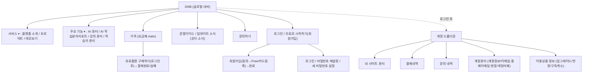

# 03. Brand site 화면설계서

| 항목 | 내용 |
|------|------|
| 문서 ID | 03_brand-site |
| 영역 | [BR01] Brand site (브랜드/마케팅 사이트) |
| 작성자 | 강테크 (테크리드, proj-techlead) |
| 지시자 | 사용자(운영자) |
| 작성일 | 2026-06-24 |
| 버전 | v1.0 (Draft) |
| 입력 문서 | CreatorLMS Figma — Brand site · `00_화면목록.md`(BR01) |
| 후속 작업자 | 송기획(주관) · 윤UX(컴포넌트/토큰) · 강테크(게이트) |
| 상태 | 증류완료 (화면 36건 증류완료 · 프로덕트 1 미설계 · 데모보기/주요기능 2 실사이트 대체 · 미확정 0) |

> 마스킹 규칙(개인정보 화면)·디자인 토큰 정합은 **추후 증류 단계에서 적용**한다.
> 화면ID·UI/DEV 타입·헤더 7필드 규약은 `DOCS-화면설계서작성표준.md`를 따른다.

> **모달/팝업 `_pu` 화면ID 추적(2026-06-25, DJ 지시)**: 본문 `### S-BR01-… P01/P02`로 정의된 고유 콘텐츠 LPU는 `00_화면목록.md §3.3.2`에서 `부모화면ID_pu##`로 채번됐다(공유 약관 상세보기 모달은 §3.3.3 `S-BR01-C01` 1회). BR 모달/팝업 6건(부모종속 5 + 공유 1). 범용 Confirm(구독취소/계정삭제/파일용량초과)·외부 toss 카드등록 PU는 제외. 매핑 SoT는 §3.3.2/§3.3.3(재증류 없이 ID 추적키만 부착).

---

## 0. 정렬 / 에스컬레이션

> 입력(Figma) 간 범위 충돌·미확정 사항을 여기에 모은다. 팀장(강테크) 컨펌 전제.

1. **버전 중복(1511:* vs 1516:*)** — Figma에 동일 화면이 구버전(`1511:*`)·전체판(`1516:*`)으로 이중 존재. **본 설계서는 `1516:*` 전체판을 기준 화면(SoT)으로 채택**하고, 구버전 고유 변형은 약식으로만 흡수했다. (PNG 익스포트는 프레임 인덱스 1:1이 아니라 주제별로 묶여 있어, 본 문서는 **캡처 실제 화면 우선**으로 증류했다.)
2. **Brand site 경계** — "마이페이지/이용상품/결제/문의/내 사이트 관리"는 캡처상 brand 도메인 GNB(로그인 후) 하위로 노출되나, 기능 책임은 사실상 **계정·결제·사이트 프로비저닝**이다. brand site(BR01)와 Customer Front/Admin(FR01/AD01) 간 **소유권 경계는 팀장 컨펌 필요** — 본 문서는 캡처에 존재하는 한 BR01로 일괄 수용하되, 추후 재배치 가능성을 열어둔다. (발산형 제언: §3-말미)
3. **이미지/일러스트 미확정** — 에러·점검·완료 화면의 중앙 일러스트 및 LP 기능 캡처 일부는 placeholder(`이미지` 박스). 최종 에셋은 윤UX 확정 대상 `[미확정]`.
4. **약관/정책 본문** — 약관 5종은 화면 레이아웃 확인 완료(제목+개정일 드롭다운+조항 본문, §2.10). 단 **본문 전문은 `creatorlms-brand/data/*.json`(terms/privacy/marketing)을 SoT로 연동**(전사 금지) `[→ 강테크/biz-legal]`.
5. **카드 등록(PG) 연동 범위** — 회원가입/유료 전환 시 카드 등록 PU는 토스페이먼츠 연동 전제(개인/법인 탭). 인증/토큰/빌링키 흐름은 06_API계약 확정 필요.
6. **LP 3종 미설계** — 프로덕트는 빈 GNB 프레임(미설계), 데모보기·주요기능 소개는 "라이브 배포 사이트(`creatorlms-brand.pages.dev`)로 대체" 명시(§2 LP군). main·플랫폼 소개·가격만 실제 설계됨. 프로덕트 콘텐츠 기획 여부 팀장/마케팅 결정 필요.
7. **구독정책 스펙 문서** — `p015`/`p041`(frame "구독정책" 1920x8382)은 UI 화면이 아니라 **정책 스펙 시트**(구독·결제 규칙 텍스트 정리). 본 설계서 §3 정책 메모 및 04_정책요약의 입력으로 활용 `[→ 임기획]`.

---

## 1. IA / 화면 맵

> 이 영역의 정보구조(메뉴 계층)와 화면 흐름. 화면목록(`00_화면목록.md` §3.3)과 정합.
> Brand site는 랜딩/마케팅 + 계정/결제/마이페이지 성격 → GNB 메뉴 위계로 기록.

**LP/마케팅 페이지군**: main · 플랫폼 소개 · 프로덕트 · 데모보기 · 주요기능 소개 · 가격 · 공지/소식 (모두 1920 가로 풀폭 랜딩, 세로 스크롤 8000px+ 장신 페이지).
**시스템/공통 페이지군**: 로딩 · 검색 No data · 404 · 네트워크 오류 · 시스템 일부 에러 · 긴급점검(전체장애) · 정기점검.
**약관군**: 이용약관 · 무료약정상품 이용약관 · 유료약정상품 이용약관 · 개인정보처리방침 · 마케팅 정보 수신 동의.
**이메일 템플릿군**(발송 메일 본문, 화면 아님): 회원가입완료 · 결제완료 · 결제실패 · 결제유예 · 서비스중지/전면중단 · 사이트생성축하 · 사용량 warning · 구독취소/만료도래/만료.

---

## 2. 화면상세설계

> 화면마다 아래 블록 템플릿을 복사해 채운다.
> - **헤더 7필드** 모두 기입(REQUIREMENT ID는 SI 산출물에만 — 사내 SM은 미작성 가능, 그 경우 `-`).
> - **좌(SCREEN DESIGN)**: 와이어/스크린샷 경로 (`screenshots/brand-site/{번호-설명}.png`).
> - **우(DESCRIPTION)**: 번호 위계(`1` / `1.1` / `a`)로 동작·정책. **행복경로뿐 아니라 빈/로딩/에러/예외 상태까지** 빠짐없이.

<!-- ===== 화면 블록 템플릿 (복사해서 사용) =====================================

### S-BR01-[Depth]-[번호] [화면명]

| 필드 | 값 |
|------|----|
| SCREEN | [화면명] |
| SCREEN ID | S-BR01-______-___ |
| SCREEN TYPE | [UI: P/PU/LPU/BS] / [DEV: W] |
| LOCATION | [메뉴경로] |
| REQUIREMENT ID | -  (SI만 기입, SM 미작성 시 `-`) |
| WRITER | 강테크 |
| UPDATE | 2026-06-24 |

**SCREEN DESIGN** (좌)

> [추출 후 채움] — 와이어/캡처 경로

**DESCRIPTION** (우)
1. [페이지/섹션 구성] — LP 블록 순서·CTA 위치
   1.1. [세부 동작/정책]
2. [상태별 처리]
   2.1. 빈 상태(Empty): [추출 후 채움]
   2.2. 로딩 상태(Loading): [추출 후 채움]
   2.3. 에러 상태(Error): [추출 후 채움]
   2.4. 예외/엣지 케이스(반응형 깨짐·폼 검증 등): [추출 후 채움]
3. [전환 동선] — 가입/문의/구독 CTA → Front/Admin 연결
4. [외부 인터페이스(API)] — 문의 폼·구독 등 (해당 시, 06_API계약과 1:1)
5. [개인정보 표기 시 마스킹] — 문의 폼 등, 추후 증류 단계에서 적용

============================================================================= -->

### 2.0 공통 컴포넌트 (1회 정의 · 전 화면 공통)

> 아래는 화면이 아니라 **재사용 UI 컴포넌트**다. Alert/Confirm/Toast(MPU)는 **화면ID 미부여**(모화면 종속). GNB/Footer는 레이아웃 고정요소.

#### C-1. GNB (글로벌 내비게이션)
- **캡처**: `_exports/png/brand-site/p002.png`(비로그인), `p009.png`(로그인 후 계정 드롭다운).
- 좌: 쏠쏠 로고(클릭 → main). 중앙 메뉴: **서비스▾ · 주요 기능▾ · 가격 · 운영가이드**. 우: 🌐 한국어▾(언어선택) · [문의하기] · [로그인] · [무료로 시작하기](primary).
- **로그인 후**: [로그인]·[무료로 시작하기] 자리에 **계정명▾**(예 "DJKIM") 드롭다운 → 내 사이트 관리 / 결제내역 / 문의 내역 / 계정관리 / (구분선) / 로그아웃.
- 드롭다운: 외부클릭·Esc 닫힘, `aria-expanded`. 언어선택은 한국어 기본(다국어는 `[미확정]`).

#### C-2. Footer
- **캡처**: `p004.png`.
- 좌: 로고 + 서비스 소개문("YOUTUBE 크리에이터를 위한 올인원 AI 학습관리 플랫폼…") + SNS(YouTube/Facebook/Instagram/Twitter).
- 4열 링크: **서비스**(플랫폼 소개/프로덕트/데모보기/가격) · **주요 기능**(AI 튜터/AI 학습분석리포트/강의 관리/학습자 관리) · **지원**(운영가이드/업데이트 소식) · **정보**(이용약관/무료약정상품 이용약관/유료약정상품 이용약관/개인정보처리방침/마케팅 정보 수신 동의).

#### C-3. 모달 (LPU) — `p005.png`
- 카드형(헤더 타이틀 + ✕ 닫기 + 아이콘 + 내용 + 버튼). 2형: **버튼 1개**(primary 전폭) / **버튼 2개**(좌 outline 보조 + 우 primary). Esc·✕·외부클릭 닫힘, `role="dialog" aria-modal="true"`, 열림 중 body 스크롤 잠금.

#### C-4. 얼럿 (Alert / MPU, ID 미부여) — `p006.png`
- 아이콘 + 단문 내용 + [확인](primary 전폭) 단일. 정보/완료성 단방향 고지.

#### C-5. 컨펌 (Confirm / MPU, ID 미부여) — `p007.png`
- 아이콘 + 내용 + [취소](outline) / [확인](primary) 2버튼. 비가역·중요 액션 직전(구독취소·계정삭제 등)에 사용.

#### C-6. 토스트 (Toast / MPU, ID 미부여) — `p008.png`
- 상단 슬라이드 인 배너(파란 info), ⓘ 아이콘 + 내용. 수초 후 자동 소멸. 경량 피드백(저장됨/복사됨 등).

#### C-7. 버튼 세트 — `p010.png`
- **2개(활성)**: outline + solid. **2개(비활성)**: outline 활성 + solid 회색 disabled. **1개(활성/비활성)** solid 전폭. **더보기 버튼**(텍스트+▾, 목록 확장).
- 화면당 **solid 주 액션 1개 원칙**. 디자인 토큰은 `DESIGN-디자인시스템.md` 우선(임의값 금지).

#### C-8. 로딩 인디케이터 — `p011.png`(GNB 영역 카드, 텍스트 "로딩중입니다 잠시만 기다려주세요"), `p012.png`(Circular 스피너 + 컨텍스트 문구 "사이트 목록을 불러오는 중…").
- 콘텐츠 영역 중앙 정렬. 컨텍스트별 안내 문구 치환 가능.

#### C-9. 검색 결과 No data (빈 상태) — `p013.png`
- 일러스트(엥 이모지) + "검색 결과가 없어요! 😢" + "혹시 오타는 아니신가요? 다른 검색어로 다시 시도해 보세요! 😊". 검색·목록 공통 빈 상태 문구.

---

<!-- ▼▼▼ 시스템/에러/점검 화면군 ▼▼▼ -->

### S-BR01-9001-001 시스템 일부 에러 페이지

| 필드 | 값 |
|------|----|
| SCREEN | 서비스 일부 시스템 에러 페이지 |
| SCREEN ID | S-BR01-9001-001 |
| SCREEN TYPE | P / W |
| LOCATION | (시스템 공통) |
| REQUIREMENT ID | - |
| WRITER | 송기획 |
| UPDATE | 2026-06-24 |

**SCREEN DESIGN** — `_exports/png/brand-site/p016.png`

**DESCRIPTION**
1. 구성 — 로고 + 중앙 일러스트(placeholder) + 카피 "서비스 이용에 불편을 드려 죄송해요" + 보조문 "편리하게 서비스를 이용하실 수 있도록 최선의 노력을 다하고 있어요".
   1.1. 일러스트: 에러관련 이미지 `[미확정]`.
2. 액션 — [홈으로 가기](primary) → main 이동.
3. 정책 메모 — 일부 시스템 장애(부분 기능 다운) 시 노출. 에러 명세 원본: `p022.png`(에러페이지 Description) 참조.

### S-BR01-9001-002 404 페이지

| 필드 | 값 |
|------|----|
| SCREEN | 404 페이지 |
| SCREEN ID | S-BR01-9001-002 |
| SCREEN TYPE | P / W |
| LOCATION | (시스템 공통) |
| REQUIREMENT ID | - |
| WRITER | 송기획 |
| UPDATE | 2026-06-24 |

**SCREEN DESIGN** — `_exports/png/brand-site/p017.png`

**DESCRIPTION**
1. 카피 "이런! 선택된 페이지를 찾을 수 없어요" + 보조문 "페이지가 제거되었거나 일시적으로 사용이 어려울 수 있어요".
2. 액션 — [홈으로 가기](primary) → main. (라우팅 catch-all = 404)

### S-BR01-9001-003 네트워크 연결 오류 페이지

| 필드 | 값 |
|------|----|
| SCREEN | 네트워크 연결 오류 페이지 |
| SCREEN ID | S-BR01-9001-003 |
| SCREEN TYPE | P / W |
| LOCATION | (시스템 공통) |
| REQUIREMENT ID | - |
| WRITER | 송기획 |
| UPDATE | 2026-06-24 |

**SCREEN DESIGN** — `_exports/png/brand-site/p018.png`

**DESCRIPTION**
1. 카피 "네트워크에 접속할 수 없어요" + 보조문 "네트워크 연결 상태를 확인해주세요".
2. 액션 — [재시도하기](primary).
   2.1. **정책(중요)**: 재시도 버튼을 누르지 않아도 **네트워크 복구 시 자동 재연결 시도**해야 함(`p022.png` 3.2 명시). → 폴링/자동 reconnect 로직 필요 `[→ 정프개]`.

### S-BR01-9001-004 서비스 긴급점검 (전체장애)

| 필드 | 값 |
|------|----|
| SCREEN | 서비스 긴급점검(전체장애) |
| SCREEN ID | S-BR01-9001-004 |
| SCREEN TYPE | P / W |
| LOCATION | (시스템 공통) |
| REQUIREMENT ID | - |
| WRITER | 송기획 |
| UPDATE | 2026-06-24 |

**SCREEN DESIGN** — `_exports/png/brand-site/p019.png`

**DESCRIPTION**
1. 카피 "서비스 안정화를 위한 시스템 점검 안내" + "원활한 서비스를 위해 시스템 점검 중이에요." + 보조문 "점검시간 동안 서비스 이용이 제한되며, 빠른 시간 내에 더욱 안정된 서비스를 제공할 수 있도록 노력할게요!" + 일러스트 placeholder.
2. **예정시간 표시 없음**(긴급=비계획). 액션 버튼 없음(점검 종료까지 차단).
3. 정책 메모 — 전체장애(비계획) 시 전 페이지를 이 화면으로 대체. 정기점검(예정)과 구분(아래).

### S-BR01-9001-005 서비스 정기점검

| 필드 | 값 |
|------|----|
| SCREEN | 서비스 정기점검 |
| SCREEN ID | S-BR01-9001-005 |
| SCREEN TYPE | P / W |
| LOCATION | (시스템 공통) |
| REQUIREMENT ID | - |
| WRITER | 송기획 |
| UPDATE | 2026-06-24 |

**SCREEN DESIGN** — `_exports/png/brand-site/p020.png` (변형: `p025.png` 동일)

**DESCRIPTION**
1. 카피 "서비스 안정화를 위한 시스템 정기점검 안내" + 보조문 "점검시간 동안 서비스 이용이 제한돼요. 더욱 나은 서비스로 찾아 뵐게요!".
2. **ⓘ 서비스 점검 예정시간** 영역 — 예: "2026.05.13 24:00 ~ 2026.05.14 04:00" (계획 점검이므로 예정시간 노출 = 긴급점검과의 핵심 차이).
3. 정책 메모 — 계획 점검. 예정시간은 운영자 설정값 바인딩.

> **에러/점검 화면 명세 원본**: `p022.png`(에러페이지 Description) — 5종 분기(① 시스템 일부 에러 ② 404 ③ 네트워크 오류 ④ 전체장애 긴급점검 ⑤ 정기점검+예정시간)와 각 액션을 명문화. 본 5블록과 1:1.

---

<!-- ▼▼▼ 인증/계정 화면군 ▼▼▼ -->

### S-BR01-0302-001 로그인

| 필드 | 값 |
|------|----|
| SCREEN | 로그인 |
| SCREEN ID | S-BR01-0302-001 |
| SCREEN TYPE | P / W |
| LOCATION | Brand site > 로그인 |
| REQUIREMENT ID | - |
| WRITER | 송기획 |
| UPDATE | 2026-06-24 |

**SCREEN DESIGN** — `_exports/png/brand-site/p021.png`

**DESCRIPTION**
1. 카드형 폼. 상단 아이콘 + 타이틀 "로그인".
2. 입력 — **아이디**(placeholder "이메일을 입력해 주세요") / **비밀번호**(placeholder "비밀번호(영문, 숫자, 특수문자 조합으로 8자 이상) 를 입력해 주세요" + 👁 표시/숨김 토글).
3. [아이디 기억하기] 체크박스.
4. 주 액션 [로그인 하기](primary 전폭).
5. 보조 — "비밀번호가 생각나지 않으신다면 **비밀번호 재설정**" 링크 / [회원가입하기](outline, "아직 회원가입을 하지 않으셨다면").
6. 상태별
   6.1. **밸리데이션**(`p024.png`): 빈 아이디 → "아이디를 입력해 주세요", 빈 비밀번호 → "비밀번호를 입력해 주세요" (필드 하단 빨강, 입력박스 빨강 ring).
   6.2. 로그인 실패(불일치): 얼럿/인라인 오류 `[추정 — 별도 캡처 없음]`.
   6.3. 유료플랜 구매 진입 시 로그인: `S-BR01-0303-...`(유료플랜 구매 로그인) 분기 — 아래 결제군 참조.
7. 마스킹 — 비밀번호 입력 마스킹 필수(👁 토글 시 해제).
8. API — 로그인(JWT 발급, `Authorization: Bearer`) `[→ 강테크]`.

### S-BR01-0302-002 비밀번호 재설정 (인증메일 발송)

| 필드 | 값 |
|------|----|
| SCREEN | 비밀번호 재설정 |
| SCREEN ID | S-BR01-0302-002 |
| SCREEN TYPE | P / W |
| LOCATION | Brand site > 로그인 > 비밀번호 재설정 |
| REQUIREMENT ID | - |
| WRITER | 송기획 |
| UPDATE | 2026-06-24 |

**SCREEN DESIGN** — `_exports/png/brand-site/p023.png`

**DESCRIPTION**
1. 타이틀 "비밀번호 재설정하기" + 안내 "가입하신 이메일 주소를 입력하시면, 비밀번호를 재설정할 수 있는 이메일 인증을 보내드립니다."
2. 입력 — **이메일 주소**(placeholder "아이디로 등록된 이메일을 입력해 주세요") + [아이디 기억하기].
3. 주 액션 [인증 메일 발송하기](primary).
4. 연계 — 발송 후 메일 내 링크 → **새 비밀번호 설정**(`S-BR01-0302-003`). 메일 본문: "비밀번호 재설정 인증메일" 템플릿.
5. 예외 — 미등록 이메일: 보안상 동일 안내(계정 존재 노출 금지) `[추정 — 권장 정책]`.
6. API — 재설정 인증메일 발송 `[→ 강테크]`.

### S-BR01-0302-003 새 비밀번호 설정

| 필드 | 값 |
|------|----|
| SCREEN | 새 비밀번호 설정 |
| SCREEN ID | S-BR01-0302-003 |
| SCREEN TYPE | P / W |
| LOCATION | Brand site > 로그인 > 비밀번호 재설정 > 새 비밀번호 설정 |
| REQUIREMENT ID | - |
| WRITER | 송기획 |
| UPDATE | 2026-06-24 |

**SCREEN DESIGN** — `_exports/png/brand-site/p027.png`

**DESCRIPTION**
1. 타이틀 "새 비밀번호를 설정하세요" + 안내 "보안을 위해 이전에 사용하지 않은 새로운 비밀번호를 설정해 주세요."
2. 입력 — **새 비밀번호**(🔒 placeholder "새 비밀번호를 입력하세요" + 👁 토글, 하단 강도 게이지 4단) / **새 비밀번호 확인**(👁 토글).
   2.1. **정책**: "8~16자, 영문 대소문자·숫자·특수문자 조합 필수" (로그인 폼의 "8자 이상"보다 강함 → §3 정책충돌 메모).
3. 주 액션 [비밀번호 변경 완료하기](primary). 보조 [← 로그인 화면으로 돌아가기].
4. 진입 — 재설정 인증메일 링크(`p026.png`)로만 진입. **링크 유효 1시간**(만료 시 재요청 안내).
5. 완료 → 컨펌 모달(`S-BR01-0302-003 P01`).
6. 마스킹 — 비밀번호 마스킹 필수.

##### S-BR01-0302-003 P01 새 비밀번호 설정 - 완료 컨펌 (LPU)
- **캡처**: `_exports/png/brand-site/p028.png`.
- ✓ 체크 아이콘 + "비밀번호가 재설정되었습니다" + "새로운 비밀번호로 로그인하세요." + [로그인으로 이동하기](primary) + ✕.

> **이메일 템플릿: 비밀번호 재설정 인증메일** — `p026.png`. [비밀번호 재설정 하기](primary 버튼, 링크) + 보안 안내 "본 링크는 발송 후 **1시간** 동안만 유효" + 버튼 미작동 시 복사용 URL(`https://admin.djtechtree.com/reset-password?token=...&expires=...`) + 보안 안내 3항(요청 안 했으면 무시 / 주기적 변경 권장 / 개인정보 입력 요구 없음) + "본 메일은 발신 전용". **정책: 재설정 링크 토큰 + 만료(expires) 파라미터**.

---

<!-- ▼▼▼ 회원가입 화면군 ▼▼▼ -->

### S-BR01-0301-002 회원가입 (동의 통합 폼)

| 필드 | 값 |
|------|----|
| SCREEN | 회원가입 (동의) |
| SCREEN ID | S-BR01-0301-002 |
| SCREEN TYPE | P / W |
| LOCATION | Brand site > 회원가입 |
| REQUIREMENT ID | - |
| WRITER | 송기획 |
| UPDATE | 2026-06-24 |

**SCREEN DESIGN** — `_exports/png/brand-site/p031.png`

**DESCRIPTION**
1. 카드형 폼. 타이틀 "회원가입" + 서브 "쏠쏠에 오신 것을 환영합니다". (파일럿 샘플 `S-BR01-0301-001`과 동일 화면 — 본 블록을 기준으로 통합.)
2. 입력(모두 필수 `*`): 성 / 이름(2단) · 이메일 주소 + [인증코드 발송] · 인증코드(6칸 분할) + [확인](미입력 비활성) · 비밀번호("최소 8자 이상 특수문자 기호를 포함해 주세요.") · 비밀번호 확인.
3. 약관 동의 박스 — [전체 동의] 마스터 / 필수: 이용약관·개인정보 처리방침·만 14세 이상(각 `>` 상세) / 선택: 마케팅 정보 수신 동의.
4. 주 액션 [회원 가입하기](primary 전폭).
5. 상태별 — 밸리데이션(`회원가입 - 밸리데이션 체크` 화면, 필드별 오류) · 인증코드 발송 PU(아래) · 카드 등록 PU(아래) · 완료(`S-BR01-0301-003`).
6. 정책 메모 — 필수 약관 3종 미동의 시 가입 차단. 만 14세 미만 가입 불가. 인증코드 확인 완료 전 가입 차단.
7. 마스킹 — 비밀번호 마스킹.

##### S-BR01-0301-002 P01 인증코드 발송 PU (LPU)
- **캡처**: `_exports/png/brand-site/p034.png`.
- 아이콘 + "이메일로 인증코드가 발송되었습니다. **3분 내** 인증코드를 등록해 주세요" + [확인](primary). 발송 후 이메일 버튼은 [인증코드 **재** 발송]으로 전환.
- **정책**: 인증코드 유효 3분. 만료 시 밸리데이션 "만료되었거나 유효하지 않은 인증코드입니다. 인증코드 재발송으로 새로운 인증코드를 입력해 주세요."(`p039.png`).

##### S-BR01-0301-002 밸리데이션 체크 (변형)
- **캡처**: `_exports/png/brand-site/p039.png`.
- 필드별 오류: 성/이름 미입력 "성과 이름을 입력해 주세요" · 이메일 미입력 "이메일 주소를 입력해 주세요" · 인증코드 "이메일로 보내 드린 인증코드를 입력해 주세요" / 만료 안내 · 비밀번호 확인 불일치 "비밀번호가 맞지 않네요. 다시 입력해 주세요." · 필수 약관 미체크 "필수 동의를 체크해 주세요". (오류 필드 빨강 ring + 하단 빨강 메시지.)

> **이메일 템플릿: 회원가입 인증코드 메일** — `p035.png`. 6자리 코드(예 `400039`) 큰 박스 표시 + "본 메일은 발신 전용". (인증코드 발송 = 가입 이메일 인증용.)

> **약관 상세보기 모달(공통)** — `p036.png`. 회원가입/사이트 생성 폼의 약관 `>` 클릭 시 LPU로 약관 본문 + [취소]/[동의하기]. 동의 시 해당 체크박스 on.

### S-BR01-0301-003 회원가입 - Free 완료

| 필드 | 값 |
|------|----|
| SCREEN | 회원가입 - Free 완료 |
| SCREEN ID | S-BR01-0301-003 |
| SCREEN TYPE | P / W |
| LOCATION | Brand site > 회원가입 > 완료 |
| REQUIREMENT ID | - |
| WRITER | 송기획 |
| UPDATE | 2026-06-24 |

**SCREEN DESIGN** — `_exports/png/brand-site/p032.png`

**DESCRIPTION**
1. ✓ 아이콘 + "환영합니다!" + "쏠쏠 회원가입이 완료되었습니다. 이제 YouTube 크리에이터를 위한 최고의 학습 플랫폼을 경험해보세요!"
2. 가입 요약 카드 — "이메일: user@example.com" + 플랜 뱃지 **[Free]**.
3. 강조 카피(빨강) "1분 만에 만드는 내 사이트, 바로 만들어 보세요".
4. 온보딩 3스텝 카드 — ① 내 사이트 관리하기(나만의 학습 사이트를 빠르게 구축) ② 첫 강좌 업로드(YouTube 영상 링크 또는 직접 영상 업로드) ③ YouTube 연동(멤버십 회원을 쉽게 초대).
5. 주 액션 [사이트 바로 만들기](primary) → 내 사이트 만들기(`S-BR01-0401-001`).
6. 정책 메모 — Free 플랜 자동 부여(카드 미등록 가입 경로). 가입완료 이메일 발송(템플릿 `p043.png`류).

<!-- ▼▼▼ 파일럿 샘플 (2026-06-24, 자동 추출+증류 검증용) ▼▼▼ -->

### S-BR01-0301-001 회원가입 - Free

| 필드 | 값 |
|------|----|
| SCREEN | 회원가입 - Free |
| SCREEN ID | S-BR01-0301-001 |
| SCREEN TYPE | P (전체화면) / W (웹) |
| LOCATION | Brand site > 회원가입 > Free 플랜 가입 |
| REQUIREMENT ID | - |
| WRITER | 송기획 (증류) · 강테크 (게이트) |
| UPDATE | 2026-06-24 |
| FIGMA NODE | `1516:21572` |

**SCREEN DESIGN** (좌)

**DESCRIPTION** (우)
1. 페이지 구성 — 상단 좌측 로고, 중앙 카드형 가입 폼("회원가입" / 서브타이틀 "쏠쏠에 오신 것을 환영합니다").
2. 입력 필드 (모두 필수 `*`)
   2.1. **성** — placeholder "성을 입력해 주세요" / **이름** — "이름을 입력해 주세요" (2단 배치).
   2.2. **이메일 주소** — "이메일을 입력해 주세요" + 우측 [인증코드 발송] 버튼(파란 solid).
   2.3. **인증코드** — 6칸 분할 입력 + [확인] 버튼(미입력 시 비활성 회색).
   2.4. **비밀번호** — "최소 8자 이상 특수문자 기호를 포함해 주세요." (정책: 8자+특수문자 포함).
   2.5. **비밀번호 확인** — "비밀번호를 다시 입력해 주세요."
3. 약관 동의 (그룹 박스)
   3.1. [전체 동의] 마스터 체크박스.
   3.2. **필수** — 이용약관 동의 / 개인정보 처리방침 동의 / 만 14세 이상입니다 (각 `>` 상세보기 이동).
   3.3. **선택** — 마케팅 정보 수신 동의.
4. 주 액션 — [회원 가입하기] (하단 전폭 남색 버튼, `i` 인포 아이콘 동반). 화면당 solid 주액션 1개 원칙 부합.
5. 상태별 처리
   5.1. 검증(Validation): 별도 화면 `회원가입 - 밸리데이션 체크`(`1516:21509`)에서 필드별 오류 문구 노출 — 본 화면과 연계.
   5.2. 인증코드 발송: `회원가입 - Free - 인증코드 발송 PU`(`1516:21443`) 팝업 연계.
   5.3. 완료: `회원가입 - Free 완료`(`1516:21630`)로 이동.
   5.4. 로딩/에러: 공통 `로딩페이지`·에러 페이지 세트 적용 [추정 — 해당 화면 증류 시 확정].
6. 외부 인터페이스(API) — 이메일 인증코드 발송/확인, 회원가입 제출 [→ 강테크: 06_API계약에서 엔드포인트화].
7. 마스킹/개인정보 — 비밀번호 입력 마스킹 필수. 이메일은 가입 단계라 평문 입력(표기 시 마스킹은 조회 화면에서).

<!-- ▲▲▲ 파일럿 샘플 끝 ▲▲▲ -->

> **회원가입 완료 변형** — `p038.png`: 동일 완료 화면이나 강조 카피 "**10분 완성! 나만의 서비스를 만들어 보세요!**", 첫 카드 번호뱃지 없음, CTA [쏠쏠 바로가기]. (A/B 또는 구버전 변형 — 기준은 `p032.png`.)

---

<!-- ▼▼▼ 마이페이지 - 내 사이트 관리 화면군 ▼▼▼ -->

### S-BR01-0401-001 내 사이트 만들기 (새 사이트)

| 필드 | 값 |
|------|----|
| SCREEN | 마이페이지 - 내 사이트 관리하기 - 새 사이트 만들기 |
| SCREEN ID | S-BR01-0401-001 |
| SCREEN TYPE | P / W |
| LOCATION | Brand site > (계정) 내 사이트 관리 > 새 사이트 만들기 |
| REQUIREMENT ID | - |
| WRITER | 송기획 |
| UPDATE | 2026-06-24 |

**SCREEN DESIGN** — `_exports/png/brand-site/p033.png`

**DESCRIPTION**
1. 타이틀 "내 사이트 만들기" + "나만의 학습 플랫폼을 만들어 보세요".
2. 입력
   2.1. **사이트 이름** `*` — 안내 "사이트의 이름을 입력해주세요. (예: 김영희의 영어 교실)", placeholder "2~20자 이내로 입력해 주세요" (정책: 2~20자).
   2.2. **사이트 도메인** `*` — `https://` + [입력 3~30자] + `.solsol.com` 고정 접미 + [도메인 중복 체크]. 안내 "영문, 숫자, 하이픈만 사용 가능" (정책: 3~30자, [a-z0-9-]).
3. **무료 플랜 시 유의 사항** — 스크롤 박스 "구독서비스 결제 안내"(월간: 처음 결제일 기준 매월 같은 날 자동결제 / 연간: 매년 같은 날 자동결제 …). → 결제 정책 본문 노출.
4. 동의 — "쏠쏠 **무료약정상품 구매 약관**에 동의합니다." 체크박스(필수).
5. 주 액션 [+ 생성하기](primary).
6. 상태/변형
   6.1. 중복 체크 — 사용 가능: "사용 가능한 도메인" 초록 / 이미 사용 중: "이미 사용 중인 도메인" 빨강 (`마이페이지-새 사이트 만들기-도메인 중복 체크` 변형 2종, 1516:24332/24345).
   6.2. 약관 미동의 시 생성 차단.
7. 정책 메모 — 도메인은 `*.solsol.com` 서브도메인. 무료 플랜도 약정상품 구매 약관 동의 필요(향후 유료 전환 자동결제 고지). 사이트 생성 시 축하 이메일 발송(템플릿).

### S-BR01-0401-002 내 사이트 관리 - 생성된 사이트 (목록)

| 필드 | 값 |
|------|----|
| SCREEN | 마이페이지 - 내 사이트 관리하기 - 생성된 사이트 |
| SCREEN ID | S-BR01-0401-002 |
| SCREEN TYPE | P / W |
| LOCATION | Brand site > (계정) 내 사이트 관리 |
| REQUIREMENT ID | - |
| WRITER | 송기획 |
| UPDATE | 2026-06-24 |

**SCREEN DESIGN** — `_exports/png/brand-site/p037.png`

**DESCRIPTION**
1. 타이틀 "내 사이트 관리하기" + "내 사이트를 손쉽게 관리할 수 있어요".
2. 상단 배너 — "아직 사이트를 만들지 않으셨다면, 내 사이트를 개설하실 수 있습니다!" + [+ 내 사이트 만들기].
3. 사이트 목록(반복부, 행당): 플랜 뱃지(Free/Basic 등) · 사이트명/도메인 · 요금/결제주기 · 가입일/구독기간 · **상태 뱃지**(이용중/구독취소/만료임박 등 색상 구분) · 사용량/회원수 · ⋮ 더보기 메뉴.
4. 하단 프로모 카드 — "다른 플랜 둘러보기 · 더 많은 기능과 혜택을 확인하세요" + [플랜 둘러보러 가기].
5. 상태별
   5.1. **빈 상태(No data)**: 사이트 0개 → 빈 일러스트 + [+ 내 사이트 만들기] CTA (`마이페이지-내 사이트 관리(No data)`, 1516:23312).
   5.2. **로딩**: "사이트 목록을 불러오는 중…"(공통 C-8, `p012.png`).
6. 정책 메모 — 행 상태 뱃지 = 구독 상태 머신(이용중→만료임박→만료/구독취소). 상태별 행 액션(연장/업그레이드/취소)은 ⋮ 또는 이용상품 정보 화면 연계.

##### S-BR01-0401-002 빈 상태 (No data)
- **캡처**: `_exports/png/brand-site/p096.png`.
- 상단 배너 [+ 내 사이트 만들기] + 중앙 일러스트("헉!!") + "사이트가 하나도 없네요... 😢" + "아직 만들어진 사이트가 없어서 좀 쓸쓸하네요… 첫 번째 사이트를 만들어보시는 건 어떨까요? 생각보다 어렵지 않답니다! 몇 분이면 나만의 온라인 강의 플랫폼을 만들 수 있습니다." + 하단 "🚀 다른 플랜 둘러보기" 프로모 + [플랜 둘러보러 가기].

##### S-BR01-0401-001 P01 도메인 중복 체크 결과 (LPU)
- **캡처**: `_exports/png/brand-site/p098.png`(이미 사용 중).
- 사용 중: ✕ 빨강 아이콘 + "이미 사용 중인 도메인입니다" + "다른 도메인을 선택해 주세요." + 입력 도메인(`https://example-site.solsol.com`) + [확인] + ✕.
- 사용 가능 변형: ✓ 초록 + "사용 가능한 도메인입니다" 류(1516:24345).

---

<!-- ▼▼▼ 공지/소식(업데이트 소식) 화면군 ▼▼▼ -->

### S-BR01-0501-001 공지/소식 (목록)

| 필드 | 값 |
|------|----|
| SCREEN | 공지/소식 |
| SCREEN ID | S-BR01-0501-001 |
| SCREEN TYPE | P / W |
| LOCATION | Brand site > 운영가이드/업데이트 소식 > 공지·소식 |
| REQUIREMENT ID | - |
| WRITER | 송기획 |
| UPDATE | 2026-06-24 |

**SCREEN DESIGN** — `_exports/png/brand-site/p053.png`

**DESCRIPTION**
1. GNB + 타이틀 "공지 / 소식". 우측 검색 인풋("내용을 검색해 보세요" + 🔍).
2. 목록(반복부, 행당): 📌 상단 고정 핀(있을 시) · 제목(예 "[안내] 2026 6월 카드사 부분 무이자 할부 이벤트 안내") · 작성시점(방금 전/1시간 전/날짜) · 👁 조회수.
3. 하단 [더보기 ▾](C-7 더보기 버튼, 추가 로드).
4. 상태별 — 빈: 검색 No data(C-9) / 로딩(C-8) 적용.
5. 정책 메모 — 핀(고정 공지) 우선 정렬. 조회수 카운트. 비로그인도 열람 가능(공개).

### S-BR01-0501-002 공지/소식 상세

| 필드 | 값 |
|------|----|
| SCREEN | 공지/소식 > 상세페이지 |
| SCREEN ID | S-BR01-0501-002 |
| SCREEN TYPE | P / W |
| LOCATION | Brand site > 공지·소식 > 상세 |
| REQUIREMENT ID | - |
| WRITER | 송기획 |
| UPDATE | 2026-06-24 |

**SCREEN DESIGN** — `_exports/png/brand-site/p054.png`

**DESCRIPTION**
1. 제목 + 📌 + 작성시점 + 👁 조회수. 본문 영역(이미지/리치텍스트).
2. **첨부파일** 섹션 — 행당 파일명(최대 50자, 초과 시 처리 — 설계 메모) + [다운로드].
3. 이전/다음 글 네비("이전 [제목] · 다음 [제목]" + 시점).
4. [목록] 버튼 → 목록 복귀.
5. 정책 메모 — 첨부 파일명 길이 제한(약 50자) `[추정]`. 다운로드는 R2 객체 키 연계 가능.

---

<!-- ▼▼▼ 가격/요금제 · 결제 화면군 ▼▼▼ -->

### S-BR01-0601-001 가격 (요금제 main)

| 필드 | 값 |
|------|----|
| SCREEN | 가격 - main |
| SCREEN ID | S-BR01-0601-001 |
| SCREEN TYPE | P / W |
| LOCATION | Brand site > 가격 |
| REQUIREMENT ID | - |
| WRITER | 송기획 |
| UPDATE | 2026-06-24 |

**SCREEN DESIGN** — `_exports/png/brand-site/p085.png`

**DESCRIPTION**
1. 타이틀 "크리에이터에게 딱 맞는 플랜을 선택하세요" + 보조 "소규모 시작부터 대규모 운영까지, 모든 단계에 최적화된 가격".
2. **결제주기 토글** — [월간] / [연간 30% 할인] 세그먼트. (연간 30% 할인 = 회사 정책 정합.)
3. **플랜 4종 카드**(가로 나열): **Free**(₩0, 결제 수수료 10%) · **Basic**(₩100,000/월, 수수료 0%, "가장 인기 있는 플랜" 뱃지) · **Growth**(₩300,000/월, 수수료 0%) · **Advanced**(₩500,000/월, 수수료 0%).
   3.1. 각 카드: 발행 상품 수 / 동영상 저장 용량 / 학습자(회원) 수 제한 / 동시 수강 인원 / 관리자 계정 수 / 사이트 수 + AI 튜터·AI 영상번역·영상자동변환 무료 한도 + CTA([무료로 시작하기] / [구매하기]).
4. **Enterprise** 별도 박스 — "협의 · 대규모 운영 / 맞춤형 기능 …" + [문의하기].
5. 하단 **요금제 비교** 섹션 — "각 플랜의 기능을 비교해 보세요" 표.
6. 전환 — [구매하기] → 비로그인 시 로그인(유료플랜 구매 진입) → 로그인 후 유료플랜 구매하기(`S-BR01-0601-002`).
7. 정책 메모 — Free=수수료 10%, 유료=수수료 0%. 플랜별 정량 한도(상품/용량/회원/AI)는 06_API계약·billing.md SoT 연동 `[→ 강테크]`. 수치 정합은 `creatorlms-brand/docs/billing.md` 확인.

### S-BR01-0601-003 결제 완료 (최초 결제)

| 필드 | 값 |
|------|----|
| SCREEN | 결제 완료 - 최초 결제시 |
| SCREEN ID | S-BR01-0601-003 |
| SCREEN TYPE | P / W |
| LOCATION | Brand site > 가격 > 구매 > 결제 완료 |
| REQUIREMENT ID | - |
| WRITER | 송기획 |
| UPDATE | 2026-06-24 |

**SCREEN DESIGN** — `_exports/png/brand-site/p087.png`

**DESCRIPTION**
1. ✓ + "결제가 완료되었습니다!" + "쏠쏠 Basic 플랜 구독이 시작되었습니다. 지금 바로 강력한 AI 기능을 활용하여 학습 플랫폼을 운영해보세요."
2. **결제 정보 카드** — 주문 번호(ORDER-YYYY-MM-DD-NNNNNN) · 구독 플랜(Basic) · 구독 유형(월간 자동결제) · 결제 금액(110,000원 VAT 포함) · 결제 수단(신한카드 **** **** **** 1234) · 구독 기간(2025.03.15~2025.04.14) · 다음 결제일(2025.04.15) · 결제 상태(● 결제 성공).
3. 안내 "결제 정보 및 영수증은 '결제내역'에서 확인하실 수 있습니다." + [쏠쏠 바로가기].
4. 정책 메모 — 카드번호 마스킹 필수(가운데 마스킹, 뒤 4자리 노출). 금액 VAT 포함·천단위 콤마. 자동결제 = 다음 결제일 명시. 결제완료 이메일 발송(템플릿).
5. 변형 — **플랜 업그레이드시 결제 완료**(1516:22249): 동일 레이아웃, 카피·차액/적용시점 표기 차이.

##### S-BR01-0601 P01 회원가입/구매 - 카드 등록 PU (토스페이먼츠, LPU)
- **캡처**: `_exports/png/brand-site/p088.png`.
- 토스페이먼츠 위젯 "등록할 카드를 입력해주세요"(주식회사 맑은소프트). 탭 **개인 / 법인**(법인은 사업자번호 10자리 추가).
- 입력: 카드번호(4분할) · 유효기간 MM/YY · [필수] 서비스 이용 약관, 개인정보 처리 동의(전자금융거래 기본약관/개인(신용)정보 수집·이용/제3자 제공/자동승인(정기결제) 이용약관) + [다음].
- 정책 메모 — 카드번호/유효기간 입력 마스킹. 빌링키 발급(정기결제). 비가역 결제는 운영자 정책 준수(실결제 최종승인 자동 금지).

### S-BR01-0601-002 유료플랜 구매하기 / 플랜 업그레이드 (로그인 후)

| 필드 | 값 |
|------|----|
| SCREEN | 유료플랜 구매하기 - 로그인 후 / 플랜 업그레이드 |
| SCREEN ID | S-BR01-0601-002 |
| SCREEN TYPE | P / W |
| LOCATION | Brand site > 가격 > 구매 (로그인 후) |
| REQUIREMENT ID | - |
| WRITER | 송기획 |
| UPDATE | 2026-06-24 |

**SCREEN DESIGN** — `_exports/png/brand-site/p100.png`

**DESCRIPTION**
1. 2단 레이아웃. **좌: 선택된 플랜 + 결제 금액 산정**
   1.1. 선택된 플랜 헤더(플랜명 Basic·사이트명 MONZO·플랫폼 수수료 0%).
   1.2. **플랜 업그레이드 선택** 세그먼트(Free/Basic/Growth/Advanced, 현재≤선택만 '가능').
   1.3. **결제주기 토글** [월간 구독]/[연간 구독] (연간 30% 할인 강조).
   1.4. **결제 예정 금액**(대형, 예 863,000원 VAT 포함).
   1.5. **결제 금액 요약** — 연간 구독 요금(840,000원) − 현재 월간 구독 미사용 금액(일할 계산, -110,000원) = 산정된 결제 금액(785,000원). (일할 차액 정산 정책 반영.)
   1.6. **연간 플랜 업그레이드 혜택** 카드 — ① 연간 360,000원↓(30% 할인) ② 즉시 적용(구독기간 시작/잔구가 연간으로 변경) ③ 일할 계산 적용(현재 미사용 기간 일할 차액 제외 결제).
2. **우: 결제하기**
   2.1. **결제 정보** `*` — 등록 카드 없을 시 "등록된 카드가 없습니다" + [카드 등록하기 ⊕](→ 토스 카드등록 PU). 등록 시 마스킹 카드 표시.
   2.2. **유료 플랜 시 유의 사항** 스크롤 박스(구독서비스 결제 안내: 월간/연간 자동결제 규칙).
   2.3. "쏠쏠 **유료약정상품 구매 약관**에 동의합니다." 체크(필수).
   2.4. 주 액션 [결제하기](primary).
3. 변형 — 동일 상품 **월간→연간**(1516:22426) / **상위 상품 업그레이드(월간)**(1516:22565) / **즉시 결제**(1516:22505). 일할 차액·적용시점 계산만 달라짐.
4. 밸리데이션 변형(1516:22641): 약관 미동의/카드 미등록 시 결제 차단·오류.
5. 정책 메모 — 플랜 변경 즉시 적용·미사용 일할 차액 제외(회사 정책 정합). 월→연 즉시, 연→월은 기간 종료 후(billing.md). 카드번호 마스킹. 비가역 결제 게이트 준수.
6. 변형 캡처 — Growth 업그레이드(`p101.png`, 269,500원 = 300,000−110,000 일할) · 즉시 결제(`p110.png`, "즉시 결제" 170,500원 = 100,000+110,000 경과 차액 *청구 금액 정상화/즉시 적용).

### S-BR01-0601-004 결제 완료 - 플랜 업그레이드

| 필드 | 값 |
|------|----|
| SCREEN | 결제 완료 - 플랜 업그레이드시 |
| SCREEN ID | S-BR01-0601-004 |
| SCREEN TYPE | P / W |
| LOCATION | Brand site > 플랜 업그레이드 > 완료 |
| REQUIREMENT ID | - |
| WRITER | 송기획 |
| UPDATE | 2026-06-24 |

**SCREEN DESIGN** — `_exports/png/brand-site/p102.png`

**DESCRIPTION**
1. ✓ + (카피 영역) + 결제 정보 카드(주문번호/구독 플랜/유형/금액/수단/기간/다음 결제일/상태).
2. 강조 카피(빨강) "바로 업그레이드 플랜을 사용하실 수 있어요!" + [홈으로 이동] / [내 사이트 관리하기](primary). (최초 결제 완료(`-003`)와 CTA·카피 차이.)

### S-BR01-0601-005 결제 실패

| 필드 | 값 |
|------|----|
| SCREEN | 결제 실패 |
| SCREEN ID | S-BR01-0601-005 |
| SCREEN TYPE | P / W |
| LOCATION | Brand site > 결제 > 실패 |
| REQUIREMENT ID | - |
| WRITER | 송기획 |
| UPDATE | 2026-06-24 |

**SCREEN DESIGN** — `_exports/png/brand-site/p108.png`

**DESCRIPTION**
1. ✕ 빨강 + "결제를 실패하였습니다!" + "결제 처리 중 문제가 발생했습니다. 다시 시도해 주세요."
2. **결제 시도 정보 카드** — 주문번호/플랜/유형/금액/수단(마스킹)/기간/다음 결제일 + 결제 상태(✕ 결제 실패 빨강).
3. **실패 원인** 박스(⚠) — "카드 한도 초과 또는 결제 승인이 거부되었습니다. 카드사에 문의하시거나 다른 결제 수단을 이용해 주세요."
4. [가격 페이지로 이동하기]. 변형: 1516:22314 (다른 실패 사유 문구).
5. 정책 메모 — 결제 실패 시 재시도 동선. 자동결제 실패는 재시도(3일/6회)→유예(27일) 정책(아래 결제 유예 메일·이용상품 상태 연계).

---

<!-- ▼▼▼ 마이페이지 - 이용상품 정보 · 구독 · 결제내역 화면군 ▼▼▼ -->

### S-BR01-0801-001 마이페이지 - 이용상품 정보 (상태별 Variation)

| 필드 | 값 |
|------|----|
| SCREEN | 마이페이지 - 이용상품 정보 (상품 상태별 Variation) |
| SCREEN ID | S-BR01-0801-001 |
| SCREEN TYPE | P / W |
| LOCATION | Brand site > (계정) 이용상품 정보 |
| REQUIREMENT ID | - |
| WRITER | 송기획 |
| UPDATE | 2026-06-24 |

**SCREEN DESIGN** — `_exports/png/brand-site/p105.png`(상태별 행), `p039`/`p086`(목록 컨텍스트)

**DESCRIPTION**
1. 이용 상품(사이트)별 행: 플랜 뱃지 · 사이트명/도메인 · 요금/결제주기 · 구독 시작/만료일 · **상태 뱃지** · 사용량 · 우측 액션(⋮ 또는 [구독 취소하기]/[사용 연장하기]/[업그레이드]).
2. **상품 상태별 Variation**(p105 한 화면에 케이스 나열):
   a. **무료 플랜**(일부 항목 '-')
   b. **유료 - 정상 구독**(상태 이용중)
   c. **유료 - 구독 취소 예정**(만료일까지 이용, "구독취소 예정")
   d. **유료 - 결제 실패/유예**(상태 경고색)
   e. **유료 - 만료 임박**(연장 유도)
   f. **만료**(사용 중지)
3. 액션 — 구독 취소(`P01` 컨펌→완료), 사용 연장(`S-BR01-0801-002`), 업그레이드(가격 구매 화면).
4. 정책 메모 — 상태 머신: 정상→(취소요청)취소예정→만료 / 정상→(결제실패)유예→만료. 구독 취소는 기간 만료 후 해지(즉시 환불은 수동 접수, 회사 정책).

##### S-BR01-0801-001 P01 구독 취소 컨펌 (Confirm/MPU, ID 미부여)
- **캡처**: `_exports/png/brand-site/p106.png`.
- ✕ 빨강 + "구독 취소가 아쉬워요! 기간 만료시까지 사용하실 수 있어요!" + "혹시 궁금하신 점이 있으시면 **문의하기**를 이용해 주세요" + [취소](outline) / [구독 취소하기](primary).
- **정책**: 구독 취소해도 **기간 만료 시까지 이용 가능**(즉시 해지 아님). 회사 정책의 "①남은 기간 종료 후 해지"와 정합.

##### S-BR01-0801-001 P02 구독 취소 완료 (LPU)
- **캡처**: `_exports/png/brand-site/p107.png`. ✕ 빨강 + "구독 취소가 완료되었습니다" + "내 사이트 관리하기에서 확인하실 수 있습니다" + [확인] + ✕.

### S-BR01-0801-002 마이페이지 - 사용 연장하기

| 필드 | 값 |
|------|----|
| SCREEN | 마이페이지 - 이용상품 정보 - 사용 연장하기 |
| SCREEN ID | S-BR01-0801-002 |
| SCREEN TYPE | P / W |
| LOCATION | Brand site > 이용상품 정보 > 사용 연장하기 |
| REQUIREMENT ID | - |
| WRITER | 송기획 |
| UPDATE | 2026-06-24 |

**SCREEN DESIGN** — `_exports/png/brand-site/p112.png`

**DESCRIPTION**
1. 🔄 + "사용 연장하기" + "플랜을 연장하고 서비스를 계속 이용하실 수 있어요!"
2. **선택된 플랜** 카드 — 플랜명(Basic)·사이트(MONZO)·수수료 0% / 구독 주기(월간 자동결제)·만료 예정일(2026.03.13).
3. [취소](outline) / [결제하기](primary).
4. 정책 메모 — 만료 임박/만료 상품 재결제로 기간 연장. 결제 실패 시 결제 실패(`-005`) 동선.

---

<!-- ▼▼▼ 문의하기 화면군 ▼▼▼ -->

### S-BR01-0701-001 문의하기

| 필드 | 값 |
|------|----|
| SCREEN | 문의하기 |
| SCREEN ID | S-BR01-0701-001 |
| SCREEN TYPE | P / W |
| LOCATION | Brand site > 문의하기 |
| REQUIREMENT ID | - |
| WRITER | 송기획 |
| UPDATE | 2026-06-24 |

**SCREEN DESIGN** — `_exports/png/brand-site/p091.png`

**DESCRIPTION**
1. 타이틀 "문의하기" + "궁금하신 사항이나 도움이 필요하신 경우 문의해 주세요. 빠르고 정확하게 답변 드리겠습니다."
2. **문의 유형** `*`(라디오): 상품 / 결제(구매 및 환불) / 제휴 문의 / 서비스 문의 / 기타.
   2.1. '상품' 선택 시 하위 칩: 상품전반 / 무료플랜 / 유료플랜 / 엔터프라이즈.
   2.2. 유형별 가이드 문구가 본문 에디터에 placeholder/예시로 치환됨(`p093.png` "문의 유형 선택 별 문구").
3. **제목** `*`(placeholder "문의 제목을 입력해 주세요").
4. **내용** `*` — 리치텍스트 에디터(B/I/U, 정렬, 목록, 링크, 이미지, 동영상 등).
5. **첨부파일(선택)** — [파일선택] + 파일칩(예 image.jpg ✕ 제거).
6. 주 액션 [문의하기](primary).
7. 상태별 — 접수 완료(`S-BR01-0701-002`) · 파일 용량 초과(`P01`).
8. 정책 메모 — 비로그인도 문의 가능하나 답변은 마이페이지(이메일)>문의내역에서 확인. 파일 용량 제한 존재.

##### S-BR01-0701-001 P01 파일 용량 초과 확인 (Alert/MPU, ID 미부여)
- **캡처**: `_exports/png/brand-site/p094.png`. 얼럿(C-4) "파일 용량이 업로드 가능한 최대 용량을 초과했습니다." + [확인]. 초과 파일 업로드 차단.

### S-BR01-0701-002 문의하기 - 접수 완료

| 필드 | 값 |
|------|----|
| SCREEN | 문의하기 - 접수 완료 |
| SCREEN ID | S-BR01-0701-002 |
| SCREEN TYPE | P / W |
| LOCATION | Brand site > 문의하기 > 접수 완료 |
| REQUIREMENT ID | - |
| WRITER | 송기획 |
| UPDATE | 2026-06-24 |

**SCREEN DESIGN** — `_exports/png/brand-site/p092.png`

**DESCRIPTION**
1. ✓ + "문의가 정상적으로 접수되었습니다" + "빠르게 문의 내용 확인 후 답변드리겠습니다!"
2. **문의 내용 카드** — 문의유형(예 "상품 - 무료플랜") + 제목/본문 요약.
3. 안내 "답변은 마이페이지(이메일) > 문의내역에서 확인하실 수 있습니다." + [홈으로 바로가기].
4. 정책 메모 — 접수 시 확인 이메일 가능. 답변 채널 = 문의 내역.

---

<!-- ▼▼▼ 마이페이지 - 계정관리 화면군 ▼▼▼ -->

### S-BR01-0901-001 마이페이지 - 계정관리 (계정정보)

| 필드 | 값 |
|------|----|
| SCREEN | 마이페이지 - 계정관리 (계정정보) |
| SCREEN ID | S-BR01-0901-001 |
| SCREEN TYPE | P / W |
| LOCATION | Brand site > (계정) 계정관리 |
| REQUIREMENT ID | - |
| WRITER | 송기획 |
| UPDATE | 2026-06-24 |

**SCREEN DESIGN** — `_exports/png/brand-site/p126.png`(전체), `p129.png`(밸리데이션 변형)

**DESCRIPTION**
1. 타이틀 "계정 관리" + "내 계정 정보를 관리할 수 있어요".
2. **계정 폼**
   2.1. **아이디(이메일)** — readonly(예 `dj****@example.com` 마스킹 권고) + "아이디로 사용된 이메일은 변경할 수 없습니다." (마스킹 §7).
   2.2. **성 / 이름** 입력.
   2.3. **비밀번호**(현재 비밀번호) / **새 비밀번호** / **새 비밀번호 확인** — 우측 "비밀번호가 생각나지 않으신다면 [비밀번호 재설정]" 링크(`S-BR01-0302-002`). 비밀번호 입출력 마스킹(§7).
   2.4. **마케팅 정보 수신** 토글(수신거부/수신동의) + "중요 공지 및 서비스 관련 필수 안내 등은 수신 설정과 관계없이 발송될 수 있습니다." (정보통신망법 정합).
   2.5. **2단계 인증** 토글(사용안함/사용) + "서비스 로그인할 때 이메일로 추가 인증이 요구됩니다."
3. **결제 수단** 영역
   3.1. 등록 카드 카드형 리스트(브랜드·`**** 5547` 마스킹·등록일·[대표 카드 설정]/[삭제]). [카드 블록처리] / [카드 등록하기 ⊕](→ 토스 카드등록 PU, `S-BR01-0601 P01` 공통).
   3.2. **빈 상태**: "등록된 카드가 없습니다" + [카드 등록하기 ⊕] (p129 하단).
4. **결제 이메일** 영역 — 현재 결제 이메일(예 `bil****@malgnsoft.com` 마스킹 권고) + [이메일 변경](→ `S-BR01-0901-002`).
5. 하단 [저장하기](primary 전폭) + [계정삭제] 텍스트 링크(→ `P01` 탈퇴 컨펌).
6. **밸리데이션 상태**(p129): 현재 비밀번호 미입력 "비밀번호를 입력해 주세요", 새 비밀번호 미입력 "비밀번호를 입력해 주세요", 확인 불일치 "비밀번호가 맞지 않습니다. 다시 입력해 주세요." 각 필드 하단 적색 + 적색 ring.
7. 정책 메모 — 아이디(로그인 이메일)는 변경 불가, 결제 이메일은 별도 변경(인증 필요). 카드번호·이메일 마스킹. 계정삭제는 비가역(컨펌+비밀번호 재확인 게이트).

##### S-BR01-0901-001 P01 계정삭제(탈퇴하기) 컨펌 (Confirm/MPU, ID 미부여)
- **캡처**: `_exports/png/brand-site/p128.png`.
- ✕ 빨강 + "탈퇴하기" + (탈퇴 유의사항 안내 박스 `[미확정 — 본문 텍스트]`) + **[위 내용에 동의합니다] 체크** + **현재 비밀번호 입력** + [취소](outline) / [탈퇴하기](primary).
- **정책**: 동의 체크 + 비밀번호 일치 시에만 탈퇴 활성. **비가역** — 회사 정책상 계정삭제는 운영자 확인 전제(데이터 영구삭제 가드).

### S-BR01-0901-002 마이페이지 - 결제 이메일 변경

| 필드 | 값 |
|------|----|
| SCREEN | 마이페이지 - 계정관리 - 결제이메일 변경 |
| SCREEN ID | S-BR01-0901-002 |
| SCREEN TYPE | P / W |
| LOCATION | Brand site > 계정관리 > 결제 이메일 변경 |
| REQUIREMENT ID | - |
| WRITER | 송기획 |
| UPDATE | 2026-06-24 |

**SCREEN DESIGN** — `_exports/png/brand-site/p131.png`, 발송PU `p134.png`, 완료 `p133.png`

**DESCRIPTION**
1. 타이틀 "결제 이메일 변경" + "다음 결제 이메일부터 변경된 이메일로 결제 이메일이 발송됩니다."
2. **현재 이메일 주소** `*` 입력.
3. **변경할 이메일 주소** `*` 입력 + [인증코드 발송](primary).
4. **인증코드** `*` — 6칸 분할 입력 + [확인](발송 전 disabled).
5. **비밀번호** `*` — "로그인 비밀번호를 입력해 주세요."(마스킹).
6. 주 액션 [결제 이메일 변경하기](primary).
7. **상태별**
   7.1. 인증코드 발송 PU(`P01`, p134): "이메일로 인증코드가 발송되었습니다. 3분 내 인증코드를 등록해 주세요" + [확인]. **유효시간 3분.**
   7.2. 변경 완료(p133): ✓ + "결제 이메일 변경이 완료되었습니다" + "다음 결제 이메일부터 변경된 이메일로 결제 이메일이 발송됩니다." + [확인].
   7.3. 밸리데이션(frame 1516:24046 인증코드 재발송 / 1516:23974 밸리데이션): 코드 불일치·만료 시 오류, [재발송] 동선.
8. 외부 인터페이스 — 인증코드 발송/검증 API(06_API계약과 1:1).
9. 정책 메모 — 결제 이메일은 인증코드(3분) + 로그인 비밀번호 이중 확인 후 변경. 변경은 다음 결제분부터 적용.

---

<!-- ▼▼▼ 마이페이지 - 결제 내역 화면군 ▼▼▼ -->

### S-BR01-1001-001 마이페이지 - 결제 내역

| 필드 | 값 |
|------|----|
| SCREEN | 마이페이지 - 결제 내역 |
| SCREEN ID | S-BR01-1001-001 |
| SCREEN TYPE | P / W |
| LOCATION | Brand site > (계정) 결제 내역 |
| REQUIREMENT ID | - |
| WRITER | 송기획 |
| UPDATE | 2026-06-24 |

**SCREEN DESIGN** — `_exports/png/brand-site/p122.png`(목록), `p121.png`(빈 상태)

**DESCRIPTION**
1. 타이틀 "결제 내역" + "내가 결제한 모든 내역을 확인하실 수 있습니다."
2. **결제 요약** 카드 4종 — 이번달 결제 / 총 결제 금액 / 결제 횟수 / 다음 결제일.
3. **결제 내역** 테이블 — 필터 3종(전체 드롭다운)·[Reset]·상품명 검색. 컬럼: 결제일 / 상품명(플랜+주기) / 사이트명 / 결제방법(신용카드) / 결제금액(VAT포함) / 상태(결제완료·결제취소) / 관리([영수증]).
   3.1. 상태 뱃지 — 결제완료(파랑)·결제취소(회색+취소일시). 결제완료 행만 [영수증] 노출.
   3.2. 하단 [더보기 ▾] 페이지네이션(C-7).
4. **빈 상태**(p121): "혁!!" 일러스트 + "아직 결제 내역이 없네요! 🤷" + "텅… 비어있어요… 플랜을 구독하시면 여기에 결제 내역이 차곡차곡 쌓인답니다! 첫 결제를 시작해보시는 건 어떨까요? 😊" + [플랜 둘러보러 가기](primary).
5. 정책 메모 — 영수증 = 신용카드 매출전표(세금계산서 대체, 회사 정책). 금액 천단위 `,`·VAT 포함 표기. 카드번호 마스킹.

---

<!-- ▼▼▼ 마이페이지 - 문의 내역 화면군 ▼▼▼ -->

### S-BR01-0702-001 마이페이지 - 문의 내역 (목록)

| 필드 | 값 |
|------|----|
| SCREEN | 마이페이지 - 문의 내역 |
| SCREEN ID | S-BR01-0702-001 |
| SCREEN TYPE | P / W |
| LOCATION | Brand site > (계정) 문의 내역 |
| REQUIREMENT ID | - |
| WRITER | 송기획 |
| UPDATE | 2026-06-24 |

**SCREEN DESIGN** — `_exports/png/brand-site/p124.png`(목록), `p123.png`(빈 상태)

**DESCRIPTION**
1. 타이틀 "문의 내역" + "내 문의내역에 대한 답변을 확인하실 수 있습니다".
2. **상태 카운트** 카드 3종 — 답변대기(빨강) / 답변중(초록) / 답변완료(검정).
3. 제목·내용 검색 + 정렬/필터.
4. **문의 카드 리스트** — 상태 뱃지(답변대기/답변중/답변완료) + 문의유형 칩(예 "무료플랜") + 제목 + 본문 요약 2줄 + 작성시각(방금전/1시간전 상대시간) + 댓글수(💬 N) + ⋮(수정/삭제). 하단 [더보기 ▾].
5. **빈 상태**(p123): "아직 문의하신 내용이 없습니다. 궁금한 점이 있으시면 언제든 문의해 주세요! 친절하게 답변 드릴게요 😊".
6. 카드 클릭 → 문의 상세(`S-BR01-0702-002`).
7. 정책 메모 — 비로그인 문의도 가능하나 답변 확인은 로그인 후 문의내역에서.

### S-BR01-0702-002 마이페이지 - 문의 내역 상세

| 필드 | 값 |
|------|----|
| SCREEN | 마이페이지 - 문의 내역 상세 보기 |
| SCREEN ID | S-BR01-0702-002 |
| SCREEN TYPE | P / W |
| LOCATION | Brand site > 문의 내역 > 상세 |
| REQUIREMENT ID | - |
| WRITER | 송기획 |
| UPDATE | 2026-06-24 |

**SCREEN DESIGN** — `_exports/png/brand-site/p125.png`

**DESCRIPTION**
1. 상태 뱃지 + 문의유형 칩 + 제목 + 작성시각 + 댓글수 + ⋮(수정/삭제).
2. **연계 정보 노출** — "신고하기 또는 결제내역 > 문의하기 했을 경우 관련 정보 노출 영역"(연계 컨텍스트, 해당 시).
3. **1:1 문의내역 본문** + **첨부파일**(image.jpg ⊥ 다운로드, 복수).
4. **댓글/답글 스레드** ("전체 N") — 관리자 닉네임/사용자 닉네임 구분, `@멘션` 답글, 작성시각. 각 댓글 [답글] + ⋮(수정/삭제).
   4.1. 답글 입력 — "@대상 답글을 입력해 주세요." + [취소](outline) / [등록](입력 전 disabled).
   4.2. 수정 모드 — 인라인 에디터 + [취소] / [수정](변경 전 disabled).
5. 정책 메모 — 본인 작성 댓글만 수정/삭제. 관리자 답변은 읽기 전용. 첨부파일 다운로드 권한 = 작성자/관리자.

---

<!-- ▼▼▼ 이메일 템플릿군 (발송 메일 본문 · 화면 아님, ID 미부여) ▼▼▼ -->

### 2.9 이메일 템플릿군 (발송 메일 본문)

> 아래는 사용자에게 발송되는 **메일 본문 템플릿**이다(브라우저 화면이 아니라 메일 렌더). 화면ID 미부여. 공통 골격 = 상단 로고 + 본문(아이콘 + 제목 + 안내문 + 정보 카드 + CTA 버튼) + 하단 "본 메일은 발신 전용 메일이므로 회신 메일에 응답할 수 없습니다." `{{치환변수}}` 머지필드 사용.

| 템플릿 | 캡처 | 핵심 내용 / 트리거 |
|--------|------|--------------------|
| 회원가입 완료 | `p035.png`(인증코드)·frame 1516:25594 | 가입 환영 + (인증코드/계정 안내). 가입 직후. |
| 이메일 인증코드 | `p132.png` | 6자리 인증코드(예 400039) + 발신전용 안내. 이메일/결제이메일 인증 시. |
| 결제 완료 | frame 1516:25520/25949 | `{{주문번호/플랜/금액/기간/다음결제일}}` + 영수증 안내. 결제 성공 시. |
| 결제 실패 | frame 1516:25985 | 실패 사유 + 재시도 안내. 자동결제 실패 시. |
| 결제 유예 | `p111.png` | 결제 유예 안내(재시도 일정/유예 만료일). 재시도 소진 후. |
| 서비스 중지 | `p114.png` | 미결제로 서비스 중지 안내 + 복구 동선. 유예 만료 시. |
| 서비스 전면 중단 | frame 1516:26030 | 최종 중단 + 데이터 보존/삭제 안내. 중지 후 추가 경과 시. |
| 사이트 생성 축하 | `p116.png` | 사이트 생성 완료 축하 + 관리 바로가기. 사이트 프로비저닝 완료 시. |
| 사용량 warning | `p117.png` | 사용량 임계(예 90%) 경고 + 업그레이드 유도. 임계 도달 시. |
| 구독 취소 안내 | frame 1516:25585 | 취소 접수 + 만료일까지 이용 가능 안내. 구독 취소 시. |
| 구독 만료 도래 안내 | frame 1516:25587 | 만료 임박 + 갱신 유도. 만료 N일 전. |
| 구독 만료 | `p120.png` | 만료 → 사이트 관리(Admin) 중지·사이트(Front) 1개월 후 중단 + [구독 갱신 바로가기]. 만료 시. |

- **정책 메모(이메일 공통)**: 머지필드(`{{USER_NAME}}`/`{{SITE_NAME}}`/`{{PLAN_TYPE}}`/`{{EXPIRED_DATE}}` 등)는 발송 시 치환. 발신전용(noreply). 결제/만료 메일은 자동결제 상태 머신(아래 §3)과 1:1 트리거. 마케팅성 메일은 수신동의 + 광고 표기(정보통신망법). 메일 본문 정확한 카피는 `[미확정 — 일부]`이며 발송 전 운영자 확인.

---

<!-- ▼▼▼ LP 마케팅 페이지군 (장신 랜딩 · 캡처 확인 완료) ▼▼▼ -->

### S-BR01-0101-001 메인 (main 랜딩)

| 필드 | 값 |
|------|----|
| SCREEN | main (메인 랜딩) |
| SCREEN ID | S-BR01-0101-001 |
| SCREEN TYPE | P / W |
| LOCATION | Brand site > main |
| REQUIREMENT ID | - |
| WRITER | 송기획 |
| UPDATE | 2026-06-24 |

**SCREEN DESIGN** — `_exports/png/brand-site/p068.png` (frame 1516:25647, 1920x8550 풀폭 랜딩)

**DESCRIPTION**
1. 상단 C-1 GNB(고정, 다크) + 하단 C-2 Footer(다크).
2. **Hero** — 헤드라인 "크리에이터의 상상이 **쏠쏠한 비지니스**가 되는 순간"(쏠쏠 강조 컬러) + 서브카피("권리 부담은 없고, 수익 극대화는 확실하게 / 쏠쏠(SaaS)이면 누구나 쉽게…") + 주 CTA [무료로 시작하기](solid) + 보조 [데모보기 →].
3. **기능 소개 섹션**(아이콘 뱃지 + 헤드라인 + 좌/우 교차 이미지 캡처, 6블록):
   3.1. "복잡한 권한 설정 끝! 강사님에게 딱 필요한 화면만 깔끔하게" (우측 강의화면 캡처).
   3.2. "영상만 올리세요, 자막부터 퀴즈 생성까지 AI가 다 알아서 하니까" — **AI 튜터 / AI 번역 / AI 자막** 3탭 + 캡처.
   3.3. "학습의 완성을 증명하는 브랜드 맞춤형 수료증" (좌측 수료증 캡처).
   3.4. "강의부터 정기 구독형 상품까지 원하는 지식의 모든 체형 판매" — 6카드: 일반 상품 / 라이브 & 특강 / 디지털 상품 / 패키지 상품 / 멤버십 / 프리미엄 커뮤니티.
   3.5. "VIP 회원에게만 슬쩍, 유튜브처럼 간편한 일부공개 링크기능" (우측 캡처).
   3.6. "디자이너 없이 만드는 나의 브랜드 공간" (에디터/사이트 캡처).
4. **마지막 CTA** — "크리에이터의 상상이 쏠쏠한 비지니스가 **완성**되는 순간" + [무료로 시작하기](solid) / [상담 문의하기](outline).
5. 상태별 — 정적 콘텐츠. 기능 캡처 이미지 일부 placeholder(`[미확정]` 에셋, 윤UX). 반응형 시 교차 이미지/텍스트 → 세로 스택.
6. 정책 메모 — 비로그인 진입점. 모든 CTA는 회원가입/문의/데모로 수렴. 강조 카피는 쏠쏠 브랜드 컬러.

### S-BR01-0102-001 플랫폼 소개

| 필드 | 값 |
|------|----|
| SCREEN | 플랫폼 소개 |
| SCREEN ID | S-BR01-0102-001 |
| SCREEN TYPE | P / W |
| LOCATION | Brand site > 서비스 > 플랫폼 소개 |
| REQUIREMENT ID | - |
| WRITER | 송기획 |
| UPDATE | 2026-06-24 |

**SCREEN DESIGN** — `_exports/png/brand-site/p144.png` (풀폭 랜딩)

**DESCRIPTION**
1. C-1 GNB + C-2 Footer. 풀폭 마케팅 LP.
2. **요약 3카드** — 핵심 가치 3종(아이콘 + 제목 + 체크리스트). 헤드라인 "이미 알고 있는 정보가 이 곳에 모여 있습니다".
3. **차별점 비교** — "다른 플랫폼과 무엇이 다른가요?" + 비교 테이블(항목별 쏠쏠 vs 타 플랫폼 ✓/✗ 매트릭스).
4. **AI 학습 경험** — "AI 기술이 만드는 차별화된 학습 경험" + 기능 그리드(AI 콘텐츠 자동화 / AI 튜터 / AI 자막·번역 / YouTube 연동 등).
5. **프로토타입 체험** — "실제 구현된 프로토타입을 직접 체험해보세요" + 체험 카드 2종([바로가기]).
6. **마지막 CTA** — "지금 바로 시작하세요" + 회원가입 CTA.
7. 정책 메모 — 비교표 수치·이미지 일부 `[미확정 — 다운스케일 가독 한계]` 단계② 확정. CTA는 회원가입/데모로 수렴.

### S-BR01-0103-001 프로덕트 / S-BR01-0104-001 데모보기 / S-BR01-0105-001 주요기능 소개 (미설계·실사이트 대체)

| 화면 | SCREEN ID | 캡처 | 확인 결과 |
|------|-----------|------|----------|
| 프로덕트 | S-BR01-0103-001 | `p145·p148·p149` | **미설계** — Figma상 GNB만 있는 빈 프레임. 콘텐츠 없음 |
| 데모보기 | S-BR01-0104-001 | `p147.png` | **실사이트 대체** — "HTTPS://CREATORLMS-BRAND.PAGES.DEV/#/DEMO 화면으로 대체합니다" 안내만 |
| 주요기능 소개 | S-BR01-0105-001 | `p150.png` | **실사이트 대체** — 동일(라이브 배포본으로 대체) |

- **확인 결과**: 이 3개 LP는 본 Figma에 **완성 설계가 없다**. 프로덕트=빈 GNB 프레임, 데모보기·주요기능=라이브 배포 사이트(`creatorlms-brand.pages.dev`)로 대체 명시.
- **정책 메모**: 데모보기/주요기능은 **실 배포본을 SoT**로 보고 화면설계서는 라우트·진입점만 정의. 프로덕트는 콘텐츠 기획 필요 `[→ 임기획/마케팅]`. (발산형: 미설계 3종은 main/플랫폼소개로 흡수하거나 라이브 링크로 대체해 화면 수 축소 가능 — §3.5.)

---

<!-- ▼▼▼ 약관군 (정적 텍스트 페이지) ▼▼▼ -->

### 2.10 약관/정책 페이지군

> 정적 약관 텍스트 페이지. **캡처 확인 완료**(p138~p142). 공통 레이아웃 = C-1 GNB(상단) + **제목(좌) + 개정일 선택 드롭다운(우, 예 "2025.01.01 개정")** + 구분선 + 본문 조항(상단 목차 없이 번호 조항 나열). 본문은 캡처상 더미/요약 텍스트이며 **실제 전문은 `creatorlms-brand/data/*.json`이 SoT**(terms/privacy/marketing). `[→ 강테크/biz-legal]`.

| 화면 | SCREEN ID | 캡처 | 본문 SoT | 본문 상태(확인) |
|------|-----------|------|---------|----------------|
| 이용약관 | S-BR01-1101-001 | `p138.png` | `terms.json` | 제목+개정일 드롭다운, 본문 더미(거의 비어있음) |
| 무료약정상품 이용약관 | S-BR01-1101-002 | `p139.png` | `[별도 데이터]` | 제목+개정일 드롭다운, 본문 더미 |
| 유료약정상품 이용약관 | S-BR01-1101-003 | `p140.png` | `[별도 데이터]` | 번호 조항 다수(본문 채워짐, 다운스케일로 전문 가독 한계) |
| 개인정보처리방침 | S-BR01-1101-004 | `p141.png` | `privacy.json` | 번호 섹션 다수(본문 채워짐) |
| 마케팅 정보 수신 동의 | S-BR01-1101-005 | `p142.png` | `marketing.json` | 제1조 광고성 정보 이용목적 / 제2조 이용 시 유의사항 / 제3조 서비스 수신 동의 철회 (조항 구조 확인) |

- **공통 동작**: 우상단 **개정일 드롭다운**으로 과거 개정본 선택 열람(버전 이력). 회원가입/계정관리의 약관 모달(`S-BR01-0301-002`)·Footer 정보 링크(C-2)가 이 페이지로 연결.
- **마케팅 수신동의(p142) 조항 구조**(확인): ①광고성 정보의 이용목적(SMS/MMS/Push/E-Mail 등 전자적 전송매체로 맞춤형/이벤트/쿠폰 정보 제공) ②이용의 시 유의 사항(동의 거부해도 서비스 이용 가능, 필수 안내는 수신설정 무관 발송) ③서비스 수신 동의 철회(고객센터 또는 로그인>계정관리>계정정보>광고성 정보 수신에서 언제든 철회).
- **정책 메모**: 약관 본문 전문은 화면설계서가 아니라 **법무 확정 데이터(JSON)** 를 렌더(전문 전사 금지). 개정 시 버전/시행일 표기, 약관 동의 이력은 가입/결제 시점 저장. 마스킹·개인정보 항목은 §7·privacy.json 정합.

---

## 3. 화면별 정책 메모

> 화면에서 발견된 정책 규칙은 여기에 적고, 단계 ③에서 `04_정책요약.md`로 합본한다(화면ID로 추적). 회사 결제·구독 정책은 [회사정보-맑은소프트.md §3]·`billing.md`가 SoT.

### 3.1 인증·계정 정책

| ID | 화면 | 정책 |
|----|------|------|
| P-AUTH-01 | S-BR01-0301-002 | 회원가입 = 약관 동의(필수/선택 분리) + 이메일 인증코드(**3분 유효**). Free는 카드 없이 가입, 유료는 카드 등록 PU 연계. |
| P-AUTH-02 | S-BR01-0302-003 | 비밀번호 = 영문·숫자·특수문자 조합 **8~16자**. 재설정 인증메일 링크 **1시간 유효**. |
| P-AUTH-03 | S-BR01-0901-001 | 아이디(로그인 이메일)는 **변경 불가**. 비밀번호 변경은 현재 비밀번호 확인 필요. 2단계 인증(이메일) 토글 제공. |
| P-AUTH-04 | S-BR01-0901-001 P01 | 계정삭제(탈퇴)는 **동의 체크 + 비밀번호 재확인** 게이트. 비가역 → 운영자 확인 전제(데이터 영구삭제 가드). |
| P-AUTH-05 | S-BR01-0901-002 | 결제 이메일 변경 = 인증코드(**3분**) + 로그인 비밀번호 이중 확인. 다음 결제분부터 적용. |

### 3.2 결제·구독 정책

| ID | 화면 | 정책 |
|----|------|------|
| P-PAY-01 | S-BR01-0601-002 | 플랜 변경 **즉시 적용**, 미사용 기간 **일할 차액** 제외 결제. 월→연 즉시, 연→월은 기간 종료 후(billing.md 정합). |
| P-PAY-02 | S-BR01-0601-002 | 연간 구독 **30% 할인**. 결제주기 토글(월간/연간). 결제 금액 = 신규요금 − 현재 미사용 일할금액. |
| P-PAY-03 | S-BR01-0601-005 / 이메일 | 자동결제 실패 → **재시도(3일/6회)** → **결제유예(27일)** → 미결제 시 상품 해지(상태 머신). |
| P-PAY-04 | S-BR01-0801-001 P01 | 구독 취소 = **기간 만료 시까지 이용 가능**(즉시 해지 아님). 즉시 취소·환불은 수동 접수. |
| P-PAY-05 | S-BR01-1001-001 | 영수증 = 신용카드 매출전표(세금계산서 대체). 결제수단 = 신용·체크카드(토스페이먼츠), 계좌이체 미지원. |
| P-PAY-06 | S-BR01-0601 P01 | 카드 등록 = 토스페이먼츠 PU(개인/법인 탭, 필수 약관 동의). 빌링키 발급 → 자동결제. 카드번호 마스킹. |
| P-PAY-07 | S-BR01-0801-001 | 이용상품 상태 머신: 정상 →(취소)취소예정→만료 / 정상 →(결제실패)유예→만료. 만료 시 Admin 중지, Front는 1개월 후 중단. |

### 3.3 문의·콘텐츠 정책

| ID | 화면 | 정책 |
|----|------|------|
| P-INQ-01 | S-BR01-0701-001 | 문의 유형(상품/결제/제휴/서비스/기타) + 하위 칩. 유형별 가이드 문구 치환. 파일 용량 제한(초과 시 차단 얼럿). |
| P-INQ-02 | S-BR01-0702-002 | 답변 채널 = 문의 내역(댓글/답글 스레드). 본인 댓글만 수정/삭제, 관리자 답변 읽기전용. |

### 3.4 마스킹·컴플라이언스 (전 화면 공통)

- 아이디/결제 이메일(계정 첫 2자 이후), 카드번호(`**** **** **** 1234`), 비밀번호/인증코드 입출력 마스킹(§7). 금액 천단위 `,`·VAT 포함 표기.
- 마케팅성 메일/알림은 **수신 동의 + 광고 표기**(정보통신망법). 필수 안내(결제·만료·중지)는 수신설정 무관 발송.
- 약관/개인정보 본문은 `creatorlms-brand/data/*.json`이 SoT — 화면은 렌더만.

### 3.5 발산형(Rethink) 제언

- **마이페이지 군의 BR01 소속 재검토** — 결제내역·문의내역·이용상품·계정관리·내 사이트 관리는 사실상 **계정/구독 콘솔**이다. brand(마케팅) 사이트와 성격이 달라, 별도 업무구분(예 `MY01` 마이페이지/콘솔)으로 분리하면 IA가 "마케팅 LP ↔ 계정 콘솔"로 명확해진다. → 팀장 컨펌 필요(§0-2와 연동). 현재는 캡처 GNB 종속 기준으로 BR01 일괄 수용.
- **약관 5종 페이지 통합** — 약관/개인정보/마케팅 5개 풀페이지를 **단일 약관 페이지 + 탭/앵커**로 합치면 화면 5개→1개, 중복 레이아웃 spec 제거. 본문은 JSON SoT이므로 탭 전환만으로 충분.
